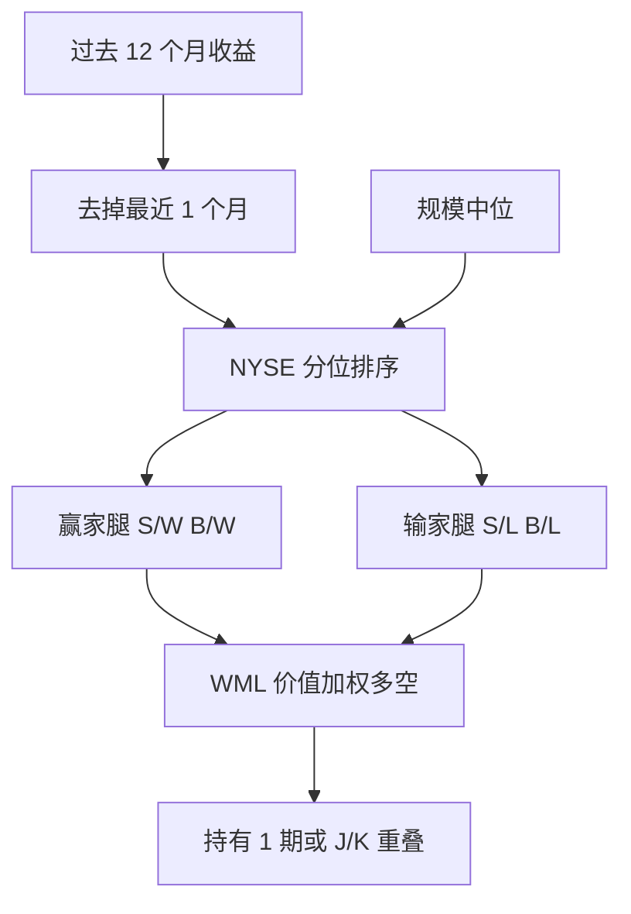
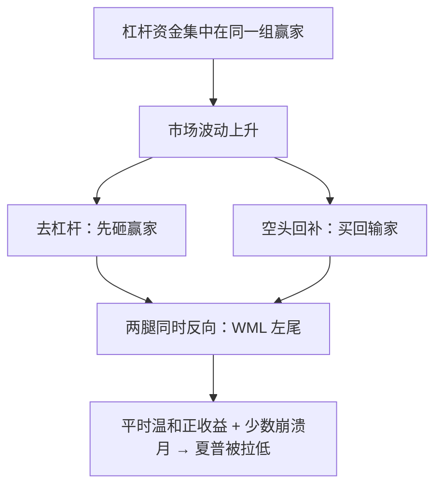

# 动量 WML

买入过去三到十二个月的赢家、卖出输家，在随后三到十二个月里仍能获得显著收益；这不是一月反转，也不是三年到五年的长期反转。

<footer>—— Jegadeesh & Titman, Returns to Buying Winners and Selling Losers, Journal of Finance, 1993</footer>

[上一课](/quant/ff5)把盈利与投资收成 RMW / CMA，三因子留下的 α 被写成与 SMB/HML 同一套多空语言。五因子小结已经点名：动量仍在模型外。中间 horizon 的相对强度——赢家减输家在 3–12 个月上持续，且与 HML 常常负相关——还没有一条腿。本课钉截面动量 **WML**（12−1）。不重推五因子的 2×3，不从有效市场总问题重开。一个月反转见[反转](/quant/short-term-reversal)；动量崩溃另文。

## 问题

五因子右侧已经有市场、规模、价值、盈利、投资。按过去收益排序的组合上仍然有 α。这不是再问「公开信息该不该预测收益」——三因子、五因子已经在特征层面回答过定价核缺哪几条。缺口是这段 **3–12 个月的相对强度**：要不要做成独立多空腿、如何跳过最近一个月以免混进[反转](/quant/short-term-reversal)、以及它与 HML 的负相关为什么不能靠 RMW/CMA 吸收。Jegadeesh–Titman 的 J/K 与 Carhart / French 的 WML（UMD）是同一条腿的两种写法。

「截面动量」翻译成大白话：不赌大盘方向，只在同一时刻给所有股票排座次——过去约 11 个月涨得多的是赢家、跌得多的是输家，买赢家、空输家，赌的是座次延续。多空两腿里市场整体涨跌的部分互相抵消，留下的是「谁比谁强」，不是「市场往哪走」。

赢家往往偏成长、偏高 β，输家偏价值、偏困境；HML 会给出「动量应该为负」的直觉。若只在五因子残差上再回归一次过去收益，诊断到了，定价核没有变。要把相对强度放进右侧，才和上一课把 RMW、CMA 放进右侧是同一句话。

### 相对强度不是时间序列趋势

时间序列动量看的是资产自己的过去超额收益是否为正（Moskowitz、Ooi、Pedersen 的期货趋势）。截面 WML 在每个日期把股票排序，多空资金内部对冲，对市场方向的净暴露被设计成接近零。一只绝对收益为负但仍强于同侪的股票可以进赢家组。把 WML 画成「股票市场的均线策略」会在熊市里误判：截面赢家在下跌市里同样在跌，只是跌得少。

标准美股动量用过去 12 个月减去最近 1 个月，记作 12−1。把最近一个月算进去，会把 Jegadeesh 的短期反转混进动量，溢价变弱甚至变号。跳月不是细节，是定义。

## 方法

经典 J/K：在 t 月末按 t−J 到 t 的累计收益排序（或按 t−J 到 t−1，以跳月），等权或价值加权买入前十分位、卖出后十分位，持有 K 个月。重叠持有时，每月组合是 K 个不同 vintage 的等权平均，以降低换手集中。Jegadeesh–Titman 的主表覆盖 J,K ∈ {3,6,9,12}。

行业惯例的因子口径更接近 French：独立 2×3，规模用 NYSE 中位，动量用 NYSE 的 30%/70%（过去 12−1 月收益），六个价值加权组合上

$$
\mathrm{WML}=\tfrac12(R_{S/W}+R_{B/W})-\tfrac12(R_{S/L}+R_{B/L}).
$$

Carhart 四因子是三因子加 WML。对组合 $i$，

$$
R_{it}-R_{ft}=\alpha_i+\beta_{iM}\mathrm{MKT}_t+\beta_{iS}\mathrm{SMB}_t+\beta_{iH}\mathrm{HML}_t+\beta_{iW}\mathrm{WML}_t+\varepsilon_{it}.
$$

动量 α 在三因子下显著为正；加入 WML 后，按过去收益排序的检验组合 α 被吸收，但按其他特征排的组合不一定。

数字实例：按 2×3 口径，设小盘赢家 $R_{S/W}=3\%$、大盘赢家 $R_{B/W}=2\%$、小盘输家 $R_{S/L}=1\%$、大盘输家 $R_{B/L}=0\%$，则 $\mathrm{WML}=\tfrac12(3\%+2\%)-\tfrac12(1\%+0\%)=2\%$。赢家腿取平均、输家腿取平均、再相减——公式的全部算术就这一步。

### 跳月、形成期与持有期

形成期过短会撞上反转与买卖价差反弹；过长会撞上长期反转。12−1 是文献里对美股最稳的折中。持有期一个月、每月再平衡，换手高、容量受流动性约束；持有 6–12 个月并重叠，换手下降，信号变钝。价值加权降低微型股贡献，等权则让动量看起来更强、也更贵。跳过最近一个月还有一个会计原因：财报窗口附近的收益含未预期盈余，短期反转与盈余漂移会打架。

```mermaid
flowchart TD
  RET["过去 12 个月收益"] --> SKIP["去掉最近 1 个月"]
  SKIP --> RK["NYSE 分位排序"]
  SIZE["规模中位"] --> RK
  RK --> W["赢家腿 S/W B/W"]
  RK --> L["输家腿 S/L B/L"]
  W --> WML["WML 价值加权多空"]
  L --> WML
  WML --> HOLD["持有 1 期或 J/K 重叠"]
```

## 机制

风险解释把赢家当成高久期、高增长期权，在好状态下更敏感；输家像困境债。这解释不了为何溢价在形成期之后继续存在、并在市场反弹时剧烈为负（动量崩溃：输家空头在 V 型反转里爆亏）。行为解释是反应不足与趋势追逐：新闻缓慢进入价格，后段又过度外推。Hong–Lim–Stein 的「信息缓慢扩散」与 Daniel 等的过度自信都指向同一段中间 horizon。

实务上更有操作含义的机制是：**拥挤与强平**。动量腿高度相关，杠杆资金在同一组赢家上叠杠杆；波动率上升时去杠杆先砸赢家，同时回补输家，WML 出现左尾。因此 WML 的均值来自平常月份的温和正收益，夏普被少数崩溃月拉低。任何把 WML 当稳定保险的用法都与历史分布相反。

```mermaid
flowchart TD
  C["杠杆资金集中在同一组赢家"] --> V["市场波动上升"]
  V --> D["去杠杆：先砸赢家"]
  V --> B["空头回补：买回输家"]
  D --> L["两腿同时反向：WML 左尾"]
  B --> L
  L --> S["平时温和正收益 + 少数崩溃月 → 夏普被拉低"]
```

直觉类比：拥挤的动量像满员的剧院——平时人人坐得安稳（温和正收益），有人喊「着火」（波动跳升）时，所有人挤向同一扇门（同时砸赢家、回补输家）。伤害不来自火本身，而来自所有人都做同一个动作。

### 行业动量与残差动量

行业等权动量往往更稳、换手更低，因为个股特异噪声被抵消。残差动量先对 [Fama-French](/quant/ff3) 回归，再用残差收益排序，意在去掉市场与价值的污染。两者都不是 Jegadeesh–Titman 原文的定义；在因子模型里它们改变的是 WML 与 HML、MKT 的相关，而不是「动量是否存在」。复制时必须先声明排序变量是总收益还是残差。

WML 与 HML 的负相关是配置问题不是笔误。价值-动量组合的分散化在 Asness 等「价值与动量无处不在」里被写成跨资产事实。单看股票 WML 的回撤，会低估它在多因子里的对冲价值，也会低估同时减杠杆时两者一起崩的尾部。

## 边界

容量：输家腿多是低流动性、高借券费用的股票，账面溢价含卖空约束。剔除借不到的股票后，WML 变薄。交易成本对等权十分位很致命，对大盘价值加权 2×3 好一些，但仍远高于 HML 的年度再平衡。

样本：美股 1927 年起即可算动量，崩溃集中在 1932、2009 一类反弹。国际股票、商品、外汇上也有趋势，但不能把期货的时间序列动量夏普直接标在个股 WML 上。A 股的涨跌停与短期投机让 12−1 与一个月反转的相对强弱与美股不同，必须用当地断点重做。

不要用日内或隔夜收益当「高频动量」却引用 1993 年论文。不要把 12 个月均线金叉当成 WML。因子模型里 WML 的 β 是协方差，一只从未进过赢家组的股票仍可有正动量载荷。

常见误区：初学者容易把「12 个月均线金叉」这类趋势跟踪当成 WML。均线策略是时间序列的——只看指数或单一资产自己的历史，择时进出；WML 是截面的——每天给全市场排座次、多空对冲，市场方向净暴露接近零。两者都带「趋势」二字，对象与风险完全不同。

真实出处：Jegadeesh & Titman, Journal of Finance, 1993；Carhart, Journal of Finance, 1997（四因子）。UMD 名称见 Ken French 数据说明。动量崩溃见 Daniel & Moskowitz, Journal of Financial Economics, 2016，不要写进 1993 年正文。

## 小结

- 截面动量是 3–12 个月的相对强度，标准因子是跳过最近一个月的 12−1 WML/UMD。
- 构造常用规模×动量的 2×3 价值加权；J/K 重叠持有用于降低换手。
- 三因子吸不掉动量；WML 与 HML 常负相关，尾部有崩溃。
- 卖空成本、借券与微型股会显著侵蚀账面溢价。
- 出处：Jegadeesh & Titman, Journal of Finance, 1993；因子化见 Carhart, 1997。
