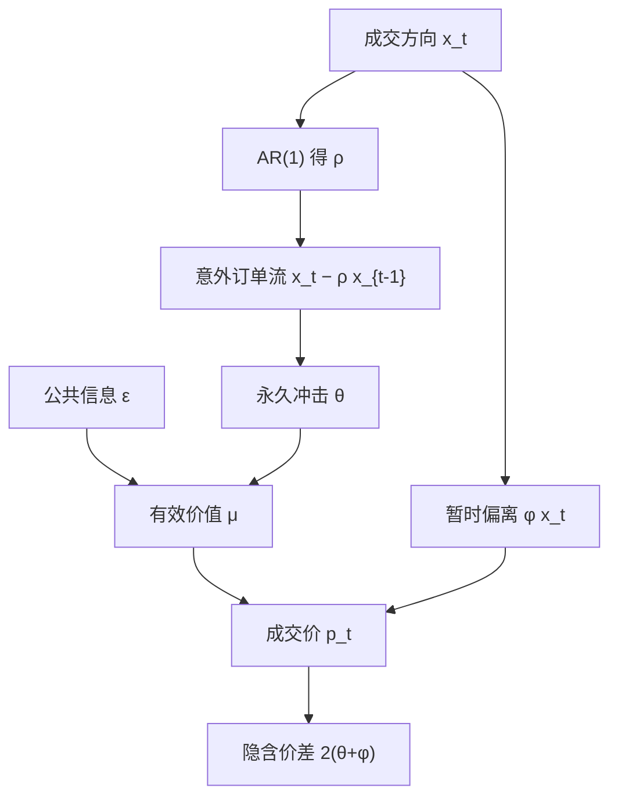

# MRR 价差分解

成交价的变动可以写成三项：订单流方向的可预期部分所携带的信息、未预期订单流对信念的更新，以及买卖报价之间的暂时弹跳；公共消息则进入残差。

<footer>—— Madhavan, Richardson &amp; Roomans, Why Do Security Prices Change? A Transaction-Level Analysis of NYSE Stocks, Review of Financial Studies, 1997</footer>

买卖价差不是一块铁板。[Glosten–Milgrom](/quant/glosten-milgrom) 把报价写成条件期望，价差来自逆向选择；存货模型把中点偏移写成头寸管理；[Roll 模型](/quant/roll-model) 用收益的负一阶相关恢复有效价差，却把信息与摩擦捆在同一个协方差里。Madhavan、Richardson、Roomans（1997）在成交层面给出一个可估的线性结构：**MRR**。它把交易方向的自相关显式写进信念更新，从而把价差拆成永久成分（信息不对称 $\theta$）与暂时成分（指令处理加存货补偿 $\phi$），并允许公共信息独立冲击有效价值。本站 [价差分解](/quant/spread-decomposition) 讲会计身份；本篇写 MRR 的识别与误用边界。它回答的是「这一笔成交之后，价格里留下了什么」，不是「做市商赚了多少点」。

## 问题

观测到的是一串成交价 $p_t$ 与（需推断的）方向 $x_t\in\{+1,-1\}$。价格为什么动？候选机制至少有四条：对手可能知情，于是这笔成交改变有效价值；订单流本身序列相关，于是「又一次买入」里有一部分是已经被预期到的，不应再当作新信息；做市商对买卖收取暂时补偿，成交价在报价两侧弹跳；公告、宏观与指数期货上的公共消息不经过本股票的订单流也会改价格。若只用 Roll 的 $\mathrm{Cov}(\Delta p_t,\Delta p_{t-1})$，四条机制压进一个负数，无法说宽价差是因为更毒还是因为更贵的处理。

需要一个把「可预期订单流」与「意外订单流」分开的信念方程。意外才更新价值；可预期部分已经在上一期报价里。暂时成分则只存在于成交价相对有效价值的偏离，随后回跳。公共信息进入有效价值，但不通过 $x_t$。MRR 的贡献是把这套会计写成交易频率上的线性回归，参数有明确的微观结构名字。

### 方向自相关为什么必须单独建模

实务订单流不是独立抛硬币。拆单、算法切片、惯性都会让 $x_t$ 出现正的一阶相关。若仍假设 $x_t$ 独立，所有持续性都会被记成信息，$\theta$ 被高估，暂时成分被低估。反过来，若把全部相关都当成存货诱导的均值回复，又会把知情交易的缓慢显示写成摩擦。识别的关键是：对信念而言，只有 $x_t-\mathbb{E}[x_t\mid x_{t-1}]$ 是新息。MRR 用 $\mathbb{E}[x_t\mid x_{t-1}]=\rho x_{t-1}$ 这一最简单的 AR(1)，已经足以把「相关」从「信息」里剥开一层。

方向 $x_t$ 本身是估计出来的。Lee–Ready 用成交价相对当时报价中点的位置推断主动方，开盘、交叉盘与中点成交会分错。错分会把 $\rho$ 和 $\theta$ 一起带偏。报告 MRR 而不报告方向算法与中点成交处理，等于没有识别条件。

## 方法

记 $x_t=+1$ 为买方发起、$-1$ 为卖方发起。订单流

$$
x_t=\rho x_{t-1}+v_t,
$$

其中 $v_t$ 是未预期方向。做市商的后验价值（有效价格）为

$$
\mu_t=\mu_{t-1}+\theta(x_t-\rho x_{t-1})+\varepsilon_t,
$$

$\theta$ 是意外订单流对信念的冲击，$\varepsilon_t$ 是公共信息。成交价在有效价格之上再加暂时补偿：

$$
p_t=\mu_t+\phi x_t+\xi_t.
$$

$\phi$ 补偿指令处理、存货与最小报价单位带来的离散；$\xi_t$ 吸收舍入。一阶差分消去不可观测的 $\mu$，得到可估的成交价变动

$$
\Delta p_t=\theta(x_t-\rho x_{t-1})+\phi(x_t-x_{t-1})+e_t,
$$

其中 $e_t$ 含公共信息与舍入的差分。把 $x_t$ 与 $x_{t-1}$ 视为回归元（$\rho$ 可先由方向的 AR(1) 得到，再代入；或与价格方程联合 GMM），即可恢复 $(\theta,\phi,\rho)$。

隐含报价价差是买卖两侧暂时加永久补偿之和：

$$
s=2(\theta+\phi).
$$

信息份额（价差中的逆向选择比例）为 $\theta/(\theta+\phi)$，暂时份额为 $\phi/(\theta+\phi)$。这与 [有效价差与实现价差](/quant/effective-realized-spread) 的会计平行：有效价差对应 $\theta+\phi$ 量级，实现价差更接近 $\phi$，两者之差更接近 $\theta$——但 MRR 把订单流预测也写进了 $\theta$ 的定义，因而比「事后中点移动」多一个 $\rho$ 的修正。

### GMM 矩与交易日内的时变

原文用 GMM，矩条件来自 $e_t$ 与方向、滞后方向正交，以及方向的 AR(1)。NYSE 上他们允许参数随交易日时段变化：开盘附近 $\theta$ 通常更大，因为隔夜信息在开盘发现；午后 $\phi$ 的相对份额可以上升。这与「全日一个价差数字」不兼容。复制应至少拆开盘、午盘、收盘三段，而不是把全日 $\Delta p$ 丢进一条回归。

公共信息 $\varepsilon_t$ 使 $\Delta p_t$ 即使在 $x_t=x_{t-1}=0$ 的假想里也会动。MRR 并不试图识别 $\varepsilon$ 的结构，只要求它与当前意外订单流的相关被正确放进残差。若宏观公告瞬间同时触发订单流与价格跳，正交条件被破坏，$\theta$ 会吞掉一部分公告效应。稳健做法是在已知公告窗口单列，或把指数收益作为额外的公共信息代理放进 $\Delta p$ 方程。

$\rho$ 接近 1 时，$x_t-\rho x_{t-1}$ 变小，$\theta$ 变得难估。高频切片单会把 $\rho$ 抬得很高，这时应先在事件时间上聚合到「一次经济成交」，再估 MRR，而不是在每一笔碎单上硬拟合。

## 机制

机制分两层。第一层是学习。做市商看到一笔主动买。若这类买在过去常常接着还是买，那么当前这笔里有一块是「早就该发生的」，报价中点其实已经部分反映；只有超出 $\rho x_{t-1}$ 的那一块，才说明有人带来了关于价值的新消息，$\mu$ 才移动 $\theta$ 那么多。第二层是补偿。无论有没有信息，提供即时性的一方要求 $\phi$：覆盖处理成本、存货风险与tick。成交之后若没有新信息，价格应回到 $\mu$，于是观测上出现与 $x_t$ 反号的回跳——这就是暂时成分。

由此可对照其他模型。[Kyle](/quant/kyle-model) 的 $\lambda$ 是订单流对价格的线性冲击，没有把「可预期订单流」单独拿出来，也没有买卖两侧的暂时弹跳；它更适合批量拍卖或中间价冲击。[PIN](/quant/pin) 用买卖计数的结构模型估信息事件概率，不分解单笔 $\Delta p$。Hasbrouck 的 VAR 把成交与报价的新息做成信息份额，更灵活，也更少结构；MRR 用三个标量换来可叙述的价差分解。Glosten–Harris 一类线性模型同样估逆向选择与暂时成分，但对订单流自相关的处理不如 MRR 干净。

### 价差变宽时究竟是哪一项

公告前、财报周、小盘股上，价差变宽常常被口头说成「信息不对称上升」。MRR 允许检验：若只有 $\theta$ 上升而 $\phi$ 稳定，叙事成立；若 $\theta$ 不动 $\phi$ 上升，更像存货或处理——例如做市商资本紧张、最小报价单位限制、或成交稀疏使固定成本无法摊薄。开盘的宽价差往往两项都高：隔夜公共信息尚未被报价吸收（$\varepsilon$ 大），同时方向更毒（$\theta$ 大），弹跳也因拍卖与连续盘切换而更猛（$\phi$ 大）。只报一个「开盘价差」会把三种原因叠在一起。

竞争与电子化主要压 $\phi$：处理成本下降、做市商增多使存货分担更容易。$\theta$ 是否下降取决于知情交易是否被更好的披露、更密的报价所稀释。把二十年间价差收窄全部记成「市场更公平」，会低估处理成本下降的贡献，也会高估信息环境的改善。

## 边界与工程取舍

MRR 是成交时钟上的线性模型。它假定：方向是二元的；信念对意外订单流线性；$\rho$ 是一阶的；暂时偏离一个 $\phi$ 就够。隐藏单、冰山、中点成交、多层簿上的深度变化，都不会进入 $x_t=\pm 1$。在现代限价簿里，同一毫秒的多笔成交可能是一次大单扫过若干档，把它们当成多次独立的 $x_t$ 会重复计算信息。较干净的做法是把同一主动单扫出的序列合成一次，方向取主动方，数量可进入扩展（把 $x_t$ 换成带符号成交量），但那已经不是 1997 年的原文。

最小报价单位约束使 $\phi$ 含有离散化。tick 变粗时 $\phi$ 上升，并不等于处理成本上升。样本若跨越 tick 改革，应分段估。停牌、集合竞价、涨跌停处方向与价格的生成过程换了，全日 MRR 无意义。A 股的开盘集合竞价、T+1 与涨跌停会让 NYSE 口径的 $\rho$ 不可比；必须用当地连续竞价成交重做，并单独处理集合竞价。

不要把 $\theta/(\theta+\phi)$ 叫做「知情交易比例」——它是价差中的信息补偿比例，不是人数比例。不要在已经用实现价差算过一遍逆向选择之后，再用全日 MRR 当「独立证据」却用同一批成交。不要在 $\rho$ 未报告时比较两只股票的 $\theta$：相关结构不同，$\theta$ 的单位并不自动可比。

MRR 分解的是成交价路径，不是做市商会计利润。即使 $\phi>0$，被选中、被撤单、被隔夜跳空伤害之后，流动性提供者仍可能亏损。把 $\phi$ 当成「做市必赚」会与毒性文献冲突。

## 小结

- MRR 把 $\Delta p_t$ 写成意外订单流的永久冲击 $\theta$、方向切换的暂时成分 $\phi$，以及公共信息残差。
- 订单流 AR(1) 的 $\rho$ 把可预期方向从信息里拿掉；忽略 $\rho$ 会高估逆向选择。
- 隐含价差 $2(\theta+\phi)$，信息份额 $\theta/(\theta+\phi)$，与有效—实现价差会计相近但多了方向预测修正。
- 参数随日内时段、tick、方向算法而变；开盘与碎单聚合是一等设定。
- $\theta$ 不是 PIN，$\phi$ 不是做市利润；模型是成交层面的线性近似，不是限价簿的完整描述。
- 出处：Madhavan, Richardson & Roomans, *Review of Financial Studies*, 1997。对照 Glosten–Milgrom、Roll、Hasbrouck VAR 与有效—实现价差。
