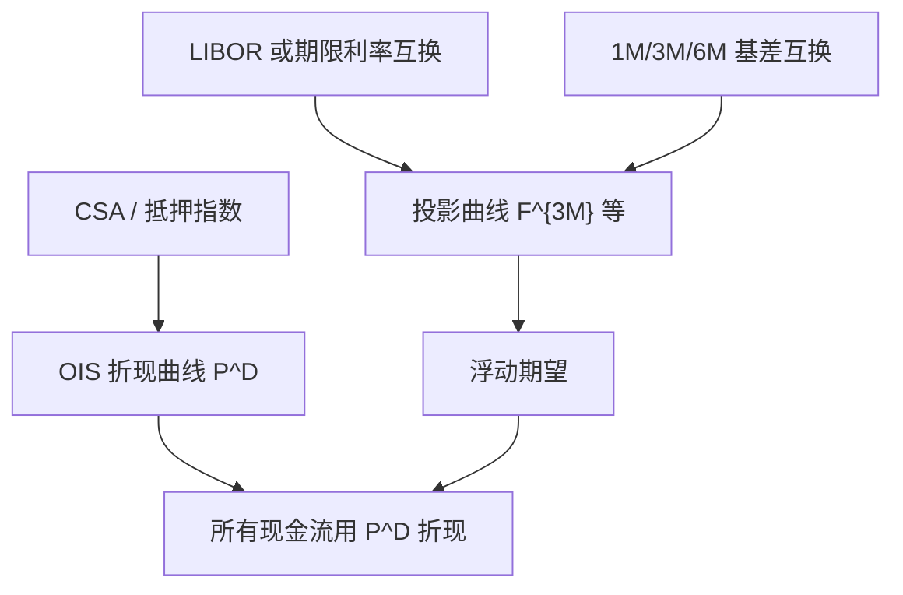

# OIS 与多曲线

    
抵押衍生品的折现应跟随隔夜指数互换曲线；LIBOR 合同的浮动端仍按 LIBOR 远期投影——一条曲线不能再同时做两件事。

    <footer>—— 危机后市场惯例；Bianchetti, Two Curves, One Price, Risk, 2010；Hull and White, LIBOR vs. OIS: The Derivatives Discounting Dilemma</footer>

2008 年以前，许多台子用同一条 LIBOR 互换曲线既折现又预测浮动现金流。危机中 LIBOR–OIS 基差从几个基点撑开到数十甚至上百，再也不随「微小摩擦」被忽略。有抵押（CSA）的衍生品，日终抵押接近以隔夜指数计息，其融资与折现更靠近 OIS；而未抵押或浮动端仍挂钩 3M LIBOR 的合同，投影必须用 3M 曲线。Marco Bianchetti 2010 年在 *Risk* 上用「两条曲线、一个价格」概括定价：折现曲线与投影曲线成对出现。John Hull 与 Alan White 把「该用 LIBOR 还是 OIS 折现」写成交易与估值的两难，并说明抵押约定如何决定选择。自助法仍然适用，只是未知量拆开了。

## 问题

单曲线下，标准浮动端在重置与支付匹配时，现值可收成面额减终折现，互换利率是折现加权远期平均，远期由同一 $P$ 的比得到。基差一宽，3M LIBOR 远期不再等于 OIS 隐含的三个月复利，用 OIS 折现却用 LIBOR 自助的远期，价格会变；用 LIBOR 折现抵押组合，又与 CSA 的隔夜利息不一致，出现虚假 P&L。问题是明确三件事：折现用哪条曲线、每个浮动指标用哪条投影曲线、不同期限 LIBOR（1M/3M/6M）之间的基差如何用额外曲线或基差互换吸收。

外汇与跨货币 CSA 还引入美元以外的抵押与交叉货币基差，使折现变成「本币 OIS 调整后的曲线」。那是多曲线的下一层；本篇先把单币种、抵押利率衍生品的双曲线结构说清。

### 抵押、无抵押与折现

理想 CSA：每日足额现金抵押，报酬指数为隔夜有效利率，则增量现金流的折现接近 OIS（或该指数的互换曲线）。无抵押组合的折现应反映对手方信用与自身融资，那是 CVA/FVA 的领域，不应假装仍是 LIBOR 曲线就完事，也不应无条件改用 OIS。Hull–White 的「两难」正在于：同一法律主体的不同交易可能分属不同 CSA，折现不能全球唯一。多曲线首先是估值约定，然后才是曲线构建技术。

OIS 曲线由隔夜指数互换自助，不是「把 LIBOR 曲线减一个常数」。形状可以不同，尤其在短端政策利率路径与长端供需上。

## 方法

先自助 OIS：输入是隔夜存款、短端 OIS、长端 OIS 互换，得到折现 $P^D(0,T)$。再自助投影：对 3M LIBOR 互换，固定端用 $P^D$ 折现，浮动端是 $\sum P^D(0,T_i)\delta_i F^{3M}(0;T_{i-1},T_i)$，其中 $F^{3M}$ 来自投影折现 $P^{3M}$ 或其等价远期曲线。已知 $P^D$ 时，每个新互换到期解投影曲线的一个新节点。1M、6M 用基差互换或对应期限的互换再解 $P^{1M},P^{6M}$。FRA 直接报投影远期，仍要用 $P^D$ 折现其结算。

欧式期权与上限的标的是投影远期，微笑可以仍用 [SABR](/quant/sabr) 标记；估值时贴现用 $P^D$。旧单曲线公式里「互换 Delta」混着折现风险与远期风险；多曲线必须拆成 OIS Delta 与 LIBOR 基差 Delta，否则对冲会用错工具。

### 公式层的最小改动

确定现金流（固定端、已确定的浮动支付）只碰 $P^D$。尚未确定的浮动，用对应指标的远期乘以年分数，再乘 $P^D$。不要用 $P^{3M}$ 去折现 3M 现金流——$P^{3M}$ 在构造上往往只是为了生成 $F^{3M}$ 的辅助对象，未必是可交易的零息债券价格。Bianchetti 强调价格只有一个：所有现金流最终都用折现曲线送到今天，投影曲线只负责期望浮动。

## 机制

LIBOR 含银行信用与流动性，OIS 更接近有抵押的隔夜。二者之差是基差，本身可交易（LIBOR–OIS 基差互换）。危机后基差的水平与波动都大到必须当独立风险因子。单曲线等于假设基差恒为零；多曲线把基差的期限结构显式化。IBOR 改革用 SOFR、€STR 等几乎无信用的隔夜替代 LIBOR 之后，折现与投影在隔夜复利互换上可以重新靠近，但期限 SOFR、跨期限基差、历史 LIBOR 残余合同仍然强制多曲线或至少多指数。

对冲上，抵押互换的折现风险用 OIS 对冲，浮动指标风险用对应互换或期货对冲。用旧的「单一互换曲线 01」会在基差变动时出现无法解释的 P&L。这与 [关键利率久期](/quant/key-rate-duration) 的分桶思想一致，只是桶的维度从「期限」增加了「哪一条曲线」。

### 与自助法、远期定义的衔接

远期定义仍是「适当曲线上两个零息之比」，但必须声明是哪条曲线。OIS 远期描述隔夜复利的未来路径；3M LIBOR 远期描述 3M 定盘。无套利不再要求二者相等，只要求各自与可交易互换、基差互换一致。这是对 [即期、远期与折现](/quant/spot-forward-df) 单曲线恒等式的限制性说明：恒等式在单条曲线内成立，跨曲线相等不是恒等式。

把多曲线理解成「多做几次 Bootstrap」是对的；理解成「利率有了两个真值」是错的。真值是合同现金流加 CSA；曲线是用来表示这些现金流的坐标。

## 边界

多曲线定价仍常假设确定性基差或确定性曲线，把波动只放在投影远期的微笑上。基差本身随机时，抵押凸性、交叉货币与 Quanto 需要更重的模型，不应把 2010 年的双曲线确定性框架写成已经包含全部凸性。无 CSA 或弱 CSA 不能无条件 OIS 折现。清算中心与双边 CSA 的报酬指数若不同，折现曲线应按净额集分割。

Bianchetti（2010）与 Hull–White 的 OIS/LIBOR 讨论是危机后惯例的枢纽文献；它们不规定 SOFR 过渡后的每一张合同。构建细节仍依赖 Hagan–West 插值与日历。读旧论文里的单曲线数值例，不能直接当今日抵押组合的估值。

LIBOR 停用后，「多曲线」没有过时：变成 OIS 折现加期限利率、RFR 复利、跨币种基差。名字还在，指标换了。

## 小结

- 危机后抵押衍生品用 OIS 折现，IBOR 浮动端用自身投影曲线；单曲线假设基差为零，已与市场矛盾。
- 价格仍只有一个：投影给出浮动期望，折现把所有现金流送到今天。
- 不同期限 IBOR 需要各自曲线或基差互换；对冲要拆 OIS 01 与基差 01。
- $P^{3M}$ 常是生成远期的辅助，不应用它折现。
- CSA 细节决定能否 OIS 折现；无抵押是另一套信用与融资调整。
- 出处：Bianchetti, *Risk*, 2010；Hull and White, LIBOR vs. OIS；构建技术见 Hagan and West, 2006；入门恒等式见 Hull 教科书。
