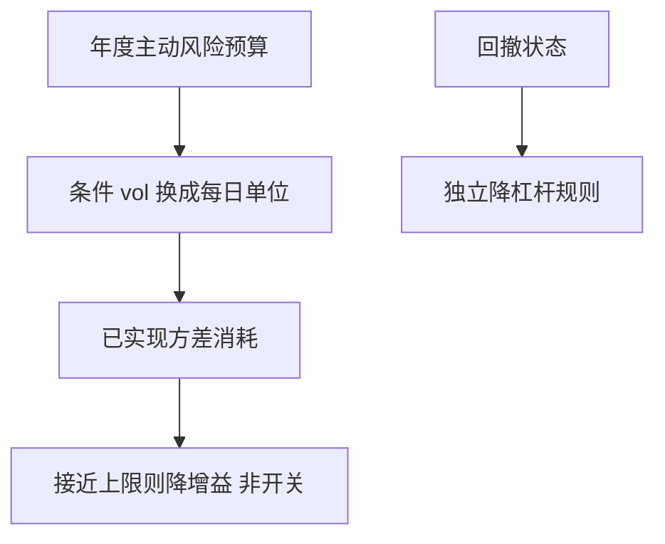

# 多期风险预算

单期风险预算把限额写在当下的因子暴露上；多期还要管路径：何时用完预算、回撤后如何再分配。

<footer>—— 对照 Grinold–Kahn 对主动风险预算的论述；动态风险预算见机构组合管理实务</footer>

[上一课](/quant/tax-aware-portfolio)把税写进再平衡。风险预算主干 [风险预算](/quant/risk-budgeting) 是单期分解。缺口是**时间**：年度主动风险预算 3%，若一季度用完，后三季度是停机还是加预算？本课写多期分配与回撤依赖的政策，接到目标日期。

## 问题

Grinold–Kahn 的 IR 优化给出各账面的主动风险份额。那是静态。真实约束是：董事会给的是年度跟踪误差或 VaR 预算，路径上已实现主动风险会消耗预算。政策若「用完即停」，等于在最有信号的时候关掉 alpha，并把卖出冲击集中在坏时候。问题是把预算当成**需要跨期平滑的资源**，类似 GP 把交易平滑，而不是当成每日硬帽。

回撤规则：净值跌破阈值降杠杆，会在均值回复的策略上买在高点、卖在低点。要区分：风险预算（事前 $\sigma$）与止损（事后路径）。两者都要，不能互相替代。

### 预算消耗不是线性时钟

若收益接近白噪声，已实现方差随时间线性涨，预算可按剩余日历比例。若波动聚集，早季的冲击会预支全年。应用条件 vol（[HAR](/quant/har-rv)/GARCH）把预算写成「剩余积分方差」而不是剩余月份。

多策略共享预算时，要避免每个策略各自 3% 再线性加总。相关性使总风险不是和；多期还要管策略间的占用先后。

## 方法

事前：把年度 $\sigma$ 预算换成每日风险单位，用条件 vol 缩放目标暴露，见 [波动瞄准](/quant/vol-scale-cta) 精神，但对象是主动簿。消耗：跟踪已实现主动方差积分，接近上限时降低增益 $A$（GP）或加宽再平衡带，而不是二元开关。回撤：独立的财富状态，降 $\gamma$ 或降杠杆，规则公开、避免优化到历史回撤。报告：预算使用率、条件 vol、因子占用三张表。

## 机制

风险预算是对未来二次变差的配额。多期最优类似消费-储蓄：今天多用，明天少用。信号强（IR 高）时应允许暂时超用并在弱信号期补偿——这需要治理，不是交易员临时申请。没有治理，多期优化会变成事后为超限找的借口。

## 边界

董事会预算往往不可平滑（硬帽）。硬帽下只能留缓冲，缓冲是成本。策略相关突变使「已分配预算」瞬间不够，要有集中超限预案。本课不把风险预算写成保证回撤上限——VaR 预算管的是事前 $\sigma$，不是路径最大回撤。

## 小结

- 多期预算管理的是风险路径，不是把单期限额每天重贴一次。
- 用条件 vol 与平滑降增益，避免用完停机。
- 回撤规则与预算分开；共享预算要管相关。
- 出处：Grinold and Kahn, *Active Portfolio Management*；波动瞄准与机构风险预算实务。
