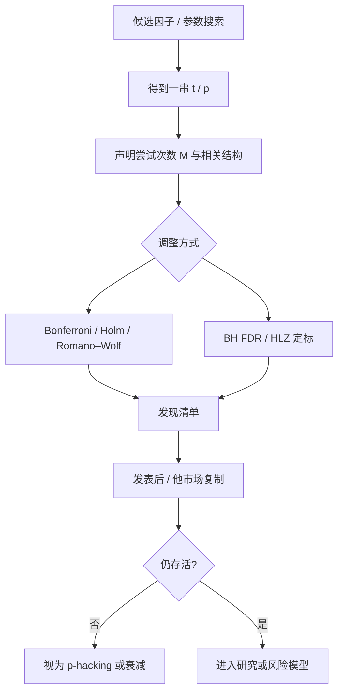

# 多重检验与 p-hacking

试图解释截面收益的因子已经太多，t 统计量等于 2.0 不再算发现；在几百次尝试之后，2.0 只是幸运。

<footer>—— Harvey, Liu and Zhu, … and the Cross-Section of Expected Returns, RFS 2016</footer>

[上一课](/quant/factor-decay-turnover)用 IC 的半衰期与维持信号所需换手决定因子是否可交易，并分开持有期衰减、发表后衰减与拥挤。缺口是发现过程本身：同一数据集上换描述子、样本、加权、中性化、持有期，再报告最好的 t。截面长期用 t>2 当「因子存在」，尝试次数从未被计入。Harvey–Liu–Zhu 把多重检验写进因子动物园：新因子的 t 需要大约 3.0。本课写 FWER、FDR、Reality Check 与发表后衰减。不重推 IC 期限结构。后课条件 CAPM 默认已经把「显著 α」当成过了多重检验的声称，而不是实验室默认。

## 问题

单次检验里，$H_0:\alpha=0$ 时 $|t|\gt 1.96$ 对应约 5% 误拒。若独立尝试 $M$ 次，至少一次误拒的概率是 $1-(1-0.05)^M$。$M=100$ 时已经接近 1。因子研究的尝试远不止 100：特征可以任意变换，样本起止可以微调，行业分类可以换，异常值规则可以改。McLean 与 Pontiff（2016）发现许多异常在发表后样本外衰减，与统计偏差和样本内过拟合一致。Linnainmaa 与 Roberts 对现金流量表异常的样本外检验，同样显示相当一部分「显著」无法复制。

更隐蔽的是相关尝试。连续换参数得到的 t 并不独立，朴素 Bonferroni（门槛变为 $0.05/M$）可能过严或过松，取决于你怎么数 $M$。Harvey–Liu–Zhu 用多重检验框架给「因子发现」重新定标，而不是假装只做了一次回归。

### 什么算一次尝试

任何在看过结果之后才锁定的选择都算：变换符号、在 12 个月与 6 个月动量之间挑、丢掉某个危机年、只报告市值加权或只报告等权、正交顺序挑 t 最大的一种。预注册（先写明样本、公式、加权）能把尝试次数降到接近 1，但量化研究很少真正预注册。最低要求是：把搜索空间写进论文或备忘录，用同一空间做多重检验调整。

「样本外」若用来选模型，就不是样本外。用 2010–2015 调参、2016–2018 挑因子、只把 2019 之后叫验证，中间那截仍在多重检验里。真正的验证集不能回头改定义。

## 方法

Bonferroni / Holm。控制族错误率（FWER）：至少一次假发现的概率。Holm 逐步法比 Bonferroni 稍强，仍对独立或正依赖较保守。适合「我声称这 5 个因子全部成立」这种联合声明。

错误发现率（FDR）。Benjamini–Hochberg 控制期望假发现比例。在因子筛选里更常用：允许一些假阳性，但要求报告的清单里假的比例有上限。Harvey–Liu–Zhu 的精神接近：给发现定一个更高的 t 门槛，使在庞大搜索下 FDR 仍可接受。他们建议的 $|t|\gt 3.0$ 不是魔法常数，而是对当时因子数量与多重检验结构的校准；因子继续增殖，门槛应更高。

多重检验的自举。White 的 Reality Check、Hansen 的 SPA、Romano–Wolf 逐步法，用收益率重抽样抓住策略间的相关。适合「在 400 个候选里挑最大夏普」这种明确的搜索。因子研究里候选相关结构复杂（价值与盈利相关），自举比假设独立更诚实。

### Lucky factors 与数据挖掘

Harvey 与 Liu 后续的 *Lucky Factors* 把问题反过来：给定已发表的因子丛林，哪些可能只是幸运。方法仍是多重检验，但强调因子之间的相关与「被尝试过但未发表」的暗数。暗数不可观测，所以任何门槛都有主观成分；正确态度是把 t=2 的因子当成假设，而不是当成风险溢价去加杠杆。

p-hacking 在工程上的孪生兄弟是回测过拟合：同一代码仓库里试了一百个正交组合，Git 记录比 t 值更有信息。保留搜索日志，比事后编一个「我们只检验了理论推导的唯一形式」更有用。

## 机制

多重检验膨胀的是第一类错误，不改变单次回归的点估计。样本内 alpha 仍然可以很大，只是其「偶然出现」的概率被低估。这与拥挤不同：拥挤是资金把可预测性做掉；多重检验是可预测性从未在统计意义上存在。实盘上两者都表现为样本外变弱，但处方不同：前者要管容量与杠杆，后者要停止交易这个信号。

贝叶斯视角更干净。先验若认为「随机特征不该定价」，则似然带来的 t=2 几乎推不动后验。Harvey–Liu–Zhu 把这种先验写成多重检验调整，避免每个数据矿工都声称自己只做了一次检验。

### 与经济理论的分工

有理论约束的因子（消费风险、条件 CAPM 的状态变量）不应与纯挖掘的技术指标享受同一门槛吗？理论上可以给理论因子更松的多重检验权重，但必须预先声明理论，而不是在显著之后补一个故事。Lettau–Ludvigson 的 $cay$ 是先有消费–财富逻辑，再进截面；若反过来，先搜宏观变量再讲故事，它就落入同一套 FDR。

## 边界与工程取舍

t=3 会误杀一些真但弱的溢价，尤其是容量大、换手低、经济含义清楚的因子。这是统计功效与假发现的权衡，不是「学术界刁难」。工业界可以并行使用：交易决策要求更高的样本外 hurdle；风险模型仍可纳入 t 较小但能解释协方差的风格——解释风险不要求它是 alpha。

不要用换样本来「验证」一个已经被全历史搜过的定义。也不要用机器学习的交叉验证假装解决了问题：若特征集是看着全样本选的，折外仍泄漏。诚实的做法包括：预指定、多重检验调整、发表后样本、其他市场复制。Hou、Xue 与 Zhang 的复制工作表明，相当一部分异常在更严格的样本与加权下显著变弱——这应视为多重检验与可投资性过滤的联合结果。

把门槛从 2 提到 3，却同时把尝试次数从 50 加到 5000（深度学习特征），净效果仍是假发现。门槛必须随搜索空间一起走。

## 小结

- 因子发现是多重检验问题；t=2 对应的是单次检验，不是动物园里的发现门槛。
- Harvey–Liu–Zhu（2016）论证新因子需要更高的 t（他们校准到约 3.0），并应把未报告的尝试计入。
- FWER 与 FDR、以及考虑相关的自举（Reality Check、Romano–Wolf）是可用的调整工具；*Lucky Factors* 处理已发表丛林里的幸运者。
- McLean–Pontiff 的发表后衰减、Hou–Xue–Zhang 的复制，与 p-hacking 和不可投资性一致，应作为默认的样本外关卡。
- 风险解释与 alpha 声称可用不同门槛；理论因子的优待必须预声明，不能事后编故事。
- 出处：Harvey, Liu and Zhu, *… and the Cross-Section of Expected Returns*, Review of Financial Studies, 2016；Harvey and Liu, *Lucky Factors*；McLean and Pontiff, JF, 2016；White, *A Reality Check for Data Snooping*, Econometrica, 2000。
