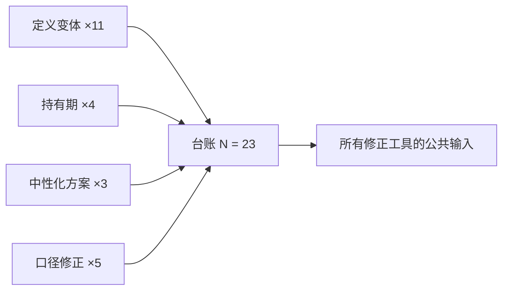
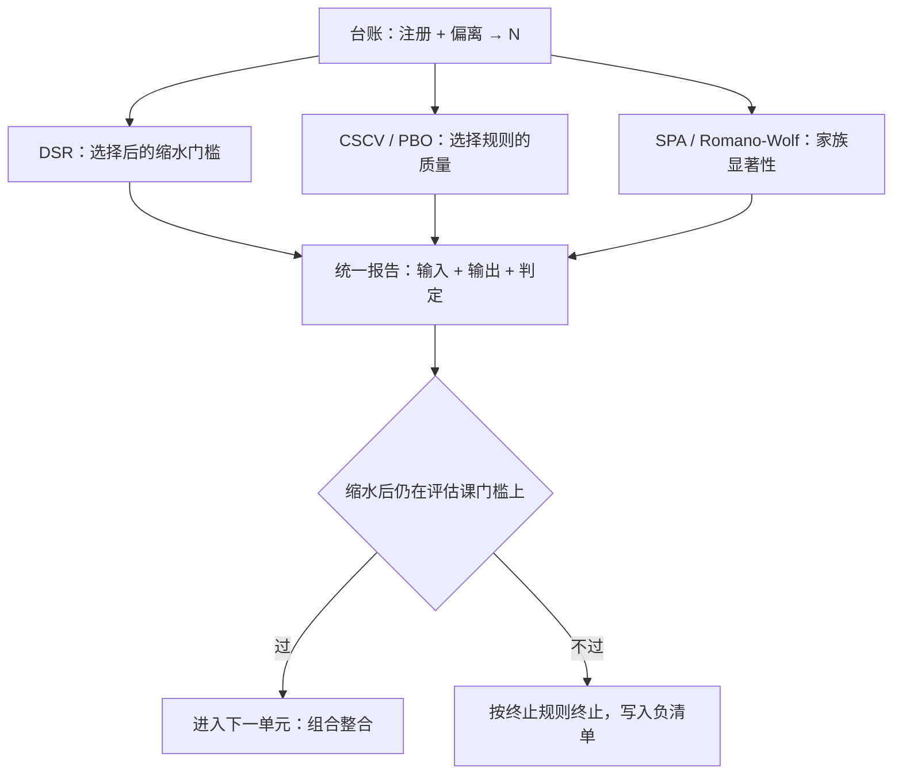

# 多重检验纪律的现场用法

在一个检验过数百个因子的世界里，t=2 不再是门槛，而是起跑线。

<footer>—— 据 Harvey, Liu and Zhu (2016) 对多重检验后 t 统计量门槛的讨论整理</footer>

[上一课](/quant/single-signal-eval)让 IC、换手与成本第一次会师：毛指标活着，净指标悬而未决。悬着的那部分正是本课要清算的。本课是「假设与数据」单元的收束：[多重检验与 p-hacking](/quant/multiple-testing-factors) 给了理论，[Probability of Backtest Overfitting](/quant/pbo)、[CSCV 组合对称交叉验证](/quant/cscv)与 [Deflated Sharpe](/quant/deflated-sharpe) 给了工具；本课不重讲任何一个，只演示它们在**这一次**研究中如何被选用与报告——防止纪律沦为仪式。

## 问题

纪律沦为仪式有三种形态。其一是装饰：跑完全部流程，报告里引用 CSCV 与 DSR 的文献，却不写 N 从哪来——修正量没有输入，引用等于没引用。其二是择优：三种修正都跑，只报告最松的那个，这本身就是又一次多重检验。其三是误用：把为「策略对基准」设计的检验套在别的对象上。缺口的本质：工具课讲的是每个工具回答什么问题，没讲一次具体研究该买哪几样、报告的读者是谁。

「修正量」指 DSR、PBO 这类工具算出来的打折门槛。可以把它们想象成计算器：输入不了「试了多少次、各次表现差多少」，就永远按不出结果。所以报告里引用了文献却不写 N，等于展示了一台从没插电的计算器——仪式做完了，折扣一分没打。

## 方法

对本单元的 PEAD 案例现场走一遍。第一步，**数 N**：注册文档加偏离记录给出 N=23（11 个定义变体、4 个持有期、3 个中性化方案、5 次口径修正）。N 是台账产物，不是回忆产物。第二步，选工具并写明各自回答的问题：

- **Deflated Sharpe**：回答「N 次试验里最好的那个 Sharpe，期望该是多少」。输入 N、各试验 Sharpe 的方差、偏度峰度、样本长度；输出缩水后的门槛，样本内 t 对照它判断。
- **CSCV / PBO**：回答「选中的变体是不是只是运气最好的那个」。对变体表现矩阵做组合对称切分，PBO 接近 0.5 就意味着样本内最优与样本外表现几乎脱钩。
- **Romano-Wolf / SPA**：回答「多空组合跑赢基准的部分在家族校正后是否仍显著」（[FDR / Romano-Wolf](/quant/fdr-romano-wolf)、[Hansen SPA 检验](/quant/hansen-spa)；bootstrap 原型是 [White Reality Check](/quant/white-reality-check)）。这是主结论的最终闸门。

三个工具回答三个不同问题：全部报告，不择优。第三步，**报告口径**：注册与偏离、N、每个工具的输入输出、缩水后是否仍站在评估课的门槛上；探索性结果单列一节并标注。（本段数字为演示口径。）

Harvey、Liu 与 Zhu 的清单里收了三百多个候选因子，并估计新异象的 t 门槛应抬到 3.0 量级。门槛不是更严了，而是终于把「这条文献里已经试过多少次」计进价里。

N 不是拍出来的总数，而是各类选择逐项累加的结果：

数字实例：PBO 的取值在 0 与 1 之间，衡量「样本内选中的最优变体，样本外落入表现较差那一半」的频率。PBO = 0.5 意味着你的挑选和掷硬币一样准；若 23 个变体算出 PBO ≈ 0.48，翻译成人话就是——你挑中的那个大概率不是真的好，只是抽签抽得好。

## 机制

纪律不沦为仪式的机制在**接口**：预注册产出 N，审计产出可信的输入分布，评估产出毛指标，统计修正把三者合成一个可复核的判定。工具不是越多越好：DSR 回答选择后的期望缩水，PBO 回答选择规则本身的质量，SPA 与 Romano-Wolf 回答相对基准的家族显著性——三个答案可能不一致，不一致本身就是报告内容。修正各有假设：DSR 依赖 Sharpe 分布的近似与方差估计，CSCV 依赖对称切分，Romano-Wolf 依赖 bootstrap 世界的相关结构，超出假设的用法要声明。也别把修正叠到一切皆死：主修正在注册时选定一个，其余作稳健性附录。

## 边界

修正救不了信息量不足：样本太短时连 DSR 的方差都估不稳，此时按终止规则走，别把「再收两年数据」当失败。本课到此刻意留一个缺口：单信号在缩水与成本后达标，只说明它**作为独立下注**成立；能不能进组合，取决于与既有持仓的相关、约束与加权——那是下一单元第一课（组合整合）的问题。带着这个缺口进下一单元，比假装它已被回答要好。

常见误区：把「样本太短、检验过不了」当成需要克服的失败，于是等新数据、换口径、再试一轮。实际上按终止规则停下来的研究是一份合格产出——它把「此路不通」写进负清单，替未来的自己省下整轮试错。这正是上一课止损线在统计工具层的落地。

## 小结

- 纪律仪式化三形态：引用不输入、择优报告、误用检验对象；对策是把工具当机器用。
- N 来自台账（注册加偏离），是一切缩水量的输入。
- DSR、PBO、SPA/Romano-Wolf 各答一个问题，全部报告，不择优；主修正在注册时选定。
- 报告口径：注册与偏离、N、输入输出、缩水后判定；探索结果单列标注。
- 本单元收束：单信号达标留下组合缺口，由下一单元第一课接手。
- 出处：Harvey, Liu and Zhu (2016)；Bailey, Borwein, López de Prado and Zhu (2014, 2017)；White (2000)；Hansen (2005)；Romano and Wolf (2005)。
