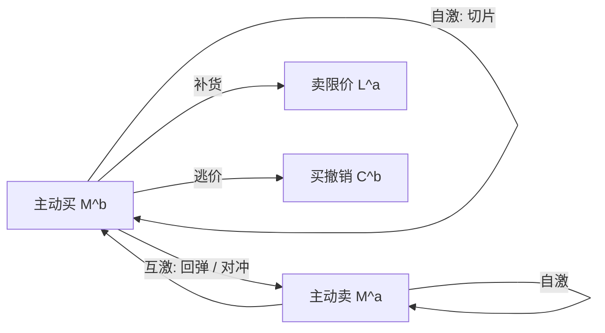

# 多元 Hawkes 互激

一类事件不仅可以激励自己再次发生，还可以激励另一类：主动买抬高随后的主动卖，限价到达抬高随后的撤销。互激把「成串」从单变量记忆写成一张有向的核矩阵。

<footer>—— Hawkes, Spectra of some self-exciting and mutually exciting point processes, Biometrika, 1971；高频估计与分支矩阵见 Bacry 等人的工作</footer>

一维 Hawkes 只有自激：过去的成交抬高现在的成交强度。[成交到达强度](/quant/hawkes-trades) 用它说明成串与分支比；[Hawkes 订单簿强度](/quant/hawkes-lob) 已经把事件扩成多类，但重点仍在簿的生成与恢复力。本篇把对象收窄到**互激本身**：核矩阵 $\Phi=(\phi_{ij})$ 的非对角元、分支矩阵的谱、以及「谁 Granger-激励谁」在点过程里的含义。它是识别工具，用来区分切片动量、回弹补货与闪价回路，不是用来构造一条「跟着互激下单」的策略。

## 问题

买卖成交若只有自激，市场像两列几乎分开的火车：买的切片激励更多买，卖的切片激励更多卖。若还有互激，火车之间有换乘：买之后很快有卖，可能是做市存货对冲、套利回补或简单的价格噪声交易。这两种世界里，同样的成交密度对应完全不同的中点路径——前者趋势，后者来回。只报告一维 $n$ 无法区分。多元模型的最小问题是：估计 $N_{ij}=\int_0^\infty\phi_{ij}(u)\,\mathrm{d}u$，即 $j$ 类事件平均触发多少个 $i$ 类后代（直接加间接要靠 $(I-N)^{-1}$ 的 resolvent）。

第二个问题是维数。$d$ 类事件有 $d^2$ 个核。没有稀疏性或参数共享，单日微观结构样本也能过拟合出「全连接互激」。需要可检验的约束：例如对角主导、反对角只允许成交、限价-撤销对只允许同侧，等等。

### 分支矩阵与谱半径

线性多元 Hawkes 的强度为

$$
\lambda_i(t)=\mu_i+\sum_j\int_{(-\infty,t)}\phi_{ij}(t-s)\,\mathrm{d}N^j_s.
$$

积分核得到 $N=(N_{ij})$。过程稳定（存在平稳强度）的充分条件是 $\rho(N)<1$。$\rho$ 接近 1 表示系统接近临界分支过程：外生的一笔可以引发长串后代，类与类之间传递。Filimonov–Sornette 式的内生性讨论在多元里应报告 $\rho(N)$ 与主导特征向量，而不是某一个 $N_{11}$。特征向量告诉我们余震能量主要贮存在哪些事件类型里——往往是撤销，而不是成交，因为撤销远更频繁。

$N_{ij}$ 是事件计数的平均后代，不是股数，也不是价格。大核可以从大量一股的闪价里来。解释经济大小时，至少用标记过程或用「该类事件的平均量」去换算。

## 方法

指数核下 $\phi_{ij}(u)=\alpha_{ij}e^{-\beta_{ij}u}$，或对所有边共享一组 $\beta$ 以减少参数。估计用极大似然；高维用正则化（对 $\alpha$ 的 L1）或逐步加入边：从对角开始，按残差互相关的拉格朗日乘子检验加边。Bacry 等人也发展了基于矩和 Wiener–Hopf 的估计，适合核形状未知、但需要非参数 $\phi_{ij}(u)$ 的情形——例如看互激是 10 毫秒峰值还是 1 秒峰值。

因果叙述要小心。点过程里「$j$ 激励 $i$」是：在历史上加入 $j$ 的事件会提高 $i$ 的条件强度。它不是结构因果模型里的 do-演算，更不是可交易领先。延迟的行情会让先收到的场所看起来在激励后收到的场所。多市场研究必须用各交易所自己的撮合时间，而不是本地到达时间，否则互激图会画成光纤图。

### 三种可命名的子矩阵

把事件排成买成交、卖成交、买限价、卖限价、买撤、卖撤。三个子块几乎总是值得单独报告：

1. **成交块。** 对角：切片与动量；反对角：回弹、存货对冲。对角减反对角的差，粗略区分趋势流与来回流。
2. **成交→限价块。** 对手方限价被激励：补货、恢复力；同侧限价被激励：追价排队。
3. **限价↔撤销块。** 同侧高互激：闪价与探询；若限价强烈激励对手方撤销，可能是报价被跨越前的逃逸。

这些名字是事后标签，要靠核的时间尺度核对：闪价在毫秒，补货可以到秒，切片看母单节奏。跨尺度的单一指数核会把它们混成一个 $\alpha$。

## 机制

互激的微观机制不必是知情。做市商在被买成交击中后，可能撤销剩余买限价并在卖侧补货，于是 $M^b$ 激励 $C^b$ 与 $L^a$。套利账户在一腿成交后立刻打另一腿，表现为跨合约互激。同一母单的子单在买卖之间很少互激，更多是对角自激。因此核矩阵是参与者混合的投影，不是单一策略的指纹。把估计出来的反对角叫做「做市商存在」是过度诠释；只能说数据与补货回路相容。

与 QR 的关系：队列变薄会同时提高某些强度，即使没有时间核也会看到「成交之后限价增多」。多元 Hawkes 若不含 $q$，会把状态反应估成互激。混合做法是 $\lambda_i(t)=\mu_i(q_t)+\sum_j(\phi_{ij}*dN^j)$，让 $\mu$ 吸收 QR，$\phi$ 吸收真正的记忆。这是目前较干净的识别，也更难估。

### 从互激到价格相关

若买成交激励卖成交的核很强且快，中点更可能在成交后回跳，有效价差的实现部分变小；若几乎只有对角，中点更可能继续走，永久冲击份额上升。Bouchaud 传播核把带符号成交对价格的平均响应写成 $G(\tau)$；多元 Hawkes 提供成交符号序列的生成器。二者可以耦合：用 Hawkes 生成符号，用 $G$ 生成价格，得到冲击的时间结构——这是连接本篇与 [传播核](/quant/bouchaud-propagator) 的标准桥。不要在没有价格模型的情况下，从 $N$ 直接读出夏普。

谱半径接近 1 时，似然对核误设极度敏感。报告时应给出对 $\beta$ 网格、对是否含开盘、对是否剔除公告窗的稳健性，而不是一个点估计叙事。

## 边界

线性互激不能表示「成交之后暂时禁止同方向」这类抑制，而自成交防范与最小报价寿命会制造短不应期。负核或非线性抑制存在文献，但平稳性条件更绕。类别若按价格档位再拆，维数爆炸，通常应停在 BBO 事件。集合竞价、涨跌停板上的连续同向成交会让对角核爆掉，这些时段应删掉或单独建模。

不要用估计出的 $\Phi$ 去「预测下一笔类型」当回测 alpha：你自己的下单会立刻改写过程，开环命中率没有执行含义。不要把跨市场的互激图当成领先指标对外宣传，除非已经用撮合时间做过延迟稳健性。午休、隔夜必须切断卷积。

互激矩阵适合做设定检验与机制分类。把它当因子库里的一列高维特征，通常既不平稳，也不正交于波动与成交量。

## 小结

- 多元 Hawkes 用核矩阵描述类与类之间的激励；稳定性看分支矩阵的谱半径。
- 对角与反对角的成交块区分动量切片与回弹；成交对限价的块描述恢复力。
- 高维必须稀疏化；残差互相关用于加边，而不是一上来估满矩阵。
- 不含队列状态时，QR 式的状态反应会被误认为互激。
- 延迟、制度时段与事件计数（而非股数）限制经济解释。
- 出处：Hawkes, *Biometrika*, 1971；市场中的多元估计见 Bacry, Mastromatteo and Muzy 及后续的核与分支比工作。
