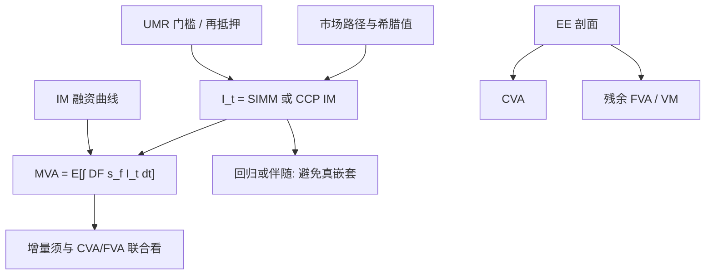

# MVA 初始保证金调整

初始保证金是对未来几天潜在损失的预留现金，本身随市场敏感度变动；为持有这笔现金所付的资金，变成又一项随暴露凸性而涨的调整。

<footer>—— Gregory, The xVA Challenge 中对 MVA 的处理；保证金模型背景对照 ISDA SIMM 与 CCP SPAN 类方法</footer>

变异保证金跟着当前市值走，充分现金 CSA 下接近把 [FVA](/quant/fva-funding) 关掉。初始保证金（IM）覆盖的是平仓地平线上的潜在损失，即使今日 $V=0$ 也要缴。非清算衍生品在 UMR 下用 [ISDA SIMM](/quant/span-simm) 一类敏感性法；CCP 用 SPAN 或类似扫描。IM 余额是随机过程：delta、vega、曲率随市场变，IM 随之变，融资成本的期望就是 MVA（Margin Valuation Adjustment）。Gregory 把它列为 xVA 中最吃计算的一项，因为 IM 已是风险的非线性函数，再取期望等于嵌套。本篇写 MVA 的积分对象、与 CVA/FVA 的差别、以及如何避免在 SIMM 上再套一层不可对冲的黑箱；不重复 SPAN/SIMM 的网格公式。

## 问题

记 $I_t$ 为 $t$ 时刻须持有的初始保证金（对净额集或对 CCP 账户，取我方须缴的现金或合格券的融资口径）。资金利差 $s_f$ 作用在这笔预留上，

$$
\mathrm{MVA}\approx\mathbb{E}\Bigl[\int_0^T e^{-\int_0^t r} s_f(t)\,I_t\,\mathrm{d}t\Bigr].
$$

$I_t$ 不是 $V_t^+$：零市值的对冲组合仍可能有大 IM（方向性风险被对冲、曲率与基差还在）。因此 MVA 不能用 CVA 的 EE 剖面乘一个「保证金因子」。问题是 $I_t$ 的计算：SIMM 要完整敏感性，敏感性要重估；未来每个时点每条路径做一次 SIMM，是暴露引擎之上再套风险引擎。

第二问题是双边 IM 的分段与门槛。UMR 有名义门槛，低于门槛无 IM，刚过门槛突然出现一大块 $I$，MVA 对名义集中度极端敏感。CCP 的 IM 连续一些，但有附加保证金与违约基金，MVA 只覆盖 IM 融资还是也覆盖基金，政策要写清。合格券的 haircut 使「缴国债」仍有资金与流动性成本，不能假设 $s_f=0$。

### 为何变异保证金不进 MVA

变异保证金（VM）是当日 $V$ 的现金交换，对应的融资已在 FVA 的残余暴露里（有门槛时）或在 OIS 贴现里（无门槛现金 CSA）。IM 是额外的一层，地平线是 MPOR（非清算常 10 日，CCP 更短），统计量是高分位损失而不是 $\mathbb{E}[V^+]$。同一市场因子，EE 进 CVA，IM 进 MVA，敏感度不同：增加一笔对冲可能降低 EE 却因 SIMM 的风险类相关而增加 IM，CVA 下降、MVA 上升。xVA 优化必须联合，不能先按 CVA 压缩再惊讶 IM。

SIMM 的风险权重是行业标定，不是你的风险中性波动。MVA 因此含「监管/行业模型」与「前台模型」两套动态。用前台 Monte Carlo 驱动市场，再用 SIMM 映射成 $I_t$，两套不一致是模型风险，不是实现 bug。

## 方法

**定义 $I_t$。** 对 UMR：在路径的 $t$，计算净额集对 SIMM 风险因子的敏感性（IR delta 按币种与期限桶、FX、信用、股权、商品、vega 与曲率），按公开参数加总得到 IM。对 CCP：调用与清算所一致的扫描或历史 VaR 代理。双边 IM 常是每方计算后取约定规则（各自 SIMM、或第三方）。MVA 用我须融资的那一侧；对方缴来的 IM 是否可再抵押，决定能否冲减 $I_t$。再抵押受限时，收到的 IM 不能抵 FCA，MVA 更大。

**期望。** 朴素嵌套：外层市场路径，内层每个 $t$ 做全量 SIMM。不可行。标准近似：（1）回归：在暴露模拟的截面上把 $I$ 对状态变量回归，类似美式；状态至少含主要利率因子与 FX。（2）敏感性的动态：只模拟驱动 SIMM 的那些 delta/vega，用伴随或公式希腊值，避免全量重估。（3）网格：对平行曲线、FX 即期等低维状态预计算 IM 表。长到期、多币种、含信用敏感的净额集，近似误差必须抽样复检。

**资金与期限。** $s_f$ 常用批发无抵押或专门的 IM 融资曲线（有时低于一般 FTP，因为 IM 可隔离）。把一般 FVA 的 $s_f$ 直接用在 IM 上会偏贵或偏便宜，取决于隔离与再抵押。积分到交易到期；可取消结构的 $I_t$ 在取消后消失，须与暴露引擎同一行权逻辑。

### 与 CVA、FVA 的联合优化

压缩交易、尽早清算、把非线性拆到 CCP，通常同时降 CVA/FVA/MVA，但不是单调。例如把 IRS 留在双边以净额掉存量，可能因未清算而继续缴 UMR IM；改清算则双边 IM 换成 CCP IM，MVA 换记账本。增量 MVA 必须在目标净额集上算：一笔对冲若降低 SIMM 的 delta 却增加 vega 桶，IM 可能上升。报告应给 ΔCVA、ΔFVA、ΔMVA 三列增量，避免只按 CVA 做压缩。

对冲 MVA：IM 对市场因子的导数（保证金 delta）可通过扰动今日敏感性再跑 SIMM 得到。用利率互换对冲 IM 的期限桶，会改变前台 DV01，须与交易台限额协调。MVA 的资金曲线对冲与 FVA 类似，残差大。信用敏感 SIMM（非清算 CDS 等）让 MVA 含对手方以外的一般信用权重，与 CVA 的单名 CDS 不是同一风险。

## 机制

机制是「为未知的几天损失预留资本金式的现金」。CVA 买的是违约或有损失；MVA 买的是即使双方都存活也必须锁住的流动性。IM 随波动与头寸集中度上升，危机里 $I_t$ 与 $s_f$ 同跳，MVA 有自身的错向——与 Brunnermeier 描述的催缴螺旋同类，只是发生在初始保证金而不是仅变异保证金。CCP 在压力中加收附加 IM，路径上的 $I_t$ 有跳，平滑回归会低估 MVA 尾部。

相对 SPAN/SIMM 本文只取它们的输出当 $I_t$ 的定义。MVA 不重新发明保证金，它问融资。把 SIMM 参数当成可校准的市场价格是错的：参数由 ISDA 定期更新，更新日 MVA 跳，这是运营日历风险。Gregory 强调 MVA 随 UMR 分阶段实施从「理论字母」变成真实 PnL，计算投资才有理由。

中央清算降低双边 CVA，同时把 MVA 与违约基金流动性推到前台。xVA 总和经济上可以上升。用「已经清算所以 xVA 为零」做投标，会漏掉 IM 融资。

### 计算失败模式

回归若只用利率水平，会漏波动状态：swaption 账簿的 SIMM vega 随立方运动，MVA 在 vol 冲击下会爆。必须把关键 vega 桶或一个 ATM 波动因子纳入状态。SIMM 的信用类对信用敏感净额集可以主导 IM，而利率暴露引擎可能根本没模拟信用利差——路径上 $I_t$ 被冻在今日信用 delta 上，MVA 对利差运动失明。混合净额集要把信用因子送进外层模拟，见 [利率-信用混合](/quant/rates-credit-hybrid)。门槛非线性使回归在零 IM 与正 IM 之间抖动，分段或分类回归优于全局线性。

## 边界与工程取舍

不要用 EE×k 天×分位数权重当 IM 再乘 $s_f$：那是用 CVA 工具冒充 SIMM。不要忽略双方 IM 与再抵押规则。不要对隔离账户仍用无抵押一般 FTP 而不评估隔离是否降低 $s_f$。不要在 SIMM 参数更新时没有重估存量 MVA。国内非清算与合格抵押清单与 ISDA 默认不同，$I_t$ 的定义先要法律确认。

MVA 通常大于充分 CSA 下的残余 FVA，小于无抵押长到期 CVA，但对市场化程度高、大量清算或 UMR 覆盖的账簿可以成为主项。优先级：先把 IM 定义与再抵押搞对，再投资嵌套算法。字母顺序仍服从 cva-lite 的纪律——单边 CVA 与抵押后 EE 可靠之后，再让 MVA 进投标，否则无法分辨是暴露错了还是 SIMM 近似错了。

出处：Gregory, *The xVA Challenge*。IM 模型见 ISDA SIMM 与 CCP SPAN 公开方法，本博客的对照见 [SPAN 与 SIMM](/quant/span-simm)。嵌套与回归是数值文献，不要写成 SIMM 规范的一部分。

## 小结

- MVA 是初始保证金余额上资金成本的期望；IM 由 SIMM 或 CCP 模型定义，不是 EE。
- 计算需要在路径上得到未来 IM，通常用回归或敏感性动态，而不是真嵌套全量 SIMM。
- 变异保证金走 FVA/OIS；IM 是额外流动性锁定，危机里与 $s_f$ 同跳形成保证金错向。
- 压缩与清算须同时看 ΔCVA、ΔFVA、ΔMVA；对冲可能降暴露却升 IM。
- 再抵押、隔离、门槛与参数更新日历决定 MVA 是否可解释。
- 出处：Gregory 的 xVA 论述；ISDA SIMM 与 CCP 保证金方法论。
