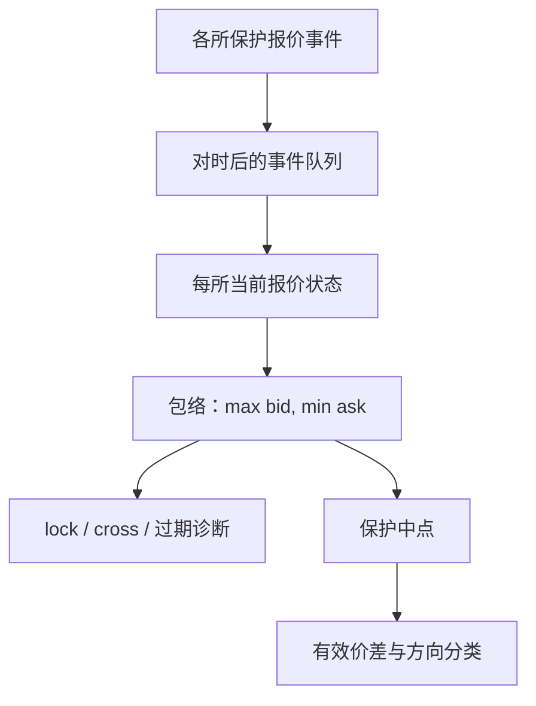

# NBBO 构造

全国最优买卖是保护报价在共同时钟上的逐事件包络。构造细节——哪些尺寸、是否含锁定、用哪一条馈送——会改变中点，从而改变每一笔有效价差。

<footer>—— 据 Reg NMS 对保护报价与 NBBO 的定义；对照 Hasbrouck 对综合报价的经验处理</footer>

[PTP / GPS 对时](/quant/ptp-gps-sync)给出了跨所时间能否相减。[市场分割](/quant/market-fragmentation)给出了 NBBO 的设计含义。本课的缺口是算法：输入各所保护报价事件，输出 $(B_{\mathrm{N}}(t),A_{\mathrm{N}}(t))$。Holders 与研究人员各自实现时，常在零股、锁定交叉、过时报价、SIP 与直连之间分叉。本课写可复述的构造步骤，使有效价差与 EMO 的「外侧」有定义。不重复碎片化的质量辩论。

## 问题

朴素算法：每个事件时刻，在所有场所的当前买价里取最大，卖价里取最小。立刻遇到：场所报价是否仍有效（未过期、未停牌）、尺寸是否达到 round lot、是否允许锁交叉进入包络、直连缺失的场所用什么填充。SIP 的官方 NBBO 已经做完这些选择；自己用直连拼，必须把选择写成代码注释。缺口是：论文里「我们用 NBBO 中点」若不可复述，ES 不可比。

过时报价：某所短暂停更新，朴素包络会把一个旧的最优买价一直留下，造成虚假交叉。需要心跳与过期规则。这与序号缺口相关：增量丢了却没过期，包络是错的。

### 保护报价 ≠ 全部可见报价

零股、某些非保护指令、未达到规则尺寸的报价，不进保护 NBBO，但仍可成交。构造保护 NBBO 时排除它们；构造「可交易合成最优」时可以纳入。两套都应能产出，并在表头写名字。用可交易最优去评估 trade-through，会把合法的非保护成交当成违规。用保护 NBBO 去评价零售改善，会把零股改善当成了不起的价格改善。

锁定（$B=A$ 跨所）与交叉（$B\gt A$）在未校准时钟上更容易出现。构造前应对时；仍出现的锁交叉应保留为状态，而不是在代码里强制 $B\lt A$ 把真实制度现象洗掉。

## 方法

事件驱动：每个场所维护当前保护买/卖及尺寸、序号、时间。事件到达（已对时）则更新该所，再重算包络。输出：NBBO、贡献场所、是否 lock/cross、保护深度（各所在最优价上的尺寸之和）。与 SIP 官方 NBBO 对照：分叉占比、分叉时差一个 tick 的占比。分叉来自延迟、来自尺寸规则、还是来自你漏买的场所，应能诊断。

中点 $M=(B_{\mathrm{N}}+A_{\mathrm{N}})/2$ 在 lock 时仍有定义，在 cross 时几何崩溃。交叉期间有效价差应标缺失，或改用本所中点，不要输出负的报价价差当数据。开收盘拍卖期许多场所没有连续保护报价，NBBO 应标拍卖状态，而不是沿用前一连续报价。

### 与方向分类、实现价差的接口

EMO 的 at-ask 是相对哪一个 $A$？保护 $A_{\mathrm{N}}$ 还是本所 $A$？必须声明。实现价差的 $M_{t+\tau}$ 必须与 $M_t$ 同一构造，否则曲线形状来自中点定义漂移。多 $\tau$ 曲线在拍卖处断开，构造算法要能输出「此刻无连续 NBBO」。

## 机制

NBBO 是规则输出，不是自然价格。它成为暗池中点锚、订单保护参照、有效价差分母。构造偏误会系统性改写市场质量：漏掉一个经常报价的场所，价差被估宽；未过期旧报价，价差被估窄甚至交叉。这与价差分解三项无关——你改的是会计的分母。先修设计课已经警告对照 SIP 还是直连；本课把警告变成可执行的事件循环。

不要在交叉的 NBBO 上估 [Roll](/quant/roll-model)。Roll 需要买卖回跳的成交价；交叉的综合报价说明参照已经坏了，应回到本所成交价或等交叉解除。

### 拍卖时段应输出无连续 NBBO

开收盘与波动再开盘，保护报价可能不存在或不应沿用前一连续口。构造器要打拍卖状态，有效价差改用集合会计。沿用旧包络会在开盘制造虚假交叉。

## 边界

没有 SIP 的市场，构造的是「你覆盖范围内的最优」，不要叫 NBBO。欧洲最佳执行不是单一法定 NBBO。下一课 TRACE 是债券打印，没有股票式包络可拼。加密聚合最优是网站行为，不是保护报价。

自己拼的直连包络与 SIP 官方 NBBO 分叉时，应诊断缺所、尺寸规则还是延迟，而不是挑选更漂亮的一条写进论文。

## 小结

- NBBO 构造是事件驱动的保护报价包络，规则必须可复述。
- 保护最优与可交易最优分开输出。
- 过期、停牌、拍卖状态要切断包络，禁止旧报价永驻。
- 交叉时中点缺失，不要硬算有效价差。
- 与 SIP 官方序列对照，用来诊断馈送与规则，而不是偷偷选更漂亮的一条。
- 出处：Reg NMS 对保护报价的定义；Hasbrouck 对综合报价的使用；零股与尺寸见 O'Hara, Saar and Zhong。
