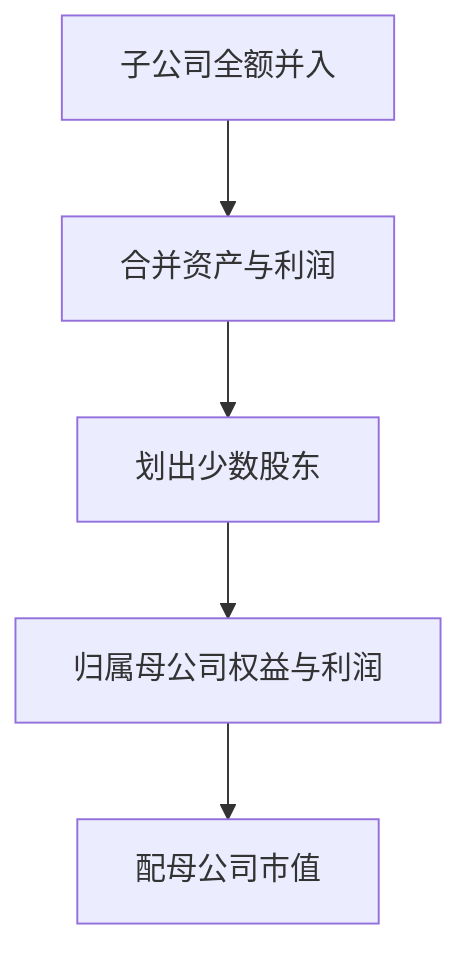

# 合并与少数股东

合并把子公司的资产与利润全额加进来，再单独划出不属于母公司股东的一份；用错归属，ROE 与账面市值比较的就不是同一类要求权。

<footer>—— 据 Penman 对合并报表与少数股东权益的处理；Fama–French 账面权益构造中对非控制权益的惯例整理</footer>

上一课[租赁与表外](/quant/lease-off-balance)决定哪些使用权进表。本课决定**哪些主体进表**：合并范围与非控制权益（少数股东）。这是财务课程最后一课。下一课起进入「市场制度、资金与事件」，对象从公司状态表换成可交易杠杆与清算规则。本课不重写租赁，也不提前讲保证金。

## 问题

控制一家子公司后，合并报表把子的资产、负债、收入、费用全额纳入，即使母公司只持有 70%。利润表划出少数股东损益，资产负债表划出少数股东权益。盈利因子若用「归属母公司净利润」配「含少数股东的总权益」，ROE 被抬高；反过来，用合并净利润配母公司权益，ROE 被压低。价值因子的账面同样要声明含不含 NCI。缺口是要求权对齐：市值通常是母公司流通股本的市值，账面与利润就应取归属母公司的那一层，除非你显式把 NCI 也当成要求权并找到对应价格——通常没有单独市值。

合并范围变化（收购、出售、VIE）会造成收入与资产跳变，投资因子再次被会计主体改变推动，类似并购商誉年。

### 少数股东权益不是负债

NCI 是权益，不是有息债务。把它加进净负债去算杠杆，会夸大杠杆因子。把它从权益里丢掉却把子公司资产留在总资产里，投资与资产周转率失真。正确做法是全套选用「归属母公司」或全套选用「集团」，不要分子一层、分母另一层。

Fama–French 账面常用归属普通股股东的权益，并处理优先股与 NCI。复制时要看说明书是否 subtract minority interest，不能只下载一个 SEQ 字段。

## 方法

来源卡上为每个因子加一行：NCI 是否进入账面、净利润是否归属母公司、总资产是否合并全额（通常是）。市值用母公司普通股市值。PIT：合并范围以当时年报/季报为准，后来出售的子公司不得从历史合并表里删掉来「保持连续」——那是另一种幸存者。范围变化在形成日作为当时事实进入资产增长。

交叉持股与库存股已在稀释、回购课处理，不在此重算，但合并层会再出现一次内部抵消；以合并后字段为准，不要把母公司单体表与合并表混接到同一时间序列。

归属母公司的利润配母公司市值；总资产仍是合并全额。已售子公司不从历史合并范围擦掉。下一课保证金不再使用报表 D/E 当维持线。

## 机制

合并是控制观：经济上你指挥了 100% 的资产，会计就加总 100%，再承认别人的剩余要求权。因子若交易的是可买到的普通股，应对齐母公司股东那一层。控制观与要求权观打架时，资产增长（控制观）与 ROE（要求权观）会同时动但故事不同。这与分部课对称：分部没有独立市值，NCI 通常也没有；能交易的仍是母公司证券。财务课程在此收束：后面制度课假设你已经能交出当时可交易、口径对齐、含退市的基本面截面。

下一课保证金问的是经纪商如何对这份证券杠杆。合并杠杆是报表杠杆，保证金是资金约束，不要把资产负债率直接当成维持保证金。

价值与 ROE 默认对齐母公司普通股：利润用归属母公司，账面不含 NCI（或按说明书明确处理），市值用母公司普通股。总资产仍是合并全额，因此资产周转与 ROE 的要求权层不同，这是合法的，只要不把两者当同一杠杆叙事。出售子公司后，历史合并表保持当时范围，不要为了「连续经营」把已售业务从过去剔掉。单体表与合并表禁止混接。

## 边界

不写 VIE 准则全文，不做法务上的控制权鉴定。下一课[保证金与维持保证金](/quant/margin-maintenance)换题目：可交易资金，不是会计合并。后课默认：盈利与价值已声明 NCI 口径并与母公司市值对齐；合并范围按当时报表，不事后剔出已售子公司。

下一课换成保证金：报表 D/E 不是维持保证金。财务课程在此结束，交给制度课的是一张 PIT、含退市、口径对齐、来源可指回的基本面截面。合并范围按当时报表，已售子公司不从历史里擦掉。价值与盈利的要求权层已声明并与母公司市值对齐。

## 小结

- 合并全额加总，再划出 NCI；分子分母必须同一层要求权。
- 母公司市值应对齐归属母公司的账面与利润。
- NCI 是权益不是债务，不可塞进净负债。
- 合并范围变化按当时报表进入资产增长，不回溯「保持连续」。
- 财务课止于此；下一课程换资金与制度。
- 出处：Penman 合并与 NCI；Fama–French 账面权益构造惯例。
