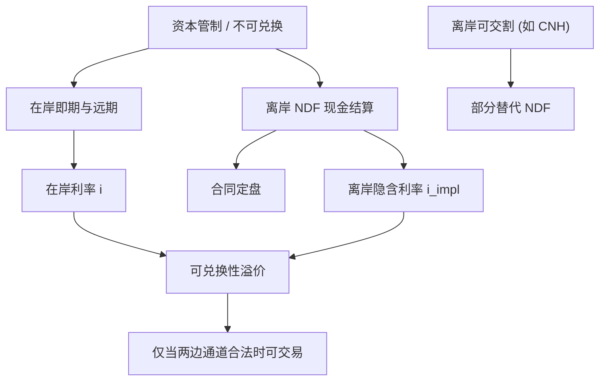

# NDF 与不可兑换货币

资本管制把交割砍断之后，远期并没有消失，只是改成用可兑换货币结算价差；离岸隐含利率与在岸利率的缺口，本身就是管制的价格。

<footer>—— Ma, Ho & McCauley, The markets for non-deliverable forwards in Asian currencies, BIS Quarterly Review, June 2004</footer>

不可交割远期（Non-Deliverable Forward, NDF）在到期时不交换本金，只用预先指定的定盘汇率与合约汇率之差，乘以名义本金，以美元（偶尔以其他可兑换货币）现金结算。它存在的原因是：韩元、新台币、印度卢比、巴西雷亚尔、印尼盾、历史上的在岸人民币等，即期或远期的本金交割对外资受限。Ma、Ho 与 McCauley（2004）把亚洲 NDF 写成在资本管制下仍能让境外投资者对冲本币债与股权的市场，并记录 NDF 隐含利率与在岸利率的系统偏离。McCauley、Shu 与 Ma（2014）更新了规模：NDF 在全球远期中的份额上升，而人民币国际化为可交割的 CNH 之后，人民币 NDF 被部分替代。Lipscomb（2005）从纽约联储角度概述市场结构。本篇把 NDF 当作**分割市场的可交易远期**，而不是当成「CIP 失败」的反例。

## 问题

标准 CIP 假设你可以借在岸、买即期、交割远期。管制下这三步至少断一步：额度、实需原则、不可兑换。此时在岸远期（若存在）与离岸 NDF 可以对同一货币报出不同价格。把二者之差叫做套利机会，通常无法交割完成。真正的对象是：NDF 汇率 $F^{\mathrm{NDF}}$、离岸可兑换货币利率、以及定盘规则，如何共同定义一个**离岸隐含本币利率**；它与在岸存款或拆借之差，是可兑换性溢价与信用、流动性的混合物。

第二层是定盘风险。NDF 的结算不依赖你能否买到现钞，而依赖合同写明的 fixing——央行中间价、WM/Reuters、当地银行调查、或指定时点的在岸即期。定盘可被干预、可在压力中暂停、可与你对冲用的离岸即期脱节。于是 NDF 不是无风险的远期，而是远期加上一份定盘基差期权。人民币 2015 年 8 月汇改期间，NDF 与在岸、CNH 的裂口同时扩大，正是定盘与可兑换性一起重定价。

### 隐含收益率与在岸曲线

在美元结算、本金不可交割的近似下，

$$
1+i^{\mathrm{impl}}\approx (1+i^{\$})\frac{S}{F^{\mathrm{NDF}}},
$$

标价法需与即期惯例一致。$i^{\mathrm{impl}}$ 是离岸愿意借出或借入该不可兑换货币的影子利率。Ma 等人强调：亚洲 NDF 隐含利率经常相对在岸显示升值压力（或相反），且 NDF 波动通常高于被干预的在岸即期。这不是微观结构噪声，而是信息更多在离岸发现、在岸被平滑。用在岸利率去给 NDF「理论定价」，再把差额当模型残差，会把政策目标写成错误。

CNH 可交割远期与 CNY NDF 一度并存。国际化为离岸交割打开口子后，NDF 份额下降，但并未在所有货币上复现：韩元、新台币的 NDF 仍然是境外主体的主市场。不要把人民币路径当成亚洲通用终局（McCauley, Shu and Ma, 2014 及后续 BIS 更新）。

## 方法

合约要素必须钉死：名义、定盘来源与时间、结算日、美元（或 CNH）结算、是否可提前平仓。估值用美元折现结算额的期望；因为本金不交换，信用暴露是盯市差额而非全名义，这与可交割远期的结算风险不同。对冲：用离岸即期或可交割交叉去管 Delta，用同一货币的 NDF 曲线去管期限；不要用在岸远期当自动替代，除非你确认可以跨境移风险。

把 NDF 曲线与在岸曲线、离岸可交割曲线并排，定义两个基差：离岸—在岸（可兑换性）、NDF—CNH 类（工具基差）。交易这些基差必须有合法的两边通道；许多时候只有一边可交易，另一边只能作为信号。Akram、Rime 与 Sarno（2008）对 G10 的高频 CIP 结论——可执行窗口短——在 NDF 上更弱：这里的「偏离」以天和周计，因为复制非法或无额度。

### 与三角、套息的拼接

不可兑换货币不应进入标准的 [交叉汇率三角](/quant/fx-triangle) 闭合检验：缺少可交割腿。合成路径常是 USD/KRW NDF 对 USD/JPY 可交割，得到的交叉是混合对象。套息若用在岸高息、用 NDF 抛补，看起来像 [利率平价](/quant/irp) 的抛补套息，收益来自 $i^{\mathrm{onshore}}-i^{\mathrm{impl}}$，本质是可兑换性与管制风险，不是 CIP alpha。未抛补持有高息新兴货币，则仍是 UIP/Fama 问题，外加跳贬值与资本管制突然收紧的尾部。

## 机制

分割机制：在岸市场服务居民与实需，价格可以含干预；离岸 NDF 服务非居民的风险转移，价格含管制持续性的赌注。两者通过贸易、地下渠道、额度拍卖弱连接，不通过本金远期强连接。因此 NDF 更像信用违约互换相对于债券：同一名义风险的另一种合约，基差反映谁能持有什么。

信息机制：当在岸即期被盯住或被平滑，宏观冲击先打在 NDF 与离岸交易上。Ma 等人已观察到亚洲 NDF 之间的相关高于在岸即期——共同的离岸风险偏好与共同的亚洲管制叙事。2015 年汇改说明：政策改变定盘规则，会同时重估所有以该定盘为标的的 NDF，并溢出到其他亚洲 NDF（BIS 后续研究用交易库数据强化了这一点）。

NDF 的对手方曾高度集中于国际银行。监管改革（清算、保证金）改变了谁能做市，但不创造交割。把清算当成「变得可兑换」，是把对手方风险降低误写成资本管制消失。

### 定盘操纵与窗口

部分货币的定盘窗口窄、可被在岸大单影响。持有 NDF 短端等于暴露在窗口行为上。这与 G10 的 WM Reuters 4pm 类似但更极端，因为在岸流动性与离岸结算货币不在同一池。风险管理应把定盘日单独限制，而不是把所有到期的 Vega、Delta 加总后假装均匀。

## 边界与工程取舍

法律：某些司法辖区限制居民参与离岸 NDF，或限制银行对非居民报价。模型假设的无约束复制在合规上不存在。流动性：KRW、TWD、INR、BRL 的 NDF 深度远好于尾部货币；尾部货币的报价可以是关系型的，回测中的日度中间价不可成交。定盘来源变更、假日、央行暂停开盘，会使合同进入后备定盘或争议。

不要用 G10 的 Du–Tepper–Verdelhan 交叉货币基差，去解释 NDF 隐含利率与在岸之差。前者是可兑换货币之间的银行中介约束；后者是兑换权本身被配给。可以都叫「基差」，计量与对冲工具完全不同。人民币要同时跟踪 CNY 在岸、CNH 可交割、残余 NDF 三条曲线，并声明账户用哪一条折现。

完全抵押的 NDF 组合仍有定盘与缺口风险，CSA 不能把不可兑换变成可兑换。压力测试应包括：定盘相对离岸即期跳开、在岸停牌、美元结算银行拒绝某货币的 NDF。

## 小结

- NDF 用可兑换货币结算定盘差，使不可兑换货币仍有离岸远期；本金不交割，复制 CIP 的路径被砍断。
- 离岸隐含利率与在岸利率之差是管制与可兑换性的价格，不是 G10 意义上的 CIP 计算错误（Ma, Ho and McCauley, 2004）。
- 定盘来源是一等风险；干预与汇改通过定盘重估全部 NDF。
- 人民币可交割离岸市场部分替代了 CNY NDF，但韩元、新台币等并未走同一条路（McCauley, Shu and Ma, 2014）。
- 三角闭合、抛补套息、交叉货币基差的标准工具，必须在确认交割与额度之后才能用；否则应把 NDF 当分割资产。
- 出处：Ma, Ho and McCauley, *BIS Quarterly Review*, June 2004；McCauley, Shu and Ma, *BIS Quarterly Review*, March 2014；Lipscomb, FRBNY, 2005；G10 CIP 对照见 Akram, Rime and Sarno, 2008 与 Du, Tepper and Verdelhan, 2018。
