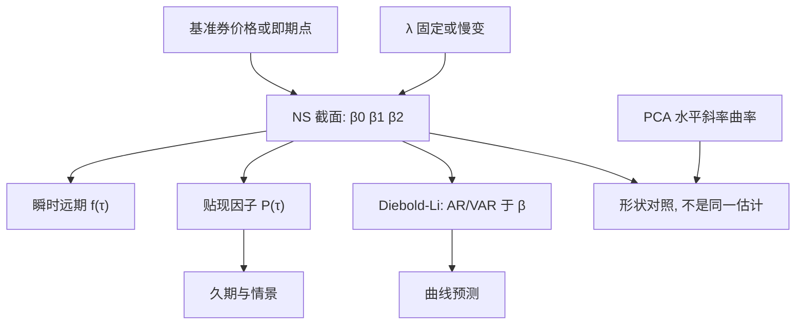

# Nelson-Siegel

    
用水平、斜率与一个由衰减速度 $\lambda$ 定位的驼峰，三加上一个尺度就能写出整条即期曲线；参数少到可以逐日回归，却仍能复制大多数国债曲线的光滑形状。

    <footer>—— Nelson and Siegel, Parsimonious Modeling of Yield Curves, Journal of Business, 1987</footer>

[上一课](/quant/dispersion-trade)停在指数–成分波动。缺口是债券曲线的低维载荷。债券曲线有无穷个期限，日度观测却只有有限个基准券。Charles Nelson 与 Andrew Siegel 1987 年给出一个极省参数的即期（或远期）函数：三个因子载荷由单一衰减 $\lambda$ 生成，水平、斜率、曲率的解释与后来 Litterman–Scheinkman 的 [曲线 PCA](/quant/curve-pca) 几乎同名，但这里是参数族，不是样本特征向量。[收益率曲线因子](/quant/yield-curve-factors) 写 PCA 的交易近似与无套利模型的分工；本篇写 NS 公式、载荷作为 $\tau$ 的函数、以及 Diebold–Li（2006）如何把它变成可预测的动态因子。Svensson 的第二驼峰见 [Svensson 扩展](/quant/svensson)。它不是 HJM，也不替代 [关键利率久期](/quant/key-rate-duration)。

## 问题

要一张光滑、可外推、每日可重估的零息曲线，三次样条能过所有点，却在翼部振荡、参数天天跳，远期利率可能为负或乱抖。Nelson–Siegel 要的是：**用固定的函数形状去逼近整条曲线**，残差留给报价噪声与局部供需，而不是用节点去记住每一个折缝。即期收益率写成

$$
y(\tau)=\beta_0+\beta_1\frac{1-e^{-\lambda\tau}}{\lambda\tau}+\beta_2\Biggl(\frac{1-e^{-\lambda\tau}}{\lambda\tau}-e^{-\lambda\tau}\Biggr).
$$

$\beta_0$ 是长端水平，$\beta_1$ 是短端相对长端的斜率因子（载荷从 1 衰到 0），$\beta_2$ 是中段驼峰（载荷在 0 处为 0、在 $\tau\sim 1/\lambda$ 附近达峰再回 0），$\lambda>0$ 控制驼峰位置。问题是：四个参数里哪些逐日自由估计、哪些冻结，才能既贴合又使 $\beta$ 时间序列可拿去预测或做风险。

对应的瞬时远期是更干净的指数组合：

$$
f(\tau)=\beta_0+\beta_1 e^{-\lambda\tau}+\beta_2\lambda\tau e^{-\lambda\tau},
$$

即期 $y(\tau)$ 是 $f$ 的平均。NS 先对远期写出 Parsimonious 形状，再积分到即期——这是 1987 年论文的构造顺序，写实现时不要只记 $y(\tau)$ 而把 $f$ 当成事后装饰。

### 载荷与 PCA 的「看起来像」

$\beta_0$ 的载荷恒为 1，像水平。$\beta_1$ 的载荷单调递减，像斜率。$\beta_2$ 的载荷是中段正、两端近零，像曲率。Litterman–Scheinkman 从样本协方差里抽出的前三个特征向量，经验上正是这三种形状。NS 把形状写成闭式，跨日可比、跨市场可移植；PCA 的向量随样本与网格变，还可能换号。二者不是同一估计：NS 是有偏的参数投影（曲线必须落在四维流形的三维切片上，若 $\lambda$ 固定则三维），PCA 是无结构的正交分解。Diebold–Li 强调这一对应，是为了用 NS 的 $\beta_{0t},\beta_{1t},\beta_{2t}$ 去做期限结构预测，而不是宣称 NS 证明了三因子定理。

$\lambda$ 与 $\beta$ 一起自由优化时，识别很弱：拉长 $\lambda$ 同时改 $\beta_2$，残差几乎不变。Diebold–Li 把 $\lambda$ 固定在使曲率载荷在 30 个月附近达峰（月度数据上约 $0.0609$），然后对 $\beta$ 做 OLS。这是工程，不是 1987 年原文的唯一做法。

## 方法

**逐日截面。** 取一组零息或自债券反推的即期，期限 $\tau_i$。若 $\lambda$ 固定，载荷矩阵已知，

$$
y(\tau_i)=\beta_0+\beta_1 L_1(\tau_i;\lambda)+\beta_2 L_2(\tau_i;\lambda)+\varepsilon_i,
$$

OLS 或加权最小二乘（对久期或流动性加权）一次给出当日 $\hat\beta$。短端报价密、长端稀，未加权会把拟合力堆在短端。约束 $\beta_0>0$、远期不太负，可作为惩罚，但硬约束过多会失去与无约束残差的可比性。

**Diebold–Li 动态。** 把每日 $\hat\beta_t$ 当成观测到的状态，用三个 AR(1)（或 VAR）预测下一期曲线。这是两步法：先截面、再时间序列。一步状态空间（Diebold–Rudebusch 等后续）把 $y_t(\tau)$ 的测量方程与 $\beta_t$ 的转移写在一起，Kalman 滤波同时滤噪声。预测评价应对远期利率或超额收益，而不是只报 $y$ 的样本内 $R^2$——光滑族很容易在样本内好看。

**与无套利的缝。** NS 截面一般不满足无套利：随机游走的 $\beta_t$ 加上确定性载荷，通常隐含锁定价。它是描述与预测工具。要定价期权或做跨期限套利检查，应把 NS 曲线当输入去拟合 Vasicek / Hull–White / HJM，或改用无套利仿射（Duffee、Ang–Piazzesi），而不是把 $\beta$ 的 AR 当定价核。用 NS 做贴现给香草债券通常够用；给凸性敏感的 MBS 或债券期权不够。

### 拟合对象：即期、远期还是价格

在价格上非线性最小二乘，权重大债券的久期，更接近 PnL。在即期上 OLS，实现简单、与 1987 年及 Diebold–Li 一致。在瞬时远期上拟合，形状与 $f(\tau)$ 的指数项对齐，但远期由即期差分而来，噪声更大。生产应固定一种，并声明折扣曲线如何从 $y(\tau)$ 积分。票息债券要先剥离或把 NS 当作贴现函数直接对现金流定价，不要把 YTM 当成 $y(\tau)$ 去拟合——YTM 是单利内部收益率，不是即期。

## 机制

指数衰减来自「短期冲击以速度 $\lambda$ 被遗忘」这一极简动态直觉：远期 $f(\tau)$ 的偏离水平部分以 $e^{-\lambda\tau}$ 消失，驼峰 $\tau e^{-\lambda\tau}$ 对应「一次脉冲在中段留下的痕迹」。它能复制倒挂（$\beta_1>0$ 且足够大）、陡峭（$\beta_1<0$）、以及中段隆起（$\beta_2$），却不能复制两个隆起或长端的额外折缝——那是 Svensson 加第二 $\lambda$ 的动机。残差若系统性地在 7–10 年出现同号，不是 $\beta$ 没估好，是单驼峰族的容量不够。

风险上，把组合对 $\beta_0,\beta_1,\beta_2$ 求偏导，得到参数久期，再映射到可交易的 2s、10s、30s，近似水平、陡峭化、蝶式。这与 PCA 对冲平行，但载荷是解析的，情景「$\beta_1$ 增加 10bp」跨日定义稳定。缺点是真实冲击若落在 NS 残差方向上（例如扭曲 20 年点），参数久期显示已对冲，PnL 仍在。因此 NS 风险应与关键利率同时看：前者管全局三因子，后者管局部折缝。

### 外推与短端

$\tau\to\infty$ 时 $y\to\beta_0$，长端被锁成水平，不能生成「超长端因养老金需求而永久低于 $\beta_0$」的结构性折弯，除非把 $\beta_0$ 理解成含该需求的有效水平。$\tau\to 0$ 时 $y(0)=\beta_0+\beta_1$，短端由隔夜政策与账单决定，NS 的光滑指数往往贴不住隔夜到 3 个月的政策台阶。实务常把最短端交给货币市场曲线，NS 只拟合 1 年以上，或对短端残差单独建模。这不是公式错误，是省参数的代价。

1987 年论文拟合的是当时美国国债曲线的光滑形态，样本与今日的有效联邦基金走廊、量化宽松扭曲不可混用。公式仍用；$\lambda$ 的达峰期限要按当前网格重选。

## 边界与工程取舍

NS 没有无套利约束，远期可以为负（名义曲线在低利率时代确实可以靠近零，但任意负法仍可能不合理）。信用曲线、通胀曲线可以各套一套 NS，参数不能跨曲线比较除非载荷定义相同。票息、税收、基准券改款会造成「曲线」本身跳动，应先清洗再拟合。

Diebold–Li（2006）把 NS 做成预测系统，发表于 *Journal of Econometrics*；Nelson–Siegel（1987）是截面参数化，发表于 *Journal of Business*。不要把预测论文的 AR 系数写成 1987 年的结果。Litterman–Scheinkman（1991）是 PCA，形状相似、估计程序不同。Gürkaynak–Sack–Wright 的美债曲线常用 Svensson，不是经典三因子 NS。A 股利率债短端被政策钉住，斜率因子对沟通敏感，$\lambda$ 若仍按美债 30 个月达峰，曲率会错位到错误的期限。

把 NS 的 $\beta_0$ 当成「长期中性利率」的估计，是叙事。它是拟合长端即期的水平参数，含期限溢价、凸性偏差与样本末端的券不足。

日度 $\beta$ 跳不一定是曲线变了：可能是 $\lambda$ 与 $\beta_2$ 的识别切换，或长端基准券缺报价。报告应附拟合残差期限图，而不只是三参数时间序列。

## 小结

- Nelson–Siegel 用 $\beta_0,\beta_1,\beta_2$ 与衰减 $\lambda$ 参数化即期（由指数远期积分而来），形状对应水平、斜率、曲率。
- $\lambda$ 宜固定或慢变，再 OLS 估 $\beta$；四参数同时自由则识别弱。
- Diebold–Li 对 $\beta_t$ 做时间序列预测；NS 本身一般不满足无套利，定价要另接仿射或 HJM。
- 与 PCA 同名因子是类比，不是同一组向量；局部折缝仍要关键利率。
- 单驼峰无法复制双隆起，那是 Svensson 的位置。
- 出处：Nelson and Siegel, *Journal of Business*, 1987；Diebold and Li, *Journal of Econometrics*, 2006；对照 Litterman and Scheinkman, 1991。
