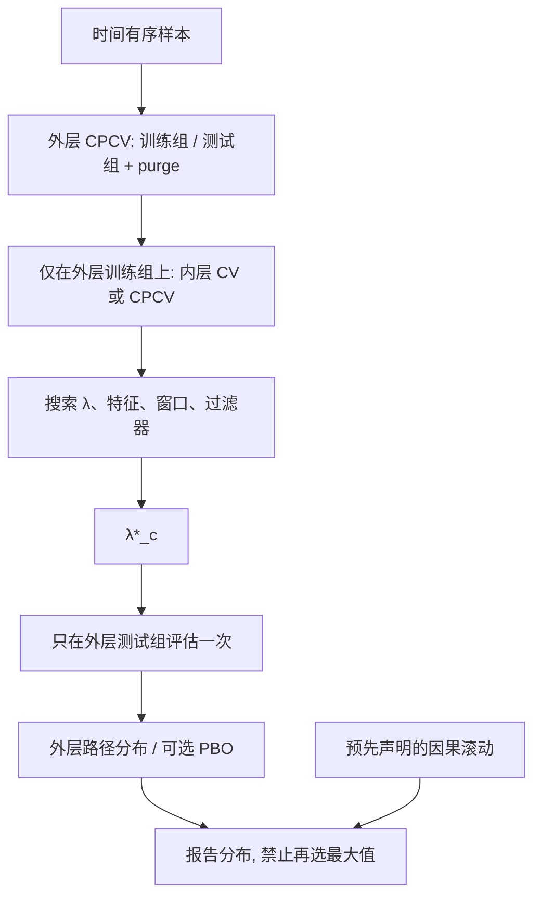

# Nested CPCV

组合划分生成许多条清洗后的样本外路径；若路径上的分数还被用来选窗口、选特征、选成本假设，路径就不再是评估。必须把网格关在每条外层训练块的内层，把外层测试块留给从未参与选择的分数。

<footer>—— 嵌套评估见 Varma–Simon、Cawley–Talbot；组合清洗划分见 López de Prado, AFML, Chapter 12；PBO 见 Bailey et al., 2017</footer>

[嵌套交叉验证](/quant/nested-cv) 写内层选、外层评这一纪律，默认外层是滚动或时间块。[组合过拟合 CPCV](/quant/cpcv) 与 [Combinatorial Purged CV](/quant/cpcv-lopez) 写如何用 $\binom{N}{k}$ 种划分生成许多条 purge 之后的路径，以及如何用路径去估 PBO 或单个估计器的划分敏感性。Nested CPCV 把两件事接起来：**外层用组合清洗划分做评估，内层只在外层训练块上再做一次组合（或滚动）搜索。** 它针对的是业界最常见的操作：已经上了 CPCV，却用路径中位数去挑超参数，等于把 $\varphi$ 条路径又变成一次选择。Bailey 的 PBO 假设候选列表已冻结；网格尚未冻结时，内层就是在生成候选，必须嵌套。

## 问题

设超参数 $\lambda$ 含窗口、正则、特征子集、是否加某过滤器、成本假设。非嵌套 CPCV 的做法是：对每个 $\lambda$ 跑全套组合路径，得到路径中位夏普或 PBO，再挑最好的 $\lambda^\star$，把该 $\lambda^\star$ 的路径分布写进研报。错误与非嵌套 $K$ 折相同：用于选择的分数就是用于报告的分数。组合次数越多，越容易挑到「在这些切法上碰巧稳」的 $\lambda$，PBO 看起来很好，只是对划分方案过拟合。

Walk-forward 嵌套给出一条可部署曲线，但路径太少，看不清选择偏差。纯 CPCV 路径多，但不嵌套则评估有偏。问题是给出一个协议：外层组合的测试组从不进入网格；内层可以用 CPCV、滚动或普通清洗 $K$ 折，只在外层训练组上运行；最终报告的是外层测试分数的分布，以及——若候选已在内层生成——外层上的 PBO。

### 两层组合的信息集

外层：时间上 $N$ 个连续组，每次取 $k$ 组当测试，其余当训练，purge 与 embargo 按 [清洗与禁运](/quant/purge-embargo)。对每一个外层组合 $c$，记训练索引 $T_c$、测试索引 $E_c$。内层：仅在 $T_c$ 上再切组或再滚动，搜索 $\lambda$，得到 $\lambda^\star_c$。然后只在 $E_c$ 上评估一次 $\lambda^\star_c$（特征管道也只在 $T_c$ 上 `fit`）。$\lambda^\star_c$ 可以随 $c$ 变，这是非平稳下应该发生的事。把各 $c$ 的 $\lambda^\star$ 平均成一个部署参数，只是为了上线；评估数字仍用外层。

sklearn 式 `GridSearchCV` 的 `best_score_` 换成本上「CPCV 路径中位最好的那组窗口」，错误同构。早停、特征筛列、拥挤过滤器阈值，全部是 $\lambda$ 的坐标，全部只能待在内层。

## 方法

**内层选什么评估器。** 内层目的是选择，不是再估一遍 PBO。内层路径可以较少：例如在 $T_c$ 上做 purged $K$ 折或较小的 $(N_{\mathrm{in}},k_{\mathrm{in}})$，按扣费后效用的中位或预先声明的分位选 $\lambda$。不要在内层用路径最大值选——那是把选择偏差再放大一级。订单级回测放在外层最终 $\lambda^\star_c$ 上，内层用同一套标签与成本模型的向量化评分。

**外层报什么。** 每个 $c$ 一个外层分数，对齐成 $\varphi=\binom{N-1}{k-1}$ 条完整路径（计数见 CPCV 专文），报告中位数、分位、最差路径。若内层输出的是「冠军配置」而候选集合在各 $c$ 之间可比，还可在外层算 PBO：训练块上内层选出的冠军，在测试块上相对一个**预先冻结的参照集合**的排名。参照集合不能是「内层刚淘汰的那些」，否则相对排名没有定义。更干净的做法是：PBO 只在候选已闭合的那一层算；嵌套 CPCV 先把网格收成一个估计器（选择程序），再对该程序做路径分布。

**计算。** 外层 $\binom{N}{k}$ 乘内层组合数乘网格。必须先靠经济约束削薄网格（换手上限、可交易宇宙、禁止未来函数），嵌套不是对任意宽搜索的许可证。配置向量化；内层禁止逐笔。评分函数若含全样本标准化，嵌套只是把泄漏嵌套地复制，见 [金融交叉验证泄漏](/quant/cv-leakage-finance)。

### 与 PBO、DSR、因果滚动的串联

一个完整协议：（1）用 Nested CPCV 得到选择程序的外层路径分布；（2）若候选列表已闭合，用 CSCV/CPCV 报 PBO；（3）用 DSR 把尝试次数与非正态写进最终夏普的检验；（4）另跑一条预先声明的 walk-forward，作为可审计的因果曲线。四者不可互相替代。只用嵌套 CPCV 的路径中位当「样本外夏普」，仍没有时间顺序上的部署叙事；只用 PBO，网格若未进内层，数字假低。

特征选择、标准化、PCA、行业收益，必须 `fit` 在当前内层训练折。拥挤指标的阈值、CPPI 乘数、HAR 的对数变换，同样是 $\lambda$。任何「我们试了几种，取了验证最好的」都要么嵌套，要么把尝试计入 DSR 的 $N$。

## 机制

非嵌套的乐观来自对验证分数取最大值。CPCV 把验证换成许多条路径，最大值变成「路径中位的最大值」或「PBO 的最小值」，偏差形式更隐蔽，机制不变：噪声在选择中被挑中，测试若共享同一噪声（未 purge）或共享同一选择所用的路径，条件期望偏高。嵌套把最大值锁在 $T_c$ 内部，$E_c$ 看到的是选择程序在新块上的实现。

组合划分相对滚动的机制优势是：每段历史都有机会当外层测试，选择偏差不被单一牛市尾巴掩盖。代价是交错块不模拟部署顺序，外层路径分布估的是划分敏感性与选择程序风险，不是冲击与容量。容量仍用因果滚动加[拥挤与容量指标](/quant/crowding-capacity-metric)。

外层分数无偏，是相对「同一数据生成过程上的选择过程」而言。非平稳下，无偏不等于可外推到下一体制。嵌套之后仍应保留从未碰过的持有期，或承认没有这样的样本。

### 何时不必上双层组合

$\lambda$ 在样本开始前冻结（预注册、沿用旧产品参数），没有选择，单层 CPCV 或单层滚动即可。网格极粗且所有格子外层几乎一样，嵌套与否差几个基点——仍须报告「未选择」。危险的是中等宽度网格：看起来克制，恰好够拟合一段划分噪声。计算预算不够时，正确的降级是削网格并预注册，而不是回到非嵌套的路径中位选美。

## 边界与工程取舍

Nested CPCV 不修复前视特征、不修复未来成交量的 VWAP、不修复全样本行业分类修订。外层若仍打乱时间，泄漏优先于嵌套。也不要把外层 $\varphi$ 条路径的最大值写成样本外夏普。部署需要单一 $\lambda$ 时，在全部训练历史（不含最终持有期）上重跑一次内层，评估仍只用外层历史路径。

内层目标必须与外层评估对齐：内层毛 $R^2$、外层扣费夏普，会选出高换手。两边都应是扣费后、容量约束后的同一效用。$(N,k)$ 与内层方案预先冻结并做敏感性，禁止挑让外层中位最高的那组划分参数——那是第三层过拟合。

看到外层 PBO 偏高就删候选再跑，协议作废。诚实做法是扩大报告：给出搜索日志上的嵌套结果，而不是清洗后集合上的结果。Bailey 等人警告过把评估器当优化目标。

## 小结

- Nested CPCV 把网格与特征选择关在每条外层训练块的内层，外层组合测试块不参与选择。
- 非嵌套地用 CPCV 路径中位或 PBO 选 $\lambda$，是组合版本的 `best_score_` 偏差。
- 报告外层路径分布；PBO 针对已闭合候选，选择程序本身用路径分布评估。
- 与 DSR、因果滚动、成本容量串联；交错路径不估冲击。
- 出处：Varma and Simon, 2006；Cawley and Talbot, *JMLR*, 2010；López de Prado, *AFML*, 第 7、12 章；Bailey, Borwein, López de Prado and Zhu, *Journal of Computational Finance*, 2017。
