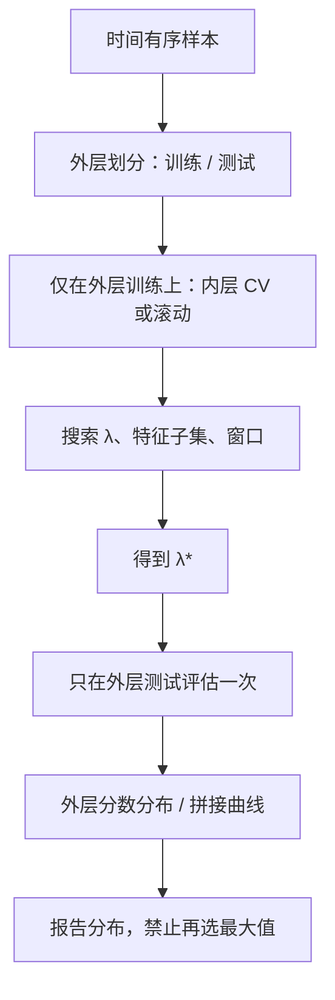

# 嵌套交叉验证

    
用同一折既选超参数又报告误差，折外分数是有偏的乐观；必须把选择关在内层，把评估留给从未参与选择的外层。

    <footer>—— 据 Varma and Simon, Bias in Error Estimation When Using Cross-Validation for Model Selection, BMC Bioinformatics, 2006；Cawley and Talbot, On Over-fitting in Model Selection and Subsequent Selection Bias in Performance Evaluation, JMLR, 2010</footer>

交叉验证本意是估计泛化误差。一旦折外分数被用来在模型、正则、窗口、特征子集之间做选择，它就不再是误差的无偏估计——选择把噪声抬进了「最好」的那个配置，报告的数字是最大值的期望，不是任一配置的期望。Varma 与 Simon、Cawley 与 Talbot 把这层偏差写成嵌套交叉验证（nested cross-validation）要消灭的对象：内层循环只负责选择，外层循环只负责评估，外层测试折从不进入网格。金融里同一逻辑更硬，因为标签重叠、非平稳与 [滚动检验](/quant/walk-forward) 上的第二次选择几乎是默认操作。本篇写嵌套结构、与 [PBO](/quant/pbo) / [CPCV](/quant/cpcv) 的分工，以及非嵌套 $K$ 折为什么会系统性夸大截面预测力。

## 问题

设算法有超参数 $\lambda$（树深、惩罚系数、回看窗口、是否加某过滤器）。非嵌套做法是：在全部数据上做一次 $K$ 折，每个 $\lambda$ 得到一个折外分数，挑 $\lambda^\star$，再把 $\lambda^\star$ 的折外分数当作泛化误差去写研报。错误在于 $\lambda^\star$ 的折外分数参与了比较。即使所有 $\lambda$ 真误差相同，最大值的期望仍高于真误差。Cawley–Talbot 强调：模型选择的过拟合与模型拟合的过拟合是两件事；只对后者做正则、却用同一验证集做前者，偏差不会消失。

金融版本往往更隐蔽。研究者用 2010–2018 做滚动选参，用 2019–2021 看结果，觉得这已经是样本外；若 2019–2021 被用来在五种信号、三种成本假设、两次窗口长度之间再挑一次，外层仍然泄漏。Walk-forward 效率、样本外夏普、折外 $R^2$，只要还用于选择，就回到非嵌套。问题是给出一个协议，使「选 $\lambda$」与「估误差」使用不相交的信息。

### 内层与外层的信息集

嵌套结构有两层划分。外层把样本切成 $K_{\mathrm{out}}$ 个评估折（金融里应是时间块或滚动窗口，禁止打乱）。对每一个外层训练部分，再做一次内层交叉验证或内层滚动，只在这部分上搜索 $\lambda$，得到 $\lambda^\star_{\mathrm{inner}}$，然后在对应的外层测试折上评估**一次**。最终报告的是 $K_{\mathrm{out}}$ 个外层分数的分布或拼接曲线，不是内层最好折的数字。$\lambda$ 可以在各外层训练段上不同，这正是非平稳下应该发生的事；把它们平均成一个「最终超参」只是为了部署方便，评估仍以外层为准。

sklearn 式 `GridSearchCV` 之后再在全样本上报 `best_score_`，就是非嵌套。金融库若把「验证段夏普」既用于早停又用于选模型再写进表格，同样有偏。早停是内层的事，表格只能写外层。

## 方法

**嵌套滚动。** 外层：用 $[t-W_{\mathrm{out}},t)$ 之前的全部历史当外层训练，用 $[t,t+H)$ 当外层测试，向前推进。内层：仅在外层训练段里再切验证窗，搜索网格（深度、学习率、回看、$L_1$ 惩罚、是否行业中性），按内层验证的扣费后目标选出 $\lambda^\star$，冻结核到外层测试段。外层测试段禁止再调仓规则、再改成本、再剔品种。这与机器学习教材里的 nested CV 同构，只是划分必须遵守时间箭头，并在接缝处对重叠标签做 purge，见 [泄漏](/quant/cv-leakage-finance)。

**嵌套 CPCV。** 若目的是估计选择偏差而不是给出一条可部署曲线，外层可以用组合划分生成许多条评估路径，内层在每条路径的训练块上做网格。计算更重，但对「网格这一层」的过拟合更敏感。与只对冻结候选算 [PBO](/quant/pbo) 的差别是：这里网格尚未冻结，内层就是在生成候选；PBO 假设候选列表已闭合。

**特征选择也要进内层。** 先在全样本上按 IC 或 MDA 筛列，再对外层做交叉验证，等于把特征选择的尝试次数藏起来。筛列、标准化、PCA、行业收益估计，必须 `fit` 在当前内层训练折上。这与 [点-in-time](/quant/point-in-time) 是同一纪律在验证协议上的投影。

### 偏差—方差与计算预算

嵌套把用于评估的样本「用得更干净」，但每层都会减小训练长度。外层折太少，外层分数方差大，你得到无偏却无用的区间；内层折太少，选择本身不稳定，$\lambda^\star$ 乱跳。Cawley–Talbot 指出选择偏差可以很大，即使样本量看起来不少。金融信噪比低，网格应先靠经济约束削薄（换手上限、可交易宇宙、禁止用未来函数），而不是靠把网格加密再靠嵌套去「修正」。嵌套不是对任意宽搜索的许可证。

计算上，外层 $K_{\mathrm{out}}$ 乘内层 $K_{\mathrm{in}}$ 乘网格大小。应对配置向量化评分；订单级回测放在外层最终候选上，而不是对每个内层格子重放逐笔。若评分函数本身有泄漏（全样本 rank 断点），嵌套只是把泄漏嵌套地复制。

外层分数的均值仍可能因为非平稳而不可外推到下一体制。无偏是相对「同一数据生成过程上的选择过程」而言的，不是相对未来市场。嵌套之后仍要保留一段从未碰过的持有期样本，或接受「没有这样的样本」这一事实。

## 机制

非嵌套的乐观偏差来自对验证分数取最大值。验证分数是真误差加噪声，噪声在选择中被系统性地挑中。嵌套把最大值留在内层，外层看到的是「这个选择程序在新块上的实现」，期望对应选择程序的风险，而不是对应被选中配置在验证集上的噪声。Varma–Simon 在小样本分类上显示非嵌套 CV 可以显著低估误差；金融标签的信噪比更低，同一机制只会被放大。

与多重检验的关系：网格点就是尝试次数。嵌套并不减少尝试，它只是不让你用尝试所依据的那些分数去报成绩。尝试次数仍应进入 [DSR](/quant/deflated-sharpe) 的 $N$，或进入 [White Reality Check](/quant/white-reality-check) 的规则集合。嵌套是评估协议，不是把 $N$ 变回 1 的魔法。

### 何时不必嵌套

若超参数在样本开始之前就冻结（预注册、沿用上一产品的参数、只用经济常数），没有选择，单层因果滚动就够。若网格极粗且所有格子外层表现几乎一样，选择偏差小，嵌套与否差几个基点——但仍应报告「未选择」。危险的是中等宽度的网格：看起来很克制，恰好足够吸收一段历史的噪声。经验上，凡是「我们试了几种窗口，取了验证最好的」都需要嵌套或把尝试计入 $N$。

## 边界与工程取舍

嵌套不修复前视特征、不修复用未来成交量做的 VWAP 假设、不修复全样本行业分类修订。它只修复「用评估数据选模型」这一层。外层若仍是随机 $K$ 折而不是时间块，泄漏协议比嵌套更优先。也不要把外层 $K_{\mathrm{out}}$ 条路径的最大值写成「样本外夏普」——那又是一次选择，见 [过拟合作为风险](/quant/overfit-as-risk)。

部署时需要一个单一 $\lambda$。常见做法是在全部训练历史（不含最终持有期）上重跑一次内层选择，得到部署参数，评估数字仍然只用外层历史路径。不要用外层测试去微调后再报同一段外层。内层目标必须与外层评估对齐：内层用毛 $R^2$、外层用扣费夏普，选择会偏向高换手；两边都应是扣费后、容量约束后的同一效用。

嵌套交叉验证的计算成本常被拿来当不做的理由。更便宜的替代是大幅缩小网格并预注册，而不是回到非嵌套的 `best_score_`。宽搜索加非嵌套，是最贵的那种便宜。

## 小结

- 非嵌套交叉验证用同一折既选模型又报误差，折外分数是最大值的有偏估计。
- 嵌套把选择关在内层，外层测试折不参与网格、早停与特征筛列。
- 金融里外层应是时间块或滚动，接缝处清洗标签；特征管道的 `fit` 必须停在内层训练折。
- 嵌套不把尝试次数变回 1，DSR / Reality Check / PBO 仍要计 $N$。
- 预注册的窄网格可以不嵌套；凡是「试了几种取最好」就必须嵌套或把尝试写入评估。
- 出处：Varma and Simon, *BMC Bioinformatics*, 2006；Cawley and Talbot, *JMLR*, 2010；López de Prado, *Advances in Financial Machine Learning*, 2018；Arnott, Harvey and Markowitz, *Journal of Portfolio Management*, 2019。
