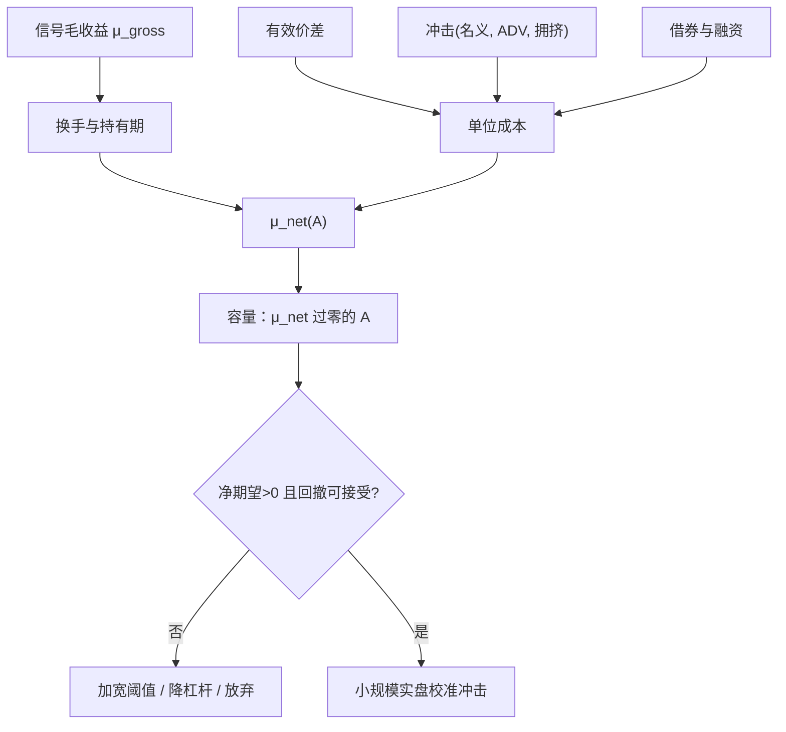

# 交易成本后的可交易性

    
账面超额在扣掉买卖价差、冲击与卖空费用之后可以消失；许多「异常」按换手排序后，高换手的那一端在成本上不可交易。

    <footer>—— Novy-Marx & Velikov, A Taxonomy of Anomalies and Their Trading Costs, Review of Financial Studies, 2016</footer>

[上一课](/quant/statarb-stops)把离场写成回归平仓、价格止损与时间止损，优先级预先写死；有交易成本时止损增加换手并常在流动性差时触发。信号表上的毛期望还不是可部署的边缘。缺口是同一套信号在可执行价格、有限深度、借券与容量约束下，净期望是否仍为正。高换手策略对价差假设最敏感；没有容量数字的边缘不是可交易边缘。本课写扣费后的那张表。不重排止损优先级。

## 问题

毛期望 $\mu_{\mathrm{gross}}$ 来自价差回归、残差动量或基差。净期望

$$
\mu_{\mathrm{net}}=\mu_{\mathrm{gross}}-\mathbb{E}[\mathrm{spread}/2+\mathrm{impact}+\mathrm{borrow}+\mathrm{fees}] \times \mathrm{turnover}
$$

在换手高时对每一项成本弹性极大。统计套利日频开平，年化换手可以是数倍到数十倍，1 个基点的成本误差会被放大成几个百分点的年化。问题因而不是「有没有信号」，而是信号的换手所对应的成本是否低于其毛边缘，以及规模放大后冲击如何使 $\mu_{\mathrm{net}}(A)$ 随资产管理规模 $A$ 下降。

报价价差的一半通常低估：有效价差含价格改善与走阔，实现价差才接近你付的。见[有效价差](/quant/effective-realized-spread)。低价、停牌、涨跌停使「回测成交价」根本不是可成交价。卖空腿的借券费与召回把空头收益变成随机且右偏的成本。把这些当成零，等于把做市与证券借贷的利润记进 alpha。

### 实施缺口与冲击函数

Perold 的实施缺口比较决策价与最终成交：延误、部分成交、放弃的交易都计入。Almgren–Chriss 把冲击写成临时与永久两部分，最优轨迹在风险与成本间权衡。统计套利的信号衰减快，轨迹不能拖太久，于是临时冲击主导，容量比慢因子更差。Korajczyk–Sadka 比较几种成本模型后发现，动量的可交易性对冲击假设敏感——固定比例成本与随规模上升的成本会给出不同的「还能做多大」。对配对与 PCA 残差，同样的话更硬，因为名义杠杆更高、股票更偏小盘。

Do 与 Faff（2012）专门问距离法配对在交易费用下还剩什么：开仓无法两腿同时成交、价差走阔，都会把 GGR 的扣费后超额进一步打薄。引用 2006 年 RFS 却用 1 个基点佣金当唯一成本，不是在复制原文的保守口径。

## 方法

一张最低限度的可交易性报告应包括：信号频率与换手；成交假设（次日开盘、中点、偏保守的主动侧）；有效价差按名称、按当日波动分层；冲击用 ADV 占比的分段函数，而不是线性外推到 100% ADV；借券用可获得性过滤，不可借则该信号记为零而非记为纸面空头；容量曲线：$\mu_{\mathrm{net}}$ 对 $A$ 作图，找到过零点。Novy-Marx–Velikov 的精神是：先按换手给策略分档，再对每档用统一的成本规则，避免只给低换手策略讲故事、只给高换手策略看毛收益。

多重检验与可交易性纠缠。样本内挑了最强的 20 对、最优 $c$、最优窗口之后，毛 $\mu$ 向上偏，成本却按真实换手发生。净期望的选择偏差比毛期望更大：你挑中的往往是换手恰好能在无摩擦世界里放大夏普的规则。正确的顺序是：冻结规则，在更早的样本估成本模型，在之后的样本看 $\mu_{\mathrm{net}}$，而不是用全样本有效价差去「解释」全样本信号。

### 谁的成本：做市、机构、零售

Frazzini–Israel–Moskowitz 的执行短fall 低于许多学术价差模型，因为大机构有中间商、暗池与耐心。高频做市的有效成本更低，但他们赚的是价差，不是残差回归的那一段。零售与准机构按屏幕价差付费，Novy-Marx–Velikov 的结论更贴近。同一篇 PCA 统计套利论文，对这三类参与者的 $\mu_{\mathrm{net}}$ 可以一正两负。可交易性必须绑定身份：融资利率、借券渠道、能否参与 ETF 一级市场、有无期现额度。没有身份的「净夏普」是未定义的数。

容量曲线应假设拥挤：若 $A$ 只是你自己的规模，而市场上同类资本是 $10A$，冲击应按 $11A$ 估。2007 年 8 月的残差相关上升，是容量的状态依赖形式，不是平均 ADV 能概括的。

## 机制

毛边缘的来源若是流动性供给（短端反转、残差回归），成本与 alpha 同源：你赚的就是别人付的价差与冲击。当更多资本来做同一件事，价差变窄、回归变快、毛 $\mu$ 下降，同时你自己的冲击上升，$\mu_{\mathrm{net}}$ 从两边被夹。这不是「市场变得有效」的抽象句，而是可交易性的供给曲线。指数与 ETF 套利更极端：公平价值公开，带外边缘被竞争压到刚好覆盖最优执行者的成本，次优执行者的净期望为负。

破裂与成本同时恶化。协整或基差机制转换时，买卖价差跳开、深度下降、借券变贵，止损与时间止损都在最贵的时刻成交。毛亏损与成本叠加，左尾比毛收益的左尾更肥。因此压力测试必须让 $\mu_{\mathrm{gross}}$ 变负的同时让价差乘数大于 1，而不是只对收益做历史回撤、成本仍用平静期价差。

### 规则设计如何为净期望服务

加宽[Z-score](/quant/zscore-entry) 阈值、降低换手、价值加权、剔除最低流动性分位、禁止在调整日与涨跌停日开仓，都是在用毛 $\mu$ 换 $\mu_{\mathrm{net}}$。分数[Kelly](/quant/kelly-sizing) 降低名义，使冲击函数停在较平的一段。时间止损缩短持有会增加换手，可能损害净期望，尽管它限制破裂；这是保险费。可交易性优化的目标函数应是约束下的 $\mu_{\mathrm{net}}$ 或扣费后的效用，不是毛夏普。把成本当回测最后一行「减 8bp」的脚注，会让前面所有超参选择都在错误的目标上完成。

## 边界与工程取舍

学术价差模型（Hasbrouck、Roll、有效价差代理）有测量误差，可能高估或低估。机构执行数据有选择偏差（只含活下来的执行、只含某类订单）。真实部署要用自己的成交回报去校准冲击，而不是永远借用论文参数。A 股的印花税、T+1、涨跌停使美股校准不可移植。现金不够、无法同时锁两腿时，策略从套利变成方向性，成本模型也要改成单腿。

不要声称「扣费后仍显著」却不报：成本模型名称、换手定义、规模 $A$、以及过零容量。不要把低换手因子（价值）的可交易性证明，写成高换手残差策略的许可。Gatev 等、Avellaneda–Lee、Blitz 等各自有自己的持有期与换手，净边缘必须分别算。若 $\mu_{\mathrm{net}}(A)$ 只在很小的 $A$ 上为正，策略可以是真实的、且对大规模资金仍不可用——这两种陈述可以同时成立。

Lesmond–Schill–Zhou（2004）的标题把动量利润称作「illusory」，针对的是当时常见的无成本表。后续文献并未得到「所有相对价值都是幻觉」的定理；得到的是：不谈换手与冲击的异常表，不能当作可交易边缘。

## 小结

- 可交易性是扣有效价差、冲击、借券与实施缺口之后的 $\mu_{\mathrm{net}}$，以及它随规模下降的容量曲线，不是纸面夏普。
- Novy-Marx–Velikov（2016）表明高换手异常对成本最敏感；动量上 Korajczyk–Sadka、Lesmond–Schill–Zhou 给出同一教训。
- 统计套利换手高、杠杆在残差空间里更大，成本误差会被放大；平静期价差不能用于破裂窗口。
- 成本随参与者身份与拥挤状态而变；Frazzini–Israel–Moskowitz 的机构短fall 不能自动授予所有账户。
- 规则与仓位应直接对 $\mu_{\mathrm{net}}$ 优化；毛边缘真实且大规模不可用，可以同时成立。
- 出处：Novy-Marx and Velikov, *Review of Financial Studies*, 2016；Perold, *Journal of Portfolio Management*, 1988；Korajczyk and Sadka, *Journal of Financial Economics*, 2004；Lesmond, Schill and Zhou, *JFE*, 2004；Almgren and Chriss, *Journal of Risk*, 2000/2001；配对成本见 Do and Faff, 2012。
