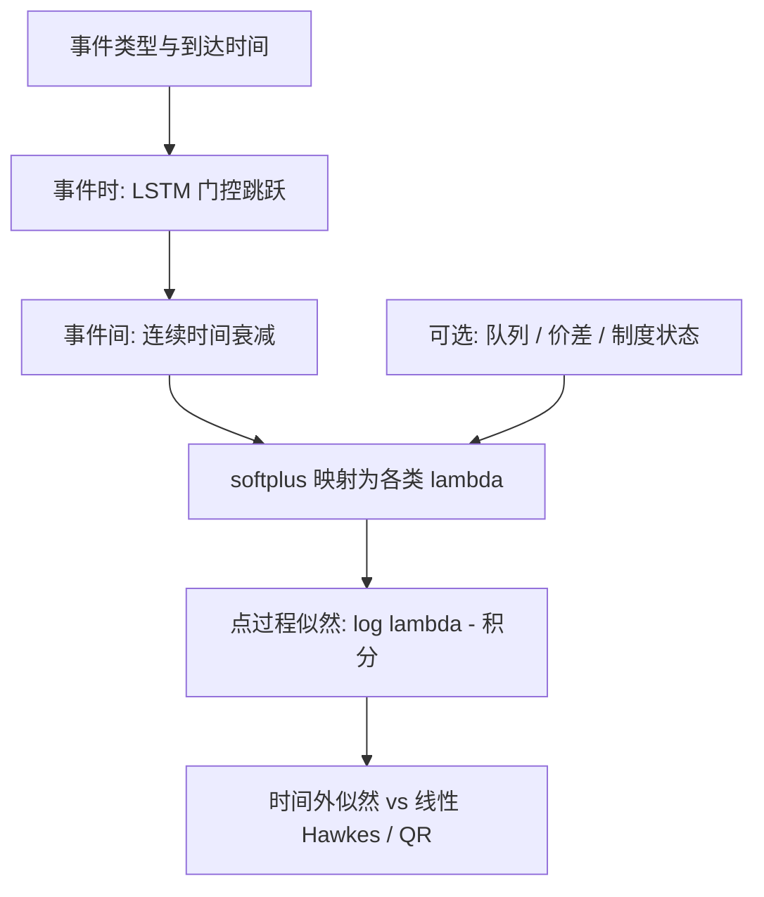

# Neural Hawkes 订单流强度

    
强度不必是过去事件的正线性叠加：一个连续时间的循环网络可以在事件到达时更新隐状态、在事件之间按时间衰减，从而允许激励，也允许抑制。

    <footer>—— Mei and Eisner, The Neural Hawkes Process: A Neurally Self-Modulating Multivariate Point Process, NeurIPS, 2017</footer>

线性 [Hawkes 订单簿](/quant/hawkes-lob) 把第 $i$ 类强度写成基线加各类核的卷积，核通常为正，于是历史只能抬高未来强度。真实簿上存在抑制：刚成交之后同一价位的限价暂时不再加、自成交防范造成短不应期、涨跌停打开前某些类型被制度关掉。Mei 与 Eisner 的 Neural Hawkes 用连续时间 LSTM 让隐状态在事件间衰减、在事件时跳跃，强度是隐状态的非线性函数，可正可负地调节。它是点过程的灵活近似，用来检验线性核是否够用，以及事件类型之间的抑制是否存在。它不是「下一笔到达就抢跑」的执行引擎；开环强度在你自己下单后立即失效，与[多元互激](/quant/multivariate-hawkes)篇的警告相同。

## 问题

指数核多元 Hawkes 在 $d$ 类事件下有 $d^2$ 个激励参数，已经容易过拟合，但仍表达不了：某类事件之后强度先降后升、交叉抑制、以及依赖当前隐式状态（价差、队列）的调制。非线性 Hawkes 与状态依赖强度（Queue-reactive 加核）是两条参数化路。Neural Hawkes 走第三条：不指定核形状，让一个连续时间 RNN 充当通用的条件强度生成器。问题是统计的：在给定历史 $\mathcal{H}_t$ 下， $\lambda_k(t\mid\mathcal{H}_t)$ 是否比线性模型更好地拟合到达时间与类型，以及多出的似然是否在时间外样本上还在。

点过程的正确似然包含事件处的 $\log\lambda$ 与积分项 $\int\lambda$。神经网络必须能在任意 $t$ 求出强度，并在区间上积分。离散时间分类（把时钟切成小格，预测格内是否有事件）会随格子变细而把大多数格变成零，且破坏时间的连续性质。Neural Hawkes 针对的就是这一连续时间目标，而不是把 LOB 再做成一个 DeepLOB 式的固定步分类。

### 连续时间 LSTM 在做什么

普通 LSTM 的步是整数。Mei–Eisner 让细胞状态在两次事件之间按指数衰减（或按可学习的衰减），事件到达时用门控吸收该事件的类型嵌入，输出门再把隐状态映射为各类型强度（softplus 保证非负）。衰减使「记忆」有物理时间，而不是事件计数：同样两笔撤单，间隔 1 毫秒与间隔 1 秒对后续强度的影响不同。这比在事件序列上跑离散 LSTM、再把间隔当特征拼进去更干净，因为间隔进入了状态动力学本身。

强度的单位是「每单位日历时间的期望计数」，不是价格。把 $\lambda$ 的峰值直接当成下单仓位，量纲错误。经济大小至少要乘该类事件的平均规模，并扣掉你自己造成的强度。

## 方法

**事件字典。** 与 Hawkes 簿篇相同：买/卖限价、撤、主动成交，必要时加改价与触及 BBO 的指示。类型过多则 Neural Hawkes 的嵌入变成过参数的查找表，时间外似然下降。心跳与状态消息必须剔除，见 [L2/L3](/quant/l2-l3-data)。开盘、午休、隔夜必须切断：连续时间衰减不能跨过闭市，否则会把隔夜当成一次很长的无事件区间，基线被拉坏。

**训练。** 最大化点过程对数似然。积分项通常用蒙特卡洛或对衰减结构的解析近似；实现细节决定数值稳定性。正则：按日切分、同一日不得既训又测、对参数做权重衰减。比较基线必须包括：齐次泊松、线性指数 Hawkes、以及带日内基线 $\mu(t)$ 的 Hawkes。只打败泊松没有信息量。验证指标用时间外似然与下一事件类型的对数损失，不要用中点方向准确率——那是另一项任务，混进似然调参会造成泄漏式的任务污染。

### 与 QR、线性 Hawkes 的嵌套

Queue-reactive 让 $\lambda$ 看当前队列 $q$。Neural Hawkes 的隐状态若只从事件流更新，会把「因为 $q$ 变了所以强度变了」估成时间记忆。更干净的结构是：把 $q$、价差当作外生输入在事件间调制衰减或输出门，让网络去拟合残差记忆，而不是强迫它重发现 QR。检验方法：在时间外样本上比较纯 Neural Hawkes、QR、QR+线性核、QR+Neural。若 Neural 的增益在加入 $q$ 后消失，增益就不是非线性互激，而是状态依赖。

预测下一事件时间可用 $\lambda$ 的积分得到等待时间分布。用于研究「恢复力有多快」合法；用于在实盘里等一个预测的时间戳去插队，会改变过程，开环分位数没有执行含义。仿真用途见 [ABIDES](/quant/abides-simulation)：可以把拟合的强度当作噪声代理的到达，而不是当作自己的信号。

似然对开盘脉冲极其敏感。若不加确定性的日内基线，网络会把每个上午的外生高峰学成「强自激」，分支比叙事全部失真。线性 Hawkes 文献里已经反复出现的问题，神经网络不会自动修好。

## 机制

线性 Hawkes 的叠加原理来自分支过程：每个祖先独立贡献后代。Neural Hawkes 打破叠加：隐状态是非线性的，两笔同类型事件在短间隔内可能互相抑制（门控饱和），在中等间隔内激励。这使它能拟合不应期与振荡式恢复。代价是：不再有简单的分支矩阵 $N_{ij}$ 与谱半径。要报告类似「谁激励谁」的故事，需做反事实：在历史里插入一类事件，看随后各 $\lambda_k$ 的路径差。这是模型内的脉冲响应，不是结构因果，延迟行情同样会把光纤延迟画成激励。

与 DeepLOB 的差别：DeepLOB 输入原始档位张量、输出中点方向；Neural Hawkes 输入事件类型与时间、输出强度。前者吃 L2 快照，后者吃事件流。可以把二者串起来：Hawkes 生成事件，簿会计更新档位，再问价格模型——那是生成式仿真，见 [MarS](/quant/mars-generative-sim)，而不是判别式 alpha。Neural Hawkes 单独并不能给出中点预测；硬把强度差当方向特征，需在无泄漏的时间切分上另做检验，且通常被 OFI 线性基准打平。

### 抑制、制度与标记

涨跌停、最小报价寿命、自成交防范都是制度性抑制，不是知情交易。模型若在含这些区间的数据上拟合，会把规则学成「神经核」。应把制度状态当作已知协变量：板上时某些类型强度机械为零，不必用 LSTM 去近似。标记过程（事件带量）可用量调制跳跃幅度；仍要防止用未来量。大单拆成多笔报告时，事件时钟被制度切片，衰减常数会吸收切片规则，跨交易所不可比。

## 边界与工程取舍

灵活模型在单日上可以几乎完美拟合到达，时间外一换品种就坏。有效样本仍是交易日。不要用测试日的似然去选隐状态维度。不要在没有切断隔夜的连续时间上训练。不要把 Neural Hawkes 的脉冲响应图当成可交易领先指标对外叙述，除非已经用撮合时间、并做过延迟稳健性——这条与线性互激完全相同。

计算上，连续时间积分比 DeepLOB 的固定张量更贵，但贵的是似然，不是「因此可以少做切分」。A 股集合竞价不是同一点过程，应分开。加密 24 小时市场没有隔夜切断，但有维护窗口与爆仓串，仍需要外生脉冲项。线性 Hawkes 在许多品种上已经足够；Neural 的正当性来自预先指定的检验：时间外似然与脉冲响应是否显示稳定的抑制，而不是来自网络身份。

把 Neural Hawkes 嵌进强化学习执行，状态里若包含该网络对未来强度的预测，而训练标签又来自同一段含自己订单的历史，过程是循环定义的。研究应先冻结强度模型于公共历史，再谈控制。

## 小结

- Mei 与 Eisner 的 Neural Hawkes 用连续时间 LSTM 生成条件强度，允许激励与抑制，补线性正核 Hawkes 表达不了的不应期与非线性调制。
- 训练目标是点过程似然，不是中点分类。必须切断隔夜，并与泊松、线性 Hawkes、QR 比较。
- 隐状态会把队列反应误当成记忆；应把 $q$ 与制度当作显式输入，再看神经网络的增量。
- 脉冲响应是模型内反事实，不是结构因果；开环强度不能当自己的下单时钟。
- 出处：Mei and Eisner, *NeurIPS*, 2017；线性对照见 Hawkes（1971）与 Bacry, Mastromatteo and Muzy 对高频 Hawkes 的综述。
