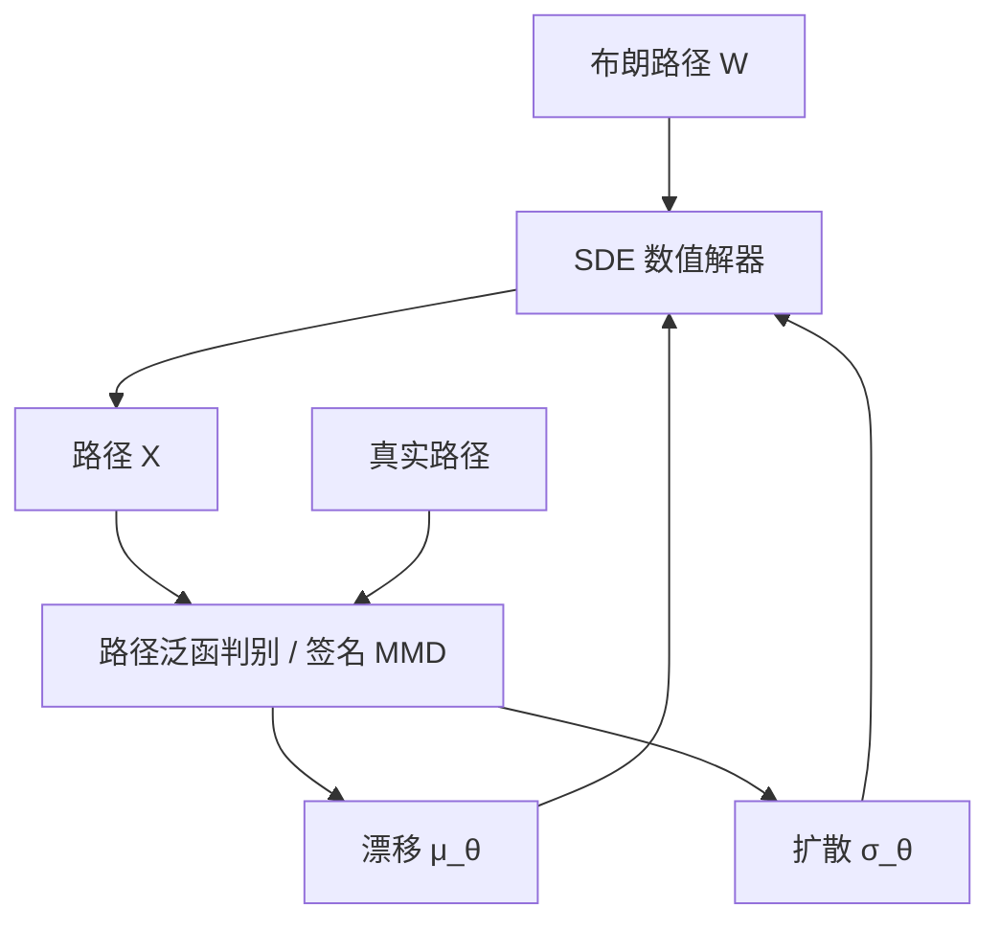

# Neural SDE

    
把漂移与扩散写成神经网络，连续时间的残差网络就变成 SDE；作为生成模型，它是无穷维的，判别或评分发生在路径空间，而不是固定长度的向量上。

    <footer>—— Kidger, Morrill, Foster and Lyons, Neural SDEs as Infinite-Dimensional GANs, ICML 2021</footer>

离散残差网络 $h_{k+1}=h_k+f_\theta(h_k)$ 的连续极限是 Neural ODE。金融市场的对象是带噪声的路径，极限应对应 SDE：

$$
\mathrm{d}X_t=\mu_\theta(t,X_t)\,\mathrm{d}t+\sigma_\theta(t,X_t)\,\mathrm{d}W_t.
$$

Patrick Kidger、James Morrill、Cristopher Foster 与 Terry Lyons 把这一对象写成路径空间上的生成器：噪声是布朗，生成器是系数网络加数值解器，对抗或评分在路径泛函上比较真假测度。本篇写 Neural SDE 作为市场生成器与作为潜变量模型的两用、数值解与反传如何耦合，以及它与 [VAE](/quant/market-generator-vae)、[Sig-WGAN](/quant/sig-wasserstein-gan)、[Deep BSDE](/quant/deep-bsde) 的分工；不把 Neural ODE 的伴随方法从头推导，也不把签名特征的代数再写一遍。

## 问题

时间序列生成器常用 RNN 或离散 GAN：输出长度固定，不规则采样要填充，在线续写要处理隐状态的离散漂移。SDE 生成器在连续时间上定义，观测可以是任意时刻的采样，缺失不是架构例外。约束也可以写进系数：扩散正定性、线性增长以保证解存在、对价格用几何形式 $\sigma(t,X)X$ 以免变负。问题是双重的：如何让 $(\mu_\theta,\sigma_\theta)$ 表达力足够产生肥尾与杠杆；如何在离散求解之后仍能对 $\theta$ 求梯度，而不让步长把模型定义偷偷改掉。

Kidger 等人强调 GAN 视角：生成器 $G_\theta(W)$ 把布朗路径映成 $X$，这是路径空间到路径空间的映射，判别器应对路径泛函打分。有限维 GAN 把路径压成固定向量再判别，等于先选定采样网格。Neural SDE 把网格降为数值误差，模型本身仍是连续的。训练目标可以是路径空间 Wasserstein、签名 MMD、或得分匹配，但模型类是 SDE。

### 潜变量 SDE 与观测方程

除了直接生成观测路径，还可以设潜过程 $H_t$ 为 Neural SDE，观测 $Y_{t_i}=g_\phi(H_{t_i})+\varepsilon$。这对应不规则时间的状态空间模型，似然一般不可析，要用滤波或变分推断。与 VAE 的差别是先验是路径上的扩散，而不是独立高斯 $z$。波动聚集、均值回复可以编码进 $\mu,\sigma$ 的结构，而不是指望向量 $z$ 一次说清整段动态。代价是训练更像随机控制：每条样本一条（或几条）潜路径，梯度噪声大。

Neural SDE 不是「带神经网络的 Heston」。Heston 有仿射结构与矩生成函数；Neural SDE 一般没有特征函数。能做的是模拟、滤波与生成，不是 Carr–Madan 式的 FFT 定价，除非再套一层 Deep BSDE 或 PDE 求解器。

## 方法

**系数参数化。** $\mu_\theta$ 与 $\sigma_\theta$ 用 Lipschitz 网络（谱归一、LipSwish 一类）以满足强解条件。多维扩散注意 $\sigma\sigma^\top$ 的正定：输出 Cholesky 因子。几何资产对 $\log X$ 建模更稳。杠杆效应需要 $\mu$ 或 $\sigma$ 依赖价格水平，或引入相关的第二布朗运动作为随机波动因子——那已是二维 Neural SDE，不是把一维扩散「加宽隐层」能代替的。

**数值格式与反传。** 欧拉–丸山简单，弱一阶；Milstein 在交换噪声下需要 Levy 面积，实现重。训练时步长是模型的一部分：改变评估步长等于改变生成器。反传有两条路：把求解器展开成计算图（内存随步数线性增长），或随机伴随。Kidger 的 torchsde 一类实现把虚拟步与布朗树（Brownian interval）管起来，使同一条 $W$ 在不同步长下一致，这是可重复实验的关键。不要在训练用粗欧拉、报告用精细解器却声称同一模型。

**训练目标。** 作 GAN：判别器可以是路径卷积、或截断签名上的线性函数——后者与 Sig-WGAN 合流，生成器换成 SDE。作得分或最大似然：一般不可用。作矩匹配：手工 stylized facts，梯度稀疏。作插值：给定两端点，桥接 SDE，用于不规则观测的填补。金融里生成式回测应把目标写进 [评估协议](/quant/generative-backtest-eval)，而不是默认对抗损失最小即市场。

### 无穷维 GAN 的含义

有限维生成器 $G:\mathbb{R}^d\to\mathbb{R}^n$ 的 $n$ 是输出维。路径生成器的输出「维数」是函数空间。判别器若只看 $n$ 个采样点，生成器只需在这 $n$ 个点上骗过，点间可以乱抖。Neural SDE 的样本路径被系数的正则性管住（扩散解的 Hölder），点间行为不是自由的。这是相对离散 GAN 的归纳偏置：不会任意高频振荡，除非 $\sigma$ 学得很大。粗糙波动要 $H<1/2$ 的正则，普通 Itô SDE 做不到，需换驱动（分数噪声）或承认模型类不够。

## 机制

弱解的存在使 $\mathrm{Law}(X)$ 由系数与初值决定。训练改变系数，等于在扩散族里找与数据最近的成员。相对 VAE，没有独立于时间的瓶颈 $z$（除非另加潜变量）；所有随机性来自 $W$ 与可选的初值分布。因此续写自然：从当前 $X_t$ 接着积分同一系数。相对离散 RNN，长期稳定性由 SDE 的回归结构（若 $\mu$ 有均值回复）约束，而不是由隐状态范数碰运气。

梯度方面，欧拉展开对 $\sigma_\theta$ 的导数经过 $\Delta W/\sqrt{\Delta t}$ 量级的项，步长细时方差大，这是随机反传的老问题。实践上中等步长加系数 Lipschitz，往往比追求很小离散误差更先要。签名判别把路径映到有限矩，给 SDE 生成器一个平滑的损失，避免卷积判别器在网格上挑刺。

### 定价与对冲接口

风险中性定价需要的是 $\mathbb{Q}$ 下的 SDE，漂移被无套利钉住，神经网络应主要参数化扩散与相关。用 $\mathbb{P}$ 上训出的 Neural SDE 直接平均支付，得到的是真实测度期望，不是价格。Deep BSDE 可在给定的 Neural SDE 上解倒向方程，但必须先改漂移或接受有价格的风险溢价模型。[Deep Hedging](/quant/deep-hedging-buehler) 则可直接把 Neural SDE 当模拟器，在 $\mathbb{P}$ 上做风险最小化，逻辑自洽。混用三种接口而不写测度，是最常见的实现错误。

Kidger et al. 的 ICML 标题写 Infinite-Dimensional GANs，指生成器作用在路径空间。实现仍在有限步上走数值解。论文贡献是模型类与训练视角，不是「不必再选步长」。

## 边界与工程取舍

跳跃要用 SDE 加泊松随机测度，或单独的跳跃网络；隔夜缺口同理。系数若全局 Lipschitz 过强，可能限制危机时的扩散爆发；过弱则解爆炸、训练 NaN。校准香草微笑通常仍用参数随机波动或局部波动，Neural SDE 更适合生成与滤波，而不是替换整张曲面的生产定价器。[PINN](/quant/pinn-option-pricing) 解的是给定系数的 PDE；Neural SDE 学系数。先学系数再解 PDE，两套网络的误差会叠，中间必须冻结与验证。

计算上，每条路径每步都要跑系数网络，比一次解码整窗的 VAE 重。批量路径应共享时间网格或使用同一棵布朗树。不要把 Neural SDE 与「深度因子模型每日截面」混称：一个是路径测度，一个是截面条件均值。

存在唯一强解的条件（Lipschitz、线性增长）在 ReLU 无界网络上并不自动满足。训练开始前应对系数做谱约束或增长裁剪，否则「生成了爆炸路径」不是市场肥尾，是数值吹掉。

与分数驱动、粗糙波动相比，标准 Neural SDE 的瞬时正则是半鞅的。若评估清单含 Hurst $H\approx 0.1$，应换驱动或换模型类，而不是加深 $\sigma$ 的网络。

## 小结

- Neural SDE 用网络参数化漂移与扩散，作为连续时间生成器，随机性来自布朗路径。
- Kidger 等人把它解释为路径空间上的无穷维 GAN；判别可用签名等路径泛函。
- 数值步长与布朗树是模型定义的一部分；训练与评估格式应一致。
- 定价必须交代 $\mathbb{P}$ 与 $\mathbb{Q}$；对冲模拟器可以在 $\mathbb{P}$ 上直接用。
- 普通 Itô 类覆盖不了跳跃与粗糙正则；系数必须有存在唯一性约束。
- 出处：Kidger, Morrill, Foster and Lyons, *Neural SDEs as Infinite-Dimensional GANs*, ICML 2021；对照 Neural ODE 与潜变量 SDE 文献。
