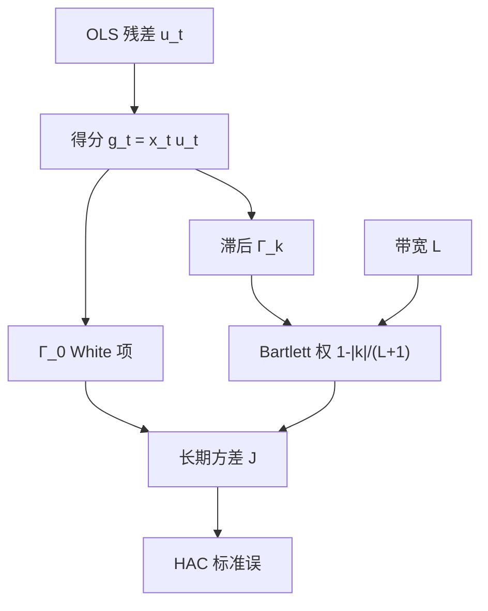

# Newey–West HAC

残差可以在时间上相关，只要相关衰减得足够快；把滞后足够远的样本自协方差加进三明治，再乘上保证半正定的权，标准误就按序列依赖而不是按独立观测来数。

<footer>—— Newey and West, A Simple, Positive Semi-definite, Heteroskedasticity and Autocorrelation Consistent Covariance Matrix, Econometrica, 1987</footer>

上一课 [OLS 与稳健标准误](/quant/ols-robust-se) 把截面异方差写进 White 三明治，但仍把观测当独立。金融时间序列里这一条接着坏：收益可以几乎无线性相关，回归残差却因重叠窗口、遗漏的慢因子、微观结构而带着短记忆。[ARMA](/quant/arma) 能把均值里的线性相关抽干，抽不干的部分仍会让 $\sum x_t u_t$ 的方差大于独立情形。Newey 与 West 给出在异方差**且**自相关下一致、并保持半正定的协方差估计。本课的缺口是：**HAC 的滞后是带宽，不是把动态模型估完。** 后课聚类处理的是截面组内相关，对象不同。

## 问题

时间序列 OLS 的渐近方差是长期方差 $J=\sum_{k=-\infty}^{\infty}\Gamma_k$，$\Gamma_k=E[x_t u_t u_{t-k}x_{t-k}^\top]$。White 只留 $k=0$。若 $u_t$ 或 $x_t u_t$ 有自相关，$J$ 被低估，$t$ 膨胀。问题是用有限样本估计 $J$，既要包含足够滞后，又不能把噪声自协方差都加进去，还要让估计矩阵保持正定——否则 Wald 统计量可能为负。

Hansen 与 Hodrick（1980）在远期溢价回归里已经按重叠结构修正；他们的矩形核在滞后多时不一定正定。Newey–West 用 Bartlett 权 $w(k,L)=1-|k|/(L+1)$，保证半正定，成为金融默认。对象是 **HAC 标准误**，不是把回归改写成 ARMA。

### 带宽 $L$ 是设定，不是数据自动给的真理

$L$ 太短，剩余自相关进 $t$；$L$ 太长，方差估计本身很吵，标准误乱跳。经验法则 $L\approx\lfloor T^{1/4}\rfloor$ 或 Andrews（1991）的数据驱动带宽，都是渐近装置。重叠 $h$ 期收益对月度变量回归时，经济带宽至少是 $h-1$，见后课 [长期收益与重叠观测](/quant/long-horizon-overlap)。把 $L$ 开到 $T/4$「为了稳健」，等于几乎不估计 $J$。

Newey–West 修正的是 $\hat\beta$ 的精度，不把 $\hat\beta$ 变成 GLS。若你真知道 AR(1) 残差，可行 GLS 更有效。金融里残差结构很少那么干净，HAC 是报推断的默认，不是均值估计的最优。

## 方法

**估计。** 先 OLS 得 $\hat u_t$，再

$$
\hat J=\hat\Gamma_0+\sum_{k=1}^{L}w(k,L)(\hat\Gamma_k+\hat\Gamma_k^\top),\qquad
\hat\Gamma_k=T^{-1}\sum_{t=k+1}^{T}x_t\hat u_t\hat u_{t-k}x_{t-k}^\top.
$$

$\widehat{\mathrm{Var}}(\hat\beta)=T(X^\top X)^{-1}\hat J(X^\top X)^{-1}$（按你软件的 $T$ 与小样本校正对齐）。核还可以换成 Parzen、二次谱（Andrews）；Bartlett 是报告习惯。

**预白化。** Andrews 与 Monahan 先对 $x_t\hat u_t$ 套一个 VAR，再对白化残差做核，带宽更稳。金融短样本里预白化阶数不要大。残差平方的 GARCH 聚集是另一种依赖：HAC 能吸收一部分，但条件异方差的模型化仍应看 [GARCH](/quant/garch)，尤其当你要的是 $\sigma_t$ 而不是斜率的 $t$。

**与 Fama–MacBeth。** 截面斜率 $\{\lambda_t\}$ 的时间序列标准误，常再套一层 Newey–West，因为风险溢价持续。这是对 **$\lambda_t$ 路径** 做 HAC，不是对个股残差做 HAC。两层不要混在同一句「已经 Newey–West」里。

### 什么时候不该用 HAC 代替模型

单位根回归、伪回归，HAC 救不了：对象错了，见 [单位根](/quant/unit-root)。结构性断点让全样本 $J$ 变成两段体制的混合物，标准误含义模糊，应接到后课断点。预测回归里 $x_t$ 高度持续，HAC 的 $t$ 仍有严重水平扭曲，那是 [Stambaugh 偏差](/quant/stambaugh-bias) 与局部到单位根的问题，不是加大 $L$ 能解的。

## 机制

得分 $g_t=x_t u_t$ 的样本均值以 $\sqrt{T}$ 速度收敛，速率由 $g_t$ 的长期方差决定。独立时长期方差就是 $\mathrm{Var}(g_t)$；相关时要把协方差链加回来。Bartlett 权对应把样本分成重叠块再平均的一种极限，正定性来自它是某个核的谱密度估计。直觉：相邻几个 $g_t$ 不是新实验，带宽 $L$ 是「多少期算一次独立信息」。

重叠收益是机制最干净的例子：月度回归用未来 12 个月收益，$g_t$ 与 $g_{t+1}$ 共享 11 个月，矩形核 $L=11$ 几乎由重叠结构钉死。没有重叠、只有 GARCH，长期方差仍大于瞬时方差，但 $L$ 不再有「窗口长度」那么硬的经济含义。

HAC 一致的前提是弱依赖：混合、近乎不相关。长记忆下 $J$ 可能发散或收敛变慢，普通 Newey–West 的 $t$ 不可靠，应接到 [ARFIMA](/quant/arfima-long-memory) 或对 RV 用 HAR 这类有约束短记忆。

### 小样本与「HAC 标准误更大」

样本短时 $\hat J$ 噪声大，HAC 标准误有时反而比 White **更小**（核把某些负的样本自协方差加进去）。这不是「更有效」，是估计误差。对照应看：加大 $L$ 时结论是否翻转；用 [bootstrap](/quant/bootstrap-finance) 是否同向。只报告使 $t$ 过线的那一档 $L$，是设定搜索。

## 边界与工程取舍

日度个股回归、截面 $N$ 大 $T$ 短，HAC 的渐近在 $T$ 上，不是在 $N$ 上——应聚类或 FM。高频回归若按 tick 当 $T$，微观结构让 $g_t$ 极强负相关，HAC 会把噪声当信息结构；应先聚合到经济间隔，或把对象换成已实现量。

工程默认：月度资产定价 $L=6$ 或 $12$；日度因子回归 $L=5$ 或 Andrews；重叠 $h$ 期则 $L\ge h-1$。并列 White 与 HAC。不要用 HAC 替代 [事件研究](/quant/event-study) 里按事件聚类的标准误。不要对已经 Newey–West 过的 FM 斜率再乘一次「因为 GARCH」的随意膨胀因子。

## 小结

- White 只覆盖 $k=0$；金融回归的得分几乎总有短记忆，长期方差要用 HAC。
- Newey–West 用 Bartlett 核保证半正定，带宽 $L$ 是必须报告的设定。
- 重叠收益的 $L$ 由窗口长度给出；预测回归的持续性扭曲不是加大 $L$ 能消的。
- HAC 报精度，不改点估计，也不替代 GARCH、单位根或聚类。
- 出处：Newey and West, *Econometrica*, 1987；带宽见 Andrews, *Econometrica*, 1991；重叠修正的先声见 Hansen and Hodrick, *Journal of Political Economy*, 1980。
