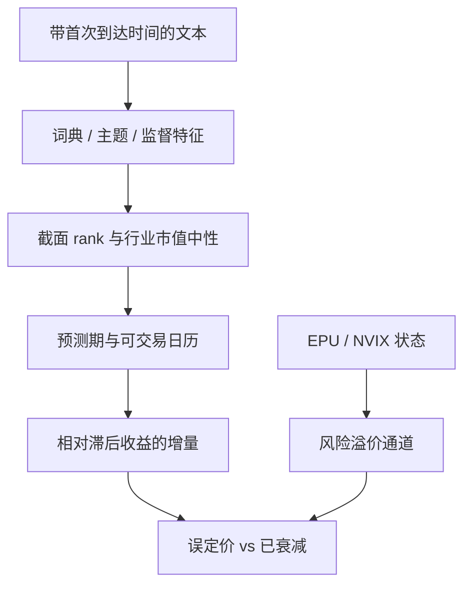

# 舆情与文本

《华尔街日报》「Abreast of the Market」专栏的悲观用词，能够预测市场随后的收益；媒体内容不只是价格的镜子，本身构成投资者情绪的可测代理。

<footer>—— Tetlock, Giving Content to Investor Sentiment: The Role of Media in the Stock Market, Journal of Finance, 2007</footer>

[上一课](/quant/supply-chain-alt)把贸易边与货运写成须滞后到可获得的网络：拓扑冲击与运价水平不是同一个因子，公开周频运量与年报客户关系是可复制输入。缺口是另一类高频公开信息：文本。词典、主题与监督模型各自估的是情绪、基本面还是风险状态，时间戳与中性化比「再爬一个源」更先决定能否复制。本课写可复制的文本因子，不重写客户–供应商可预测性。Tetlock、Loughran–McDonald 与后续监督框架是同一条测量链上的分层。

## 问题

供应链边回答的是滞后的拓扑与流量。文本要有增量，必须是：市场尚未读完（有限注意）、文本含有尚未进入会计数字的信息、或文本是风险的状态变量（不确定性、关注度）从而对应溢价而不是误定价。Tetlock 的市场级负面词更接近情绪与注意力；Tetlock 等（2008）的公司新闻更接近基本面提取。把两种回归都叫做「舆情 alpha」会混掉机制。Loughran–McDonald 的教训是测量：通用词典在金融语料上有偏，词表必须为领域重建，并报告相对于词袋长度、文件长度的标准化。

时间戳比词频更容易做错。新闻有电讯稿、报纸印刷日、网页更新与转载。用收盘后才见报的专栏去解释当日收益，是把 Tetlock 的设计（专栏与随后收益）接反。多源合并若不做去重，同一则盈余预告会被当成「情绪爆发」。Ke–Kelly–Xiu 强调监督目标与文本的对齐；对齐错了，任何深度学习都只是在拟合泄漏。

### 词典、主题与监督不是三代替代品

词典（LM 负面、LM 不确定、正向）可解释、可审计，适合监管与风险报告。主题模型与词嵌入把「谈什么」从「语气」里分开：EPU 是政策主题加不确定语气；Bybee 等把商业新闻主题与宏观周期对齐。监督模型（从收益或波动反推词权）拟合力强，但词权会把风险溢价与误定价一齐吸入，样本外脆弱，且难以向投资委员会解释为何某个词今年变号。Gu、Kelly 与 Xiu（2020）在表格特征上比较机器学习，文本特征同样要接受样本外与经济约束（Avramov、Cheng、Metzker 2023 一类限制）。正确态度是分层：先词典与主题做可解释因子，再把残差文本交给监督模型，并锁住词表与训练窗。

把社交媒体提及量当情绪，测到的常常是关注度与零售交易，而不是文本极性。Antweiler–Frank 已区分看涨言论与争议（意见分歧）。只报「情绪分数」而不报成交量与意见分歧，结果无法与机制对照。

## 方法

**市场级。** 按 Tetlock：日频专栏或头条的负面词占比，去趋势、控制滞后收益与周末，预测随后市场收益。García 的分样本（扩张/衰退）应预指定。EPU 与 NVIX 是风险指数，评价应看是否预测风险溢价或是否作为[宏观状态](/quant/macro-state-variables)改善条件均值，而不是看它们能否做高频择时。

**公司级。** 新闻或 8-K/年报的 LM 词频，控制市值、行业、上日收益与分析师修订，预测随后收益或盈余意外（Tetlock et al. 2008）。事件研究应使用新闻首次到达时间，而不是数据库入库时间。Heston 与 Sinha 等后续工作比较新闻与社交媒体；复制时源必须固定，不能把样本外新出现的 App 混进来而不做覆盖调整。

**监督学习。** Ke–Kelly–Xiu 用文本预测收益，本质是高维词特征上的正则化。必须：按时间切分、对文档时间戳做滞后、对重叠收益做[重叠调整](/quant/label-horizon-overlap)、并报告相对 LM 词典的增量。词权的经济含义要用 holdout 年检查稳定性。不能把全样本 tf-idf 的 IDF 用到过去——那是前视的语料统计。

### 中性化与换手

负面新闻集中在小盘、低价、高波动名字，原始多空会变成[规模](/quant/size-neutral)与残差波动。应在截面 rank 后对行业、市值回归，或先做特征正交，见[特征 rank](/quant/cs-rank-features)。新闻因子换手高，Novy-Marx–Velikov 的成本分类适用：日频舆情在扣[有效价差](/quant/effective-realized-spread)后经常消失，只留下公告窗口附近的一段。衰减曲线应公开：多数文本 IC 在一到五日内掉到噪声，见[因子衰减](/quant/factor-decay-turnover)。

机器翻译与跨语言词表会引入系统性偏差：同一事件在英文电讯与本地语言媒体上的到达时间不同。用全球新闻做 A 股因子时，时钟应以本地可获得为准，而不是以英文源为准。

## 机制

有限注意：投资者不能即时处理全部新闻，价格对负面词的调整滞后，随后均值回复（Tetlock）或基本面兑现（Tetlock et al.）。意见分歧：高争议伴随成交量，可能提高波动而非给出方向（Antweiler–Frank）。风险：EPU、NVIX 升高对应风险溢价升高，期望收益可以上升同时价格下跌——这是贴现率通道，用同期负相关去证明「情绪预测」会把风险当成 alpha。

文本与另类数据的分工：卫星与货运提供物理现在时，文本提供叙事与政策。Engle 等（2020）的气候新闻对冲，是文本作为风险因子的构建，而不是预测哪家公司下周上涨。把气候新闻 z-score 丢进选股 GBDT，而不对行业中性，多半是在做空碳密集板块的 beta。

发布后衰减：一旦 LM 词典成为标准特征，公开新闻的极性被广泛交易，剩余预测力转向更难的结构（供应链关系是否被提及、主题切换）或转向更干净的时间戳。增量来自测量，不是来自把同一专栏再送进更大的模型。

### 监管披露与媒体不是同一语料

10-K 的 LM 词频更接近公司选择的披露语气与风险因子陈述，更新频率为年或季，适合慢变量。新闻是外部生产的注意力过程，适合短持有。把两者拼成同一个「NLP 因子」而不标来源，无法解释换手与容量。Jiang、Lee、Martin 与 Zhou 等对管理层语调的研究，对象是披露选择，有内生性：差公司也可能选择正面词。媒体相对更难被单一公司控制，但有编辑选择与广告激励。识别上，Engelberg 与 Parsons（2011）用地方报纸与本地投资者证明媒体的因果影响——这是机制证据，不是说多订阅一家通讯社就能提高夏普。

## 边界与工程取舍

不要用未来的词表修订或未来的语料 IDF。不要把未授权的全文库整篇转载进研究报告（版权）；特征应是计数与模型输出。不要用社交媒体去识别或定向到个人账户。中文金融文本的分词、否定与反讽使英文 LM 词表不能硬译；需要中文领域词表或监督，并单独做样本外。涨跌停使「新闻后可交易收益」在 A 股上常从下一可成交日开始，日历要改。

多重检验：同一新闻源上试五十种极性公式，t=2 不够，见 Harvey–Liu–Zhu。预指定词表版本与标准化，把搜索空间写进备忘录。

GPT 类模型可以当特征提取器，但不能当时间机器：用事后训练的大模型给历史新闻打标签，知识截止日期与语料污染会造成前视。文本因子的模型版本必须冻结并随 vintage 保存。

## 小结

- Tetlock（2007）建立媒体负面词对市场收益的预测；Tetlock et al.（2008）把它连到公司基本面；Loughran–McDonald（2011）纠正金融语料上的词典偏差。
- EPU（Baker–Bloom–Davis）与 NVIX（Manela–Moreira）更接近风险状态；García（2013）指出情绪预测力随体制变化。
- Ke–Kelly–Xiu 与 Gentzkow–Kelly–Taddy 把文本推进到高维监督与计量框架；增量必须相对词典基线，并严控时间戳与 IDF 前视。
- 公司新闻因子换手高、易变成小盘与波动暴露；扣费后往往只留下短窗口。
- 出处：Tetlock, *JF*, 2007；Tetlock, Saar-Tsechansky and Macskassy, *JF*, 2008；Loughran and McDonald, *JF*, 2011；García, *JF*, 2013；Antweiler and Frank, *JF*, 2004；Baker, Bloom and Davis, *QJE*, 2016；Manela and Moreira, *JFE*, 2017；Gentzkow, Kelly and Taddy, *JEL*, 2019；Ke, Kelly and Xiu, 2019；Engelberg and Parsons, *JF*, 2011。
