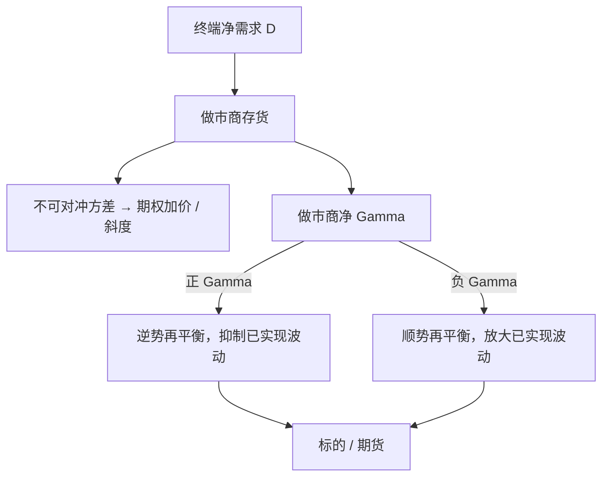

# 期权需求压力

做市商无法把期权完全对冲掉时，终端需求会把不可对冲残差的方差写进期权价格；一只合约上的买压，也会按不可对冲部分的协方差抬高其他合约。

<footer>—— Gârleanu, Pedersen and Poteshman, Demand-Based Option Pricing, Review of Financial Studies, 2009；实证与对冲外溢见 Ni, Pearson and Poteshman 及相关后续</footer>

教科书把期权价格写成标的过程的函数：给定波动、利率与分红，供需不出现。Ni、Pearson 与 Poteshman 这一支文献要补的，是中介资产负债表。终端投资者净买入看跌或看涨，期权做市商必须接下仓；只要复制有残差——随机波动、跳跃、离散对冲——仓位就有不可对冲风险，风险厌恶的中介会把价格抬离无摩擦公式。这就是**需求压力**（demand pressure）：它先改隐含波动曲面，再经 Delta 对冲改写标的路径。Bollen 与 Whaley（2004）已经看到带符号的期权成交与隐含波动同向变动；Gârleanu–Pedersen–Poteshman（2009）给出与不可对冲方差成比例的定价；Ni、Pearson、Poteshman 与 White（2021）把同一条仓位再写成对股票波动的非信息渠道。本篇写度量与机制，衔接[波动偏斜](/quant/vol-skew)和[Delta 对冲](/quant/greeks-hedge)，不讨论如何制造逼仓或绕开持仓限额。

## 问题

无摩擦市场里，终端多头可以由做市商用标的完全复制，期权只是多余证券，需求不定价。现实里复制误差的方差 $\mathrm{Var}(\varepsilon)$ 大于零。记终端对合约 $i$ 的净需求为 $D_i$（以做市商空头为正），中介的风险厌恶为 $\gamma$，则合约 $i$ 相对无摩擦价格的加价近似

$$
\Delta P_i \;\propto\; \gamma\,\mathrm{Var}(\varepsilon_i)\,D_i,
$$

交叉影响则换成 $\mathrm{Cov}(\varepsilon_i,\varepsilon_j)D_j$。虚值指数看跌的不可对冲残差大，同一单位需求对价格的撬动也大——这与指数期权整体偏贵、个股期权相对便宜的截面事实同方向：终端在指数上净多期权（尤其是保护性看跌），在个股上净空。问题不是「有没有人在买期权」，而是做市商账上的净 Gamma、净 Vega 与不可对冲协方差，有没有大到足以移动隐含波动，并经对冲单移动现货。

第二条渠道是信息。Ni、Pan 与 Poteshman（2008）表明期权成交里有人在交易未来已实现波动；带方向的开仓也可以预测股票收益。需求压力论文要分开的是：**非信息**的存货渠道。Ni 等人（2021）的识别是做市商净 Gamma 与随后股票已实现波动负相关——正 Gamma 的再平衡是逆势的，负 Gamma 是顺势的——这与「知情交易把信息写入价格」不是同一回归。把两条渠道揉成「期权成交预测股票」，会把存货冲击当成 alpha。

### 净需求必须按账户类型拆开

公开成交量是买卖配对后的总量，不含谁在开仓。Gârleanu 等人用交易所按账户类型划分的未平仓：公众客户、自营、做市商。终端净需求定义为非做市商的净多头。指数上客户长期净多看跌，个股上客户常净空（备兑、卖出波动），于是指数微笑更陡、个股更平。只看「看跌成交量升」而不看开平仓与账户类型，会把平仓与开仓、对冲与投机混成一个数字。

Ni、Pearson 与 Poteshman（2005）记录到期日股价钉在最大未平仓执行价附近。钉住是对冲流在 $K$ 附近的机械结果，不是需求压力的全部；但它证明做市商的股票单足够大，能改变收盘分布。需求压力把同一机制从到期日推广到每个交易日的 Gamma 再平衡。

## 方法

度量分三层，不要混用。第一层是带符号的期权成交：主动买入看涨减主动卖出看涨，看跌反向，再按 Delta 折成等价股票。Bollen–Whaley 用这一层解释隐含波动的日变化。第二层是未平仓的终端净头寸，对应 Gârleanu 等人的水平回归：贵的是「谁一直拿着」，不只是「今天谁在打」。第三层是做市商净 Gamma

$$
\Gamma^{\mathrm{MM}}_t=\sum_{k} q^{\mathrm{MM}}_{k,t}\,\Gamma_{k,t},
$$

其中 $q^{\mathrm{MM}}$ 是做市商在系列 $k$ 上的净仓（通常由成交容量代码累加）。$\Gamma^{\mathrm{MM}}>0$ 时，标的上涨则 Delta 升，做市商卖标的；下跌则买。这是波动的减振器。符号反过来，再平衡放大波动。Ni 等人（2021）把这一层接到个股已实现波动与大变动概率上。

回归上应同时放需求与对冲。只回归隐含波动对期权成交，分不清信息与存货；只回归股票波动对 Gamma，又丢掉了曲面本身被买贵的那一段。完整的工作流是：用非做市商净需求解释隐含波动的水平与偏斜，用做市商 Gamma 解释随后的已实现波动，再检查两者是否被同一批开仓驱动。控制项包括已实现波动、跳、以及标的自身的买卖压力，避免把股票订单簿的冲击算到期权头上。

### 不可对冲残差决定哪些合约更「贵」

完全可复制时 $\mathrm{Var}(\varepsilon)=0$，需求再大也不加价。残差来自随机波动、跳跃、离散再平衡与买卖价差。期限短、障碍近、虚值深的合约，残差方差更大，单位需求的价格影响也更大。这解释了为什么保护性虚值看跌的需求特别能陡化斜度，而平值短期限的需求更多表现为水平抬升。交叉项 $\mathrm{Cov}(\varepsilon_i,\varepsilon_j)$ 意味着买一只虚值看跌，也会抬高邻近执行价与邻近到期——做市商对冲的是一篮子不可对冲风险，不是单点。曲面因此以相关核的方式被需求「涂」过，而不是只在成交的那一个 $K$ 上跳。

## 机制

终端买保护，做市商空头看跌：客户净多期权时，做市商净空期权，做市商 Gamma 为负、Delta 随现货下跌更负。指数保护的典型状态即是如此——现货跌则做市商必须再卖现货或期货，价格更跌。个股上客户常净空期权，做市商正 Gamma，再平衡是逆势的。同一套会计，在指数与个股上给出相反的波动反馈。需求压力首先定价的是期权；对冲是把那一页账翻译成标的订单流。

到期日是极限情形。剩余期限 $\tau\to 0$ 时平值 Gamma 发散，Ni、Pearson 与 Poteshman（2005）的钉住是再平衡在执行价处变成「墙」。日常的需求压力是同一墙的矮版本：不必等到到期，只要净 Gamma 大、标的穿过密集开仓区，对冲单就会在短窗口里与价格同向或反向。Amaya 等人把这一机制做到 0DTE 指数期权，见[0DTE 与波动](/quant/amaya-0dte-volatility)。

把「看跌成交量升」当成看空信号，忽略了开仓方向与谁在做市。客户买看跌是保护需求，做市商空头随后卖现货，短窗里像看空；客户卖看跌则相反。没有账户类型的成交量，符号不确定。

### 与偏斜、风险溢价的分工

[波动偏斜](/quant/vol-skew)可以来自崩盘恐惧、杠杆效应或需求。需求压力不否定前两者，它给出可检验的增量：在控制已实现偏度与杠杆之后，终端净需求仍解释隐含斜度的时变。风险溢价文献里的「保险很贵」，有一部分是中介风险厌恶乘上不可对冲方差，而不全是代表性投资者的边际效用。两者在指数看跌上经常同向，识别要靠账户持仓，而不是只靠斜率本身。

## 边界与工程取舍

美国的账户类型数据来自交易所的容量代码，延迟与覆盖都不是实时全市场。用公开的 option-to-stock 成交比或 Put/Call 比代替净需求，只能做粗筛选，不能声称复制了 Ni 或 Gârleanu 的回归。做市商内部还会把仓位转到其他柜台或用方差互换对冲 Vega，公开 Gamma 会低估真实存货。跳跃日线性对冲失效，需求压力的平方差公式在跳后要打折。

境内上市期权（沪深 50ETF、300ETF、中金所股指期权等）有交易所公布的做市商制度、持仓限额、限仓限报与投资者适当性。持仓限额把单一账户的 $D_i$ 截断，不等于市场总存货消失，但会改变需求向哪些账户集中。不得把持仓限额、套保额度或做市豁免理解成可以拆分账户放大净需求；公开规则把限额写成约束，研究只估计约束内的价格影响。回测若假设无限卖出虚值看跌并不受限仓，与交易所规则冲突。

需求压力是中介定价，不是操纵指引。用大额期权去「制造」标的冲击，落入交易所有关异常交易与市场操纵的监控范围。本篇的工程含义是：风险系统要跟踪做市商一侧的净 Gamma，而不是设计如何把价格推过执行价。

## 小结

- 期权不能被无残差复制时，终端净需求按不可对冲方差进入价格，并按协方差传到其他执行价与到期。
- 指数上客户净多保护、个股上常净空，对应指数期权更贵、斜度更陡的截面。
- Ni–Pearson–Poteshman 把同一存货写成对标的的影响：到期钉住、日常 Gamma 再平衡与已实现波动。
- 度量要拆账户类型与开平仓；总量 Put/Call 不能代替净需求。
- 境内上市期权的持仓限额与做市规则是约束，不是可绕过的摩擦。
- 出处：Gârleanu, Pedersen & Poteshman, *RFS*, 2009；Bollen & Whaley, *Journal of Finance*, 2004；Ni, Pearson & Poteshman, *JFE*, 2005；Ni, Pan & Poteshman, *Journal of Finance*, 2008；Ni, Pearson, Poteshman & White, *RFS*, 2021。
