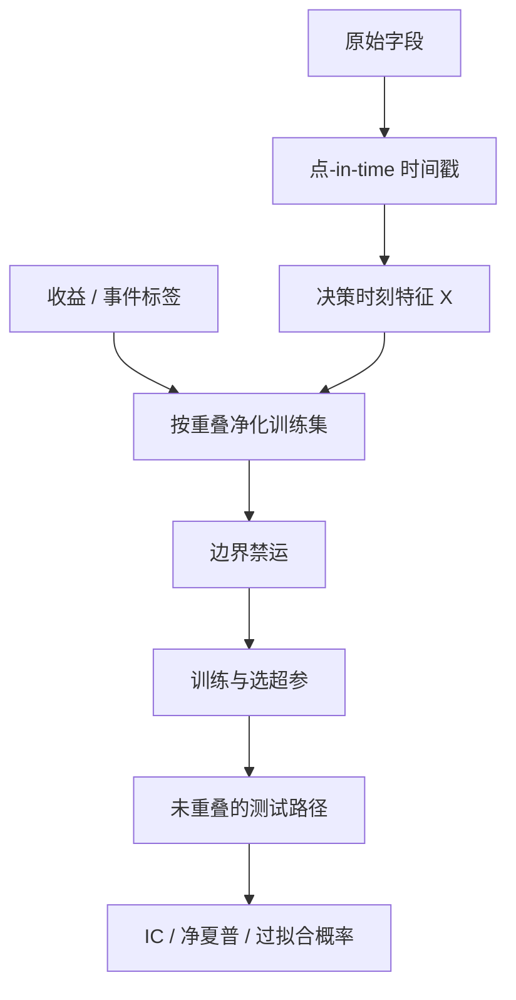

# 防止未来函数

训练集与测试集若在时间上交叠，交叉验证会把未来信息漏进模型；必须先按事件净化，再在边界上加禁运期。

<footer>—— Lopez de Prado, Advances in Financial Machine Learning, 2018，关于 purged k-fold 与 embargo</footer>

回测里最贵的错误不是估错一个系数，而是让标签或特征看见了它们本不该看见的未来。Lopez de Prado 把这类泄漏写成金融机器学习的结构性病：收益在时间上重叠、事件有持续期、同一信息会以不同字段迟到。普通 k-fold 打乱样本，等于假设观测独立；价格路径显然不独立。于是「验证集上的夏普」可以完全由泄漏贡献。本篇把未来函数收成可检查的规则：点-in-time 特征、标签的时间边界、净化与禁运、以及 A 股公告与行情源特有的迟到。它是[正则线性](/quant/regularized-linear-alpha)能被相信之前必须先做的一层，也是[多重检验](/quant/multiple-testing-factors)之外另一条让发现变假的通道。

## 问题

一个监督样本是 $(X_t,y_t)$。若 $X_t$ 的任何分量在 $t$ 时刻对交易者不可获得，或 $y_t$ 用到了 $t$ 之后才确定的价格，模型就在做未来函数。常见形态有三。特征泄漏：用当日收盘价计算的估值去「预测」当日收盘收益；用当季财报的最终数去解释财报公布前的收益；用复权后全样本的复权因子回填除权前价格。标签泄漏：用重叠的五日收益当标签，却把相邻五日当成独立折，训练与测试共享同一段路径。评估泄漏：在全样本上标准化、选阈值、挑品种池，再声称样本外。

金融时间序列的依赖比 i.i.d. 交叉验证假设的更长。一篇研报发布后，价格可以调整数日；一个宏观公告的波动会进相邻的训练折。Lopez de Prado 指出，即使你按时间切分，若标签的区间互相重叠，测试折的 $y$ 仍含训练折已经见过的部分路径。问题不是「要不要交叉验证」，而是验证手续必须与数据生成过程的持续期匹配。否则正则选的 $\lambda$、树的深度、特征集，全是泄漏的函数。

### 点-in-time 不是「用了昨日数据」这么简单

许多库把财报字段写成报告期期末数，时间戳是报告期，不是公布日。用 12 月 31 日的净利润去解释 1 月的收益，等于假设市场在年报发布前三个月已经知道审计后的数字。正确的时间戳是交易所或指定披露媒体的公布时点，再加你自己能解析、入库、下单的延迟。分析师一致预期、行业分类、指数成分、ST 状态、停牌标志，都有修订史：用最新快照回填历史，是存活与修订双重泄漏。A 股的除权除息、涨跌停、集合竞价成交，还会让「当日可交易价格」与「当日收盘字段」不是同一个对象。

复权是研究便利，不是交易事实。后复权用未来的拆细与分红去改写历史价格，前复权在每次公司行为后改写全部历史。信号若在价格上计算，必须固定一种只使用当时已知公司行为的复权，或直接用未复权价加已知乘数。

## 方法

先给每一个特征写「可获得时刻」$t^{\mathrm{avail}}$，给每一个标签写「实现窗口」$[t,t+h]$。训练样本只允许 $t^{\mathrm{avail}}\le t_{\mathrm{train}}$，并且该样本的标签窗口不得打进测试集的特征窗口。Lopez de Prado 的 purged k-fold：按时间切折之后，删掉训练集里标签与测试折重叠的那些观测（purging）；再在测试折两端各挖掉一段禁运（embargo），吸收信息到达的余震。组合式净化交叉验证（CPCV）进一步枚举多组测试路径，用来估计过拟合概率，而不是只报一条幸运的验证曲线。

实施上，特征表应是点-in-time 快照：每一行对应一个决策时刻，列值等于该时刻信息集。指数成分用当时的成分，不用今日的成分回填；行业用当时的分类；财务用当时已公布的最新报告，而不是后来重述的数字。标签用可成交收益：以信号可获得之后的开盘集合竞价或次日可交易价为起点，而不是用含同期收盘的收益。Bailey、Borwein、Lopez de Prado 与 Zhu（2014）讨论的回测过拟合概率，针对的是策略搜索次数；净化交叉验证针对的是同一次训练里的泄漏。两者要同时做。

### 重叠标签与事件采样

若你用三重屏障（止盈、止损、超时）给每笔入场打标签，事件持续期不同，相邻事件高度重叠。把每个事件当独立样本做 k-fold，泄漏几乎必然。Lopez de Prado 的建议是：在事件时间上采样，并对持续期做净化，而不是在时钟格子上假设每分钟独立。评估时，测试路径的夏普必须用非重叠的持有区间，或对重叠做明确的 HAC 调整；否则样本内看似独立的许多赌注，其实是同一段行情的重复计数。这与[事件时间](/quant/event-time)的选择是同一问题在监督学习里的投影。

## 机制

泄漏之所以抬高验证分数，是因为模型在训练时已经见过测试路径的一部分。线性模型会把「将要发生的收益」编进与之相关的任何特征；树会直接劈开那个泄露列。样本外一旦换成真正迟到的信息，IC 消失。更隐蔽的机制是标准化与筛选：用全样本均值方差去中心化，等于把未来的极端值写进今日的 z-score；用全样本流动性过滤股票池，等于在历史决策日剔除了当时还算流动、后来退市或停牌的名字。存活偏差是未来函数的一种：你用了「今天还活着」这一未来信息。

禁运期的机制是切断信息余震。一个涨停打开后的反转，可能跨越你设置的折边界；不禁运，测试折的标签仍与训练折的最后几日共享微观结构状态。禁运不是越大越好：过大则浪费样本，过小则泄漏残留。应对照事件的经验持续期——财报后数日、宏观后数小时、涨跌停打开后的换手脉冲——来标定，而不是用一个万能的 1%。

「用昨日收盘预测今日收益」并不自动安全。若特征含有今日开盘前尚未发布、却被数据商写成昨日字段的公告，昨日收盘已经不是合法信息集。核对的是数据商的时间戳语义，不是你的代码里有没有 `shift(1)`。

### A 股特有的迟到与截断

交易所与数据商对停牌、复牌、临时停牌、异常波动的标志会事后修订。用最终标志回测当时的可交易性，会高估策略在涨跌停与停牌上的执行。开盘集合竞价的虚拟参考价在 9:15–9:25 揭示，但 9:20 后不可撤单；若你的「开盘价特征」用了 9:25 的成交价去决定 9:20 的订单，这是分钟级未来函数。北向持股、龙虎榜、融资融券余额是 T+1 或盘后公布的，不能当作当日盘中状态。正确的做法是把每个字段的官方发布时间写进特征字典，并在回测引擎里拒绝时间戳不早于决策时刻的列。

## 边界与工程取舍

净化与禁运降低泄漏，也降低有效样本量，方差上升。这不是让你改回打乱 k-fold，而是让你承认金融验证的信息量本来就小。特征工程的自由度仍在：同一信息可以有几十种合法的点-in-time 写法，搜索本身要进[多重检验](/quant/multiple-testing-factors)。Lopez de Prado 的 CPCV 估计的是既定搜索下的过拟合概率，不是给你无限试特征的许可证。

不要用未来的指数权重做历史组合；不要用最终的行业分类解释十年前的收益；不要在含重叠标签的样本上报告「交叉验证夏普」。也不要把点-in-time 数据库的购买当成免疫：若你自己在研究中用全样本选了哪些因子进库，泄漏发生在库门之外。记录搜索日志，冻结定义，把验证集彻底锁死，比再写一层更复杂的交叉验证更重要。

最危险的未来函数往往长得像数据清洗：删掉后来被确认的错价、用修订后的财务、用最终的上市板块归属。清洗必须以当时公共信息为界，事后更正只用于复盘当时是否可交易，不能用于生成当时的信号。

## 小结

- 未来函数是特征、标签或评估手续使用了决策时刻不可获得的信息；`shift(1)` 不是充分条件。
- 普通 k-fold 假设独立，价格路径与重叠标签破坏该假设。
- Purged k-fold 与 embargo 按事件持续期切断训练与测试的信息重叠，见 Lopez de Prado, *Advances in Financial Machine Learning*, 2018。
- 点-in-time 必须覆盖财务公布日、成分、分类、复权、停牌与行情标志，而不仅是价格滞后。
- 存活、全样本标准化与全样本选池是评估阶段的未来函数。
- 回测过拟合概率见 Bailey, Borwein, Lopez de Prado and Zhu, *Notices of the AMS*, 2014。
- 出处：Lopez de Prado, *Advances in Financial Machine Learning*, Wiley, 2018。
