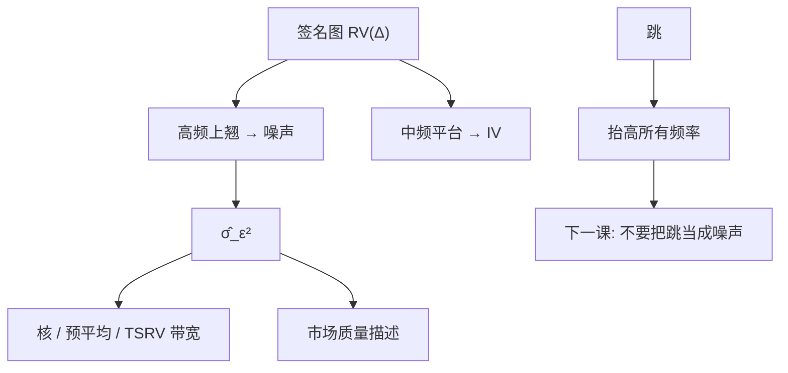

# 噪声方差估计

签名图在高频端的上翘斜率，量的是微观结构噪声的二次贡献；把它估出来，既是市场质量的描述，也是 TSRV、核与预平均的带宽输入。

<footer>—— Bandi and Russell, Separating Microstructure Noise from Volatility, Journal of Financial Economics, 2006；两尺度识别见 Zhang, Mykland and Aït-Sahalia</footer>

[刷新时间](/quant/refresh-time) 改变了有效采样数 $n^*$。[微观结构噪声](/quant/microstructure-noise) 给出 $\mathbb{E}[\mathrm{RV}]\approx IV+2n\sigma_\varepsilon^2$。本课把 $\sigma_\varepsilon^2$ 当成**要估计的参数**：Bandi 与 Russell 讨论用密采样矩分离噪声与波动；TSRV 的密网格项是同一矩。缺口是：$\sigma_\varepsilon^2$ 随日、随股票、随是否用中点而变，固定带宽等于假装噪声水平恒定。下一课把大的剩余（跳）从噪声里分开，并接到新闻时刻。对象先是噪声二阶，不是跳。

## 问题

i.i.d. 加性噪声下，$\mathrm{RV}_n/(2n)\to_p\sigma_\varepsilon^2$（当 $n\to\infty$ 且该项主导 $IV/n$）。有限 $n$ 时 $IV/(2n)$ 污染估计，需减一个稀疏 RV 或用 Bandi–Russell 的最优采样思想同时顾及两者。相关噪声下「$\sigma_\varepsilon^2$」变成短滞后谱，单标量不够，应报噪声的自相关长度或核估计的噪声部分。

问题：用成交价还是中点？成交价含 Roll 弹跳，$\sigma_\varepsilon$ 更大，对应执行；中点更接近报价噪声。Hasbrouck 定价误差方差是另一度量（VAR 分解），与 RV 矩的 $\sigma_\varepsilon^2$ 相关但不等。不要混名为「噪声」。

### 签名图作为估计器

横轴 $\Delta$ 或 $n$，纵轴 RV。高频段线性上翘的斜率识别 $2\sigma_\varepsilon^2$。中频平台识别 $IV$。估计应分两段拟合，而不是用全部频率做一次回归。开盘季节会让「平台」倾斜，先除季节或分段会话。

$\hat\sigma_\varepsilon$ 可与有效价差对照：Roll 说 $\sigma_\varepsilon$ 与 $s/2$ 同阶。数量级对不上时，多半是相关噪声、错数据或网格不是成交时钟。

## 方法

**简单矩。** $\widehat{\sigma}_\varepsilon^2=\max\bigl(0,(\mathrm{RV}^{\mathrm{all}}-\mathrm{RV}^{\mathrm{sparse}})/(2(n-\bar n))\bigr)$。与 TSRV 同源。负值截断。

**Bandi–Russell。** 选择使 MSE 最小的采样频率，隐含噪声与 $IV$ 的权衡；可产出噪声估计作为副产品。最优频率随日变，这正是自适应带宽的理由。

**预平均/核的副产品。** 许多一致 $IV$ 估计量同时一致（或可）估噪声矩。应与主估计同一套清洗和刷新。刷新后 $n$ 用 $n^*$。

**诊断。** 日序列 $\{\hat\sigma_{\varepsilon,t}\}$ 应与价差、深度同向；危机日噪声升。若与 $IV$ 几乎完全共线，可能没分离开（带宽太短，IV 漏进噪声项）。

### 用途

1. 选 $k$、$K$、核 $H$；2. 市场质量横截面（与价差、Hasbrouck 并列）；3. 判断五分钟是否够疏。不要把 $\hat\sigma_\varepsilon$ 当 alpha 信号——它慢变、易被制度改变。

## 机制

密采样下 $\Delta Y\approx\Delta\varepsilon$，平方和数的是噪声二次变差。稀疏时 $\Delta X$ 主导。差的期望隔离噪声。相关噪声：$\Delta\varepsilon$ 的平方和还含 $2\mathrm{Cov}(\varepsilon_i,\varepsilon_{i-1})$ 一类，Roll 负相关会改变系数 2。机制上必须先看收益一阶 ACF：强负是弹跳，应用 Roll 结构；弱相关或正，噪声模型更脏，标量 $\sigma_\varepsilon^2$ 只是有效值。

圆整：价格落在 tick 网格，$\varepsilon$ 有界、非高斯，密采样 RV 的上翘仍在，但渐近公式的常数变。小价格股应报 tick 占价格的比例。

把所有零收益（日历插值）算进 $n$，会把 $\sigma_\varepsilon^2$ 估崩。$n$ 必须是真实更新次数或刷新格数。

### 到跳跃与新闻的交接

噪声是高频、反向、暂时；跳是持久的水平移动。签名图上噪声随频率上翘，跳抬高所有频率的平台。下一课用这个几何把新闻跳从噪声里分开，并接到公告时钟。若把跳日的平台抬高当成 $\sigma_\varepsilon$ 升，会错误加长核带宽、把跳平滑进 $IV$。

## 边界与工程取舍

极薄股票 $n$ 小，分离失败，应放弃密采样噪声估计，只用五分钟当 $IV$、用报价价差当质量。盘前盘后噪声结构不同，不要并入连续竞价样本。

工程：每日估 $\sigma_\varepsilon^2$ 用于自适应带宽；横截面用中位数日。与有效价差对照。不要用未清洗 tick。不要跨日拼接估一个 $\sigma_\varepsilon$。下一课：跳与新闻。

## 小结

- 密网格 RV 主导项是 $2n\sigma_\varepsilon^2$，可识别噪声方差；须用对的 $n$（刷新、真实更新）。
- 相关噪声、圆整、季节会改变系数；标量 $\hat\sigma_\varepsilon^2$ 是有效值，应与价差对照。
- 主用途是自适应带宽与市场质量，不是交易信号。
- 跳抬平台、噪声抬高频端，分离失败会把带宽选错。
- 出处：Bandi and Russell, *Journal of Financial Economics*, 2006；Zhang, Mykland and Aït-Sahalia, *JASA*, 2005；Roll 价差与 Hasbrouck 定价误差为对照度量。
