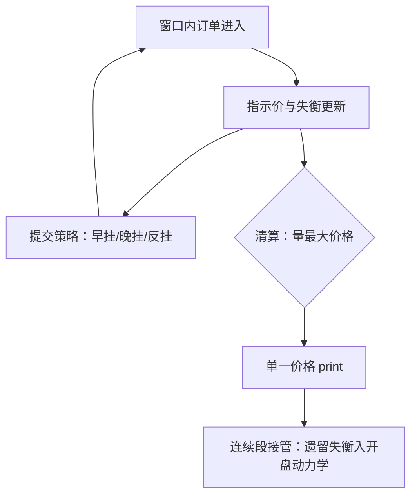

# 竞价阶段的微观结构

竞价把一段时间的信息积累压缩成一次定价：没有时间优先，供需曲线一次相交——用连续市场的直觉读它，条条错位。

<footer>—— 据 Harris, Trading and Exchanges, 2003；Budish, Cramton and Shim, Quarterly Journal of Economics, 2015 整理</footer>

[上一课](/quant/obd-intraday-seasonality)把形状整体搬家登记成制度事件，清单里拍卖规则修改排在最前；日内两端的峰也由竞价造成。本课写这个机制：主干已有 [开盘与收盘集合竞价](/quant/opening-closing-call)、[连续与竞价的取舍](/quant/continuous-vs-auction)与[收盘竞价的设计](/quant/closing-auction-design)；本课深钻竞价内部——指示价与失衡怎么演化、清算价怎么形成、订单怎么博弈，以及把竞价错当连续会错在哪。

## 问题

竞价是单一价格的批量清算：订单在窗口内积累成供需曲线，一次相交出清，没有时间优先。连续段的统计直觉在这里整体失效：竞价 print 是清算价不是边际成交，开盘跳空不是第一笔市价冲击，点差在竞价里没有通常含义。把竞价数据混进连续段的冲击估计、点差统计与毒性度量，第一、二、四课的产出逐项被污染。缺口是给竞价建立自己的口径。

### 指示价与失衡的演化

竞价窗口内可观测的是指示价与指示失衡：每笔新订单进入，理论出清价与未配对方向随之更新。这条更新路径是竞价的「动力学」：信息随订单积累逐步揭示，而非瞬间揭晓。指示失衡是公开的方向信号——自我实现（吸引同向单）又自我限制（吸引反向单），两力的对比决定价格发现效率。指示值的公布时点是信息集跳变：公布前后的提交博弈结构不同。

收盘竞价的成交占比在指数再平衡与衍生品到期日成倍抬升——正是上一课的「形状搬家日」。当普通日平均，收盘峰被系统性高估，且永远查不出原因。

## 方法

建模分三块。清算规则：出清价取成交量最大化价格，同量时的次优价格规则决定边界订单的归宿——规则细节改变行为，跨市场比较先对规则。提交博弈：指示价透明时，早挂暴露意图、晚挂承担不成交风险，尾盘偷袭与反偷袭集中于窗口末端；收盘占比大的市场，指数与被动资金把执行压进竞价，套利者围绕公布的失衡下注。数据口径：竞价订单流单独建事件字典，速率与连续段分开估——第一课按会话分段在这里走到底。批量清算还有一层制度含义：频繁批量拍卖用时间离散化取消竞速，[Budish, Cramton and Shim](/quant/frequent-batch-auction) 的论点——本课把它当作机制光谱的一端。

## 机制

竞价改变信息结构：连续段的订单是边际行动，竞价窗口的订单塑造所有人都看见的指示值——同一笔限价在两种机制里的信息外部性完全不同。价格发现集中的机制：一次性出清让知情单不必怕排队劣势，敢在窗口内放量，开盘竞价因此吸收相当一部分隔夜信息——日内形状开盘峰的来源；收盘竞价吸收指数与对冲需求。开盘后头几分钟由竞价遗留物决定：未配对方向的残余、出清价与共识价的偏离是开盘动力学的初始条件，第一课的耗尽模型从这里起跑。

错误清单：把竞价成交量并进连续 K 线（上一课的三形状互检抓它）；用连续段速率外推竞价期间；忽视指示值公布时点，把公布后的订单激增当新信息；跨市场比较忽略次优价格规则与透明度差异。

## 边界

指示失衡不是承诺：最终出清价可以显著偏离最后指示值，尾盘博弈正是利用这个缝隙。数据粒度受披露制度约束，有的市场只公布快照，演化路径不可观测，对象退化成清算前后两点。竞价占比本身是体制变量：被动化与指数化持续改变它，「收盘形状」是会漂移的对象，历史平均要带截止日。竞价内的成交归因无法做：清算价里分不出边际推动者，冲击归因在这段天然缺位。

## 小结

- 竞价是单一价格批量清算：无时间优先、供需一次出清，连续段直觉在此整体失效。
- 竞价的对象是指示价与失衡的更新路径；公布时点是信息集跳变。
- 竞价数据必须与连续段分开：字典、速率、冲击、毒性全部分口径。
- 批量清算与连续撮合是机制光谱的两端（Budish–Cramton–Shim）。
- 出处：Harris, *Trading and Exchanges*, 2003；Budish, Cramton and Shim, *QJE*, 2015；规则对照见[开盘与收盘集合竞价](/quant/opening-closing-call)。
