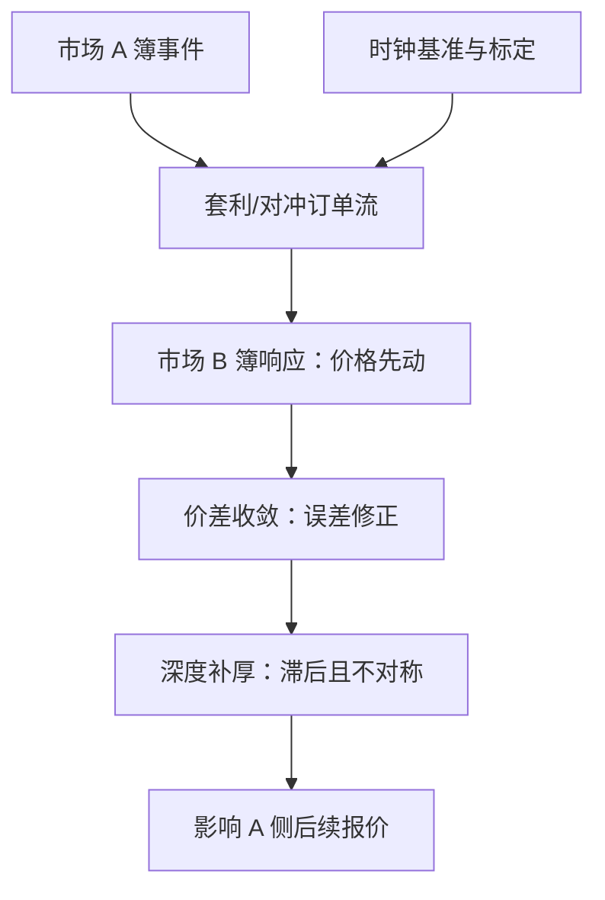
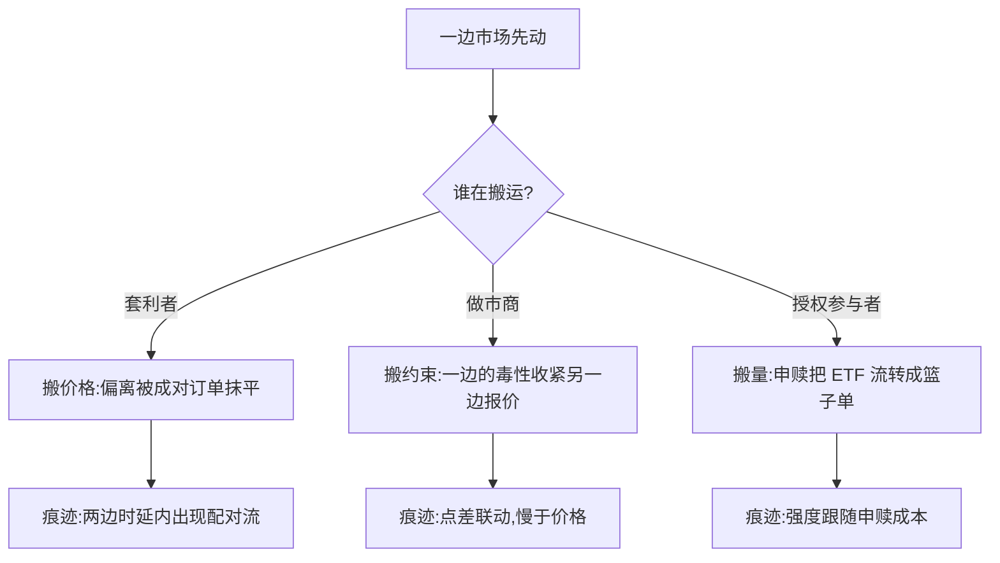

# 跨市场联动与传导

两个市场一起动，可以是共同信息，也可以是一边的簿事件被人搬到另一边——区分这两件事，靠的不是价格曲线，是追踪搬运工。

<footer>—— 据 Hasbrouck, Journal of Finance, 1995；Bouchaud 等, Trades, Quotes and Prices, 2018 整理</footer>

[上一课](/quant/obd-liquidity-common-factors)的共同性还在同一市场的名字之间。本课跨出去：同一标的的多 venue 与期货、现货、ETF 之间的联动传导。主干已有 [指数套利](/quant/index-arb)、[ETF 套利](/quant/etf-arb)、[Hasbrouck 信息份额](/quant/hasbrouck-is)；本课深钻传导的微观渠道——一边的簿事件经由谁、多快、以什么形态出现在另一边的簿上。

## 问题

联动不等于传导。两个市场一起动，最小假设是共同信息，更强主张是机械传递——套利流把偏离抹平。不分渠道的代价具体：lead-lag 被读成「期货发现了信息」，其实只是期货表达成本低；流动性收缩被算进资产相关性，其实做市商在两个市场共用同一本库存约束。识别渠道是核心缺口：价格、流量、流动性三条通道各要各自的证据。

术语翻译：lead-lag 就是「先后脚」——A 市场先动、B 市场隔几毫秒跟着动。但先动不等于发现信息：可能只是 A 的表达成本低（保证金少、不占现货篮子），大家习惯先在那里下注，随后才由套利把价格「搬」到 B。

### 三条通道各自的证据

价格通道：误差修正与协整刻画偏离的收敛速度，[信息份额](/quant/hasbrouck-is)式分解把价格发现归到 venue，证据是方差分解。流量通道：套利与对冲订单流本身可观测——ETF 申赎与篮子交易、期现的反向下单——证据是一边的簿事件与另一边的套利流在时延内对应。流动性通道：点差与深度的跨市场联动比价格慢、恢复不对称——冲击后价格先收敛、簿后补厚，证据是微观量的时序差。

毫秒级 lead-lag 结论对时钟同步极其敏感：两个市场的时戳基准差几十毫秒，「谁领先谁」可以整个翻转。先核对[交易所与经纪商时钟](/quant/exchange-broker-clocks)的口径，再谈先后——这不是修辞，是数据处理的第一步。

## 方法

先立时钟基准：各 venue 的时间戳来源与精度，统一到同一参考，必要时用共同事件（套利成交对）标定偏移。价格层：协整与误差修正给出收敛半衰期；信息份额回答「谁在发现价格」，但份额依赖变量顺序与时延假设。流量层：跨市场的成对订单流（一卖期货、一买篮子）配对追踪，估传导时延与磨损——不是每次偏离都被套利，套利成本决定传导的触发带。流动性层：点差与深度的跨 venue 相关按滞后扫描，确认「价格先、簿后」。三层结论必须相互兼容：流量层的时延应解释价格层的收敛速度与流动性层的补厚滞后。

## 机制

传导的载体是三类人。套利者搬价格：篮子与成分、期货与现货的偏离被他们的订单流抹平，传导速度由套利成本与时延决定，成本高则偏离在带内漂移。做市商搬库存约束：跨市场管理同一本库存，一边吃到的毒性收紧另一边的报价——上一课的共同因子在 venue 间同样成立。授权参与者搬 ETF 的量：申赎机制把 ETF 流量转换成篮子流量，传导强度跟着申赎成本走。三股力叠加，「谁传导给谁」不是常数：常态下期货领导、压力下反向回灌都观测得到。

三类搬运工各留什么痕迹，可以分看：

数字实例：设套利走一圈的总成本（手续费加冲击加保证金占用）是 5 个基点，那么期货与现货偏离在 ±5bp 之内时没人出手——价格看似「失灵」地各走各的，其实是套利触发带内的正常漂移；带子越宽，联动越迟钝。

错法清单：时戳不对齐就跑因果（方向翻转）；把期现 lead-lag 全读成信息优势（低成本表达与保证金机制同样造成先行）；把 ETF 当独立证券，漏掉申赎通道；把不同 venue 的统计合并口径（内部化、汇总规则）当同质深度。

常见误区：初学者容易把协整当成因果——两个价格总回到同一条线上，不代表谁「导致」谁。协整只说「会回来」，因果证据要靠在流量层看到成对的套利订单：一侧成交后，另一侧在时延内出现方向相反的跟进单。

## 边界

传导研究受数据精度硬约束：毫秒以下的结论要求时钟质量超过多数公开数据的能力，超出部分只能存疑。套利流可观测的只是冰山：场内对冲场外的链条在公开数据断线。均衡关系会制度性断裂：涨跌停、熔断与保证金调整会暂时关闭通道，样本单独处理。协整与因子描述收敛，不描述先后因果——因果证据来自流量配对，价格模型只是骨架。

## 小结

- 联动分三条通道：价格（误差修正与信息份额）、流量（套利单配对）、流动性（点差与深度的滞后联动）。
- 时钟基准先行：毫秒级「先后」结论对时戳同步极其敏感。
- 传导载体三类：套利者搬价格、做市商搬库存约束、授权参与者搬 ETF 申赎。
- 次序经验：冲击后价格先收敛、簿后补厚；因果证据来自流量配对，不是协整。
- 出处：Hasbrouck, *Journal of Finance*, 1995；机制与市场语言见 Harris, *Trading and Exchanges*, 2003；套利通道见[指数套利](/quant/index-arb)与[ETF 套利](/quant/etf-arb)。
