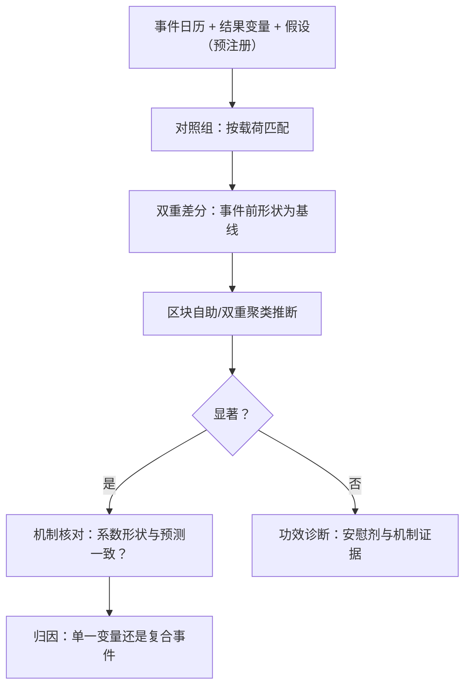

# 事件研究的微观版本

规则类事件改变的不是现金流，是速率方程的系数——结果变量必须换成微观量，对照与机制也落在微观上。

<footer>—— 据 MacKinlay, Journal of Economic Literature, 1997；Harris, Trading and Exchanges, 2003 整理</footer>

[上一课](/quant/obd-hf-vol-noise)把微观读数做干净；本课起进入方法单元：把日频事件研究——主干[事件研究](/quant/event-study)的窗口、正常收益模型与横截面推断——下放到微观事件：tick 调整、撮合迁移、竞价规则修改、费率变化、新 venue。结果变量不再是异常收益，而是前面几课的微观量；「微观版本」的含义就在这：机制同源，对象与推断协议换掉。

## 问题

日频 machinery 不能直接搬。其一，微观结果变量有强日内形状与体制依赖（第五课），前后不控时点的比较里季节性冒充效应。其二，微观数据有强序列相关与横截面相关（第七课的共同因子），横截面独立假设失效，标准误系统性偏小。其三，事件常复合：tick 与费率同日改，单一归因从设计上不成立。缺口是微观版的设计协议：结果变量、对照、推断、功效不足时的出路。

### 结果变量与窗口

结果变量逐一定义在微观量上：相对点差、各档深度、价格发现份额、$\lambda$ 口径、噪声方差、成交强度与竞价占比。窗口多两条约束：避开事件日过渡段——参与者迁移策略需要时间，过渡段既非旧体制也非新体制；对齐日内相位——比较窗口落在形状的同一相位上，否则第五课的形状差异直接进结果。

tick size 分级试点是微观事件研究的天然素材：同日不同组、跨票可比、规则外生。即便如此，两组的事前差异仍要先用历史数据钉死——平行趋势只是口头承诺时，双重差分给出的是精确的错觉。

## 方法

设计四步。定义：事件日历、结果变量、假设方向，预注册口径——「效果好不好」式总结不算数据。对照：同期对照组做双重差分，按载荷匹配（流动性水平、波动、行业）；事件前形状是基线前提——形状不稳（第五课的崩坏清单）就没有干净基线，先剔除搬家日。推断：自相关与横截面相关用区块自助或双重聚类；单次事件功效天然弱，此时报告机制证据——系数变化的形状是否与机制预测一致（tick 变小应主要压缩价差，其次改变深度分布），而非只报显著性。稳健性：安慰剂事件、时移窗口、按体制分层重估。

## 机制

为什么可行：规则类事件改的是速率方程的系数——第一课的 $\lambda$ 族、点差的分布、竞价的透明度——这些量事件前后可测，测的就是机制本身。为什么功效弱：样本常常是「一个市场的同一段历史」，横截面全市场一起变，载荷分散不了。为什么机制证据在功效不足时仍有信息：若价差收窄伴随深度分布搬家而噪声方差不动，这与「tick 约束放松」的机制一致、与「整体流动性改善」的叙事不一致——机制核对让弱功效研究仍有累积价值。这与复盘课同构：判据落在机制上，不落在「显著」上。

错法：前后均值比较不控日内相位与共同因子；过渡段当新体制样本；复合事件声称单一归因；把日频结论（流动性改善）直接当微观机制（点差收窄来自哪一档）。

## 边界

单次事件的因果链永远有缺口：对照再好也排不掉同时发生的未观测变化——机制证据是缓解不是消除。结果变量同源相关（点差、深度与噪声方差，上一课），当独立证据重复计数会夸大确定性。外部有效性受限：规则事件迁移到别的市场，前提是参与者结构相近。产出是速率系数的变化表，不是好坏评价——评价要接回市场质量的目标函数，属制度设计的另一门课。

## 小结

- 换掉三件事：结果变量换成微观量、对照加日内相位与共同因子控制、推断用区块自助/双重聚类。
- 窗口避开过渡段；事件前形状是基线前提，形状搬家日先剔除。
- 单次事件功效天然弱：机制证据（系数形状核对）是主要的累积价值来源。
- 产出是速率系数的变化表，不是好坏评价。
- 出处：MacKinlay, *JEL*, 1997；设计对照见[事件研究](/quant/event-study)；微观口径见 Harris, *Trading and Exchanges*, 2003。
