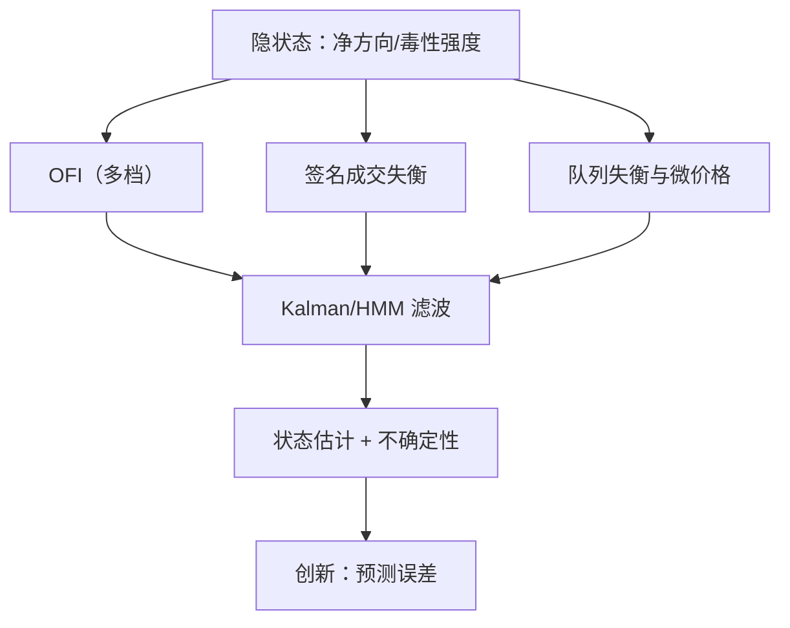

# 订单流的状态空间表示

签名成交量、订单流不平衡与队列失衡说着同一件事，又各自夹带噪声；状态空间不是多一个信号，是把「谁信几分」写成方程。

<footer>—— 据 Cont, Kukanov and Stoikov, Journal of Financial Econometrics, 2014；Hasbrouck, Journal of Finance, 1995 整理</footer>

[上一课](/quant/obd-impact-microfoundations)把冲击钉回簿的状态：同一笔订单流，簿密度不同，响应不同。要在线用起来——报价、执行、毒性检测——得回答「订单流现在处于什么状态」，而所有流量信号都是这个隐状态的带噪投影。本课把订单流写成状态空间：隐状态、观测通道、滤波器。它不是新信号，是把 [OFI](/quant/ofi-toxicity)、签名成交、队列失衡、微价格的最优加权方式写成方程。

## 问题

单一通道直接用都有病。签名成交量被拆单污染，母单碎片与反向单混在一起，符号序列短窗内几乎不可读。[OFI](/quant/ofi-toxicity) 的原始设定只数最优档的增撤成，量在多档间转移时它会漏，跨档跳变更像方向反转。队列失衡看不到冰山，也读不出撤销背后的犹豫。三个通道覆盖的簿事件集不同、误差相关不高——这恰恰是融合的前提。缺口很具体：把多通道观测收成状态估计并给出不确定性；否则手工加权是在拟合回测，权重没有出处。

### 状态定义随任务而定

「订单流的状态」没有唯一答案，定义跟着下游任务走：执行关心短时净方向，做市关心条件毒性强度，研究关心流量的信息含量。同一套滤波机器，状态、观测矩阵与噪声假设不同；本课只管把状态估出来，状态怎么定价是下一课的事。

多档 OFI 是这个框架的第一个收益：把一档扩到前 $K$ 档，在回归里是逐档重新拟合，在状态空间里只是给观测矩阵 $H$ 加几行——「用几档」变成改一行配置，边际权重由滤波自动压低。

## 方法

线性高斯层：隐状态 $x_t$ 按近似随机游走演化，观测 $y_t=Hx_t+\varepsilon_t$，各通道的 $H$ 行把 OFI、成交失衡、队列失衡、微价格偏离写成状态的投影。Kalman 滤波给出每步的估计与方差；噪声比稳定时，稳态增益可离线算成表——它就是各通道的最优权重，来源是信噪比，不是调参。经验基础是 [Cont, Kukanov and Stoikov](/quant/ofi-toxicity) 的观测：中间价变动近似等于 $\beta$ 乘 OFI 加噪声，正是观测方程的形状。状态是离散体制（安静、知情、毒性）时换隐马尔可夫，分布重尾时用粒子滤波。滤波的副产品是创新——一步预测误差，「这笔流量比预期多出多少」的度量，下一课的动态逆向选择就吃它。

## 机制

融合优于单一通道的机制是误差的低相关：OFI 数簿事件，成交失衡数成交，队列失衡看存量，噪声来自不同的行为（拆单、冰山、犹豫性撤销），加权后按方差摊薄，信号按载荷叠加。滤波还给出不确定性。同样一串买单，估计方差大时少动，方差小时才值得重报价；省掉这个开关的系统，会在信号差的时段把噪声放大成动作。稳态增益还有制度解释：数据质量变差（丢包、口径改变）时观测噪声变大，增益应自动变钝；不随噪声重估增益的系统，等于假设数据和标定那天一样干净。

错误形态都很常见：直接吃签名成交量，系统对拆单过反应；只用一档 OFI，大单在二档挂拆时整个漏检；多信号线性相加却不讨论误差共线，权重由回归的偶然决定，换一只票就失效。

## 边界

状态空间是表示，不是因果：把估计出的「净方向」读成知情者的意图，超出了模型承诺。滤波有时滞——状态在动，估计落后半步，冲击响应快的时段这半步就是成本。观测字典依赖数据源：合并行情的聚合规则一变，$H$ 整体搬家，增益要重估。最后，状态估计的验收和队列模型同一口径：不是似然最高，而是下游指标——执行滑点、报价盈亏——在使用估计后变好；验证怎么设计，本课程最后一单元再谈。

## 小结

- 订单流的状态空间表示 = 隐状态 + 多通道观测 + 滤波，本质是把「谁信几分」写成增益。
- 单通道各有盲区：签名成交被拆单污染、一档 OFI 漏多档、队列失衡看不到冰山。
- 稳态 Kalman 增益是各通道的最优权重，来源是信噪比；噪声体制变了增益必须重估。
- 创新是流量的「意外」度量；状态定义随任务而定，验收在下游指标。
- 出处：Cont, Kukanov and Stoikov, *Journal of Financial Econometrics*, 2014；Hasbrouck, *Journal of Finance*, 1995；工程语境见 Cartea, Jaimungal and Penalva, *Algorithmic and High-Frequency Trading*, 2015。
