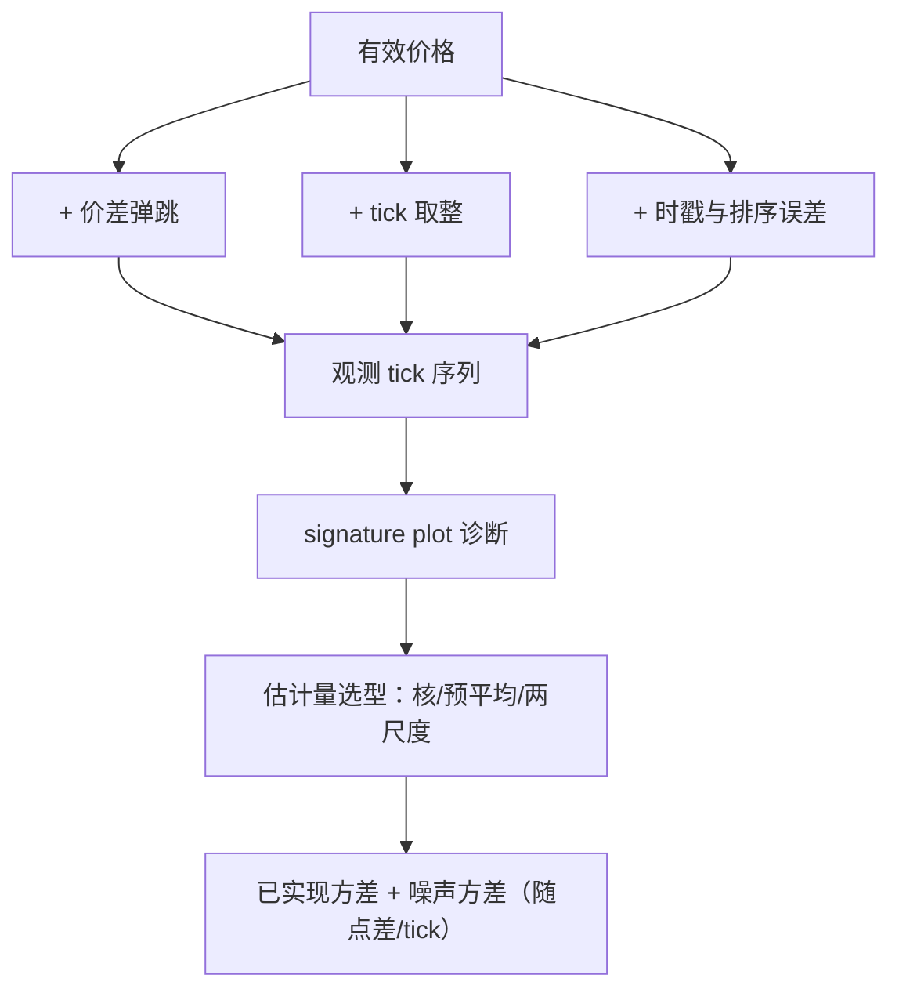
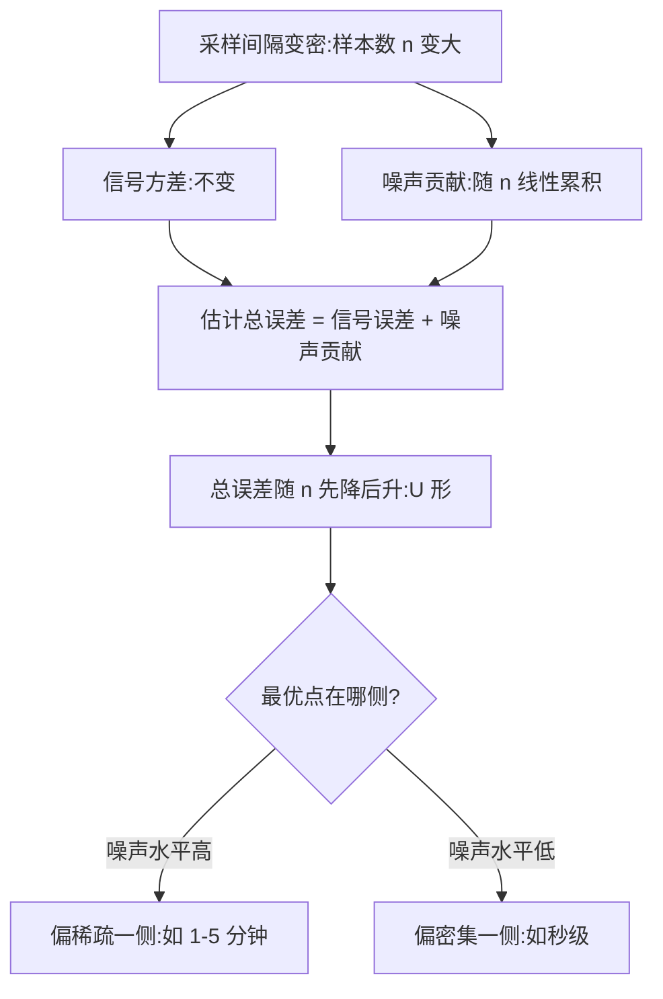

# 高频波动率与微观噪声

采样越密，噪声越多：观测频率不是免费参数，由噪声与信号的相对预算决定，而不是「数据越多越好」。

<footer>—— 据 Aït-Sahalia, Mykland and Zhang, Review of Financial Studies, 2005；Harris, Trading and Exchanges, 2003 整理</footer>

[上一课](/quant/obd-crossmarket-linkage)把跨市场的时钟钉住；本课回到单标的的读数问题：从 tick 读波动率。主干已写过[微观结构噪声](/quant/microstructure-noise)、[已实现波动与噪声](/quant/rv-noise)、[预平均](/quant/pre-averaging)、[两尺度估计](/quant/tsrv)与[已实现核](/quant/realized-kernel)；本课深钻噪声与簿动力学的关系：噪声从哪来、它自己有什么结构、这个结构如何反过来约束估计量的设计。

## 问题

密采样下已实现方差发散：噪声方差随采样频率线性进入估计，五秒收益的「波动率」可以主要不是波动。关键在于，这里的噪声不是仪器误差，而是前八课动力学的叠加投影：价差弹跳是点差动力学的影子（成交轮流打在两侧），取整是价格网格的影子，时间戳错序是撮合与时延的影子。把噪声当要消除的常数误差项，会错过它自己的结构——它有日内形状（开盘点差宽则噪声大），有跨票与跨市场的共同性，这些结构正是它「来自簿」的证据。

数字实例：取整噪声近似均匀分布，单次方差约 tick²/12。采样间隔从 5 分钟缩到 5 秒，样本数从 78 涨到 4680——涨 60 倍，灌进已实现方差的噪声也涨 60 倍，而真实信号方差一分不多。「越密越准」在这里方向恰好相反。

### 噪声模型的层次

MA(1) 是起步假设：噪声与自身滞后一阶相关，对应价差弹跳。更现实一层是依赖噪声：噪声与过去的有效收益相关，取整与时延都会造成。估计量跟着层次走：低噪声短记忆用已实现核，强噪声用预平均或两尺度；谱系与适用区间主干课已比较过，本课只钉选择依据——先诊断、后选型，不把一个估计量用到所有数据上。

术语翻译：MA(1) 噪声就是「只记得上一次」的误差——这笔成交弹到买侧，下一笔多半弹回卖侧，相邻两次误差负相关，隔一次就互不相干。它是价差弹跳最简单的数学画像，也是「短记忆」诊断的分界线。

signature plot 是最便宜的第一诊断：把已实现方差按采样频率画成曲线。若方差随频率单调上翘且不出现平台，说明噪声主导，任何「再密一点会更好」的直觉都该停下——平台的缺失本身就是噪声水平的信息。

## 方法

流程四步。诊断：signature plot 看噪声水平；先按第五课对齐会话——去季节与去噪次序不能反，对未除季节的序列估噪声，开盘的真波动会被记成噪声。选型：按噪声水平与记忆长度选估计量，频率内生——最优采样频率是噪声方差的函数，不是外生常数。噪声方差的估计与使用：估出来的噪声方差本身是输出，[状态空间表示](/quant/obd-flow-statespace)的观测噪声与后面仿真校准课的价格网格参数都吃这个数。跨体制检查：噪声方差按点差与 tick 体制分箱报告，常数假设在此最常出错。

## 机制

噪声-信号权衡在两个方差对频率的不同响应：信号方差不随采样加密增加，噪声方差随样本数线性累积——所以存在内生最优频率，[Aït-Sahalia, Mykland and Zhang](/quant/microstructure-noise) 给出了它的位置。噪声与点差同源：成交落在买侧还是卖侧的随机性、报价更新的粒度，同时生成了点差与弹跳——有效点差估计与噪声方差是同一枚硬币的两面（Hasbrouck 的市场质量口径）。噪声的结构性还意味着它可以条件化：按点差体制分层估噪声，比全局常数更接近生成机制。

两种方差对采样密度的响应方向相反，最优频率就是从这场拉锯里长出来的：

错法：跳过诊断直接定采样频率；噪声方差跨票跨体制搬运；先去噪后去季节把开盘当噪声；把两尺度修正当万能补丁——外推到噪声假设之外照样崩。

常见误区：初学者容易以为「数据精度高就该用满」。实际上越过最优点后继续加密，只是把取整与弹跳的方差往估计里灌；选频率先看 signature plot 有没有平台、在哪弯折，再看数据的名义精度。

## 边界

噪声模型与真实撮合总有层差：依赖噪声之外还有突变成分（大跳价、开盘首笔），稳健估计量覆盖不了全部。噪声方差的估计精度有限：它靠自协方差的高阶项，短样本下抖动大。噪声与基本面波动的分离在极端时段失效：闪崩时段「噪声」与「价格发现」边界模糊，记成哪种结论完全不同。本课的噪声是读数层的，不处理样本选择与数据缺失——那是数据工程的边界。

## 小结

- 微观噪声是簿动力学的投影：价差弹跳、取整、时戳误差各有生成机制，不是白噪声误差项。
- 采样频率内生：噪声方差随频率线性累积，最优频率是噪声水平的函数。
- 流程：signature plot 诊断 → 去季节先行 → 估计量选型 → 噪声方差作为输出回填模型。
- 噪声与点差同源：按点差体制分层估噪声优于全局常数。
- 出处：Aït-Sahalia, Mykland and Zhang, *RFS*, 2005；Hasbrouck, *RFS*, 1993；估计量谱系见[微观结构噪声](/quant/microstructure-noise)与[两尺度估计](/quant/tsrv)。
