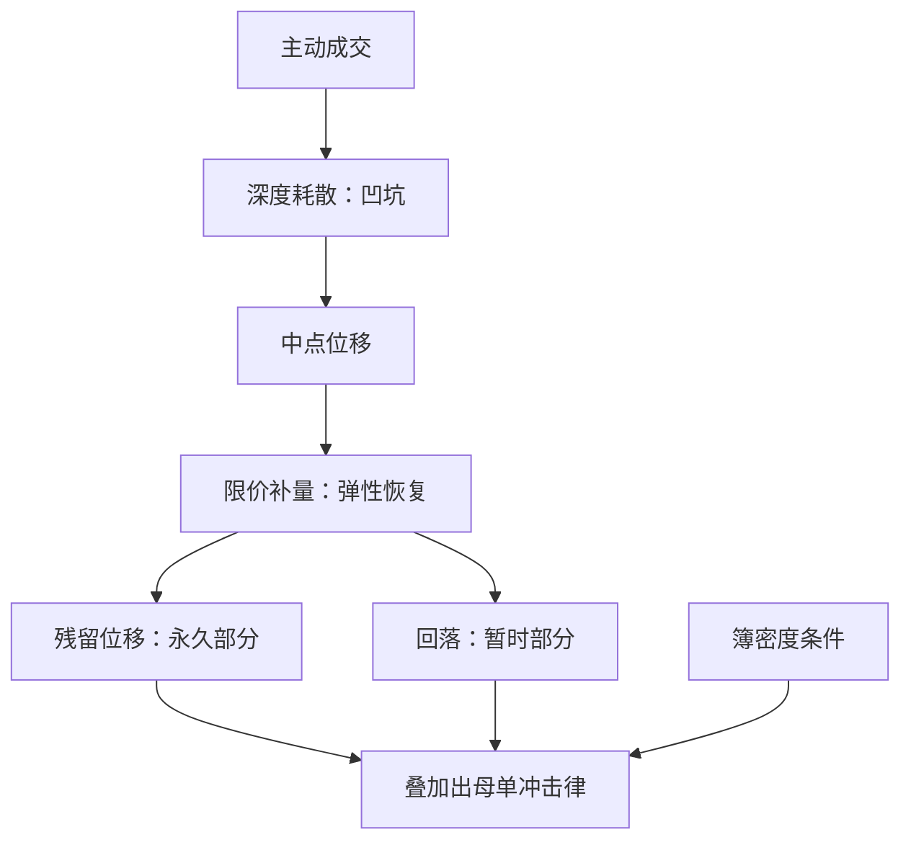
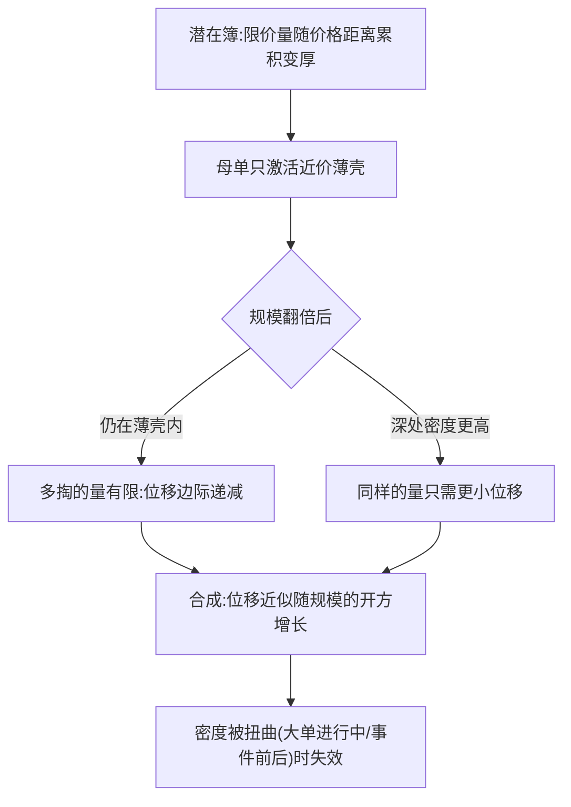

# 价格冲击的微观基础

冲击律是平均意义上的响应函数；要用在某笔订单上，必须回答它对簿上哪个状态量取的平均。

<footer>—— 据 Bouchaud 等, Trades, Quotes and Prices, 2018；Harris, Trading and Exchanges, 2003 整理</footer>

[上一课](/quant/obd-queue-dynamics)把队列动力学的验收钉在一张统计清单上：速率族对状态的依赖、耗尽与补量、存活与自相关。本课把视角从「簿怎么生成事件」转到「事件怎么搬价格」。冲击的两条经验律主干已经讲过：[Bouchaud 传播核](/quant/bouchaud-propagator)的单笔线性响应与[平方根冲击律](/quant/square-root-impact-law)的母单凹性；本课不重推这两条律，而是问它们的微观基础：冲击在簿上是哪个量的函数，机械耗尽与信息更新各占哪一段。

## 问题

把冲击律当成本表用是最常见的错法：同一规模的订单，在簿密度不同的两个日子，价格响应可以完全不同，平均化的冲击律却对两日给出同一个数。缺口不是再找一条更准的经验律，而是把冲击还原到簿的状态：主动成交先吃掉最优档的量（上一课的耗尽），中间价跳，限价补量随后把深度填回，价格一部分回落、一部分留下。这条微观路径的群体平均，就是传播核与母单冲击律观测到的东西。

术语翻译：冲击不是「砸盘」那种新闻用语，而是你自己订单造成的那部分价格位移。冲击律回答「规模翻倍，位移涨多少」——线性律说涨一倍，平方根律说只涨约 1.4 倍；本课问的是这个倍数在簿上由什么决定。

### 机械与信息两条线

冲击有两个来源。[Kyle 模型](/quant/kyle-model)那条线是信息性的：成交被读成信号，做市商按流量调整价格，$\lambda$ 是信息含量的价格。队列动力学这条线是机械性的：量被吃掉、簿变薄、价格因为流动性暂时变贵。经验冲击是两线的叠加，分辨的抓手是回复：机械成分随补量部分回落，信息成分不回头——这与 [Bouchaud 传播核](/quant/bouchaud-propagator)拆分暂时与永久是同一件事。

无套利给这条分解上了锁：Huberman 与 Stanzl 指出，若永久冲击对规模是凹的，来回买卖大单可以无风险盈利——凹性必须主要放在暂时项，永久项保持线性。

## 方法

把一次主动成交写成三步：立即耗散——成交档与邻近档的深度被抽走，剖面出现凹坑；弹性恢复——限价补量按速率族把凹坑填回，价格部分回落；残留——回复停止后的净位移。传播核 $G(\tau)$ 就是这三步在群体上的平均轮廓；母单的平方根来自单笔核在订单流记忆上的叠加与潜在订单簿的临界界面，[平方根冲击律](/quant/square-root-impact-law)那课已经论证。工程上，条件化是关键动作：估计与使用冲击时，把 $Q/V$ 与簿密度同时作为条件。潜在簿模型的检验口径：控制住密度之后，「根号」的残差应当大幅缩水。

## 机制

凹性在簿的密度结构：限价量随距离累积成潜在分布，主动订单只激活它的薄壳，吃的量翻倍不等于穿透翻倍的深度，边际位移递减。衰减在订单流记忆：成交自相关，若响应不衰减，叠加起来价格会超扩散；传播核的幂律衰减正是把流量记忆对冲掉的形状。两条机制合起来也回答了「什么时候它不成立」：密度被外力扭曲（大额母单进行中、事件前后）或流量记忆被制度改变时，薄壳近似与对冲条件先后失效。

平方根的「根号」具体从簿上哪个结构长出来，值得单独画一遍：

数字实例：按平方根律位移正比于规模的开方——下 100 万的位移是基准 c，下 400 万约 2c，下 900 万约 3c。规模翻 9 倍成本只翻 3 倍，多出的空间就是分批执行算法赚的钱；若冲击真是线性的，拆单将毫无意义。

把冲击条件化在簿状态上，是本课对上一课的回报：队列模型给出的深度、价差与补量速率正是冲击函数的自变量。不这么做，用全程平均的冲击律做执行与做市，会在薄簿日低估成本、在厚簿日高估成本。

常见误区：初学者以为执行算法的作用是「躲开冲击」。实际上机械与信息位移都躲不开，只能摊薄——把同样的量摊到更长窗口与更厚簿状态上执行，省下的正是凹性给的那部分差价，而不是让冲击消失。

## 边界

单笔冲击不可识别：观测里混着同时到达的他人流量，能谈的只有平均响应。隐藏流动性让簿密度本身带测量误差，冰山与暗池吸收掉的那部分成交不会出现在凹坑里。自己的订单流有记忆：连续执行时，前面的执行改写后面的状态，冲击律的「其他不变」前提被自己破坏。体制依赖无法用一条曲线吸收：把 $G$ 当不变的换算表，等于宣布参与者结构与簿密度形状恒定——本课给出它在簿上的成因。

## 小结

- 冲击的微观基础是三步：耗散、弹性恢复、残留；经验冲击律是这条路径的群体平均。
- 机械与信息两线叠加，分辨抓手是回复：暂时项随补量回落，永久项不回头。
- 无套利要求凹性留在暂时项、永久项线性（Huberman–Stanzl）。
- 凹性来自潜在簿密度与薄壳激活，衰减来自对订单流记忆的对冲。
- 使用冲击必须条件化在簿密度上：平均律不是成本表。
- 出处：Bouchaud 等, *Trades, Quotes and Prices*, 2018；Kyle, *Econometrica*, 1985；Huberman and Stanzl, *Econometrica*, 2004；市场语言见 Harris, *Trading and Exchanges*, 2003。
