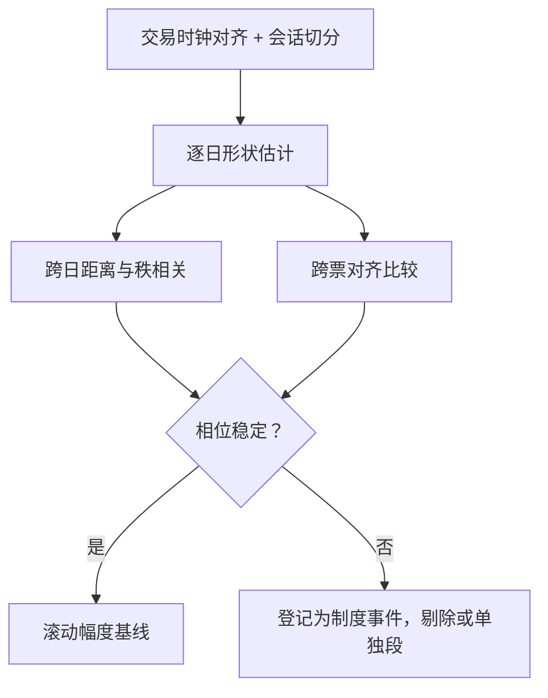

# 日内季节性的稳定形态

日内形状比它的幅度可靠得多：峰谷的幅度随体制伸缩，相位却极少搬家——形状整体搬家那天，多半是规则改了。

<footer>—— 据 Andersen and Bollerslev, Journal of Empirical Finance, 1997；Harris, Trading and Exchanges, 2003；Bouchaud 等, Trades, Quotes and Prices, 2018 整理</footer>

[上一课](/quant/obd-adverse-dynamic)把价差写成状态函数之后，一个被低估的状态变量浮出水面：现在是交易日的几点。波动的日内周期主干在[日内季节性](/quant/intraday-seasonality)讲过：怎么估 $s_i$、怎么去季节。本课进入「截面与时间」单元，把对象换成形状本身——成交、点差、深度、毒性各自的日内形状有多稳定，什么时候整体搬家。分工是：主干课管估计，本课管稳定性。

## 问题

去季节这个动作默认了形状可估且稳。但形状跨日、跨票、跨体制会变：危机年的开盘峰比平常高出一截，被动化改变收盘的堆积，拍卖规则一改，两端形状整体搬家。用不稳的形状去季节，体制变化就埋进残差，下游的 GARCH、跳跃检验、毒性回归全部承接伪持续。缺口不是再估一次 $s_i$，而是回答：形状的哪些性质值得当常数用，哪些必须跟着体制走。

### 稳定什么，不稳定什么

经验上稳定的是相位：成交、点差、深度的峰谷位置——开盘与收盘堆积、会话中段凹陷——由交易时间表与机构流程决定，流程不变则相位不动。不稳定的是幅度：同一只票不同年份的峰高可以差数倍。这条不对称给出使用规则：相位可以当结构写进模型（第一课按会话分段的速率族就是用法），幅度必须滚动估计。形状整体搬家几乎总有制度原因：会话结构调整、tick 与费率改革、拍卖规则修改、参与者结构迁移。

三个形状互检是便宜的诊断：成交量、点差、深度的日内形状应大致同相位。若点差峰与成交峰错开几个格子，多半不是市场现象而是数据问题——竞价成交被并进连续时段，或会话边界切错。

## 方法

先对齐再谈稳定：交易时钟而非墙钟、午休切分、提前收盘日单独处理——口径主干课已立好，本课在其上做三层检验。其一，跨日稳定性：滚动窗内逐日形状对基准的距离分布，秩相关比均方距离更能抵抗幅度漂移。其二，跨票稳定性：个股形状与市场聚合形状对齐比较，大盘与指数的形状通常比小票稳。其三，崩坏检测：规则改动日前后做形状对照，把「形状搬家日」登记成制度事件清单，供下一课与事件研究课使用。

稳定形状是速率方程的基线：第一课的分段强度、第四课毒性的日内先验、后面噪声与事件研究的时间控制，都吃这份形状。崩坏日不进基线：剔除或单独成段，否则形状被极端体制绑死。

## 机制

形状来自日历与流程：开盘承接隔夜信息、做市商重建报价，收盘服务指数与拍卖需求，午间参与率塌陷。稳定性是机构流程惯性的度量——流程不变，相位不变。幅度不稳定的机制是体制：波动、参与率、被动资金占比都乘在形状上，$\sigma_{t,i}\approx s_i\tilde\sigma_{t,i}$ 的相对轮廓稳、绝对水平随体制缩放。读反了会错在哪：把幅度当结构，模型每年重估「结构性」参数；把相位当体制，规则改动后拿旧相位硬套，开盘段全部错位。

## 边界

短样本撑不起稳定性检验：新上市与近年改过规则的品种只能借同市场聚合形状，并声明风险。跨市场不可混估：有午休、竞价制度不同的市场，形状不能平均。公告日是形状内的例外而非新形状：瞬时抬高单列为公告效应，写进 $s_i$ 会污染普通日。形状稳定性是假设而非定理：检验给出「何时可当常数」的判据，给出不了永远。

## 小结

- 本课对象是日内形状的稳定性：相位稳、幅度随体制伸缩，这是使用规则的全部依据。
- 检验三层：跨日距离与秩相关、跨票对齐、规则改动日的崩坏登记。
- 稳定形状的用途：速率基线、毒性先验、事件研究的时间控制；崩坏日剔除。
- 形状整体搬家几乎总是制度事件，应登记成清单供后续课使用。
- 出处：Andersen and Bollerslev, *Journal of Empirical Finance*, 1997；日内剖面见 Bouchaud 等, *Trades, Quotes and Prices*, 2018；估计方法见[日内季节性](/quant/intraday-seasonality)。
