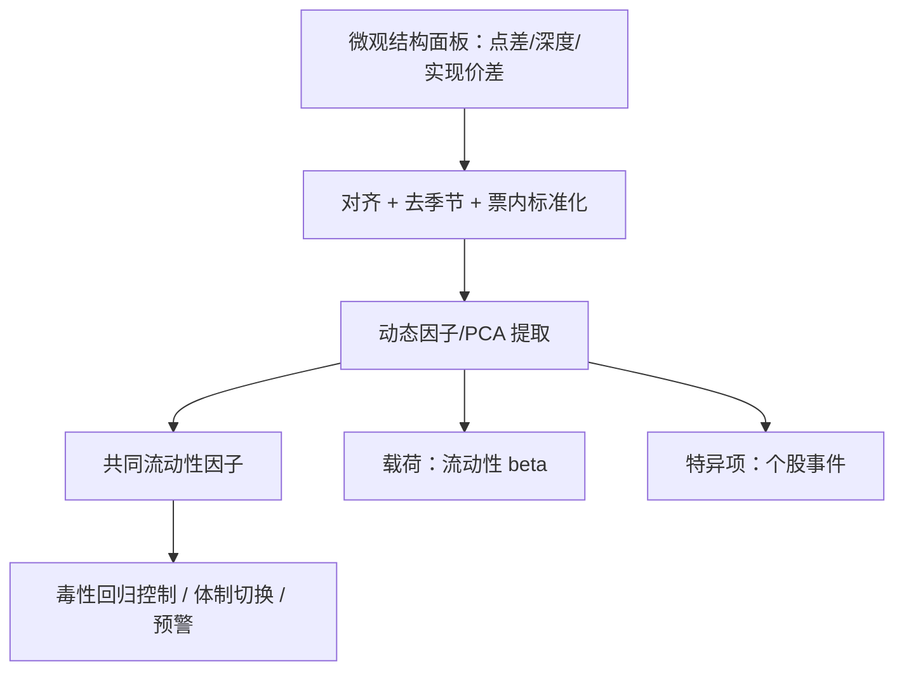
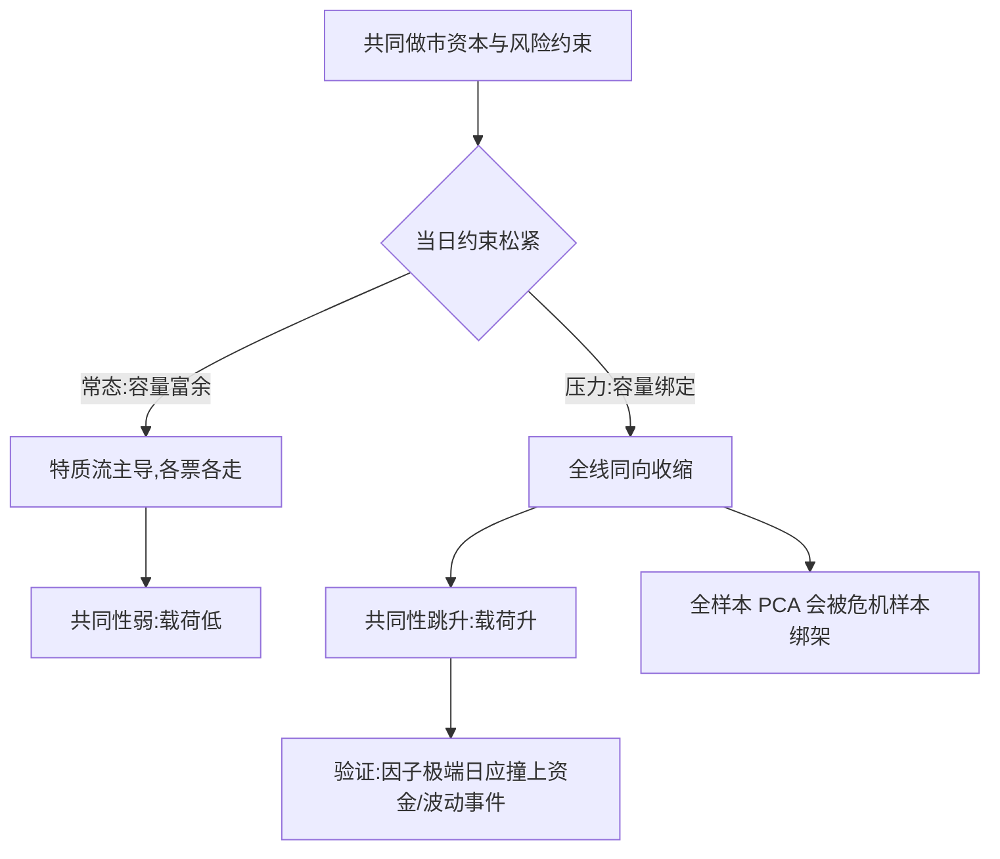

# 流动性的共同因子

点差与深度不是各管各的：同一批做市资本服务着整面墙的名字——把共同变动从单票时序里拆出来，单票的流动性故事才讲得清。

<footer>—— 据 Chordia, Roll and Subrahmanyam, Journal of Financial Economics, 2000；Bouchaud 等, Trades, Quotes and Prices, 2018 整理</footer>

[上一课](/quant/obd-auction-microstructure)把竞价从连续段里分开；本课展开单元的横截面维度，把镜头从单票时间序列拉到整个市场：点差、深度、实现价差、毒性代理的共同变动。资产定价面主干已讲过[流动性因子](/quant/liquidity-factor)与[Amihud 非流动性](/quant/amihud-illiquidity)；本课在微观结构面板上做同一件事——提取共同因子，把单票流动性分解成因子、载荷与特异项。

## 问题

单票点差的时序混杂两层：票面特质（事件、股东结构、注意度）与市场范围的流动性波动（资金面、波动体制、公告日）。不分离，上一课的毒性回归会把市场性收紧记成个股毒性上升，微观事件研究会把共同冲击当成处理效应。资产定价面的因子是日频、代理变量口径的；微观面板是日内、多变量的——把共同性做在高频口径上，才能回答「流动性收缩几点开始、先紧点差还是先掉深度」这类定价面答不了的问题。

术语翻译：流动性 beta 就是「你的票随大盘流动性动的放大倍数」——市场整体点差变宽 10%、你的票跟着变宽 15%，beta 约 1.5。它和收益 beta 一样是载荷，只是载在点差与深度上而不是收益上。

### 测什么、怎么提

面板的列是微观量：相对点差、各档深度、实现价差、成交强度、毒性代理；口径照第五课先对齐（交易时钟、去日内形状），再跨票标准化。提取用动态因子模型或 PCA，载荷就是流动性 beta。关键的经验约束是共同性的时变性：市场下跌与高波动时段共同性显著上升——载荷不是常数，全样本 PCA 会把危机样本的强共同性摊进整段历史，夸大第一主成分的常态占比。

进因子前把点差取对数：点差右偏、票间水平差大，直接用水平值，第一主成分会退化成「高价差票」的哑变量——提取出来的不是共同变动，是横截面分组的影子。

## 方法

流程四步。口径：对齐与去季节照第五课，标准化在票内做（对数或稳健 z 分）。提取：小面板直接 PCA，时变载荷用动态因子或滚动窗；因子个数按截面平均相关的陡降判断，不硬凑。解释与验证：经济来源按三条核对——共同做市资本与资金约束（资金紧则全线收缩）、共同波动体制、共同公告；验证是因子极端日的事件回看：资金事件、大波动日是否落在因子尾部。下游接回：毒性回归加因子控制项，把市场性收紧从个股毒性里扣除；状态空间的噪声体制按因子状态切换。

## 机制

共同性在供给侧：一批做市商、同一池资金、同一套风险约束服务所有名字，约束收紧时没有票独善其身——这是共同性的微观理由，也是它有宏观锚的原因。时变性在容量：常态下约束松、特质流主导、共同性弱；压力下容量绑定，共同性跳升。不完全共同在票面：事件、持仓集中度与特质流量让特异项有真实方差——这层不是噪声，是单票研究该留下的部分。

约束松紧如何决定共同性高低，是时变载荷的机制图：

数字实例：常态下几十只票点差变化的截面平均相关可能只有 0.1 上下，资金紧的日子能冲到 0.5 以上；第一主成分解释的方差占比随之从不到两成跳到过半。把两类日子混进一个全样本 PCA，得到的「平均共同性」哪天都不像。

错法各有形状：用日频 ILLIQ 宣称微观结论（口径错配）；跨票直接平均原始点差（水平主导）；因子提完不复核极端日（只提了统计量，没验证含义）；把特异项当噪声平滑掉（丢掉单票研究的目标）。

常见误区：初学者容易以为流动性是单票属性——「我的票够活跃就行」。压力情景里要问的是：全市场同时收紧时，你的退出成本按流动性 beta 被整体抬升多少；约束是同一池资金给的，没有票独善其身。

## 边界

微观数据的横截面覆盖有限：面板只含高频数据可得的名字，幸存与覆盖偏差进因子。共同性与市场收益双向：跌引起流动性收缩，收缩也压价格——因子模型不自动给出因果。载荷在制度变化处断裂：交易制度改、tick 变，beta 要重估。微观因子与定价面的流动性溢价对接要过频率与口径两道转换，本课的因子不直接就是风险价格。

## 小结

- 微观结构面板上提共同因子：单票流动性 = 因子 + 载荷 + 特异，日频代理是它的低频投影。
- 先对齐、去季节、票内标准化（点差取对数），否则水平差异冒充共同变动。
- 共同性时变：压力时段跳升，载荷非常数，全样本 PCA 会被危机样本绑架。
- 机制锚在共同做市资本与容量约束；特异项是单票故事，不是噪声。
- 出处：Chordia, Roll and Subrahmanyam, *JFE*, 2000；Pástor and Stambaugh, *JPE*, 2003；Acharya and Pedersen, *JFE*, 2005；定价面综述见[流动性因子](/quant/liquidity-factor)。
