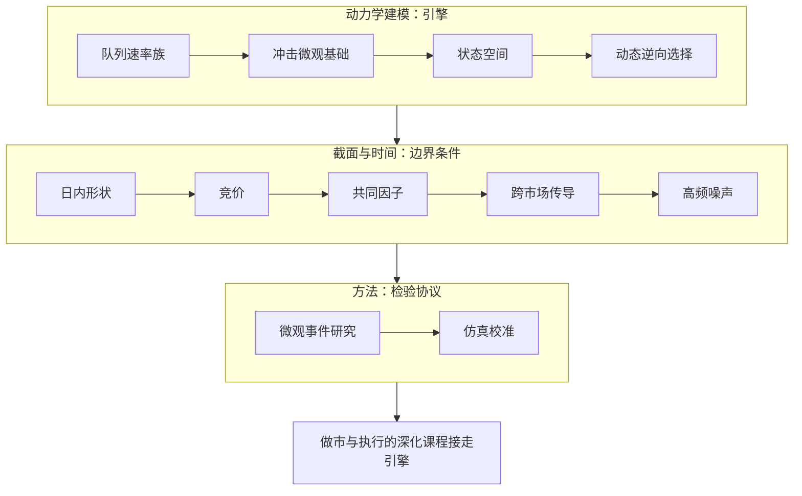

# 订单簿动力学收束

簿的动力学不是一条定律，是一叠互相约束的统计：速率方程、冲击律、噪声与季节，哪一条松了，别的都会替它说谎。

<footer>—— 据 Bouchaud 等, Trades, Quotes and Prices, 2018；Cartea, Jaimungal and Penalva, Algorithmic and High-Frequency Trading, 2015 整理</footer>

[上一课](/quant/obd-simulation-calibration)把校准的纪律收尾：分层对什么、按任务加权、开环与闭环分开。本课收束全课程：把十二课重排成一张地图，重申贯穿的口径，交还边界。做市与执行的深化课程会从这里接走速率方程与冲击函数，那是下一门课的事。本课程到此收束。

## 问题

十二课走完，要收的不是知识点清单，而是三条容易走散的主线。其一，动力学建模单元给了簿的「引擎」：队列的速率族、冲击的微观基础、订单流的状态空间、逆向选择的动态化——一条因果链，拆开用会断。其二，截面与时间单元给了「边界条件」：日内形状、竞价、共同因子、跨市场传导、高频噪声——引擎永远运行其上。其三，方法单元给了「检验协议」：微观事件研究与仿真校准——前面每一课的量都按这两套协议与数据对账。

## 方法

方法同样是收束而不新增：把十二课按「引擎—边界条件—检验协议」三层重排成读序地图，排序本身是论断——方法单元引用的每个量都产自前面的课，引擎的结论必须先于它的边界条件被读。地图之外只交两样东西：三条贯穿口径与三条边界，全是前课已立论命题的汇总。

### 一张地图

按读序重排：

- [队列动力学的建模](/quant/obd-queue-dynamics)：速率族与统计清单。
- [价格冲击的微观基础](/quant/obd-impact-microfoundations)：耗散、恢复、残留，条件化在簿密度。
- [订单流的状态空间表示](/quant/obd-flow-statespace)：多通道观测收成状态。
- [逆向选择的动态版本](/quant/obd-adverse-dynamic)：价差是条件毒性的函数。
- [日内季节性的稳定形态](/quant/obd-intraday-seasonality)：相位稳、幅度随体制伸缩。
- [竞价阶段的微观结构](/quant/obd-auction-microstructure)：批量清算自成口径。
- [流动性的共同因子](/quant/obd-liquidity-common-factors)：因子 + 载荷 + 特异。
- [跨市场联动与传导](/quant/obd-crossmarket-linkage)：三条通道与时钟基准。
- [高频波动率与微观噪声](/quant/obd-hf-vol-noise)：噪声是动力学的投影。
- [事件研究的微观版本](/quant/obd-eventstudy-micro)：结果变量与推断的微观协议。
- [仿真校准：让模型对上数据](/quant/obd-simulation-calibration)：分层校准、任务加权。

## 机制

把十二课压成一个视角：簿的动力学 = 状态 × 速率 × 机制。状态可观测（队列、价差、滤波后的流）；速率是状态的条件函数（$\lambda$ 族、条件毒性、噪声水平）；机制是速率背后的行为与约束（拥挤税、信息不对称、做市资本、制度规则）。每课都在给这个三元组的一个分量装上测量与校验：一、二课装速率与机制，三、四课装在线估计，五到九课钉边界条件，十、十一课钉对账协议。这也解释了排序：引擎先于边界条件，边界条件先于方法——方法单元的每个协议引用的都是前面所有课的产出。

十二课的量互相条件化——冲击条件在簿密度、毒性条件在流状态、噪声条件在点差体制。脱离条件的「数值表」在这门课里不存在，任何抛开条件引用数字的用法都不是这门课的主张。

贯穿口径三条。统计清单先于模型：先写下要对上的统计与容差，再选生成器。条件化先于平均：冲击、毒性、噪声、季节处处是状态或体制的函数，全程平均是最后一项输入。闭环意识贯穿始终：报价改写来流、执行改写簿、仿真里自己的订单是状态的一部分——单向的统计关系在市场里是特例。

## 边界

收束课不新增机制，边界重申三条。可见簿：隐藏量、场外与内部化让每层估计带观测误差，补不进模型。约化：模型承诺「照这个状态行事的历史损失更小」，不承诺对手方的类型与意图。体制：全部系数——速率、冲击、噪声、形状、载荷——都带样本期烙印，制度变更日是共同的失效时刻。深钻层到此为止：主干的完整闭环加本课程的引擎与协议，构成下一阶段课程的全部前提。

## 小结

- 一条主线：队列速率 → 冲击微观基础 → 状态空间 → 动态逆向选择，拆开用会断。
- 一层条件：日内形状、竞价口径、共同因子、跨市场通道、高频噪声，引擎运行其上。
- 一套协议：微观事件研究与仿真校准，把每个量与数据对账；权重来自下游任务。
- 三个口径：统计清单先于模型、条件化先于平均、闭环意识贯穿始终。
- 边界三条：可见簿、约化模型、体制烙印——制度变更日是共同的失效时刻。
- 出处：Bouchaud 等, *Trades, Quotes and Prices*, 2018；Cartea, Jaimungal and Penalva, *Algorithmic and High-Frequency Trading*, 2015；Harris, *Trading and Exchanges*, 2003。
