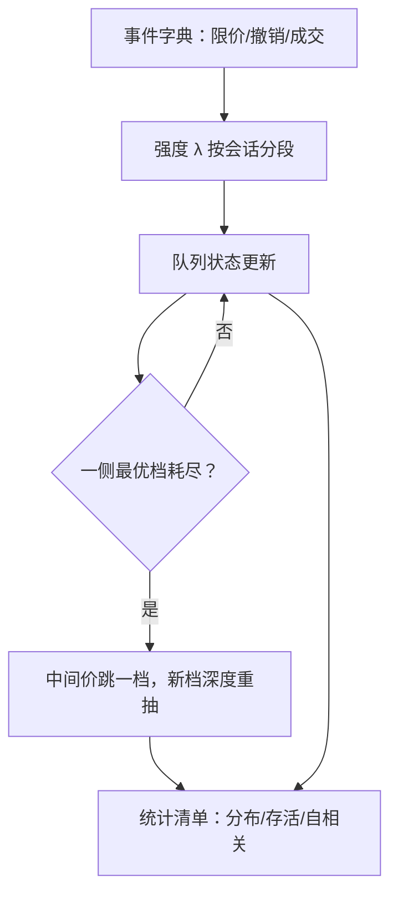
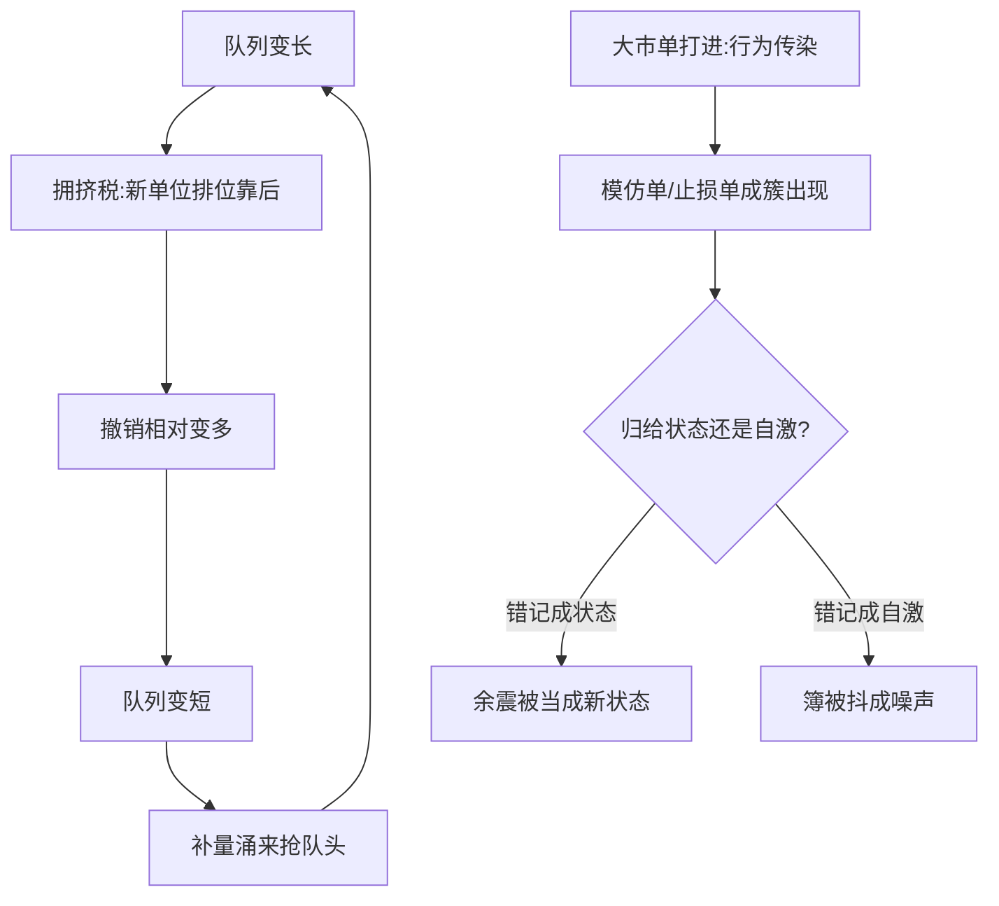

# 队列动力学的建模

队列不是存放存货的仓库，是被三支速率推着走的状态：限价挂进来、撤销抽出去、市价吃下去——每支速率看着队列的长度，再决定下一步。

<footer>—— 据 Huang, Lehalle and Rosenbaum, JASA, 2015；Bouchaud 等, Trades, Quotes and Prices, 2018 整理</footer>

[上一课](/quant/research-postmortem)把研究的闭环收在证据链上：失败与成功同模板归档，死因必须落在判据上，$N$ 的完整性靠台账维持。量化主干至此走完一圈；本课是「订单簿动力学深化」的第一课，主干已交付三块基石：[限价订单簿](/quant/lob-structure)的状态机、[queue-reactive](/quant/queue-reactive) 的状态依赖强度、[Hawkes 订单簿](/quant/hawkes-lob)的时间自激。本课程不重复这些定义，而是把「簿怎么动」本身当对象：先建模队列，再问冲击、订单流与逆向选择，再看截面与时间的稳定形态，最后落到方法。第一课钉住建模目标：一个队列模型要对上哪些可观测量才算合格。后课默认已经读完本课。

## 问题

[限价订单簿](/quant/lob-structure)给出了队列的静态描述，[queue-reactive](/quant/queue-reactive) 给出了第一层动力学：限价、撤销、市价的强度是当前队列长度与价差的函数。缺口在评价标准：估计出 $\lambda^{\mathrm{LO}}(q)$、$\lambda^{\mathrm{C}}(q)$、$\lambda^{\mathrm{MO}}(q)$ 之后，什么叫做「对上了数据」？只匹配平均深度是廉价的合格——强度定错的模型也能在均值上凑对，却在存活时间、耗尽补量、深度自相关上全错；下游的成交概率与逆向选择度量吃的正是这些条件统计，不是均值。

术语翻译：强度 $\lambda$ 就是「下一瞬某类事件发生的速率」——$\lambda^{\mathrm{C}}=3$ 表示此刻每秒平均撤 3 笔；把它写成队列长度的函数 $\lambda(q)$，意思是「队列剩多少个单位时，撤销速率是多少」，这比一个全程平均数多出来的正是状态。

### 要对上的统计清单

建模目标固定成一张清单：队列长度的边际分布；队头存活时间与耗尽概率；吃薄后的补量速度；深度与中点波动的自相关；价差状态的停留时间。任何新的队列模型都按同一张清单交卷，并写明放弃了哪几条。

一个便宜的判别：队头存活时间接近指数，说明给定状态后事件已无记忆，QR 式状态依赖大体够用；显著重尾或成簇，说明还有自激没被状态吸收——先加状态、再谈核。

## 方法

状态取双侧最优档 $(q^{b},q^{a})$ 加价差 $s$，事件字典沿用 [Hawkes 订单簿](/quant/hawkes-lob)的口径：限价、撤销、成交分侧计数，改单拆成撤加增。强度用事件暴露时间估计，不用墙钟采样——稀疏时段会低估强度。价格运动写成耗尽：一侧最优档打到零，中间价跳一档，新档深度从初始化分布里抽。估出来的是按开盘、午间、收盘分段的函数族；日内相位的系统处理留给后课。

自激加不加由数据裁决：控制住 $(q^{b},q^{a},s)$ 之后残差仍成串，再加核。先状态后自激是识别问题：两个通道都有解释力，不分先后就分不清系数，仿真会把余震错误记成状态变化。

## 机制

状态依赖的机制是时间优先下的拥挤税：队列越长，新挂单位排得越后、等待期权越不值钱，撤销相对变多；队列被打薄，补量涌进来抢队头。深度被拉向一个统计上的舒适区间——均值回复是这个机制的产物，不是外加的正则项。自激的机制是行为传染：一笔大市单引来模仿单或止损单，事件在时间上成串。两股力同时存在，分配错了，仿真要么把簿抖成噪声，要么把余震记成新状态。

深度的均值回复是两支速率推出来的平衡，回路本身值得单独看：

直觉类比：把队头想成景点的售票窗口——队太长时，后面的人觉得「轮不到我」陆续离开（撤销升）；队一短，新游客立刻凑上来抢位置（补量升）。深度的「舒适区间」就是这两股人流平衡出来的，不是谁设定的目标值。

这个分配有下游后果：把市价强度直接当自己的填成强度，忽略了「你挂上去之后状态已经变了」；逆向选择也要按队列状态条件化，薄档被吃与厚档被吃的信息含量不同。两个下游话题本课只留接口。

为什么重要：下游成交概率吃的是条件统计——按「队头还剩 3 个位子」算出的成交概率，与按平均深度算的可以差出数倍；均值上合格的模型，在排队与撤单决策上给出的答案可以完全相反。

## 边界

可见队列只是可成交量的下界：冰山让市价强度的观测带低偏，这是数据层次问题，改陡函数补不上。模型是约化的：它不区分知情与否，把 $\lambda(q)$ 读成信念超出识别集。开环仿真只对统计诊断有效；把自己的订单放进去，就进入了被干预的世界，要靠仿真校准的纪律兜底。制度时段、涨跌停与竞价衔接都会改写速率系数，跨段混估等于宣布形状不变。

## 小结

- 队列动力学的建模对象是速率族对状态的依赖，不是一张平均深度表。
- 验收按统计清单交卷：边际分布、存活时间、耗尽与补量、自相关；均值对齐不等于合格。
- 价格运动写成耗尽加新档初始化，中点波动可以是内生产物。
- 可见队列带隐藏量偏差；开环诊断与闭环干预是两个世界。
- 出处：Huang, Lehalle and Rosenbaum, *JASA*, 2015；Bouchaud 等, *Trades, Quotes and Prices*, 2018；状态机定义见[限价订单簿](/quant/lob-structure)。
