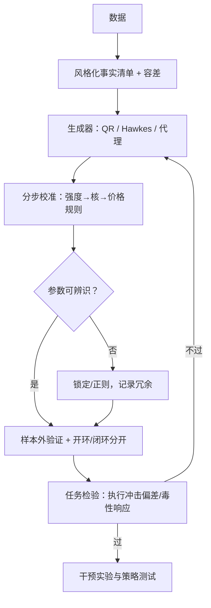
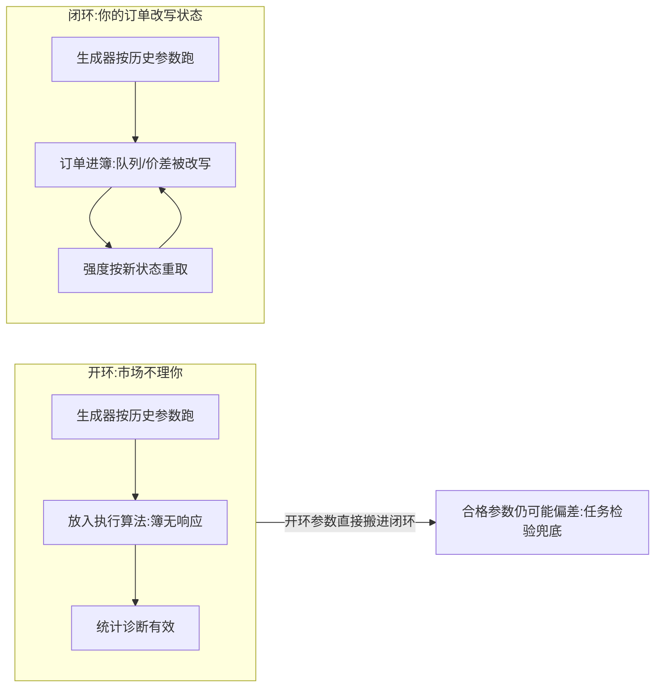

# 仿真校准：让模型对上数据

仿真器不产生数据里没有的信息，只把参数的含义展开成路径；校准问的不是「像不像」，是「对下游要紧的那组统计，像不像」。

<footer>—— 据 Huang, Lehalle and Rosenbaum, JASA, 2015；Bouchaud 等, Trades, Quotes and Prices, 2018 整理</footer>

[上一课](/quant/obd-eventstudy-micro)的自然实验难得，更日常的回路是仿真：让生成器对上数据，再在生成的世界里问「如果会怎样」。主干已写过 [queue-reactive 的仿真](/quant/queue-reactive)、[多代理市场仿真 ABIDES](/quant/abides-simulation) 与[仿真器的冲击偏差](/quant/simulator-impact-bias)；本课把校准当方法讲：分层对什么、拿什么验证、错在哪。

## 问题

仿真器的地位常被摆错成两极：当成比回测更真的世界（它不产生新信息），或当成无用玩具（它恰恰是唯一能做干预实验的世界——放入执行算法，簿会反过来响应）。校准的真问题：模型空间与统计清单都无限长，不可能全对；必须分层规定「对上什么」，按任务规定「放弃什么」。第一课的统计清单在这里升格为校准目标，校准好坏最终体现在下游任务的偏差上——[仿真器的冲击偏差](/quant/simulator-impact-bias)就是生效判据。

术语翻译：校准就是「给模型的旋钮找到让输出对上数据的位置」——先固定要对照的统计清单，再调参数，让仿真算出的同一组统计落进容差。没有清单的调参不叫校准，叫把曲线画好看。

### 校准的层级

层级从低到高：边际统计（点差与深度分布、成交强度、撤成比）→ 联合统计（量价互相关、[OFI 的 $\beta$](/quant/ofi-toxicity)、冲击函数）→ 动力学（深度自相关、传播核、波动聚集）。低层错了会传染高层：强度定错，核怎么调都对不上动力学——第一课「先状态后自激」的次序在校准上的重演。

校准报告的固定三行：对上了哪些统计、放弃了哪些、参数冗余诊断（哪几组参数对同一统计不可分辨）。没有「放弃」一行的仿真报告默认宣称对上了一切——经验上从不成立，也最容易在下一季度数据上现形。

## 方法

流程五步。风格化清单：按目标市场与体制列出要匹配的统计与容差——清单先于代码，否则校准退化成「跑通」。生成器选择：队列级的 QR、点过程级的 Hawkes、代理级的 ABIDES，按问题层级选；代理模型多出的自由度每个都要付校准代价。分步估计：先强度（暴露时间口径），后自激核，再价格规则，每步残差进下一步。参数辨识：不同参数对同一统计冗余时锁定或正则，否则策略结论建在没有唯一解的参数沟里。验证：样本外重跑统计清单；开环诊断与闭环干预分开；任务检验——执行仿真核对实现冲击对[冲击律](/quant/square-root-impact-law)的偏差，做市仿真核对毒性响应的方向与量级。

## 机制

分层的机制：低层统计是高层的生成条件——强度决定什么事件发生，事件流决定上层一切分布与相关，校准必须自底向上；跳层匹配会让上层拟合吸收低层错误，参数从此失去解释。任务加权的机制：全统计对齐不可能，权重唯一合法来源是下游任务——执行研究里冲击函数与深度自相关的一阶矩重要过点差尾部；做市研究里毒性响应量级权重最高。开环与闭环的差别在反身性：开环里市场不理你，闭环里你的订单改写状态，合格参数在闭环里仍可能偏差——这不是校准失败，是两个问题。

开环与闭环到底差在哪一步、为什么合格参数也会偏，对照着看最清楚：

数字实例：若撤成比被校准得差了 30%，跳层拟合会让价格规则的参数把这个缺口悄悄吸收——表面每项容差都达标，参数早已失去解释；任务一换（从执行换到做市），偏差立刻现形。这就是「先强度后核再价格规则」的次序换来的东西。

错法：只对均值（第一课说过，均值对齐最廉价）；校准与验证窗口同源；开环参数直接用于闭环策略测试；隐藏量缺席导致低估冲击、高估打穿；用一次「看起来像」的路径图代替统计验收。

常见误区：初学者容易拿「仿真跑出来的路径长得像真数据」当验证通过。验证对象是统计清单与下游任务偏差，不是某条路径的视觉相似——一条「看起来像」的路径完全可以由错误的参数生成，换一天种子就露馅。

## 边界

仿真不外推机制：换制度后的世界没有校准数据，只能给旧机制参数下的猜测，必须标注。代理层的行为假设不可检验：每个智能体的规则都是未校准的自由度，结论只能落在被校准的统计上。校准有样本期烙印：体制变了要重估，参数不是资产。产出永远是条件句——「若世界仍这样运转，则策略如此」——把条件句读成保证，是方法单元所有课的共同边界。

## 小结

- 仿真器是模型的展开器：价值在干预实验，代价是不产生新信息。
- 校准分层：边际 → 联合 → 动力学；自底向上，低层错误会传染高层。
- 权重来自下游任务：执行看冲击偏差，做市看毒性响应；没有任务的校准没有权重。
- 制度变迁与代理层假设是硬边界：产出是条件句，不是保证。
- 出处：Huang, Lehalle and Rosenbaum, *JASA*, 2015；Byrd, Hybinette and Balch, *ABIDES*；风格化事实图谱见 Bouchaud 等, *Trades, Quotes and Prices*, 2018。
