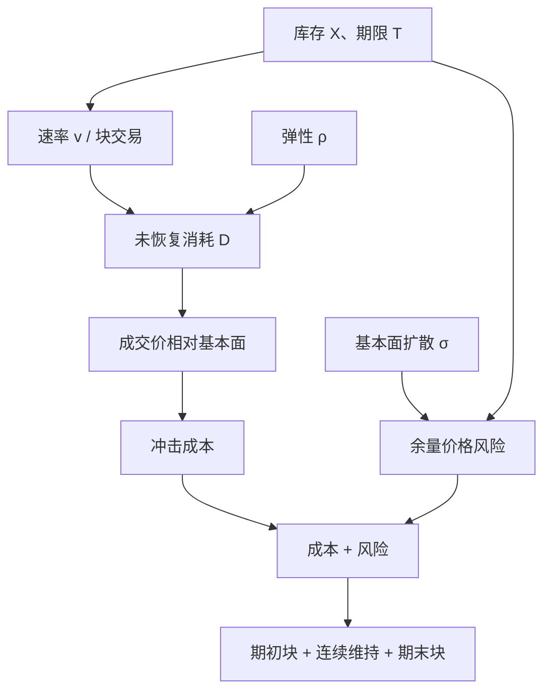

# Obizhaeva–Wang

    
限价簿不是瞬时冲击函数：你吃掉的深度需要时间恢复。最优执行因此在「现在打薄一层」与「等弹性把供给补回来再打」之间权衡，而不是只在速率的二次惩罚里选一条双曲正弦。

    <footer>—— Obizhaeva and Wang, Optimal Trading Strategy and Supply/Demand Dynamics, Journal of Financial Markets, 2013</footer>

[上一课](/quant/implementation-shortfall)把实施缺口定义为纸面组合与真实组合的价值差，参照点是决策价；跑赢 VWAP 既不充分也不必要于缩小 IS。会计尺子还不是簿的动力学。Almgren–Chriss 把临时冲击写成速率的瞬时函数；[瞬时与永久冲击](/quant/temp-perm-impact) 则要求消耗的流动性按核回到簿上。缺口是把这张图写成可解的供给–需求：块状限价簿、指数弹性，交易使价格移动，随后以速率 $\rho$ 回复。最优往往含期初与期末块、中间连续消耗——形状与 AC 的光滑双曲正弦不同。本课写模型对象与校准边界，不是诱单手册。

## 问题

决策时刻要在 $T$ 内卖掉库存 $X$。公开簿在每个价位上有有限深度；吃掉一截，对手方下一单位更贵，同时做市与新限价会把深度补回。若把补回当成无穷快，模型退化成只依赖瞬时速率的 AC 临时项；若把补回当成无穷慢，你面对的是一块几乎永久的深度消耗，最优是尽快或按永久冲击的线性约束交易。真实市场介于两者之间：弹性时间尺度从秒到小时，与你的 $T$ 可比。问题是把「簿的状态」写进执行状态变量，而不只把历史短fall 拟合成 $\eta v$。

OW 的基准设定是单向簿的线性供给：价格冲击与已消耗的「未恢复深度」成比例，未恢复深度以指数 $\rho$ 衰减。基本面价格可以带或不带漂移与布朗运动。风险中性、无漂移时，问题变成确定性控制：何时消耗、消耗多少，使冲击成本最小。风险厌恶或有扩散时，还要权衡余量的价格风险，块交易的大小随之改变。

### 弹性把时间变成流动性的一种形式

深度恢复等价于：同样的速率，在簿厚时冲击小，在刚被打薄时冲击大。因此最优不会是均匀速率——刚交易完应降低速率等恢复，恢复后再加速。这与 POV「市场成交快自己也快」可以相反：市场成交快可能正是簿被消耗、弹性尚未完成的时候。把 OW 轨迹误当成 VWAP，会在恢复半途继续加量，把瞬时冲击当成可忽略的价差。

弹性 $\rho$ 不是波动 $\sigma$。$\sigma$ 是基本面或中点的扩散；$\rho$ 是供需不平衡的衰减。两者可以同时高：消息日价格乱跳，簿却可能很快补回，或完全相反。用 $\sigma$ 去代理 $\rho$ 会把执行状态机校准到错误的时钟上。

## 方法

线性供给与指数弹性下，瞬时价差（相对基本面）近似正比于「尚在恢复中的净消耗」$D_t$：

$$
\dot D_t = v_t - \rho D_t,
$$

成交价相对基本面的偏离 $\propto D_t$（再加可能的永久项）。风险中性、无漂移、线性成本时，变分给出的最优 $v$ 往往在 $t=0$ 与 $t=T$ 各有一笔块状交易，中间 $D_t$ 被控制在一条使边际冲击与等待成本相抵的路径上。直觉：一开始把簿打到「最优的薄度」，然后用连续交易维持该薄度与弹性流入的平衡，最后在截止时刻把剩余库存清掉——截止时刻没有「再等恢复」的价值。这与 AC 线性临时冲击（成本 $\propto\int v^2$、无状态 $D$）的光滑内点解不同：OW 的状态在 $D$，控制在 $v$，块交易来自对 $D$ 的瞬时可控性。

有布朗运动与库存惩罚时，块的大小下降、连续段更前倾，因为等待的风险变贵。把弹性核从指数换成幂律或 Gatheral 一类传播核，闭式块结构一般消失，需解积分方程，见 [Gatheral–Schied](/quant/gatheral-schied)。工程近似是：用指数 $\rho$ 做日内模型，用更慢的核去做跨日永久项，不要强迫一个 $\rho$ 覆盖两个时间尺度。

### 与 Almgren–Chriss 何时同形、何时分叉

若弹性极快（$\rho\to\infty$），$D$ 几乎不积累，冲击只活在当下的 $v$，OW 接近瞬时临时冲击。若再把临时项取成对 $v$ 线性（成本二次），轨迹向 AC 靠拢。若弹性极慢，几乎所有冲击都像永久，轨迹向「尽快交易」或「只付永久项」退化。分叉出现在 $\rho T$ 为中等数量级：AC 仍给出光滑 $x_t$，OW 给出「头尾更重、中间等恢复」。用 AC 校准出来的 $\eta$ 去生成 OW 的块大小，量纲不对——$\eta$ 是速率惩罚，$1/\rho$ 与深度密度才是 OW 的参数。

离散桶实现：每桶选择消耗量，状态 $D$ 按 $e^{-\rho\Delta t}$ 衰减后加上本桶消耗。可加约束：每桶数量上限、拍卖时段不可连续吃簿、涨跌停使供给曲线截断。多资产时各簿有自己的 $D$，交叉影响要通过相关的基本面风险进入目标，而不是假设吃 A 会指数恢复 B 的深度。

## 机制

机制是限价供给的消耗与补充。主动买吃掉卖方队列，可成交价上移；随后新的限价卖、做市补货、部分撤单回补，不平衡衰减。OW 用一条线性供给加一个指数把微观结构收成两个参数：深度密度（供给斜率的倒数）与 $\rho$。真实簿是多层、离散 tick、撤单与隐藏量并存的，线性是投影。隐藏流动性让你实际吃到的比显示 $D$ 多或少，见[冰山与隐藏单](/quant/iceberg-algo)；模型若只看 L2 深度，会低估可恢复供给或高估冲击。

无动态套利的约束仍然在：若恢复之后价格路径允许来回交易抽取确定利润，冲击设定不成立。Huberman–Stanzl 与 Gatheral 要求永久项近线性、暂时项衰减；OW 的指数弹性是暂时项，永久项应单独、线性地加在基本面上，不能把整段平方根冲击都叫做「未恢复的 $D$」。

### 为什么头尾会有块

在截止约束下，期末的影子价格包含「必须出清」的无穷惩罚，最优是在 $T$ 接受当时的供给曲线、一次性打掉余量——这就是终端块。期初块则来自：从 $D_0=0$ 的厚簿起步，把 $D$ 推到最优工作点的边际成本低于把同样的量摊到未来（未来还要承担风险或承担更差的基本面）。中间段像在管理存货管道：流入是弹性 $\rho D$，流出是 $v$，稳态附近 $v\approx\rho D$。没有弹性状态的模型给不出这种管道直觉。

终端块在工程上常被误做成「尾盘市价扫单」。模型里的块是相对于当时供给曲线的最优一次性消耗，仍受深度与参与率约束。把它翻译成竞价或连续市价之前，要先看截止时刻簿是否还在、是否已进入集合竞价。

## 边界与工程取舍

线性供给在大单打穿多层后失效；平方根或凹供给会改变块的存在性。买卖双边、中间价跳档、冰山补量，使 $D$ 不可直接观测，只能从成交相对中点的短期回复来估 $\rho$。估 $\rho$ 要用自己的母单事件研究：冲击后中点（或有效价差）的衰减，而不是用无交易时段的报价波动。样本外核对：按 $\rho$ 分层的实现短fall，以及「若把头尾块改成匀速」的对照。

不要把 OW 的期初块理解成应当在开盘集合竞价倾倒全部风险——开盘的供给曲线与连续交易的弹性不是同一个 $\rho$。不要在拥挤的再平衡日沿用平静日的深度密度。A 股价格笼子、涨跌停让供给截断，$D$ 的线性外推会建议打穿一个并不存在的价位；应把不可交易区间写成硬约束。风险厌恶参数与 AC 的 $\lambda$ 一样必须有单位，否则块大小不可审计。

Obizhaeva–Wang 2013 的贡献是把弹性写成状态，从而得到可讨论的块+连续结构；它不是对所有品种都成立的「最优执行定理」。期货主市场、暗池中点、竞价拍卖要分别建模供给。

## 小结

- Obizhaeva–Wang（2013）用线性供给与指数弹性描述限价簿的消耗–恢复，执行状态含未恢复深度 $D$。
- 风险中性基准下最优常呈期初块、中间连续、期末块；与 AC 光滑双曲正弦不同。
- $\rho T$ 中等时「等待恢复」有价值；$\rho\to\infty$ 则接近瞬时临时冲击。
- 参数是深度密度与弹性，不能把 AC 的 $\eta$ 改名套用。
- 大单、拍卖、涨跌停与隐藏量使线性供给破裂，需离散约束与自身母单校准。
- 出处：Obizhaeva and Wang, *Optimal Trading Strategy and Supply/Demand Dynamics*, Journal of Financial Markets, 2013；对照 Almgren and Chriss, *Optimal Execution of Portfolio Transactions*, Journal of Risk, 2000/2001；弹性与无套利见 Gatheral, *No-Dynamic-Arbitrage and Market Impact*, Quantitative Finance, 2010。
