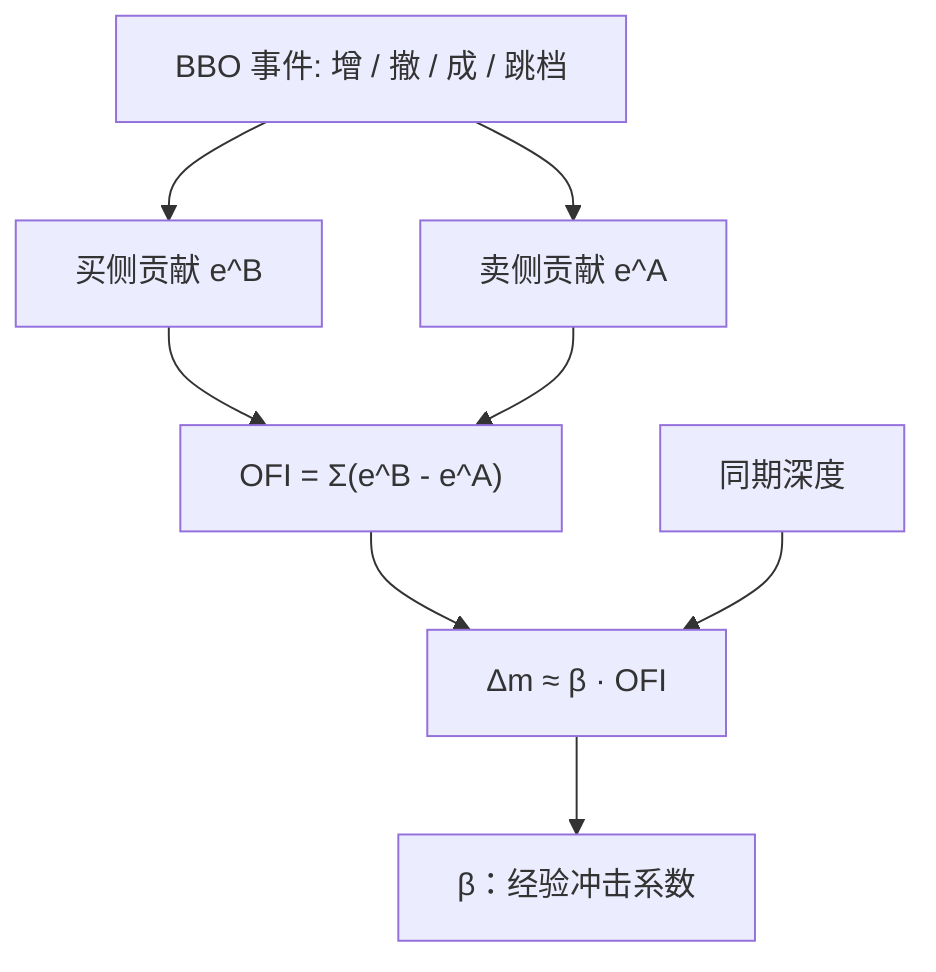

# 订单流不平衡 OFI

中间价的短期变动，很大程度上可以被限价簿事件所定义的订单流不平衡线性解释；价格冲击在这里首先是深度被改写的会计，而不必先假设一个知情交易者。

<footer>—— Cont, Kukanov & Stoikov, The Price Impact of Order Book Events, Journal of Financial Econometrics, 2014</footer>

[上一课](/quant/vpin-realtime)只在等体积桶封口时更新 VPIN；未完成桶按比例提前进入会让最后一截噪声以满桶权重进分子。缺口是短窗中间价的流量定义：存量不平衡与主动买卖差都不是 Cont–Kukanov–Stoikov 的 OFI——真正推动中点的往往是最优档增、撤、成，跳档时会计必须另写。本课钉订单流不平衡及其与 $\Delta m$ 的线性关系。不重讲批量分类。后课撤单率默认 OFI 含限价增撤，不是 Kyle 的市价净需求 $y$。

## 问题

实时 VPIN 是等体积桶上的毒性仪表，短窗中点冲击要的是 BBO 事件流量。把「订单流」理解成主动成交的买卖差，会丢掉未成交的挂撤。把「订单流」理解成整本簿的所有事件，又会把远离 BBO 的噪声算进冲击。短时间内真正推动中间价的，往往是最优档被加厚、削薄或被打穿。需要一个只对 BBO 附近事件敏感、且在档位上跳时仍有明确会计的流量。

线性冲击是第二个问题。Kyle 的 $\lambda$ 作用在总市价净需求上；这里没有做市商的出清公式，只有电子簿的几何。若 $\Delta m \approx \beta \cdot \mathrm{OFI}$ 在秒级到分钟级成立，则 $\beta$ 是「每单位净簿事件对应多少中间价变动」的经验深度倒数。它是否等于知情交易造成的永久冲击，是解释问题；首先要锁定 OFI 怎么从事件里加出来。

### 存量不平衡不是 OFI 的积分

存量 $I_1$ 是快照。OFI 是事件的带符号和。两者相关，因为加买减卖会改变 $I_1$，但撤单、成交、跳档的会计不同：跳档时旧档消失、新档出现，存量可以跳变，OFI 按规则把这次跳记成一笔贡献，而不是把新快照的 $I_1$ 当成流量。用 $I_1$ 的差分去近似 OFI，会在 BBO 跳价时系统性地错。研究里应选定 Cont 等人的事件定义，不要写「不平衡」一词带过。

OFI 也不是 [Kyle](/quant/kyle-model) 的 $y$。$y$ 是提交给做市商的市价净需求；OFI 含限价增撤。限价卖增厚会让 OFI 偏负（卖侧压力），即使没有主动卖成交。把 OFI 的 $\beta$ 直接叫做 Kyle's lambda，类型不匹配。

## 方法

考虑相邻两次簿事件。记最优买价 $P^B$、买量 $q^B$，最优卖价 $P^A$、卖量 $q^A$。Cont 等人对买侧贡献 $e^B$ 的典型规则是：若买价不变，则 $e^B=\Delta q^B$；若买价上升（更优），则 $e^B$ 取新档量；若买价下降（变差），则 $e^B$ 取负的旧档量。卖侧 $e^A$ 符号相反：卖量增加对应负贡献。一笔事件的 OFI 增量是 $e=e^B-e^A$（符号约定以买向压力为正）。窗口 $h$ 内

$$
\mathrm{OFI}_h=\sum_{k\in h} e_k.
$$

中间价变化 $\Delta m_h$ 对 $\mathrm{OFI}_h$ 做回归：

$$
\Delta m_h = \beta\,\mathrm{OFI}_h + \varepsilon_h.
$$

$\beta$ 随窗口与标的而变，通常与同期平均深度负相关：深度厚，同样的净事件推动 $m$ 更少。估计应在事件时间或短时钟窗上进行；把一天收成一个点，线性关系会被体制切换稀释。

### 成交、撤单与跳档要分开记账

主动买成交消耗卖档，$e^A$ 为负的成交量（卖量下降），OFI 为正，与「主动买推高中间价」一致。买侧撤单在价不变时 $e^B$ 为负，OFI 为负。BBO 上跳时，旧买档作废、新买档计入，贡献是水平的替换而不是 $\Delta q$ 的连续差分。实现上必须用事件馈送重建 BBO，而不能用稀疏快照的一阶差分冒充 $e$。多档 OFI 把规则扩到前 $K$ 档，对远离 BBO 的事件衰减；主结果通常仍来自最优档，多档是稳健性而不是另一个因子。

标准化方面，有人把 OFI 除以同期深度，使 $\beta$ 更像无量纲弹性。除完之后，OFI 与存量 $I_1$ 更像，线性回归的 $R^2$ 解释要重说：你可能只是在用深度调整后的流量预测价格，深度本身已进入分母。主回归应报告未除深度与除深度两套 $\beta$。

## 机制

机械机制不需要私有信息。买档变厚或卖档变薄，同样一笔随机主动单更容易把卖价抬高，$m$ 的条件期望上升。OFI 正是在累加这种几何改写。线性关系在深度相对稳定、窗口不太长时像一阶会计：净买向事件正比于对 BBO 的净压力。窗口一长，中间价会因公开信息跳开，OFI 与 $\Delta m$ 的同期相关仍在，但 $\beta$ 不再是稳定的深度倒数，而成了「信息和流量一起动」的混合斜率。

信息机制是：愿意在买侧加限价或在卖侧撤限价的人，可能认为价值更高。于是 OFI 与随后的收益同向，来源是信念。经验上，接下来几十毫秒到数秒，机械冲击占 $R^2$ 的大部分；稍长窗口若仍线性，更可能混入了方向持续与信息。Cont 等人强调的是短窗线性与深度对 $\beta$ 的调节，而不是把 OFI 做成日度 alpha 因子。

### 与带符号成交额的分工

带符号成交额只在成交时动。OFI 在纯挂撤、无成交时也动——而这正是电子盘上大量消息的来源。若价格在无成交时因一侧撤空而跳档，成交额不平衡是零，OFI 非零。微观结构预测应同时报告两者：成交不平衡更接近 Glosten–Milgrom 的观测交易，OFI 更接近簿的瞬时供给。用其中一个去解释全部短窗 $R^2$，会把挂撤驱动的跳价算到「知情成交」头上。

微价格把中间价推向薄的一侧，与存量 $I_1$ 高度相关。OFI 预测的是 $\Delta m$ 或 $\Delta$ 微价格，自变量是流量。不要把微价格变化和 OFI 同时当因变量与自变量还声称发现了新冲击定律——两者共享 BBO 事件。

## 边界与工程取舍

没有 L2 或至少可靠的 BBO 量，OFI 无法按原文计算。L1 只有价没有量的变化细节时，跳档规则退化。隐藏成交会让显示量的 $\Delta q$ 与真实消耗不一致，OFI 被低估。多市场必须先合成或选主通道，否则同一笔在不同交易所的挂撤会重复。窗口与 $\beta$ 的估计样本不能用未来深度去标准化过去的 OFI。

不要把高 $R^2$ 的线性关系当成可交易的无成本预测：同期回归里 OFI 与 $\Delta m$ 共享同一批事件，用当期 OFI「预测」当期价格是会计，不是alpha。可交易性要看滞后 OFI 对后续收益，通常弱得多，且会被价差吃掉。也不要把 OFI 的日度加总拿去替代 [Pástor–Stambaugh](/quant/pastor-stambaugh) 的流动性创新：一个是微观冲击会计，一个是月度共同风险。

真实出处：Cont, Kukanov & Stoikov, *The Price Impact of Order Book Events*, Journal of Financial Econometrics, 2014。盘口存量不平衡是另一统计量；VPIN 用成交量时钟上的买卖分类。三套「不平衡」不要画在同一张图上当复制。

## 小结

- OFI 是最优档（或前 K 档）限价簿事件的带符号流量，含增撤与成交，不是存量不平衡，也不是带符号成交额。
- 短窗中间价变化对 OFI 近似线性，$\beta$ 随深度变陡；同期高 $R^2$ 首先是会计。
- 跳档必须按规则记账，不能用快照 $I_1$ 的差分冒充。
- 滞后预测弱于同期拟合；不要把 $\beta$ 叫做 Kyle's lambda。
- 出处：Cont, Kukanov & Stoikov, Journal of Financial Econometrics, 2014。
