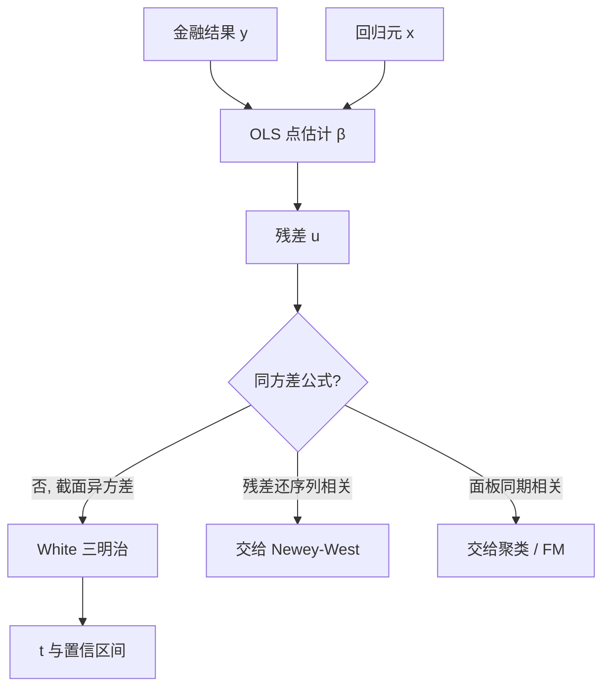

# OLS 与稳健标准误

普通最小二乘的点估计在外生与满秩下仍然可用；一旦残差方差随观测而变，沿用同方差公式算出的 t 值，只是把异方差当成了额外的样本量。

<footer>—— White, A Heteroskedasticity-Consistent Covariance Matrix Estimator and a Direct Test for Heteroskedasticity, Econometrica, 1980</footer>

上一课 [FX last look](/quant/fx-last-look) 把外汇报价权写成可拒绝的期权：成交是否发生、价差是否被选走，都是事后才观测到的金融结果。从本课起，对象从市场设计转到**在这些结果上做推断**。斜率仍用 OLS 去估——White 没有改点估计——但金融残差几乎从不同方差：大市值日、危机日、薄股票日的 $\varepsilon^2$ 差一个数量级。同方差 $t$ 会把「某几天特别吵」读成「系数特别准」。本课只处理截面或可当作独立的异方差；序列相关留给 [Newey–West](/quant/newey-west)，面板聚类留给下一课之后。后课默认：你已经会在金融回归里报 White 稳健标准误，而不是把软件默认的 OLS 标准误当结论。

## 问题

线性模型 $y_i=x_i^\top\beta+u_i$。外生 $E[u_i\mid x_i]=0$、设计满秩时，$\hat\beta=(X^\top X)^{-1}X^\top y$ 仍一致。同方差公式

$$
\widehat{\mathrm{Var}}(\hat\beta)=\hat\sigma^2(X^\top X)^{-1}
$$

要求 $E[u_i^2\mid x_i]=\sigma^2$。金融里这一条先坏：波动聚集、规模异质、事件日方差跳升，都会让 $u_i^2$ 跟着 $x_i$ 或日历走。问题不是「要不要回归」，而是 **$t$ 的分母该不该假装每个观测贡献同样的信息**。

White 的对象是条件异方差下 $\hat\beta$ 的渐近方差，不是改 $\hat\beta$ 本身。把稳健标准误理解成「换了一种估计量」，会和后课的 GMM、分位回归抢对象。

### 金融回归的残差不是实验残差

随机分配的实验里，处理指示与误差方差大致可分。收益对因子、价差对 tick、拒绝率对库存，左边的尺度随市况变，右边的变量往往与尺度相关。大股票的 $\beta$ 估得更准，不是因为模型更好，是因为 $u_i$ 更小。把全部股票等权塞进一次 OLS，点估计被薄股票拉，标准误若再假设同方差，薄股票的噪声会被当成「很多独立证据」。

稳健标准误修正的是方差估计，不修正遗漏变量与反向因果。last look 是否「降低毒性」若用事后拒绝当处理、用同期收益当结果，识别问题仍在；White 只保证你不会用错的精度去宣布一个有偏斜率。

## 方法

**三明治。** White 用

$$
\widehat{\mathrm{Var}}(\hat\beta)=(X^\top X)^{-1}\Bigl(\sum_i x_i x_i^\top\hat u_i^2\Bigr)(X^\top X)^{-1}.
$$

中间是得分的经验二阶矩。异方差时它一致；同方差时多估了一些，效率略差，通常可忽略。有限样本里 $\hat u_i$ 偏小，MacKinnon–White 的 HC1/HC2/HC3 对杠杆点再加权，金融截面（几只极端收益）应默认 HC3 一类，而不是教科书 HC0。

**诊断仍要做。** 稳健标准误不是许可证：先看残差对拟合值、对规模、对波动代理的散点。若方差结构已知（如按成交额加权），加权最小二乘更有效，White 是不知道结构时的保守默认。Breusch–Pagan 在金融里很容易拒绝，拒绝后仍用 OLS+White，而不是改成必须同方差才合法。

**与 [ARMA](/quant/arma) / [GARCH](/quant/garch) 的分工。** 均值方程用 OLS 抽线性关系；若对象是条件方差，应换 GARCH，而不是把平方残差的结构硬塞进 White 再宣布「已经稳健」。White 吃掉的是方差公式的误设，不是均值的动态误设。

### 何时同方差公式就够

日度指数超额对少数宏观意外、样本已按波动标准化、杠杆点已修剪时，两种标准误会接近。接近不是证明同方差，只说明异方差没在这个设计里主导精度。报告应并列两者：若结论只在同方差下成立，结论不成立。

## 机制

OLS 把每个 $x_i u_i$ 加总。同方差时，信息量由 $X^\top X$ 决定。异方差时，大 $u_i^2$ 的观测把总分的波动抬高，却不一定把 $X^\top X$ 抬同样多——尤其当高方差观测的 $x$ 并不更大。三明治的中间项正是在数「得分有多抖」。杠杆点（$x$ 远离中心）若同时是高方差日，会同时污染点估计与精度；HC3 把这些点的 $\hat u_i^2$ 放大，等于承认它们不该被当成普通观测。

机制上这是 M 估计的标准论：估计方程无偏，方差用得分的外积。金融面板稍后会把「独立观测」这条再拆掉；本课先把**截面异方差**从同方差公式里分离出来。

$R^2$ 与 White 无关。高 $R^2$ 的因子回归，α 的 t 仍可能被同期残差相关夸大——那是 [Fama–MacBeth](/quant/fama-macbeth) 与聚类要管的事，不是本课的三明治能代替的。

### 加权、变换与对象

对 $|y|$ 很大的观测做 winsorize，是改点估计；用 White，是改标准误。两者都常用，对象不同。对数收益已经是一种稳定方差的变换，但危机日仍更吵。把收益除以滞后已实现波动再回归，接近加权，此时 White 与同方差会靠近——这是你把异方差模型化了，不是稳健标准误「失效」。

## 边界与工程取舍

White 要求观测在时间或个体上足够接近独立。日收益回归里残差有 [GARCH](/quant/garch) 式聚集，三明治会偏小，必须接到 Newey–West。个股月收益对特征的截面，同期相关是主问题，应接到聚类或 Fama–MacBeth，而不是只开 `cov_type='HC3'`。极少数观测、极高维 $x$，中间矩阵噪声大，稳健标准误会不稳定——应减参数或用 bootstrap。

工程上：默认对所有金融 OLS 开异方差稳健；把同方差作为对照列。不要用稳健 t 去补识别。不要在重叠长期收益上只用 White（见后课重叠观测）。不要把 White 的「通过」写成「残差已独立同分布」。

软件里 `robust` 一词混用 White、HAC、聚类。报告须写清是 HC 哪一档、有没有滞后、有没有按实体聚类。复现失败常常是这一行没写。

## 小结

- 金融 OLS 的斜率在外生下仍可用；坏的是同方差标准误，不是最小二乘本身。
- White 用得分外积估计 $\mathrm{Var}(\hat\beta)$，HC3 一类对杠杆更稳，应作为截面默认。
- 它不处理序列相关、聚类、重叠观测，也不修复内生。
- 与加权、变换、GARCH 的分工：能模型化方差则更有效；不能则用三明治保守报精度。
- 出处：White, *Econometrica*, 1980；有限样本形式见 MacKinnon and White, *Journal of Econometrics*, 1985。
