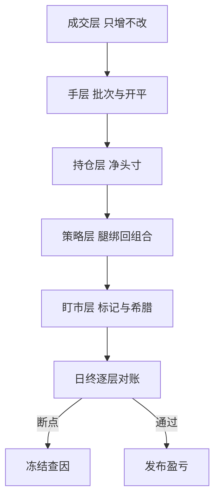

# 期权簿的分层记账

    
账本先于模型：净希腊可以重算，成本与手数不能。轧平那一刻省下的功夫，会在行权、争议与归因那天连本带利还回去。

    <footer>—— 据 Hull, Options, Futures, and Other Derivatives 期权机制与希腊字母各章；分层实务据做市运营整理</footer>

[上一课](/quant/hfs-map)把高频统计深化收束成估计与应用两条线：已实现方差、噪声修正估计量、跳跃检测与频率选择，归档成台上的输入。输入齐了，台子还缺地基：成交以什么身份落账。本课程从簿记讲起，因为后面的波动仓位、限额、曲线与对冲，都默认「每一手成交可被唯一指认」。本课写期权簿的分层，以及为什么不允许只留净数。

## 问题

成交回报只有事实：合约、方向、张数、价格、时间戳、费用。若账上只维护「净持仓加净希腊」，当天下班看似对得上，缺口几天后出现：一笔平仓消的是哪一批老仓位？跨式拆腿后策略盈亏怎么归？到期被指派，空头看涨去哪了？净数账本回答不了——它把「哪一手」这个维度丢掉了。

分层的必要性来自三种后续操作：**已实现盈亏**需要每手成本与平仓配对；**归因**需要策略标签（价差的腿还是裸卖）；**审计与争议**需要不可变的原始层。缺层的后果不是不精确，而是无法回答问题。

### 五层投影

生产账本是一条单向投影链，每层是上一层的确定性函数：

$$
\text{成交层}\to\text{手层}\to\text{持仓层}\to\text{策略层}\to\text{盯市层}.
$$

成交层只增不改。手层给每笔开仓分配批次：开仓价、策略标签、开平指定（opening / closing）。持仓层按合约净出多空，并保留配对规则——先进先出或指定批次，规则一日一定。策略层把腿绑回组合：卖出平值跨式在持仓层是两行，策略层是一行风险。盯市层才是 [希腊字母](/quant/greeks-hedge) 与标记的住址。前置与中台各算一遍，断点必须落在层与层之间，而不是笼统的「对不上」。

被指派的空头看涨不是「仓位消失」：账上要生成一笔按执行价卖出现货的成交，费用并入该批成本；漏记这一步，到期周就有来源不明的盈亏。

## 方法

落账规则按三件事定。其一，**开平指定**：交易所接受 opening / closing 标记，组合单在策略层预登记，腿到齐才成策略，缺腿当天挂「未完成组合」。其二，**配对规则**：FIFO 简单可审计，指定批次用于策略性平仓；规则差异影响已实现盈亏的时间分布，不影响净持仓——净数相同的两个台，明细可以完全不同。其三，**公司行动与到期**：拆股改乘数、除息改 [美式行权边界](/quant/discrete-dividend-am)、[到期行权与指派](/quant/option-exercise-settlement)，都必须以成交级颗粒度写新条目，不改旧数。

日终逐层对账：成交对交易所，手层对前台，持仓对托管，盯市对曲线；断掉的层冻结盈亏发布，不用调整分录硬轧平。

## 机制

分层为什么值得成本：下游每项工作对应某一层的读取。限额与 [希腊聚合](/quant/greeks-hedge) 读持仓层就够；波动账本要到手层，因为不同批次买入的同一执行价可能带着不同的隐波假设；归因要策略层，否则「跨式卖得贵」与「看涨卖亏了」抵消成糊涂账；审计要成交层的时间戳。层间只允许函数关系：报表可以重组，账本不可重放错。

只记净数的台，行权季节发现希腊与成交对不上时，既无法证明错在哪侧，也无法拆分已实现与未实现盈亏，只能全量重放成交救火；而重放的前提，恰恰是成交层从未被污染。

## 边界

场外账本另有法律层（主协议与净额结算），本课不展开；实物与现金交割的到期条目不同，[美式](/quant/american-exercise) 的指派节奏也不同。多腿交易所单由系统拆腿，标签仍需复核；配对规则受税制与监管约束，跨台搬仓要换算。最后，账本不是风险系统：账本回答「持有过什么」，风险系统回答「此刻怕什么」，用账本直接算希腊，是让最慢的一层干最快的活。

## 小结

- 账本是单向投影链：成交只增不改，手层记批次与开平，持仓层净头寸，策略层绑腿，盯市层算风险。
- 净数对账必要而不充分；已实现盈亏、归因与审计分别住在手层、策略层与成交层。
- 行权、指派、公司行动以成交级颗粒度入账，不允许改写历史。
- 配对规则一日一定；规则差异改变盈亏时间分布，不改变净持仓。
- 下一课默认账本已立：波动仓位在手层之上按到期与分位折 Vega。
- 出处：据 Hull, *Options, Futures, and Other Derivatives*；分层与对账实务据做市运营整理。
