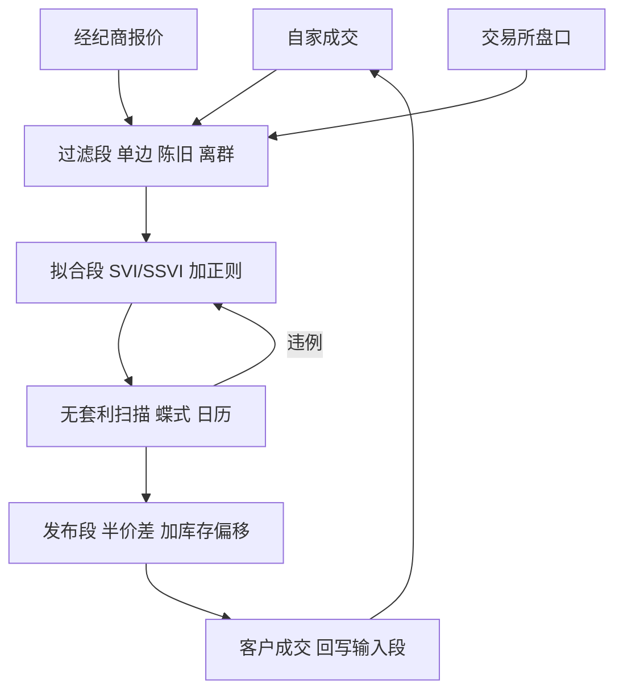

# quoted 曲线的维护

    
做市商不报整条曲面，报的是参数；维护曲线不是拟合科学，是给自家报价装一套有审计轨迹的过滤器。

    <footer>—— 据 Gatheral, The Volatility Surface 曲面参数化各章；报价维护流程据做市实务整理</footer>

[上一课](/quant/omm-greeks-limits)把敏感度折成情景限额，闸门装好了。闸门之外，报价是把市场曲面翻译成自家买卖价的一层：做市台不逐点盯几千个执行价，而是维护参数化切片，从参数导出每档报价。本课写 quoted 曲线的日常维护：输入、过滤、拟合、无套利检查、加价与库存偏移，以及快市里「加宽」与「撤单」的取舍。

## 问题

原始输入是脏的：经纪商报价有单边、有陈旧、有错误；自家成交集中在少数执行价，翼部几天无成交。直接在原始点上插值，一个错价会顺着插值核污染整段执行价；把拟合当回归科学，参数跟着噪声抖动，报价全表重绘。缺的是一条受控管线：从噪声输入到稳定的报价参数，每一步可审计。

第二个缺口是口径：市场曲面与 quoted 曲线不是同一个对象。前者是市场共识的估计，后者叠加了自家库存方向、限额余量与 [存货偏移](/quant/inventory-skew)——同一张 [SVI](/quant/svi-ssvi) 切片，两个台报出的中心与宽度可以不同，且都应该不同。

### 管线四段

**输入段**：自家成交（最可信，因为真的成交了）、双边经纪商报价、交易所盘口，每条带时间戳与可信度权重。[手层账本](/quant/omm-book-layering) 在这里再次发挥作用：成交隐波直接进入拟合，带着批次标签可回溯。**过滤段**：单边价折价、陈旧价按到期桶设 TTL、离群价按与当前切片的距离剔除。**拟合段**：按到期拟合 SVI 切片或直接更新 [SSVI](/quant/ssvi-term-consistency) 骨架，正则化约束相邻两期参数的跳变，见 [无套利参数化](/quant/svi-arb-params)；拟合残差超阈值时宁可部分失效也不硬拟。**发布段**：从参数加半价差生成报价，价差按 Delta 带与剩余时间查表，再加库存偏移与限额状态调整。

TTL 要分桶设：当周切片几秒就陈旧，两年期切片可以撑几小时。用单一 TTL 要么让远期曲线无谓重绘，要么让近端报价挂在昨天的市场上——后者是做市商亏损的经典来源。

## 方法

更新节奏与现货绑定：现货一个有效 tick 未动，曲线不必重拟，只重算贴值档的绝对价格；现货动了，先重排贴值区，再决定是否重拟。[蝶式、日历扫描](/quant/butterfly-calendar-arb) 每次都跑：自家成交落在切片上，等于一次免费校准点；扫描发现违例，回写参数而不是改报价。快市的规则事先写死：波动超过阈值时价差查表自动加宽，限级再升时收缩报价范围（只报核心 Delta 带），最内层才允许整片撤单——撤单是有义务约束的台子的最后手段。

## 机制

管线必须是单向回路：报价发布后，成交是最硬的新信息，绕过成交直接信经纪商，等于让别人的仓位替自己的库存说话。正则化不可省：相邻期限的参数跳变会被 [日历检查](/quant/butterfly-calendar-arb) 抓住，但抓住之前报价已经互相打架，先内后外平仓的客户端可以两头吃。库存偏移的机制来自存货理论：库存偏多的台下移中心、让买价更积极，[Avellaneda–Stoikov](/quant/avellaneda-stoikov) 把它写成库存的指数效用，quoted 曲线是同一机制的执行层。

不这么做会错在哪：没有过滤段，一个 99 的单边报价能把整段翼部拉上去，对手用你的报价对冲自己的库存，你收下一袋子没人要的翼部；没有发布段与输入段的回路，曲线永远在追赶市场而不是引导成交。

## 边界

quoted 曲线只对自己负责：它不是市场共识，不能直接当盯市价用——盯市要回到市场口径与独立的仲裁规则。义务做市的品种，报价范围与响应时间受协议约束，加宽与撤单的自由度比自营台小。翼部流动性差的切片，报价宽度主要由对冲成本与尾部限额决定，而不是拟合优度。最后，维护是跨时段问题：夜盘与跨所标的的曲线接力，TTL 与触发阈值要按时段配置，别把「一天」当成常数。

## 小结

- quoted 曲线是市场曲面加库存与限额的受控投影，与市场共识是两个对象。
- 管线四段：输入带权重、过滤带 TTL、拟合带正则、发布带偏移；每步可审计。
- 自家成交是最硬的校准点，必须回写输入段形成闭环。
- 快市规则事先写死：加宽、缩范围、撤单，三档依次使用。
- quoted 价不当盯市价；义务做市约束报价自由度。
- 出处：据 Gatheral, *The Volatility Surface*；管线与偏移实务据期权做市运营整理。
