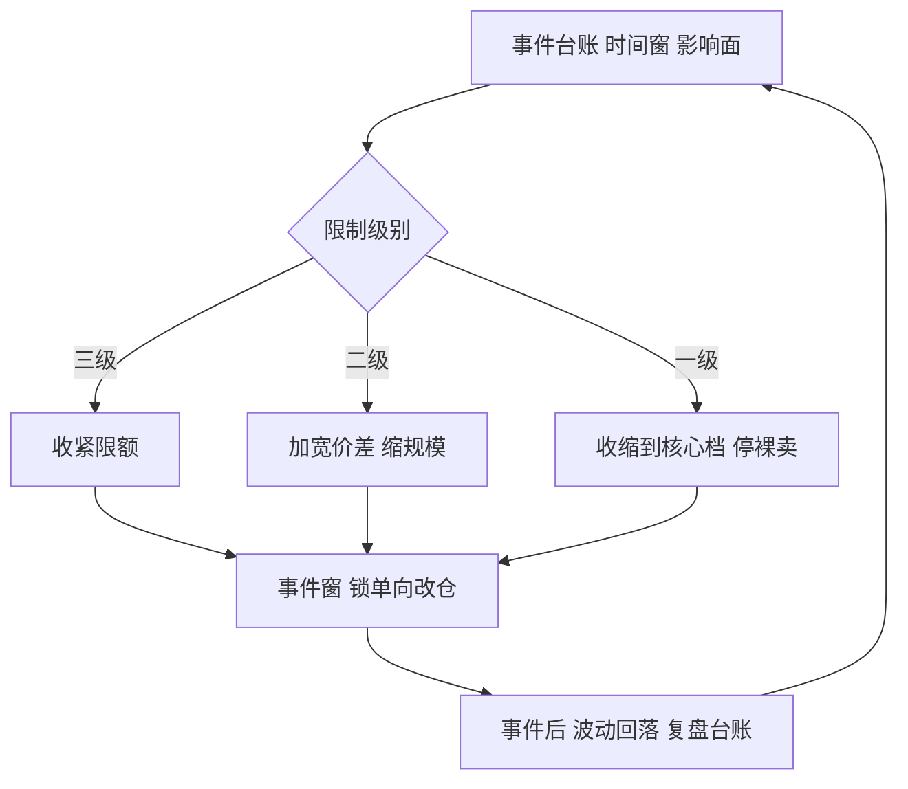

# 事件前的仓位管理

    
跳空平时是尾部，事件周是日程：把风险从「可能发生」改写成「何时、多大、怎么扛」，是事件前管理的全部。

    <footer>—— 据 Hull, Options, Futures, and Other Derivatives 波动率与事件风险相关章节；事件流程据做市实务整理</footer>

[上一课](/quant/omm-hedge-execution)把对冲写成执行规则，规则表里已经出现了「事件前补」这一类。本课把它展开：财报、议息、数据与到期日把跳空变成日历上的确定项，[隔夜跳空](/quant/overnight-gap-hedge) 的损失期望在事件夜放大数倍。仓位管理要回答：事件前减什么、报价怎么改、事件窗怎么锁、事后怎么恢复。

## 问题

事件改写风险的三种方式。其一，分布变形：股价的条件分布从近似连续变成「小动或大跳」的双峰，Gamma 在两次再平衡之间的保护失效，$\tfrac12\Gamma(\Delta S)^2$ 按跳空幅度平方计价。其二，相关性失效：对冲工具与持仓在跳空里脱钩，期货对个股账本的保护打折。其三，流动性收缩：事件前后价差扩到平时数倍，[对冲执行](/quant/omm-hedge-execution) 的参与率上限形同虚设。

做市台的特有问题是报价暴露：事件前客户单边需求最猛——买保护的人集中买看跌。报价不变等于用自家库存接走市场想扔掉的尾部。

### 事件台账

风险系统里先建事件台账：每条事件带时间窗、影响标的、预期幅度与限制级别。预期幅度有市场价格可用：到期横跨事件的平值跨式价格约 $0.8\,S\sigma\sqrt{\tau}$，大致就是市场定价的隐含移动；与内部情景对表，是事件前最便宜的压力测试。限制级别决定动作：三级只收紧限额，二级加宽价差并缩报价规模，一级收缩到核心档并暂停裸卖新仓。

「减仓」要有明细：把净 Gamma 从 2 万减到 5 千，落到执行价上意味着先平贴值到期、再平远期——事件 Gamma 几乎全住在近月。只按总量减、不按期限减的台，事件夜发现减掉的恰是最不危险的仓位。

## 方法

事件前一周：盘点近月到期与事件的重叠，[Pin risk](/quant/pin-risk) 高危执行价提前观察；数字与触碰类暴露单独清点，见 [数字期权](/quant/digital-options) 与 [障碍监控](/quant/barrier-monitoring)。事件前一日：完成减仓与对冲，收盘预留按「事件夜 Charm」而非普通隔夜计算；报价切换到事件档价差。事件窗内：系统锁单向改仓，人工只留对冲与砍仓；已对冲完的账本什么都不做也是策略——事件后的波动回落会惩罚在恐慌顶点买回 Gamma 的人。事件后一日：事件溢价消失使近月隐波下行，[期限桶账本](/quant/omm-vol-position-ledger) 的近月空头回收利润；恢复报价档级、复盘台账，把「预期 vs 实际幅度」写进事件库。

## 机制

为什么按期限分层减仓：事件损失几乎全由近月 Gamma 承担，远月 Vega 只是标记波动。反过来，完全清仓不是最优：事件溢价是波动卖方的收入之一，长期全回避等于放弃整块业务；正确的问题是「在限额内拿多少事件风险」，答案由 [情景限额](/quant/omm-greeks-limits) 给出，而不是由胆量给出。报价侧的机制同理：加宽是在收费承接尾部，撤单是把客户推给对手——义务做市品种的协议会限制后者，自由度边界要事先知道。

不这么做会错在哪：不建台账的台靠记忆管事件，一次多事件重叠日（议息撞到期、财报撞指数再平衡）就能让两个「各自没事」的账本合计击穿限额；事件后不降档的台，则一直用事件价差做生意，把客户全赶到对手那里。

## 边界

台账只覆盖已知日历：地缘冲突、停牌与监管行动没有预告，事件管理对它们无效，兜底仍是 [限额](/quant/omm-greeks-limits) 与资本。隐含移动是市场共识不是预测，把它当内部情景会自我循环；事件溢价的规模随品种与年份漂移，事件库要滚动更新而不是一次性标定。最后，事件是 [波动率期限结构](/quant/vix-term-structure-trade) 上的齿：连续处理事件（把每个事件当一次小展期）与离散处理（事件前后切换档级）是两种风格，混用会让期限桶的盈亏解释失去一致性。

## 小结

- 事件把跳空变成日程：分布双峰、对冲脱钩、流动性收缩，三条都要进预案。
- 事件台账带时间窗与限制级别；跨式价格给出市场定价的隐含移动作对表基准。
- 减仓按期限分层：事件 Gamma 住近月，只减总量的台减错了仓位。
- 加宽是收费承接尾部，撤单是最后手段；义务协议限定自由度。
- 事件后波动回落要降档恢复并复盘台账；未知事件靠限额兜底。
- 出处：据 Hull, *Options, Futures, and Other Derivatives*；事件台账与档级实务据期权做市运营整理。
