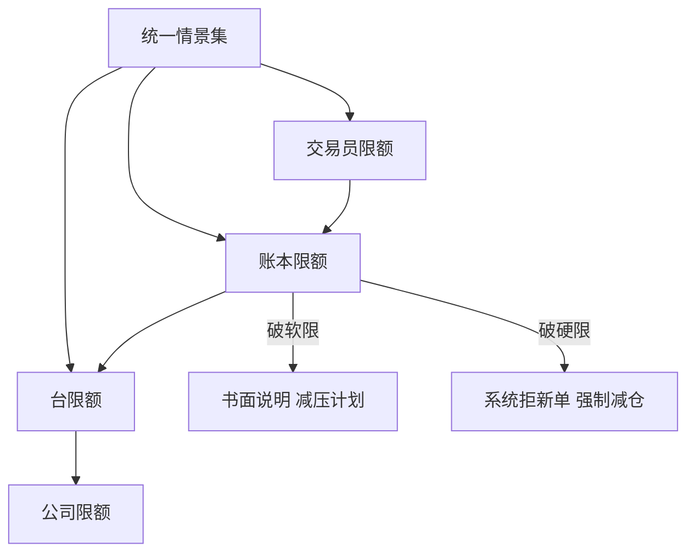
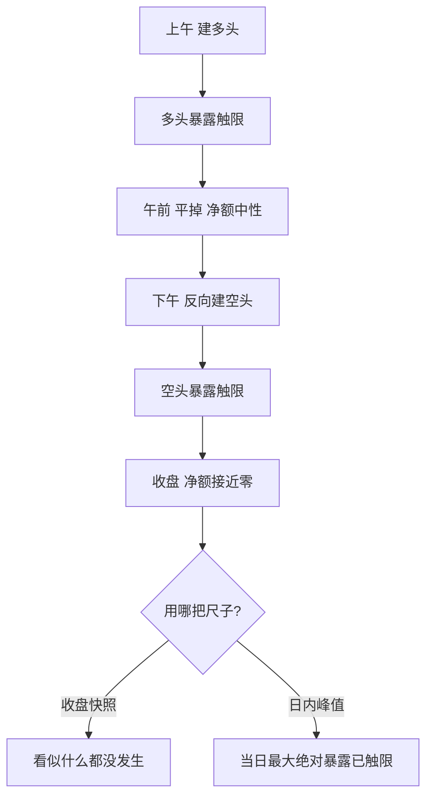

# 敏感度limits与聚合

    
限额不是希腊字母的天花板，是情景损失的天花板；Gamma 本身不可比，可比的是同一次跳空里它值多少钱。

    <footer>—— 据 Hull, Options, Futures, and Other Derivatives 希腊字母与风险管理各章；限额架构据做市实务整理</footer>

[上一课](/quant/omm-vol-position-ledger)把波动仓位折进期限桶，账本从此能读出「持有哪一段波动」。下一问是「允许多大」：每台、每账本、每个交易员允许多大的 Delta、Gamma、Vega 与隔夜损失，跨账本怎么加总，破了限走什么流程。本课写敏感度限额的定义、聚合与治理——它是 [账本](/quant/omm-book-layering) 与报价曲线之间的闸门。

## 问题

裸希腊数字不可比。两千万的 Gamma 在平值短到期上是几次小跳空的量，在深虚值长到期上可能一整年都用不上；Vega 一千万分布在当周还是两年期，含义完全不同。若限额直接钉在希腊数字上，要么形同虚设，要么迫使交易员把仓位藏进限额没有覆盖的维度。缺的是把敏感度翻译成**共同货币**的规则：情景损失。

直觉类比：裸希腊数字像有人用「公斤、米、升」各报各的数，没法比大小；情景损失把它们统统换算成「同一次跳空里值多少钱」这一种货币，限额表才有统一的刻度，藏仓位也无处可藏。

第二个问题是聚合。四个交易员各自限内，加起来可以远超台子的承受力：相加把相关性当一，开根把相关性当零，两种错法都会在压力日兑现。

### 先定情景，再定限额

把限额定义在同一组情景上：例如现货 $\pm 2\%$、$\pm 4\%$ 乘隐波 $\pm 3$ 个点的网格，加上隔夜跳空与到期周专用情景。Gamma 限额写成 $\tfrac12\Gamma(\Delta S)^2$ 的损失上限，Vega 限额写成各期限桶同动 1 个点的上限，Vanna 与 [Charm](/quant/higher-greeks) 折进「跌且波动升」与「现货不动过一夜」的情景。这样不同到期、不同执行价的仓位在限额表里说的是同一种话。

聚合规则要先聚仓位再算损失：把全部账本放在同一个情景里重估，得到总损失；而不是先算各账本的损失再挑一种相关性公式相加。前者对任何相关结构都对，后者只在相关性假设成立时对——压力日恰恰是假设失效日。

## 方法

限额体系四层：公司、台、账本、交易员，上层是下层的聚合加缓冲。每条限额写五要素：度量（哪个情景）、期限（日内、收盘、隔夜）、币种、软硬、审批人。软限破限要当日书面说明与减压计划，硬限破限系统直接拒新单。日内检查按节奏排：开盘前用隔夜情景重估一次，事件窗口另加频率。

聚合分两种口径。同标的净额聚合：同一合约的 Delta 直接抵消，这没有争议。跨标的聚合：用相关性矩阵，但要给「相关性趋一」的压力变体保留一条最严限额——危机里分散化最先失效。到期与 [Pin](/quant/pin-risk) 专项限额独立于日常限额，因为它们的损失发生在容量最小、流动性最差的时刻。

数字实例：Gamma = 5000、现货 100，在 ±2% 跳空档，$\tfrac12\times5000\times2^2=10000$，这一档情景里 Gamma 值 1 万元损失；同一仓位放进 ±4% 档就是 4 万元。损失按跳空幅度平方放大——这正是裸 Gamma 数字看不出危险、必须换算成情景损失的原因。

## 机制

情景化为什么改变行为：交易员优化的是被度量的东西。裸 Gamma 限额催生「把 Gamma 藏进深虚值」的会计游戏——数字变小，$\tfrac12\Gamma(\Delta S)^2$ 在大跳空下不变甚至更大；情景限额使这类替换无处遁形，因为任何形状的仓位都要在同一个网格里报价。这也是 [希腊对冲](/quant/greeks-hedge) 与限额的分工：对冲决定每天交易多少，限额决定被允许持有多少残余。

聚合的机制难点在净额的时效：收盘净额可能掩盖日内两端各自触限的路径——上午多头触限、下午空头触限，收盘看什么都没发生。关键账本要加日内峰值限额，记当天的最大绝对暴露而不是收盘快照。

不这么做会错在哪：只盯收盘净数的台，会在一次午后的单边行情里发现「限额从未被触发、损失却已经发生」；反过来，只盯峰值的台会被正常的往返行情天天误报。两把尺子都要有，且写明谁对哪把负责。

## 边界

情景集是有限维的，真正的尾部（相关结构突变、停牌、[隔夜跳空](/quant/overnight-gap-hedge) 叠加到期）落在网格之外，限额之外还要有 [压力测试](/quant/gamma-flip-level) 与硬性减仓触发。限额不是预测：破限不等于犯错，长期不破限往往说明情景集太松或业务在收缩。度量口径变更（换情景、换桶）等价于改限额，必须走与限额变更相同的审批，否则每一次「技术性调整」都是一次静默的放松。

常见误区：初学者容易把限额当成绩单——「破限 = 犯错，长期不破 = 干得好」。实际上破限可能只是市场走到了情景边缘，触发的是流程而不是处分；而长期从不破限，往往说明情景集定得太松，或者业务量在悄悄收缩。

## 小结

- 限额的货币是情景损失：Gamma、Vega、Vanna、Charm 都折进统一的情景网格才可比。
- 聚合先聚仓位再算损失；跨标的要保留相关性趋一的压力限额。
- 限额分四层，软硬与审批人事先写死；到期与 Pin 用专项限额。
- 收盘净额之外要有日内峰值，路径风险不是快照能看到的。
- 口径变更等于限额变更，走同一审批；长期不破限是情景集太松的信号。
- 出处：据 Hull, *Options, Futures, and Other Derivatives*；情景限额与聚合治理据期权做市实务整理。
