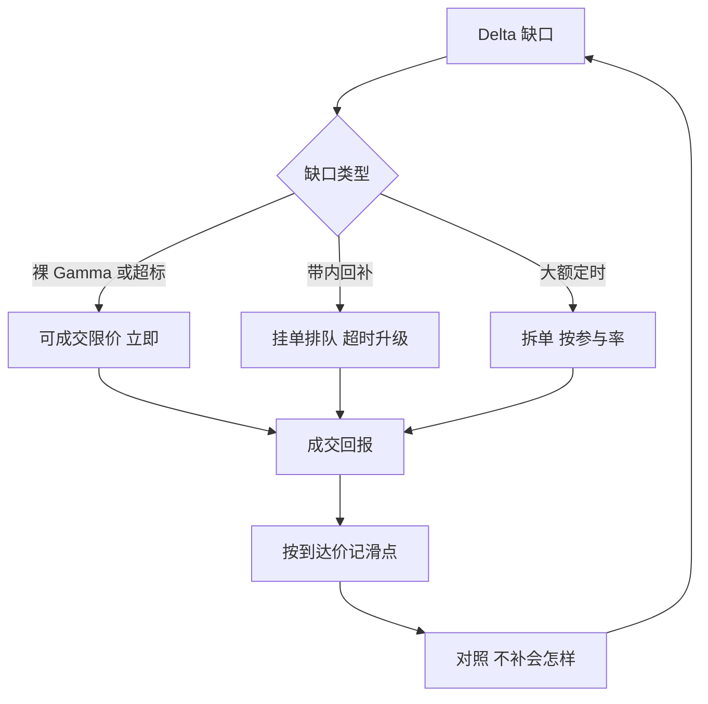

# 对冲的执行细节

    
对冲公式给出的是张数，不是订单；从张数到成交之间损失的每一跳，都直接从波动率边际里扣。

    <footer>—— 据 Hull, Options, Futures, and Other Derivatives 希腊字母与动态对冲各章；执行细节据做市实务整理</footer>

[上一课](/quant/omm-curve-maintenance)把 quoted 曲线维护成受控管线；报价被吃、账上生成 [手层](/quant/omm-book-layering) 批次，同时生成一笔标的缺口。[Delta 对冲频率](/quant/delta-hedge-freq) 回答了「何时补」，本课回答「怎么补」：用什么工具、什么订单、什么节奏把缺口填上，滑点记到哪本账。频率课讲带宽，本课讲带宽内的手艺。

## 问题

公式说补 $\Delta$ 张。执行要回答四个公式没有的问题：用现货、期货还是期权补；用市价单、可成交限价还是挂单；立刻补、按时点补还是触发补；补完的滑点算进哪一笔盈亏。答错任何一条，波动率边际都会被侵蚀——卖出隐波 1 个点的优势，可以在大 Gamma 日的追价里全额回吐，账面显示「波动看对了却没赚到」。

对冲还反向作用于行情：短 Gamma 台的再平衡是买涨卖跌，趋势日里与自身对冲需求同向竞争的单子不止你一家。执行方案必须把「自己也是冲击来源」算进去。

### 工具、订单与节奏

**工具**：现货杠杆与借用成本高、但无基差；期货有保证金效率、有换月与基差；期权补 Delta 会带进新的 Gamma 与 Vega，属于 [Vanna / Volga](/quant/vanna-volga) 那类二阶管理。选择由缺口大小、持有期与可用保证金共同决定。**订单**：缺口必须立即消除（隔夜前的裸 Gamma、事件前的超标）用可成交限价封顶滑点；带内回补用挂单 [按队列位置](/quant/optimal-limit-placement) 等 [成交概率](/quant/cks-optimal-placement)，等不到再升级。**节奏**：到点补（每半小时或收盘）可预测、可摊薄；触带补（Delta 出带才动）省单但慢半拍；两者混合最常见——到点小额、触带大额。

滑点必须按到达价（下单决策那一刻的中间价）记账：一张缺口 500 张的期货单，成交均价比决策时中点差 0.05%，对 5000 点的指数就是 12.5 点，接近隐波十分之一个点。不按到达价记，执行损耗会伪装成「波动没看对」。

## 方法

把执行写成与 [限额](/quant/omm-greeks-limits) 同级的规则表：每类缺口（日内补、收盘补、事件前补）对应工具、订单类型、参与率上限与升级路径。参与率设上限（例如不超过盘口几分钟成交量的固定比例），大单拆 [时间表](/quant/almgren-chriss) 或按 [冲击的传播](/quant/bouchaud-propagator) 分批。收盘补有专门规则：收盘前的缺口按「愿付滑点上限」执行，因为 [隔夜跳空](/quant/overnight-gap-hedge) 的损失期望远大于日内滑点。每笔对冲单事后记三笔账：到达价滑点、费用、以及「不补会怎样」的对照——对照项是校准执行规则的唯一依据。

## 机制

到达价为什么是记账核心：执行质量的度量若挂在「成交均价对比收盘价」上，运气可以顶替手艺；到达价把「决策时刻的中间价」固定为原点，滑点成为可归因、可改进的量。升级路径为什么必须有时限：挂单省的是价差、赌的是排队，短 Gamma 台在趋势里等排队，等于让 $\tfrac12\Gamma(\Delta S)^2$ 每分钟生长——时限是价差节约与 Gamma 损耗的换算，写进规则而不是留给盘感。

期货与现货的换算也要进机制层：Beta 调整、股息与借券成本折算、换月日的双腿，任何一处口径不一致，Delta 就不是账本以为的那个 Delta。到期周还要把 [离散对冲误差](/quant/discrete-hedge-error) 的量级记在心上：误差是平方根级的，滑点预算应与之同阶。

不这么做会错在哪：没有滑点台账的台，执行规则永远在「感觉上还行」的状态；有台账但不做对照的台，会把好年景的运气当成好规则，直到一次大跳空把差异摊开。

## 边界

对冲执行不解决概念错误：用期权补 Delta 带进二阶暴露，那是 [Vanna / Volga](/quant/vanna-volga) 的课；流动性枯竭日参与率上限形同虚设，规则表要有「不可执行」分支——宁可持仓过夜也不追一口价，是限额问题不是执行问题。停牌与熔断类机制下，最好的订单也发不出去，事件前削减才是唯一的对冲。最后，执行数据本身要进 [账本](/quant/omm-book-layering)：时间戳到毫秒，否则到达价无从谈起。

## 小结

- 频率课定带宽，本课定带宽内的手艺：工具、订单、节奏、记账四件事。
- 立即消除的缺口用可成交限价封顶滑点；带内回补挂单排队，超时升级。
- 滑点按到达价记账并做「不补会怎样」的对照，执行规则才有校准依据。
- 参与率上限与拆单是对自己冲击的控制；收盘补按愿付滑点上限执行。
- 工具换算（Beta、借券、换月）错一处，Delta 就不是账本的 Delta。
- 出处：据 Hull, *Options, Futures, and Other Derivatives*；到达价与执行规则据做市实务整理。
