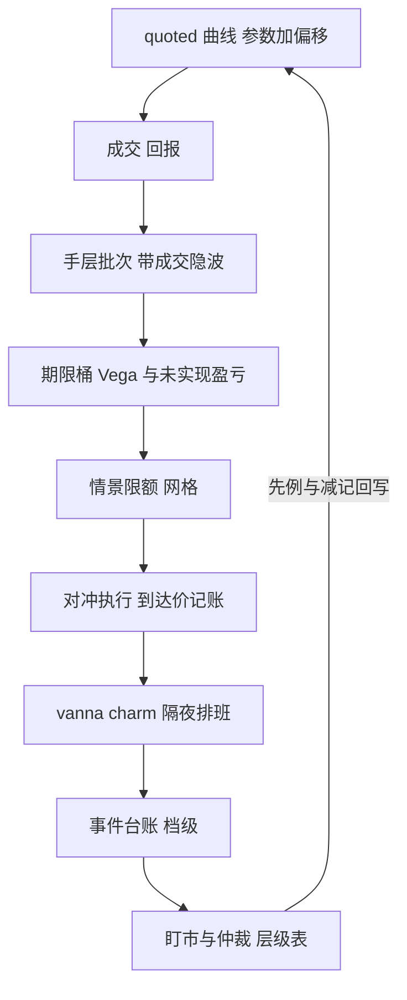
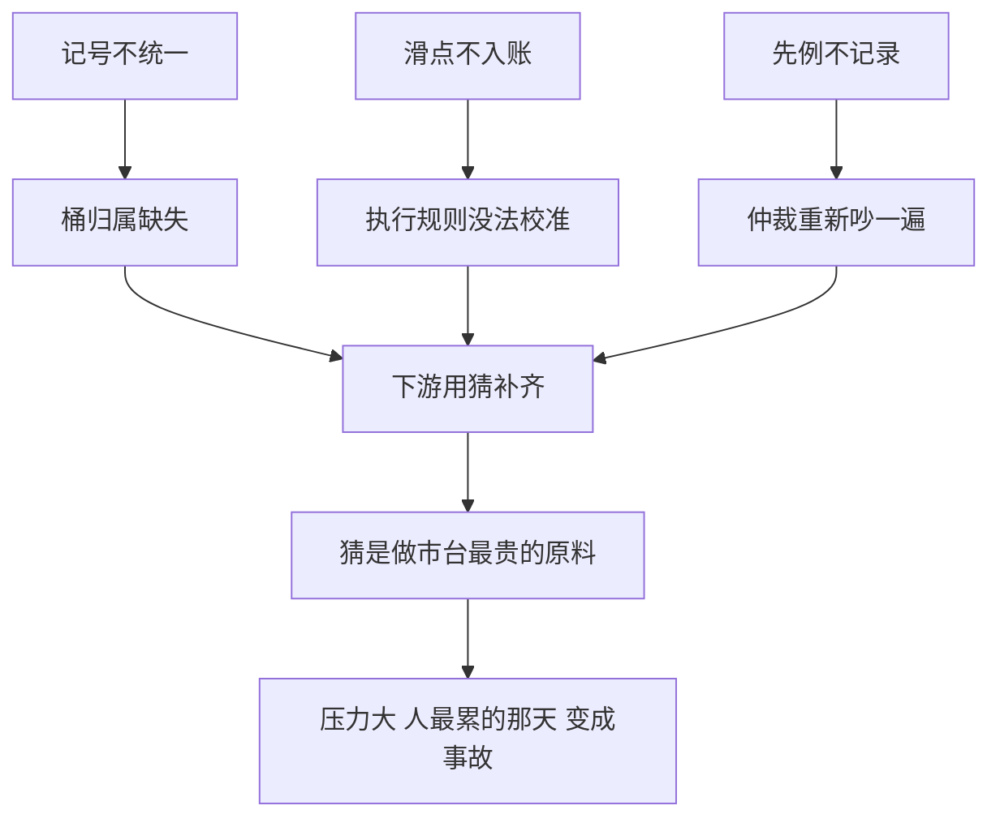

# 期权做市收束

    
做市台没有魔法：一条可审计的账、一张有口径的曲线、一套事先写好的规则；深化课的全部内容，是把这三样从口号变成字段。

    <footer>—— 据 Hull, Options, Futures, and Other Derivatives；Gatheral, The Volatility Surface；运营整合据做市实务整理</footer>

[上一课](/quant/omm-mark-disputes)把「值多少」收进仲裁流程，本课程到此收束。九课走了一条从地基到屋檐的路：三个簿记课立账本，五个定价与对冲课管日常，本课把它们合回一张图，并标出与已修课程的接口。

## 问题

单课各讲一件事，合起来要回答一个问题：做市台的每个动作能否从**成交层追溯到限额层**，中途不经过任何人的记忆。一笔客户单进来：报价来自 [quoted 曲线](/quant/omm-curve-maintenance) 的参数与偏移；成交落进 [分层账本](/quant/omm-book-layering) 的手层，带成交隐波；仓位折进 [期限桶](/quant/omm-vol-position-ledger)，进了 [情景限额](/quant/omm-greeks-limits) 的网格；Delta 缺口交给 [执行规则表](/quant/omm-hedge-execution)，滑点按到达价记账；隔夜的 [时钟与波动漂移](/quant/omm-vanna-charm-daily) 排进晨会；日历上的 [事件](/quant/omm-event-positioning) 决定今天的档级；估值冲突归 [仲裁层级](/quant/omm-mark-disputes)。任一环节断了链——记号不统一、桶归属缺失、滑点不入账——下游就会用猜补齐，而猜是做市台最贵的原料。

直觉类比：这条链像物流单号系统——包裹每过一站扫码留痕，丢件时能立刻定位在哪一站消失。做市台的每笔风险也要能从报价追到限额；哪一站「只有人记得、没有记录」，件就是在那里丢的。

这条链的实用版本是审计三问：这个数字从哪来、谁改过、依据哪条规则。到期周复盘里，「减仓为什么先平这一档」的答案若是人名而不是规则条款，链条在那里就已经断了。

## 方法

把收束写成一张对照表：每课交付一个**字段**或**规则**，而不是一个知识点。账本课交付批次与开平指定；波动账本课交付桶归属与标记隐波；限额课交付情景网格与软硬分级；曲线课交付 TTL、正则与三档快市动作；执行课交付参与率上限与到达价台账；事件课交付台账与档级；vanna / charm 课交付偏移预留与晨会排班；仲裁课交付层级表与 IPV。验收一条链是否活着，用最普通的审计问句：这个数字从哪来、谁改过、依据哪条规则——三个答案都指向文件而不是人，链就是活的。

与已修课程的接口同样要钉死：曲面几何与 [无套利参数化](/quant/svi-ssvi) 是曲线课的输入，[Delta 对冲频率](/quant/delta-hedge-freq) 与 [离散对冲误差](/quant/discrete-hedge-error) 是执行课的理论层，[Vanna / Volga 三点](/quant/vanna-volga) 与 [高阶希腊](/quant/higher-greeks) 是漂移课的工具箱，[Gamma scalping 恒等式](/quant/gamma-scalping-pnl) 与 [偏度溢价](/quant/risk-reversal-skew) 解释这台子赚的是什么钱，[VIX 期限结构](/quant/vix-term-structure-trade) 把桶语言接到指数产品。深化课不重复它们，只把理论装进流程的螺丝孔。

数字实例：审计三问的一次合格回答长这样——「这个 Vega 数字来自 9 月桶、标记隐波 32%（文件）；由曲线管线 14:05 自动更新（系统）；依据 TTL 规则第 3 条（规则）」。三个答案都指向文件与人名无关，这条链才算活着。

## 机制

课程内部有一条机制主线：**信息只进不丢，规则先于裁量**。账本层不丢手数与成本，桶不丢期限与分位，滑点台账不丢执行损耗，仲裁先例不丢裁定依据——每一层保留的信息，都是下游某个流程免于猜测的代价。反过来，凡是靠记忆与盘感补位的环节（哪个桶该减、哪笔报价算数、漂移留给谁补），都会在压力大、人最累的那天变成事故。做市业务的其他课程讲的是「如何赚」，本课程讲的是「如何活得久且说得清」：收益来自曲线与存货，生存来自账、限、裁三条硬规则。

## 边界

本课程刻意没有覆盖三块。其一，策略层：报价偏移与 [库存理论](/quant/avellaneda-stoikov) 的最优参数在哪里，属于做市策略而非做市运营。其二，制度化前线：义务做市的协议细节与监管口径，各辖区不同。其三，前沿：[强化学习做市](/quant/rl-market-making) 把报价写成序贯决策，[高频做市实证](/quant/menkveld-hft-mm) 给出行业基准——它们检验的仍是本课程的地基：账本、限额与执行规则不变，变的是生成报价的那一层。跨品种组合、场外簿记与清算也各有专课，此处不展开。

常见误区：初学者容易以为做市台的核心竞争力是「预测准」。本课程的答案相反：收益来自曲线与存货，生存来自账、限、裁三条硬规则——预测只决定多赚一点，断链却能让台子一夜说不清自己持有过什么。

## 小结

- 九课一条链：报价、落账、分桶、限额、执行、漂移、事件、仲裁，环环可追溯。
- 每课交付字段或规则；验收标准是「数字从哪来、谁改过、依据哪条」三问有文件答案。
- 机制主线：信息只进不丢，规则先于裁量；记忆补位的环节就是事故的地址。
- 与基础课的分工：几何、频率、恒等式在先修课，本课程把它们装进流程。
- 未覆盖的策略层、监管细节与 RL 前沿各有专课，接口已标出。
- 出处：Hull, *Options, Futures, and Other Derivatives*；Gatheral, *The Volatility Surface*；整合口径据期权做市运营实务整理。
