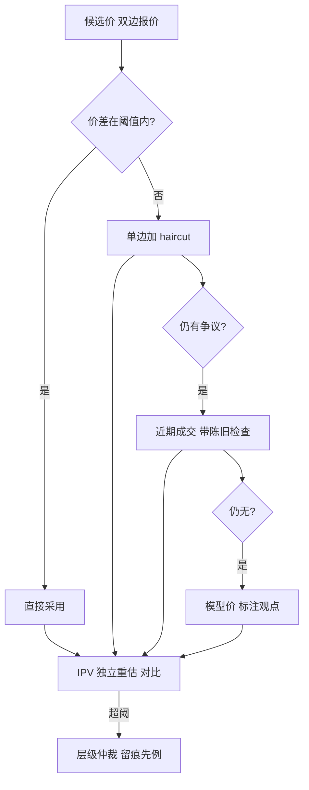
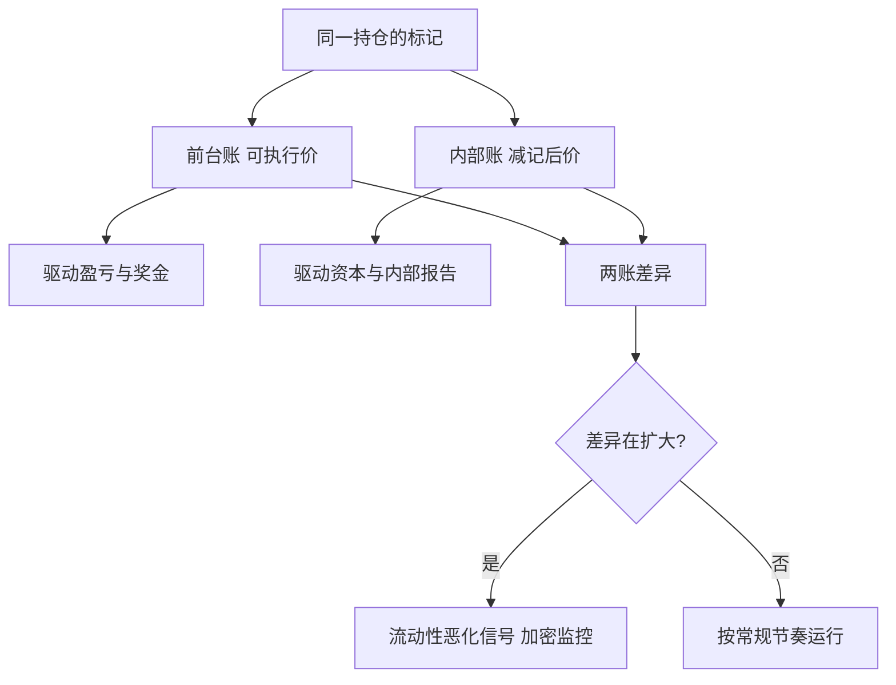

# 定价争议的仲裁

    
盯市价是一种带程序的约定，不是一个真值；争议的解决方案必须在争议发生之前写好，否则「哪笔报价算数」本身会成为套利空间。

    <footer>—— 据 Gatheral, The Volatility Surface 模型与市场之辨；盯市与独立验证流程据做市实务整理</footer>

[上一课](/quant/omm-vanna-charm-daily)把时钟项排进日程，账本的日常运转到此闭环。剩下的冲突是估值本身：翼部没有双边报价，近月刚跳空，自家 quoted 曲线与市场口径对不上，前台与风控各算各的数。本课写定价争议的仲裁：候选价的层级、独立验证、减记与签字——把「值多少」从辩论变成流程。

## 问题

盯市价驱动盈亏、[限额](/quant/omm-greeks-limits)、保证金与奖金，激励天然扭曲：持仓人倾向乐观标记，宽市场里一点裁量就能把浮亏画成浮盈。历史巨亏案的共同点不是模型错，而是盯市无人复核。做市台的日常版本更琐碎：同一执行价，经纪商 A 报 18、B 报 21、最后成交在 16，标记用哪个？quoted 曲线为引导成交而偏移（见 [曲线维护](/quant/omm-curve-maintenance)），不能自己当盯市价。没有事先写死的规则，每个宽市场日都会重新吵一遍。

直觉类比：盯市价像给房子估保额——保险公司的估值员不能由房主兼任。仲裁就是把「谁来估、按什么顺序估、估不出来怎么办」事先写成手册，而不是等吵架那天再现场定规矩。

### 候选价的层级

仲裁的第一原则是**可执行性降序**。一级：双边经纪商报价，且价差在阈值内（例如不超过 2 个波动点）——可执行，直接用。二级：单边报价或价差超阈——用单边中点，按价差宽度加 haircut。三级：近期成交，带陈旧性检查，流动性差的翼部成交价可能比现行报价更差。四级：模型价——按 [曲面](/quant/svi-ssvi) 参数或插值给出，标注为模型观点，附 haircut。每一级到下一级的触发条件与 haircut 幅度事先写死，[成交层账本](/quant/omm-book-layering) 的时间戳让「陈旧」可判定而不是可争论。

Haircut 是对「不可执行程度」的定价：价差 3 个波动点的翼部按 1 个点减记是常见量级。减记只进内部报告与资本口径，不改前台账——两本账的差本身是要盯的指标，差异扩大说明流动性在恶化。

## 方法

独立价格验证（IPV）是仲裁的执行机构：不属于前台的小组用相同输入独立重估全簿，逐日（敏感品种逐笔）对比前台标记，差异超阈强制进入层级仲裁。争议流程三步：一方提交候选价与证据（报价单、成交回报、参数快照）；仲裁人按层级表裁定；裁定与依据写入估值台账，同桶短期内引用先例。对手方争议（提前终止、大宗定价）走合同约定的估值条款，市场价不可得时按文档 fallback，不在本课展开。

术语翻译：IPV（独立价格验证）就是让「不背盈亏指标的中台小组」用同样的市场输入，独立把全簿价值再算一遍，跟前台的数对表。关键在「独立」二字：复核的人既不从前台拿奖金、也不受前台指挥，激励扭曲才不会顺着流程爬回来。

减记规则同样事先化：报价缺位超约定天数、或成交价系统性低于标记超阈值，自动降级并冻结相关桶的已实现盈亏确认。

## 机制

层级为什么按可执行性排：盯市回答的是「今天按这个数清仓，能拿回多少」，可执行性是它的唯一直接度量；模型价排在最后不是模型不好，而是它回答的是另一个问题（公平值是什么），[Gatheral 强调曲面模型是插值约定而非真值](/quant/vol-surface)。IPV 为什么必须独立：激励问题不因流程自觉而消失，复核的人不对盈亏负责，这是整个设计中唯一不可省的冗余。先例为什么留痕：仲裁的价值在一致性，同样的输入今天裁 A 明天裁 B，等于没有仲裁，宽市场里的自由裁量就从制度缝隙回来了。

不这么做会错在哪：没有层级表的台，争议靠职级与嗓门解决，标记随最优强者漂移；有表但不留痕的台，规则在审计时无法自证被执行过——对监管而言，无法自证的流程等于没有流程。

## 边界

仲裁解决「用哪个数」，不解决「数的质量」：整个市场的报价都可能系统性偏移，层级表在市场级错价前无能为力，那是 [模型风险](/quant/calibration-regularization) 与储备金的领域。减记幅度是判断不是科学，haircut 表要随流动性状态滚动校准。实物交割、美式提前行权与 [到期指派](/quant/option-exercise-settlement) 的估值在边界日另有口径。最后，quoted 曲线与盯市口径必须物理分开——同一个数既当报价又当盯市价的台，等于自己给自己批改作业。

常见误区：初学者容易以为「模型价最科学，理应排第一」。实际上盯市回答的是「今天按这个数清仓能拿回多少」，可执行性是它的唯一直接度量；模型价回答的是另一个问题（公平值是什么），所以只能排在层级末尾并附 haircut。

## 小结

- 盯市价是带程序的约定：候选价按可执行性降序排列，haircut 与触发条件事先写死。
- quoted 曲线为引导成交而偏移，永远不能兼任盯市价。
- IPV 由不背盈亏的小组执行，是设计中唯一不可省的冗余。
- 裁定留痕成先例，一致性是仲裁的全部价值。
- 减记只进内部与资本口径，两本账的差异是要盯的流动性指标。
- 出处：据 Gatheral, *The Volatility Surface*；层级、IPV 与减记流程据做市运营与估值实务整理。
