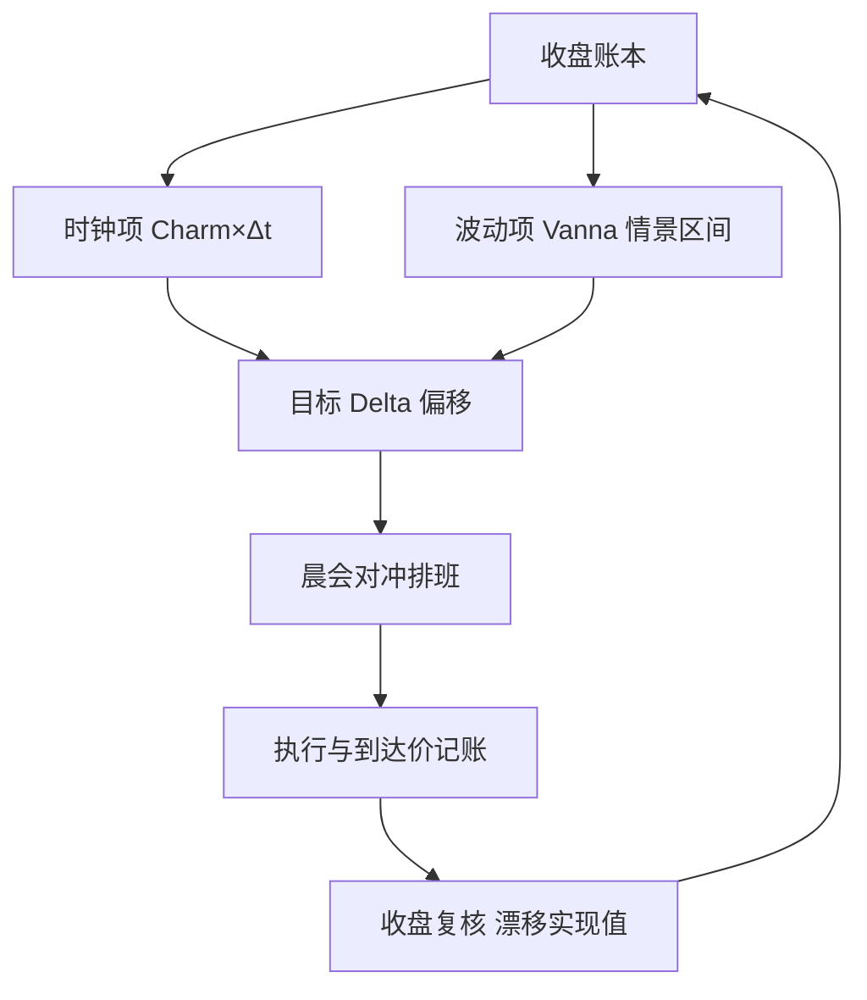
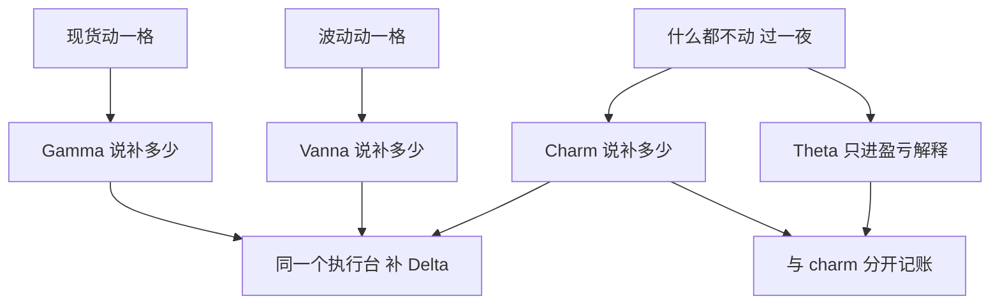

# psi 与 charm 的日常

    
现货不动、波动不动，账本也在走：时钟是唯一不会缺席的对手盘，vanna 与 charm 是它写在 Delta 上的两个签名。

    <footer>—— 据 Hull, Options, Futures, and Other Derivatives 希腊字母各章；二阶偏导的运营口径见高阶希腊课程</footer>

[上一课](/quant/omm-event-positioning)把日历上已知的集中风险排进了台账。事件之外，日历本身每天都在改写账本：即使现货与隐波一动不动，Delta 与 Gamma 也随时间漂移。本课写 **vanna**（$\partial^2 V/\partial S\,\partial\sigma$，亦即 Delta 对波动）与 **charm**（$\partial\Delta/\partial t$，Delta 对时间）的日常管理——把隔夜漂移从「开盘的意外」变成「收盘的排班」。

先钉记号，因为名字在系统间并不统一：有的终端把 vanna 写成 dvega/dspot，有的手册用 psi 记别的偏导（例如对股息收益率的敏感度）。名字可以各叫各的，偏导定义必须钉进 [账本](/quant/omm-book-layering) 的字段，否则两套系统对同一仓位算出的「vanna」不可相加。

## 问题

只把 Delta 对到零就收工的台，第二天开盘面对的不再是零：时间过了，剩余方差 $\sigma^2\tau$ 减少，密度向执行价集中，Delta 被推离原位；波动一跳，贴值区的 Delta 更是立刻变号。 [Charm / Color 高阶希腊](/quant/higher-greeks) 给出了这些偏导的公式与形状，本课不重推，只解决运营问题：漂移有多大、何时预留、排给谁执行、错了怎么兜住。

做市台比方向性账户更敏感：报价者持有大量贴值短到期仓位，charm 不是隔夜项而是盘中项；[到期周](/quant/pin-risk) 与 [0DTE](/quant/zero-dte-microstructure) 午后，Delta 的半衰期以小时计。

术语翻译：charm 就是「放着什么都不动，Delta 自己会走多少」——像牛奶有保质期，Delta 也有「时保期」；vanna 则是「隐波一动，Delta 跟着歪多少」。两者都不是新资产，只是 Delta 这个数会随时间和波动自己漂移。

### 每日例行

收盘流程固定三步。其一，算 $\mathrm{Charm}\times\Delta t$ 到次日可对冲时刻，得到「时钟项」漂移；其二，算 vanna 的隔夜情景（例如现货 $\pm 1\%$ 乘隐波 $\pm 1$ 个点的四种组合），得到「波动项」漂移区间；其三，把目标 Delta 设为零加上一个偏移——有隔夜观点就偏向观点一侧，没有就按漂移区间中点预留。漂移写进晨会对冲计划，按执行成本排序：先补漂移最大、流动性最好的桶。

数字实例：收盘算得 charm 漂移 −0.3% Delta，vanna 四情景（现货 ±1% 乘隐波 ±1 点）给出 +0.2% 至 −0.5% 的区间，偏移就取区间中点 −0.15%：目标 Delta 不设 0，而设 +0.15%。开盘时真实 Delta 大概率已落进带宽，不必抢跑。

量级参考 [Charm / Color](/quant/higher-greeks)：隔夜 charm 漂移可相当于几个百分点的 Delta，到期周贴值档按小时计。别用全年线性外推——charm 随 $\tau$ 以 $1/\sqrt{\tau}$ 的速度变，周中与到期周不是同一个数；股息日例外，除息的 Delta 跳动按 [离散股息](/quant/discrete-dividend-am) 单独处理，不是 charm。

## 方法

预留偏移是对冲，不是预测。 Charm 预留的对价是放弃漂移顺风的可能收益，换来开盘不用抢跑；是否值得用 [对冲频率](/quant/delta-hedge-freq) 的框架算：预留成本对漂移概率加权，低于抢跑的滑点就预留。执行排班交给 [对冲执行](/quant/omm-hedge-execution) 的规则表：时钟项可挂单慢慢补，波动项留到事件窗后按实现值补。Vanna 的存量风险则看聚合口径：把整本按 [经销商 Vanna / Charm 流](/quant/dealer-vanna-charm-flows) 的方法聚合成市场级对冲需求，符号取决于自家库存方向——这正是记号与定义必须先钉死的原因。

## 机制

机制上，vanna 与 charm 不是新风险源，而是同一价格函数在「现货 $\times$ 波动」与「时间」方向上的曲率与漂移。它们改变的是**对冲的时间结构**：Gamma 决定现货每动一格要补多少，vanna 决定波动每动一格要补多少，charm 决定什么都不动也要补多少。三者共用一张 [限额](/quant/omm-greeks-limits) 网格，也共用一个执行台。日常最容易犯的错是双记账：价值的时间衰减是 Theta，进盈亏解释；Delta 的时间漂移是 charm，进对冲预留——把两者加成一个「时间风险」既重复计算，又掩盖了各自的管理动作。

不这么做会错在哪：不排班的台在到期周被「无缘无故触发再平衡」折磨——其实是 charm 把 Delta 带出了带宽；不区分符号口径的台，聚合出的 vanna 与市场 [经销商流](/quant/dealer-vanna-charm-flows) 反号，隔夜情景形同虚设。

## 边界

Vanna 与 charm 都不可直接交易：没有纯时间工具，也没有纯交叉工具，只能用 [Vanna / Volga 三点](/quant/vanna-volga) 的香草组合近似，残差照旧。模型依赖要诚实：sticky strike 与 sticky delta 下的 charm 不同，[切片搬动规则](/quant/sticky-delta-strike) 换了，隔夜漂移跟着换。最后，时钟项只覆盖 $\mathrm{d}S=\mathrm{d}\sigma=0$ 的世界，跳空仍要回 [隔夜情景](/quant/overnight-gap-hedge)；charm 不是跳空的替代品，只是它的低阶近似。

常见误区：初学者容易把 Theta 与 charm 混成一个笼统的「时间风险」。其实价值衰减是 Theta、进盈亏解释；Delta 漂移是 charm、进对冲预留。合成一本账，既重复计算，又看不出各自该做的管理动作。

## 小结

- Vanna 是 Delta 对波动，charm 是 Delta 对时间；现货不动账本也在走。
- 记号各家不一，偏导定义必须钉进账本字段，聚合才有意义。
- 每日例行：时钟项乘 $\Delta t$、波动项走情景、目标 Delta 留偏移、晨会排班。
- Theta 进盈亏，charm 进预留，双记账会同时污染两本账。
- Vanna / charm 不可直接交易，只能三点近似；跳空仍归隔夜情景管。
- 出处：据 Hull, *Options, Futures, and Other Derivatives*；运营口径与聚合方法据期权做市实务整理。
