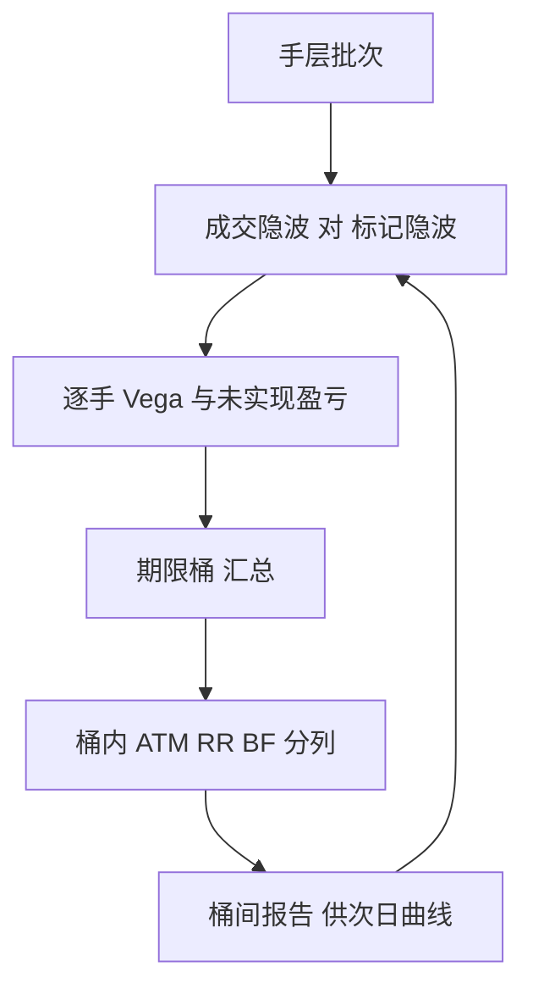

# 波动率仓位的账本

    
期权的存货是未来的波动，而波动没有仓库：它的库存价格每天由曲面重写一次。

    <footer>—— 据 Gatheral, The Volatility Surface；分桶与标记口径据做市实务整理</footer>

[上一课](/quant/omm-book-layering)把成交钉到手层：批次、开平指定与逐层对账立住了账本的骨架。骨架上的肉是价格，而期权存货的价格不是标的价，是隐含波动。本课写波动率仓位的账本：把每一手按到期与分位折成 Vega，明确标记口径，让「这台子在做多还是做空哪一段波动」成为账本上可直接读出的一栏。

## 问题

Delta 中性的期权簿，现货怎么走都不亏不赚，却仍然持有方向明确的波动仓位：卖出跨式是做空隐含波动、做多 Gamma。若账本只汇总一个总 Vega 数字，两个完全不同的台可以显示出同样的风险：一个卖近买远、一个买近卖远，总 Vega 相同，隐含期限结构一动，盈亏相反。缺的不是 Vega，而是**按到期与分位展开**的仓位，以及每格的标记价格——没有标记，未实现盈亏无从谈起。

更深一层：标的账本的存货按成本计，市价每天给一次；波动仓位的存货价格是曲面拟合的产物，[SVI / SSVI](/quant/svi-ssvi) 的参数一变，整本未实现盈亏重排。账本若不把「哪一段波动、按哪个标记」写成字段，盯市就成了可以事后辩论的软数。

### 分桶与字段

Vega 按到期切成期限桶（例如当周、当月、次月、远月），桶内再按 Delta 带或执行价区（ATM、风险反转、蝶式）细分，对上经纪商报 [偏度交易](/quant/risk-reversal-skew) 的坐标。每一手在 [手层](/quant/omm-book-layering) 记两个波动率：成交时的隐波与当前标记隐波，两者的 Vega 加权差就是该手的未实现波动盈亏。桶内汇总用 Vega 加权，而不是简单求和：一张深度虚值的期权 Vega 小但对翼部弯曲敏感，混进总数会看不见。

量级要随身带着：一张 $S=5000$、一个月期平值期权的 Vega 约为 $S\sqrt{\tau}\,\varphi(d_1)\approx 5000\times 0.29\times 0.40\approx 580$，即隐波动 1 个点价值动约 5.8；同一合约缩到一周，Vega 减半不止。这就是按到期分桶、不做一张总表的算术理由。

## 方法

日终流程四步。其一，重拟合或外推当日曲面，给每个到期桶定标记隐波；sticky 规则要事先定死——[sticky delta 与 sticky strike](/quant/sticky-delta-strike) 下同一批仓位的标记变动完全不同。其二，逐手重估：Vega、Gamma、Theta 连同桶归属一并刷新，未实现盈亏按桶落账。其三，把已实现端接进来：[Gamma scalping 的 PnL 恒等式](/quant/gamma-scalping-pnl) 说明，做多 Gamma 的台每天刮到的已实现方差与付出的 Theta 是同一笔账的两面，波动账本要给这两栏各留一列，别让它们混进「方向盈亏」。其四，出桶间报告：近月做空多少、远月做多多少、翼部净空多少，这是次日曲线维护的输入。

## 机制

分桶账本为什么是必须而非奢侈：因为波动率曲面几乎从不平行移动。事件周近月隐波抬升而远月几乎不动，期限桶的盈亏拆分直接告诉你这台子赚的是事件溢价还是赔在了桶间错配；崩溃日偏斜变陡，ATM 桶与翼部桶符号相反。总 Vega 把这些全部加零。机制上，桶是曲面导数在仓位上的投影：曲面在第 $i$ 桶动 $\Delta\sigma_i$，盈亏是 $\sum_i \nu_i\,\Delta\sigma_i$，桶账本就是让这个和式的每一项都可问责。

不这么做会错在哪：只用总 Vega 的台，在曲面扭转日看着「Vega 中性」的账本亏钱，却无法回答亏在哪一段；事后把桶补出来，桶归属又已随成交混在一起，无法复原。

## 边界

流动性差的翼部没有可靠报价，标记是模型观点，桶盈亏要带 haircut 看；Vega 是局部导数，隐波大动时 Volga 项主导，桶数字只给一阶印象。跨标的的波动仓位不可直接合并——指数波动与单票波动的相关结构是另一个账本。[0DTE](/quant/zero-dte-microstructure) 桶的 Vega 在午后塌缩成近二元的形态，按普通桶管理会漏掉 [Pin risk](/quant/pin-risk) 的形态。最后，桶划分本身是约定：换坐标（从到期到方差条带，如 [VIX 期限结构](/quant/vix-term-structure-trade) 的三十天条带）会重排队列，报告口径变更必须留痕。

## 小结

- 期权存货的价格是隐含波动；波动账本的核心字段是每手的成交隐波与标记隐波。
- Vega 按到期与分位分桶，桶内 Vega 加权；总 Vega 数会掩盖期限与偏斜的错配。
- 曲面移动几乎不平行，桶间拆分让扭转日的盈亏可问责。
- 已实现端（Gamma 刮取）与隐含端（Theta 支付）分列，混同即失去波动盈亏的解释力。
- 翼部标记是模型观点，0DTE 桶近二元，跨标的波动不可直加。
- 出处：据 Gatheral, *The Volatility Surface*；分桶、标记与对账口径据期权做市实务整理。
