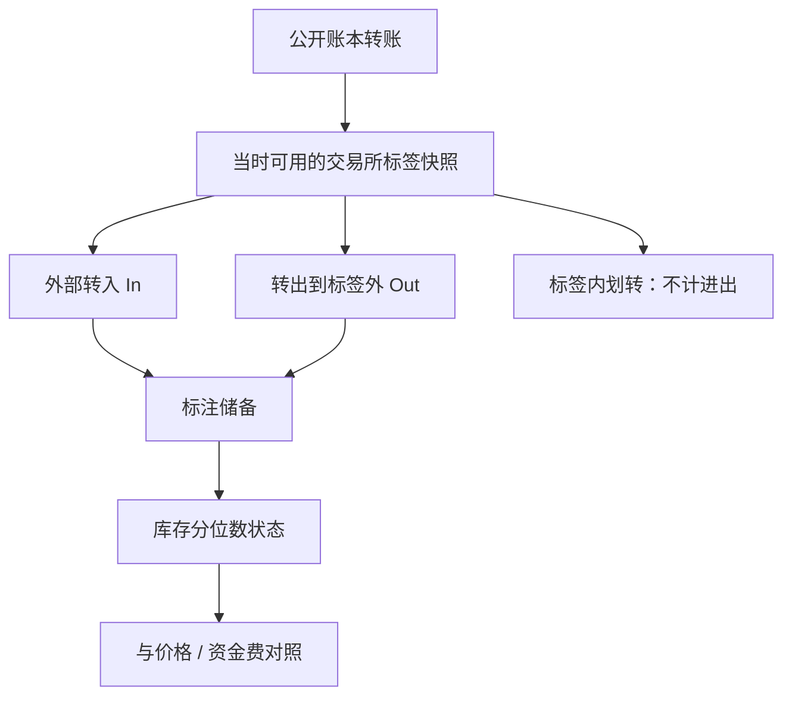

# 链上交易所流入流出

把公开标注为交易所的地址上的净转入转出当成库存仪表：币从这些地址离开，并不自动等于有人决定长期持有；只等于它离开了这批被标签覆盖的热钱包。

<footer>—— 据公开区块链账本与交易所热钱包标签产品的口径整理；对象是可审计的总量指标，不是对未标注地址的身份推断</footer>

比特币等公链的转账是公开账本。数据分析商把一部分地址标注为中心化交易所的充币/提币钱包，据此发布**交易所流入、流出、储备**一类时间序列。这些数字被用来讲「抛压」或「囤币」。本篇写它们作为**公开库存代理**能说什么、不能说什么：标签覆盖、内部划转、链上与托管的边界，以及如何接到价格而不把会计恒等式写错。只使用公开账本与公开标签集。不讨论混币、隐私币追踪、聚类去匿名、或绕过隐私工具；那些既不是本站对象，也不是可复制的因子定义。

## 问题

记标签集 $\mathcal{E}_t$ 为 $t$ 时刻被标成「交易所」的地址集合。流入是外部地址向 $\mathcal{E}_t$ 的转账量，流出相反，储备是 $\mathcal{E}_t$ 内余额之和。直觉是：流入增加可售库存、流出减少。问题是 $\mathcal{E}_t$ 不是经济上的「全部可售比特币」。它漏掉：未标注的场外柜台、新所、自托管做市、ETF 托管（见 [现货 ETF](/quant/btc-etf-basis)）、以及标签滞后。它又多算：交易所内部冷热钱包迁移、归集、以及被误标的地址。同一笔经济存款，链上可能表现为用户地址 → 热钱包 → 冷钱包两跳，流量被算两次或算成流出。

第二句话是主体。链上只看见地址，看不见账户意图。流出到未标注地址，可能是提币到自托管、转到另一家未覆盖的所、转到托管人、或转到基金钱包。把流出一律叫做「长期囤积」，是把标签补集当成了储藏需求。

### 标签是时变样本框，不是普查

标签集随交易所开业、钱包轮换、分析商修订而变。事后用今天的标签回放三年前的储备，会把当时尚未标注的钱包算进历史「流出」，造成假的库存下降。可复制序列必须：**冻结**每期当时可用的标签快照，或明确声明使用修订后的回溯标签并接受不可交易的前视。这与 [点-in-time](/quant/point-in-time) 相同。覆盖率变化应单独成序列：新标注一家大所，储备阶跃，不是用户突然充币。

本篇的输入是：公链上的明文转账、以及供应商或社区维护的交易所地址名单。不把未标注地址做实体聚类以「补全」覆盖，那会滑向身份推断。覆盖不足应表现为更大的测量误差，用敏感性分析处理，而不是用去匿名算法去补。

## 方法

**定义流量。** 在快照 $\mathcal{E}_t$ 上，

$$
\mathrm{In}_t=\sum_{\substack{tx\in t\\ \mathrm{from}\notin\mathcal{E}_t\\ \mathrm{to}\in\mathcal{E}_t}}\mathrm{value}(tx),\qquad
\mathrm{Out}_t=\sum_{\substack{tx\in t\\ \mathrm{from}\in\mathcal{E}_t\\ \mathrm{to}\notin\mathcal{E}_t}}\mathrm{value}(tx).
$$

内部转账（两端都在 $\mathcal{E}_t$）计入储备搬家，不计入 In/Out。净流 $\mathrm{Out}_t-\mathrm{In}_t$ 与储备差分应对上，对不上则是手续费、漏标或时间切分。单位用币数量，不要在分子用美元、分母用币，除非声明是「抛压的美元价值」。

**与价格对齐。** 日频上把净流入对随后收益、波动、[永续资金](/quant/crypto-perp-funding) 做回归，控制已实现波动与上日收益。即使符号符合「流入→随后更弱」，经济量级通常小，且在标签修订后不稳定。更稳的用法是**状态**：储备处于自身分位数的高位或低位，作为库存体制，而不是日频交易信号。

**分场所。** 单一综合储备被一家所的钱包迁移主导。应报告分所序列，并在某所暂停充提时把该所从综合里拿掉或标记缺失——停提时链上流出为 0 并不等于需求消失，只等于管道关了。

### 不要把 ETF 托管与交易所热钱包加总成「所有库存」

ETF 托管地址（若被公开披露或被标签）增加的是受监管信托库存，减少的是可在中心化现货所立即卖出的热钱包库存。经济上这是持有形式转换。把 ETF 申购造成的「交易所流出」读成抛压下降，可能把同一需求（通过 AP 买币进信托）写成两次故事。流量应与一级申赎公开数据对照，而不是互相替代。

## 机制

若标签覆盖了主要零售现货入口，则流入增加这些场所的可匹配库存，做市商与内部账本更容易吸收卖单，现货压力偏负；流出相反。永续与期货的定价在链下，链上储备只间接通过现货库存影响期现与资金，见 [期现](/quant/crypto-basis-trade)。机制的识别条件是：覆盖稳定、内部划转已剔除、且没有同时发生的托管迁徙。

宏观解释（「聪明钱出逃」）几乎不可证伪：同一流出可对应自托管、OTC、ETF 或漏标所。可证伪的是测量：内部划转剔除后，储备差分是否等于净流；新标签引入后，历史是否被改写；停提日是否被当成「流出骤停」。把这些诊断做完，再谈对收益的回归。

### 与订单流、资金费的接口

链上日频流量是低频库存，不是逐笔订单流。它不能替代 [OFI](/quant/ofi-cont) 或场所内买卖不平衡。资金费反映永续相对指数的租金，与热钱包储备弱相关：杠杆投机可以在储备不变时把资金费打到夹紧上限。三者同时恶化（流入升、资金极端、现货跌）提供的是拥挤叙事，仍须各自定义，不能合成一个「链上情绪」黑箱。

美元计价的「交易所净流」随币价同涨同跌，会把价格本身写进因子。用币数量做主序列，美元价值只作辅助，并在回归里不要用同期价格去标准化流量。

## 边界与工程取舍

不把本指标延伸到混币器、隐私链或「剥洋葱」式的地址聚类。覆盖缺口用「未覆盖比例上升」来报告，而不是用推断身份去填。不要用单笔大额转账当交易信号：那可能是托管归集。不要在未声明标签供应商与快照日期时比较两篇研报的储备数字。分叉、空投与合约升级会改变「一单位」的含义，流量序列要在事件日断开。

作为风险仪表，标注储备的极端分位数有助于解释现货深度与提币拥堵；作为 alpha，日频净流在费用与拥挤之后很少站得住。公开账本的价值是可审计，价值不是无穷细的监督。

出处：公链账本为公开数据；交易所标签以各数据商当时披露的方法论为准。本站不把未标注地址的实体解析当作因子输入。ETF 托管流量与一级申赎对照见比特币现货 ETF 基差条目。

## 小结

- 交易所流入流出是公开标签集上的库存代理，不是全部可售供给，也不是投资者意图。
- 必须用当时标签快照、剔除内部划转，并使储备差分与净流对账。
- 流出到标签外不能默认解释为长期囤积；ETF 托管与漏标所是常见去向。
- 更适合作为库存状态，而不是日频交易信号；应与停提、资金费、ETF 申赎分列。
- 本篇只用公开账本与公开标签，不用混币或隐私绕过类方法去「补全」覆盖。
- 出处：公开链上数据与标签产品说明书；制度对照见 ETF 与期现条目。
