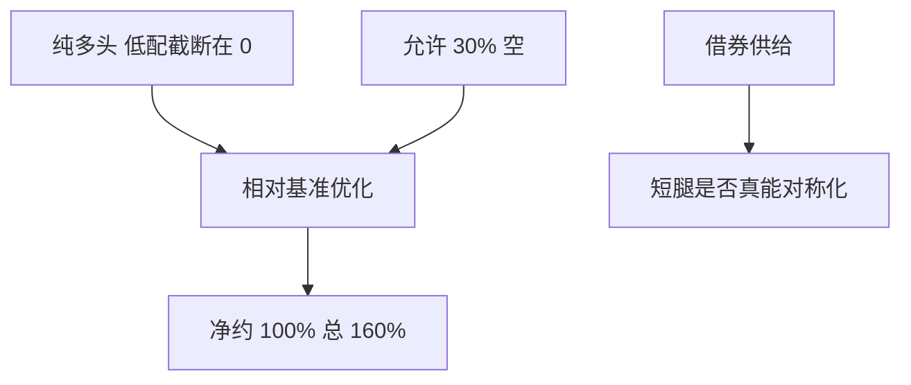

# 130/30

130/30 用有限卖空把多头主动权重的对称性补上：看好的可以超配到超过权重上限，资金来自看空的 30%。

<footer>—— Jacobs, Levy and Starer, On the Optimality of Long–Short Strategies, Financial Analysts Journal, 1998 前后对放松多头约束的讨论</footer>

[上一课](/quant/long-short-equity)是双侧都可以到 100% 的中性或多空。130/30 的缺口是**多头基准产品**：净暴露保持约 100%，总暴露 160%，空头通常 30%。主干 [组合约束](/quant/portfolio-constraints) 已写多头-only 的约束成本。本课写放松 30% 卖空值不值借券与跟踪误差。

## 问题

纯多头主动：低配一只股票最多到权重 0，超配受集中度限制。信息在看空一侧被截断。允许 30% 卖空，把释放的资金加到多头，形成 130 多 / 30 空，净仍约 1。问题是：这 30% 的借券与主动风险，是否提高 IR 足以覆盖成本。若空头只是把多头约束「对称化」且信号在两侧同样有效，Jacobs–Levy 的逻辑说应当提高效率；若信号主要在多头流动性名字、空头都是借券贵的小盘，130/30 会毁价值。

与市场中性：130/30 保留几乎全部市场 beta，基准是指数，跟踪误差有限。客户买的是「增强指数」而不是绝对收益。评价应用超额与 TE，不是用中性基金的夏普。

### 30 不是魔术数字

140/40、120/20 是同一族。最优空头比例取决于借券供给、基准集中度与信号双边性。固定 30 是产品营销与风险预算的折中。优化里应把空头比例当约束参数做稳健，而不是当理论最优。

130/30 的杠杆是总暴露 1.6，不是 1.3 倍净值的融资杠杆 ETF。重置与拖累不同。

## 方法

在基准权重附近优化主动 $w-w_b$，约束 $\sum w=1$、$\sum w^-=0.3$、$w_i\ge -c$。风险用相对 $\Sigma$。借券成本进预期收益。对照：纯多头增强 vs 130/30 的扣费 IR/TE。执行：空头名单预审。

## 机制

多头-only 的有效前沿被截断。放松卖空把一部分截断补回，主动风险的每单位 IR 上升——若短腿可执行。不可执行时，优化器会把空头堆在少数可借名字，变成集中空头风险，效率下降。

## 边界

2008 年式的做空限制会瞬间把 130/30 变回残缺多头。基准若是不可做空的指数（部分 A 股），产品结构要改，见中国课。费用高于指数增强，后课费用复合要单独算。

## 小结

- 130/30 是带有限卖空的增强指数，不是市场中性。
- 价值取决于信号双边性与借券；30% 是产品参数。
- 评价用 TE 与超额，不用绝对夏普。
- 出处：Jacobs, Levy and Starer 对多空相对多头约束的讨论，*FAJ*。
