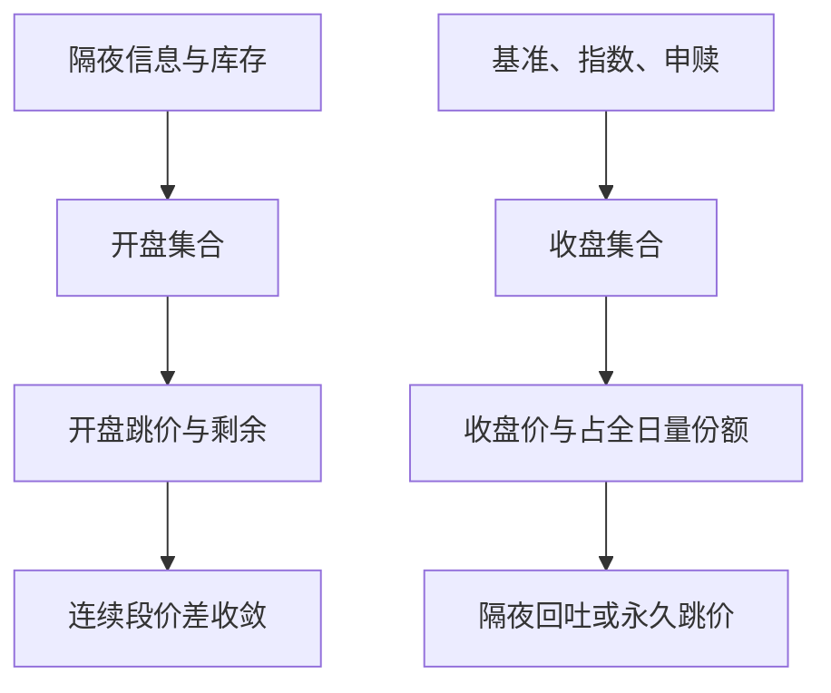

# 开盘与收盘集合竞价

开盘拍卖要吸收隔夜信息并形成第一口可交易价格；收盘拍卖要吸收指数与基准的期末需求。两者都是集合协议，但到达的订单流不是同一种。

<footer>—— Cushing and Madhavan, Stock Returns and Trading at the Close, Journal of Financial Markets, 2000；对照 Pagano, Peng and Schwartz 对收盘拍卖设计的讨论</footer>

[连续竞价 vs 集合竞价](/quant/continuous-vs-auction)已经把批量出清与连续匹配分开。本课的缺口是日历：几乎每个股票市场都把集合协议钉在开盘与收盘，而不是当成抽象的替代设计。Cushing 与 Madhavan 记录收盘附近收益与成交的异常，说明期末定价不是「又一次连续成交」。指数基金、VWAP 基准、期权交割与 A 股的涨跌停开板，都会把量挤进这两场拍卖。后课的波动中断再开盘沿用同一套出清语言，但触发条件不同，本课不预支。

## 问题

开盘集合要回答：隔夜公告、宏观发布、海外联动之后，第一口价格应落在哪。没有连续 BBO 可作参照时，参与者靠虚拟参考价、指示性成交量、以及自己的模型。若开盘拍卖质量差，连续段会用一段很长的价差与剧烈的排队去补课。收盘集合要回答另一件事：基准需要一个官方收盘价。被动资金必须按指数权重买到收盘，主动资金若以收盘为业绩基准，也有激励把差额堆到最后。Cushing–Madhavan 把收盘收益的可预测成分与交易需求连在一起：这是流量，不一定是关于公司价值的新闻。

缺口是把两场拍卖当成两个不同的订单流问题，而不是都叫「集合竞价」就结束。开盘的主导冲击往往是信息与隔夜库存；收盘的主导冲击往往是基准与套期。用同一套有效价差窗口去平均「开盘后 15 分钟」和「收盘前 15 分钟」，会把两种机制混成一个数字。

### 不可撤窗口改变博弈而不是改变出清公式

许多市场在开盘或收盘前若干分钟禁止撤单或只允许有限制的改单（A 股开盘 9:20–9:25 不可撤是常用例子）。出清规则仍然是最大成交量，但策略空间变了：最后时刻不能用假量去试探再撤。Pagano、Peng 与 Schwartz 讨论收盘拍卖设计时，把随机结束、不平衡披露、收盘价保护（closing price cross）写成同一问题的旋钮。本课只要求：回测若在不可撤窗口之后还假设可以取消，模拟器已经离开真实协议。

收盘价被指数、基金申赎、衍生品结算引用，因此操纵收盘价的激励大于盘中任意一分钟。研究与监控应单独标记收盘拍卖成交，而不是把它们稀释进全日 VWAP。

## 方法

对开盘：记录累积期虚拟价路径（若有）、开盘 $p_{\mathrm{open}}$ 相对前收的跳价、开盘量、开盘后连续段第一口价差收敛到全日中位所需的时间或笔数。跳价分解成隔夜公开信息（期货、ADR、公告时间戳）与拍卖不平衡残差。对收盘：记录收盘量占全日量的份额、收盘价相对连续段最后中点的偏差、拍卖不平衡与随后隔夜收益的关系。Cushing–Madhavan 的对象是收盘收益，不是盘中 Roll 价差。

执行研究应把「以收盘为基准」的订单单独记账。MOC / LOC（market-on-close / limit-on-close）在美股是明确的订单类型；A 股是在收盘集合里申报。把收盘拍卖的滑点写进连续段的[实施缺口](/quant/implementation-shortfall)，会让盘中算法背上不属于它的成本。指数再平衡日、期权到期日、ETF 申赎高峰日必须分层，否则样本均值被少数日历日支配。

### 披露什么不平衡、何时披露

交易所若在累积期公布指示性价格与买卖不平衡，连续开盘前的信息集就包含一条公开信号。知情者与套利者会用这笔公开量去对冲或抢跑；非知情大单则面临披露成本。完全不披露则出清价跳跃更大，连续段开盘更「贵」。方法是把披露时间表当成制度参数：同一股票在不同交易所上市，开盘质量差可能来自披露而不是来自公司本身。不要用 [Kyle](/quant/kyle-model) 的单期 $\lambda$ 去拟合开盘跳价就宣布校准完成——开盘还有涨跌停、市价申报上限、与未转入连续的剩余量。

## 机制

开盘：隔夜信息进入共同先验，拍卖把分散的市价与限价聚合成第一口价格。若期货已夜盘交易，股票开盘很大一块是跨市场传导，而不是个股发现。开盘后连续价差从宽到窄，是处理与存货项在重新开张，不一定是逆向选择突然消失。收盘：被动需求近似无弹性，必须在拍卖里成交；提供流动性的一方知道对手可能是指数而不是知情者，但数量可以极大，存货与冲击主导。收盘价相对连续中点的偏离，常被当成「收盘溢价」；其中一部分会隔夜回吐，说明它更像暂时压力而不是永久信息——这与先修课暂时/永久的切分一致，只是对象从逐笔换成一场拍卖。

A 股涨跌停使开盘集合经常直接开在限价上，剩余需求进入连续排队。此时「开盘价」不是出清均衡，是配给。用开盘价算隔夜收益仍然合法，用开盘价当可交易的无约束价格则不合法：你未必能在该价买到想要的量。

VWAP 基准若包含收盘拍卖，盘中算法越接近收盘越要决定：参与拍卖，还是把基准理解成「尽量贴近一个自己无法控制的价格」。这是基准设计问题，会反馈到收盘不平衡。

### 指数再平衡日不是普通收盘

再平衡、期权到期、ETF 申赎把无弹性需求叠进同一场拍卖，不平衡与收盘偏离的分布平移。容量与拥挤课会再遇到这件事；本课只要把这些日历日从「普通收盘均值」里拆开，否则执行基准被少数日子支配。

## 边界

不是所有「收盘价」都来自集合竞价。有的市场用最后一笔连续成交、一段时间的成交量加权、或官方指定的收盘算法。把文献里 NYSE 收盘交叉的结论搬到只用最后打印的市场，对象错了。开盘若允许盘前连续（美股 pre-open 报价、期货夜盘），「开盘拍卖」吸收的信息已经少了一截。

本课不讨论如何把大单藏进收盘去影响指数。合法研究问的是：给定公开规则与公开披露，拍卖如何定价、成本如何计量。波动性中断触发的再开盘集合，外形像开盘，信息集却是刚刚中断的连续段，下一课单独写。

出处应落到可核对的制度与论文：Cushing and Madhavan, 2000；Pagano and Schwartz, 2003；Pagano, Peng and Schwartz 对收盘设计的后续工作；以及各交易所现行开收盘规则，而不是口头「都是集合」。

## 小结

- 开盘集合消化隔夜信息，收盘集合消化基准流量；同为批量出清，订单流不同。
- 不可撤窗口、不平衡披露、收盘价定义，决定博弈，不只是出清公式。
- 质量指标应分段：开盘跳价与价差收敛、收盘量份额与相对连续中点的偏差。
- 涨跌停开盘是配给，不是无约束均衡价。
- MOC/LOC 与 A 股收盘申报必须从盘中执行会计里拆出。
- 出处：Cushing and Madhavan, *Journal of Financial Markets*, 2000；Pagano and Schwartz, *JFE*, 2003；Harris 对开收盘机制的制度叙述。
