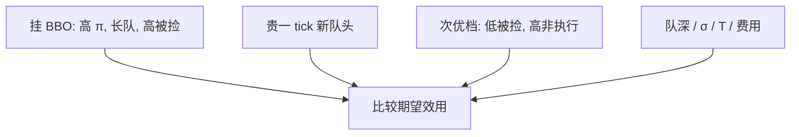

# 最优限价单放置理论

选了限价之后还要选格子：贴在 BBO 是买执行概率、卖队列位置；埋深一档是买被捡保护、卖非执行。最优档位是把上一课的两份风险标在 tick 栅格上。

<footer>—— 据 Goettler, Parlour and Rajan, Equilibrium in a Dynamic Limit Order Market, Journal of Finance, 2005；对照 Foucault, Kadan and Kandel, Limit Order Book as a Market for Liquidity, Review of Financial Studies, 2005</footer>

[逆向选择对非执行](/quant/adverse-selection-vs-nonexecution)给出目标函数的两项。缺口是离散网格上的**放置**：在哪一个 tick、多深的队列。Foucault–Kadan–Kandel（2005）把簿写成流动性市场，执行等待随价位变化；Goettler–Parlour–Rajan（2005）计算动态均衡的下单分布。本课写放置的一阶直觉与可观测含义，不重画[价格栅格](/quant/price-grid-tick)的合法性，也不把执行算法的 Almgren 轨迹搬进来。

## 问题

连续价格下「挂在 $p$」是一维搜索。tick 把搜索收成少数整数档。贴 BBO：$\pi_{\mathrm{fill}}$ 高，但同价位队可能很长，时间优先下你排在尾部，真实执行未必快；且被捡窗口开着。挂在次优档：队可能更短甚至空，但必须等 BBO 被吃掉或撤掉才轮到，非执行升、被捡降。隔空挂在更远处，几乎变成止损备忘录。问题是状态 $(n_{\mathrm{bbo}},n_{\mathrm{next}},\sigma,T)$ 如何映射到档位，而不是再讨论要不要市价。

费用使问题非单调：有的场所对提供流动性返佣，贴 BBO 的净成本下降，放置整体前移。

### 排队位置比档位标签更重要

同样挂在 $b_1$，队头与队尾的 $\pi_{\mathrm{fill}}$ 差一个到达过程。最优「放置」包括是否值得用更有攻击性的价格**跳到新的队头**（提高一个 tick 买位置）。这是在用价差换时间优先。Parlour 已说队尾可能不如市价；这里说队尾可能不如贵一个 tick 的新队头。

Obizhaeva–Wang 型最优执行是冲击函数上的轨迹，对象是市价切片。本课对象是被动单的格点。两者可组合：母单决定被动比例，子单再选档。不要把执行课的 $\lambda$ 轨迹抄进放置。

## 方法

在离散档 $k=0,1,2,\ldots$（0 为 BBO）上比较期望效用。$k=0$ 的状态含队列长度；$k\ge 1$ 的成交需要先消耗更优档。FKK（2005）强调：提供更优价格的人缩短别人的等待，是在出售流动性，应获得价差；均衡等待时间随「性价比」调整。GPR（2005）显示均衡下单会填在若干档上，形状随波动与信息变化，而不是只堆在第一档。

经验：用随后的成交与中点移动，估计各档的实现 $\pi$ 与被捡；或看撤单后改挂的方向。Cont 等人的队列反应模型提供强度，但那是统计，不是本课的均衡放置。

### 多单位与冰山

大单不能只选一个 $k$：可能拆到若干档，或同一档用冰山反复丧失时间优先。最优放置变成分配问题。隐藏理论课会说：展示量本身是信号，会改变别人的 $\pi$ 与被捡。本课默认完全可见的单位单。

## 机制

放置是在揭示耐心。Roşu 的排序在栅格上变成：最急的被动者贴 BBO，次急的挂次优。观测到的深度形状是耐心分布与 tick 的卷积。tick 变粗，可区分的档变少，排队博弈加剧，时间优先更值钱——这是后文 tick size pilot 的微观机制，也是 Harris 对最小变动价位的老结论。

信息到来时，最优 $k$ 立刻外移或改撤：近端变成被捡区。补给从远端往回填，形状出现「空洞」再愈合。宏观形状课会把愈合后的平均轮廓写成幂律一类描述；那是加总，不是单人最优。

## 边界

计算均衡对类型分布敏感，不能当交易台的档位计算器。真实还有 peg 指令自动贴档，把放置外包给交易所，见市场设计续。pro-rata 下「队尾」不再最差，放置逻辑翻转，下一课专门写。跨市场时本地最优档可能劣于另一场所的 BBO，路由先于放置。

回测里用事后成交标记「若挂在 k 会成交」，忽略你挂上会改变队列与别人策略，会系统性高估近端 $\pi$。放置理论是均衡对象，不是历史簿上的点击模拟。

## 小结

- 最优放置在 BBO 队列、跳价抢队头、次优档之间比较 $\pi$ 与被捡。
- 时间优先让「同一档的位置」成为决策变量；费用与 tick 平移最优 $k$。
- FKK 与 GPR 给出流动性市场与计算均衡两条理论路径。
- 出处：Foucault, Kadan and Kandel, *Review of Financial Studies*, 2005；Goettler, Parlour and Rajan, *Journal of Finance*, 2005。
