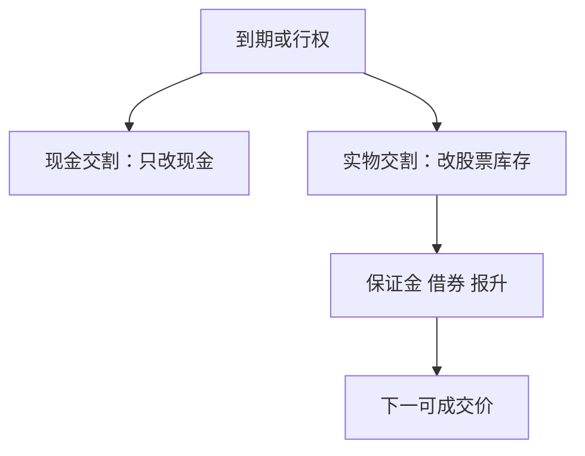

# 期权行权与交割

到期不是希腊值归零那么干净：现金交割改账户现金，实物交割改股票持仓并立即进入保证金、借券与做空规则。回测若在到期日把期权市值抹成零，会漏掉隔夜的股票腿。

<footer>—— 据 OCC 交割与行权说明；交易所美式/欧式行权与结算惯例整理</footer>

上一课[做空规则与报升](/quant/short-sale-uptick)过滤股票空头。期权到期可以把你变成股票多头或空头，过滤器必须再跑一遍。本课补行权与交割对回测状态机的冲击。不重写 Black–Scholes，不进入限价簿的期权复杂订单。随机分析课已经把提前行权当成最优停；本课问的是**交割之后资金与证券往哪走**。

## 问题

纸面期权回测常用结算价把到期损益记成现金，然后仓位清空。实物交割的个股期权不是这样：行权付出行权价、收入股票（或多头被指派变成空头股票）。周末与假期使期权到期日到股票开盘之间有缺口，股票腿的第一可成交价可以远离行权价。缺口课在这里再次出现，只是触发器是交割日历而不是维持线。现金交割的指数期权没有股票腿，但结算价规则（开盘交割 vs 收盘）会改变最后一天的损益，用收盘当结算是常见前视或错记。

### 行权不是自动按理论价平仓

虚值期权通常放弃，实值欧式自动行权有阈值规则，美式可能被提前指派（尤其临近分红）。回测按理论值在到期日「平掉」而不走 OCC 的自动行权阈值，会在深度实值与临界实值上记错股票库存。库存一旦出现，借券、报升、涨跌停立刻适用。

提前指派常发生在分红前。财务课的除权日在这里变成期权库存事件：你可能在除权前被指派成空头股票，必须融券。

## 方法

到期与行权写入日历：合约类型（现金/实物、美式/欧式）、结算价定义、自动行权阈值、交割日。到期日终：现金交割只更新现金；实物交割更新股票数量与应付现金，下一交易日按股票规则检查保证金与可借。禁止在到期日用期权中间价清仓来代替交割，除非你真的在到期前平仓且该平仓可成交。提前指派按当时已公布的分红与规则触发，不得用事后是否真的被指派的完整清单而不含随机性——至少要声明假设（总是被指派 / 从不 / 按公开阈值）。

结算周期：股票交割仍走 T+$n$，行权应付资金有自己的 OCC 时钟，两条时钟都要进占用。

深度实值个股期权在到期若被自动行权，周五收盘你还在看期权净值，周一开盘已经是股票加减现金。中间的周末缺口按股票第一可成交价记账。现金交割指数期权没有这只腿，但开盘交割窗口的结算价不是周五收盘；用错结算价会把到期周的假 alpha 做出来。提前指派与分红日历对齐，假设要写死。

## 机制

期权策略的纸面收益常把最后一天的希腊值衰减算进去，却假设没有库存。实盘在到期日之后可能持有隔夜股票，事件日、涨跌停、停牌全套适用。这是资金底在衍生品上的入口：你为了「期权 alpha」被动获得了股票因子暴露和制度约束。指数期权现金交割更干净，但结算价窗口会吸引抢跑与拍卖流动性——仍不要在本课写成 LOB。

下一课期货展期是同一类日历问题：合约到期必须换仓，否则进入交割。期权是行权库存，期货是展期或交割。

到期日按合约类型更新：现金交割只动现金与结算价定义（开盘交割不得用收盘价）；实物交割变动股票库存与应付行权价，次一交易日按股票制度跑保证金、借券、报升、涨跌停。禁止用到期日期权中间价清仓代替交割，除非平仓委托确实发生且可成交。分红前美式提前指派按声明的假设触发，并与除权日对齐。

## 边界

不重推导美式提前行权的最优停，不写期权做市义务。下一课[期货交割与展期日历](/quant/futures-roll-calendar)收制度课，并交给限价簿。后课默认：期权到期按交割类型更新现金或股票；股票腿立即受前序全部制度约束。

后课期货展期是另一类到期日历。本课实物交割的股票腿，次日立即受保证金、借券、报升、涨跌停约束。现金交割的结算价定义写错，最后一日损益全错。用期权中间价抹零代替交割，从本课起视为漏记库存。

后课默认期权到期按交割类型更新现金或股票；股票腿立即受保证金、借券、报升与涨跌停约束。

自动行权阈值以下的轻度实值可能被放弃，阈值以上变成股票。回测按当时 OCC 或交易所阈值处理，不要按理论价全部行权。由此产生的股票空头，周一开盘先过可借与报升，再谈要不要立刻平掉。

## 小结

- 现金交割改现金；实物交割制造股票库存。
- 用期权市值抹零会漏掉隔夜股票腿与缺口。
- 自动行权阈值与提前指派必须按当时规则。
- 股票腿立刻走保证金、借券、报升、涨跌停。
- 结算价定义（开盘/收盘）写错即错记最后一日损益。
- 出处：OCC 行权交割说明；交易所结算惯例。
